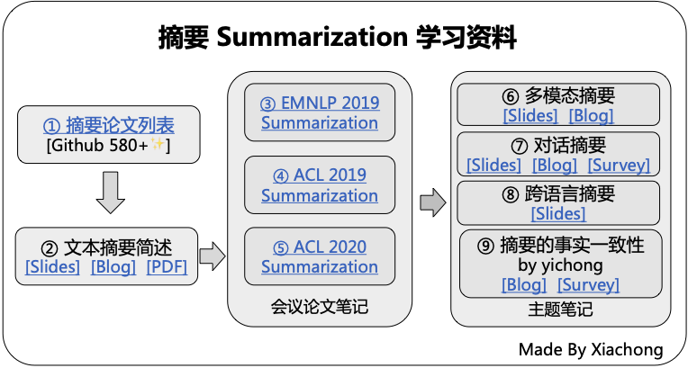
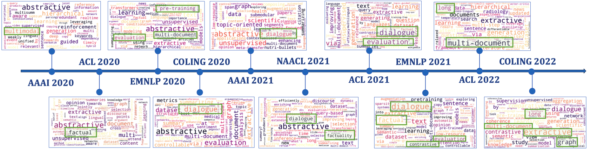

<h1 align="center"> Summarization Papers</h1>

Organized by [Xiachong Feng](http://xcfeng.net/).

## Summarization Learning Route
[Summarization Learning Route (with link)](http://xcfeng.net/res/summarization-route.pdf)

## Trending

## Presentations && Notes
* [Dialogue Summarization (2022.1)](slides/presentation/Dialogue_Summarization_DAMO.pdf) 
* [Cross-lingual Summarization](slides/presentation/Cross-lingual_Summarization.pdf)  
* [如何把DialoGPT用到对话摘要任务？@ ACL 2021](https://mp.weixin.qq.com/s/GQQRRS3F7p4Zv6wSuDh0ng)  
* [对话摘要最新进展简述](https://mp.weixin.qq.com/s/628OAOW1_-Yc_vQbeuY_uA)  
* [Dialogue Summarization (2021.5)](slides/presentation/Dialogue_Summarization.pdf)  
* [融入常识知识的生成式对话摘要](https://mp.weixin.qq.com/s/x3zqGc4pqh4x3q_uorNKcg)  
* [会议摘要有难度？快来引入对话篇章结构信息](https://mp.weixin.qq.com/s/Be7AYUPdux8NvAO4wo6_fg)  
* [文本摘要论文列表(Chinese)](https://mp.weixin.qq.com/s/tLdLGSFl229selxeogQk-w)  
* [事实感知的生成式文本摘要(Chinese)](https://mp.weixin.qq.com/s/Aye9FBwG-v2JO2MLoEjo0g)  
* [多模态摘要简述(Chinese)](https://mp.weixin.qq.com/s/Ce6jtp-gTtqeh9lgi-kHtQ)  
* [文本摘要简述](https://mp.weixin.qq.com/s/NGpDrYilAeuH6pQji0ujaA)  
* [Multi-modal Summarization](slides/presentation/Multi-modal-Summarization.pdf)  
* [ACL20 Summarization](slides/presentation/acl2020-summarization.pdf)  
* [文本摘要简述 (Chinese)](slides/presentation/文本摘要简述.pdf)  
* [ACL19 Summarization](slides/presentation/ACL19%20Summarization.pdf)  
* [Brief intro to summarization (Chinese)](slides/notes/Brief-intro-to-summarization.pdf) 
* [EMNLP19 Summarization (Chinese)](slides/notes/EMNLP19_Summarization.pdf) 
* [ACL19-A Simple Theoretical Model of Importance for Summarization](slides/paper-slides/A%20Simple%20Theoretical%20Model%20of%20Importance%20for%20Summarization.pdf) 
* [ACL19-Multimodal Abstractive Summarization for How2 Videos](slides/paper-slides/Multimodal%20Abstractive%20Summarization%20for%20How2%20Videos.pdf) 

## SOTA
1. **BRIO: Bringing Order to Abstractive Summarization** *Yixin Liu, Pengfei Liu, Dragomir Radev, Graham Neubig* `ACL 2022` [[pdf]](https://arxiv.org/abs/2203.16804) [[code]](https://github.com/yixinL7/BRIO) 

## Benchmark
* **MuLD: The Multitask Long Document Benchmark** *G Thomas Hudson, Noura Al Moubayed* [[pdf]](https://arxiv.org/abs/2202.07362) [[data]](https://github.com/ghomasHudson/muld)
* **EXPLAINABOARD: An Explainable Leaderboard for NLP** *Pengfei Liu, Jinlan Fu, Yang Xiao, Weizhe Yuan, Shuaichen Chang, Junqi Dai, Yixin Liu, Zihuiwen Ye, Graham Neubig* [[pdf]](http://explainaboard.nlpedia.ai/ExplainaBoard.pdf) [[ExplainaBoard]](http://explainaboard.nlpedia.ai/leaderboard/task-summ/index.php)
* **GLGE: A New General Language Generation Evaluation Benchmark** *Dayiheng Liu, Yu Yan, Yeyun Gong, Weizhen Qi, Hang Zhang, Jian Jiao, Weizhu Chen, Jie Fu, Linjun Shou, Ming Gong, Pengcheng Wang, Jiusheng Chen, Daxin Jiang, Jiancheng Lv, Ruofei Zhang, Winnie Wu, Ming Zhou, Nan Duan* [[pdf]](https://arxiv.org/abs/2011.11928) [[benchmark]](https://github.com/microsoft/glge)

## Survey
1. **A Survey on Cross-Lingual Summarization** *Jiaan Wang, Fandong Meng, Duo Zheng, Yunlong Liang, Zhixu Li, Jianfeng Qu, Jie Zhou* [[pdf]](https://arxiv.org/abs/2203.12515)
1. **Faithfulness in Natural Language Generation: A Systematic Survey of Analysis, Evaluation and Optimization Methods** *Wei Li, Wenhao Wu, Moye Chen, Jiachen Liu, Xinyan Xiao, Hua Wu* [[pdf]](https://arxiv.org/abs/2203.05227)
1. **Recent Advances in Neural Text Generation: A Task-Agnostic Survey** *Chen Tang, Frank Guerin, Yucheng Li, Chenghua Lin* [[pdf]](https://arxiv.org/abs/2203.03047)
1. **Survey of Hallucination in Natural Language Generation** *Ziwei Ji, Nayeon Lee, Rita Frieske, Tiezheng Yu, Dan Su, Yan Xu, Etsuko Ishii, Yejin Bang, Andrea Madotto, Pascale Fung* [[pdf]](https://arxiv.org/abs/2202.03629)
1. **A Survey on Retrieval-Augmented Text Generation** *Huayang Li, Yixuan Su, Deng Cai, Yan Wang, Lemao Liu* [[pdf]](https://arxiv.org/abs/2202.01110)
1. **A Survey of Controllable Text Generation using Transformer-based Pre-trained Language Models** *Hanqing Zhang, Haolin Song, Shaoyu Li, Ming Zhou, Dawei Song* [[pdf]](https://arxiv.org/abs/2201.05337)
1. **A Survey of Pretrained Language Models Based Text Generation** *Junyi Li, Tianyi Tang, Wayne Xin Zhao, Jian-Yun Nie, Ji-Rong Wen* [[pdf]](https://arxiv.org/abs/2201.05273)
1. **A Comprehensive Review on Summarizing Financial News Using Deep Learning** *Saurabh Kamal, Sahil Sharma* [[pdf]](https://arxiv.org/abs/2109.10118)
1. **A Survey on Multi-modal Summarization** *Anubhav Jangra, Adam Jatowt, Sriparna Saha, Mohammad Hasanuzzaman* [[pdf]](https://arxiv.org/abs/2109.05199)
1. **Pre-train, Prompt, and Predict: A Systematic Survey of Prompting Methods in Natural Language Processing** *Pengfei Liu, Weizhe Yuan, Jinlan Fu, Zhengbao Jiang, Hiroaki Hayashi, Graham Neubig* [[pdf]](https://arxiv.org/abs/2107.13586)
1. **A Survey on Dialogue Summarization: Recent Advances and New Frontiers** *Xiachong Feng, Xiaocheng Feng, Bing Qin* [[pdf]](https://arxiv.org/abs/2107.03175)
1. **Pretrained Language Models for Text Generation: A Survey** *Junyi Li, Tianyi Tang, Wayne Xin Zhao, Ji-Rong Wen* `IJCAI21` [[pdf]](https://arxiv.org/abs/2105.10311)
1. **A Survey of Recent Abstract Summarization Techniques** *Diyah Puspitaningrum* `ICICT21` [[pdf]](https://arxiv.org/abs/2105.00824)
1. **A Survey of the State-of-the-Art Models in Neural Abstractive Text Summarization** *AYESHA AYUB SYED, FORD LUMBAN GAOL, TOKURO MATSUO* [[pdf]](https://ieeexplore.ieee.org/stamp/stamp.jsp?arnumber=9328413)
1. **Automatic summarization of scientific articles: A survey** *Nouf Ibrahim Altmami, Mohamed El Bachir Menai* `Journal of King Saud University - Computer and Information Sciences` [[pdf]](https://www.sciencedirect.com/science/article/pii/S1319157820303554)
1. **Multi-document Summarization via Deep Learning Techniques: A Survey** *Congbo Ma, Wei Emma Zhang, Mingyu Guo, Hu Wang, Quan Z. Sheng* [[pdf]](https://arxiv.org/abs/2011.04843) 
1. **Deep Learning Based Abstractive Text Summarization: Approaches, Datasets, Evaluation Measures, and Challenges** *Dima Suleiman, Arafat A. Awajan* [[pdf]](https://www.semanticscholar.org/paper/Deep-Learning-Based-Abstractive-Text-Summarization%3A-Suleiman-Awajan/b7da726c244287748575ef404009609afde45bea)
2. **A Survey of Knowledge-Enhanced Text Generation** *Wenhao Yu, Chenguang Zhu, Zaitang Li, Zhiting Hu, Qingyun Wang, Heng Ji, Meng Jiang* [[pdf]](https://arxiv.org/abs/2010.04389)
3. **From Standard Summarization to New Tasks and Beyond: Summarization with Manifold Information** *Shen Gao, Xiuying Chen, Zhaochun Ren, Dongyan Zhao, Rui Yan* `IJCAI20` [[pdf]](https://arxiv.org/abs/2005.04684)
4. **Neural Abstractive Text Summarization with Sequence-to-Sequence Models** *Tian Shi, Yaser Keneshloo, Naren Ramakrishnan, Chandan K. Reddy* [[pdf]](https://arxiv.org/abs/1812.02303)
5. **A Survey on Neural Network-Based Summarization Methods** *Yue Dong* [[pdf]](https://arxiv.org/abs/1804.04589)
6. **Automated text summarisation and evidence-based medicine: A survey of two domains** *Abeed Sarker, Diego Molla, Cecile Paris* [[pdf]](https://arxiv.org/abs/1706.08162)
7. **Automatic Keyword Extraction for Text Summarization: A Survey** *Santosh Kumar Bharti, Korra Sathya Babu* [[pdf]](https://arxiv.org/abs/1704.03242)
8. **Text Summarization Techniques: A Brief Survey** *Mehdi Allahyari, Seyedamin Pouriyeh, Mehdi Assefi, Saeid Safaei, Elizabeth D. Trippe, Juan B. Gutierrez, Krys Kochut* [[pdf]](https://arxiv.org/abs/1707.02268)
9. **Recent automatic text summarization techniques: a survey** *Mahak Gambhir, Vishal Gupta* [[pdf]](https://link.springer.com/article/10.1007/s10462-016-9475-9)

## Toolkit
1. **iFacetSum: Coreference-based Interactive Faceted Summarization for Multi-Document Exploration** *Eran Hirsch, Alon Eirew, Ori Shapira, Avi Caciularu, Arie Cattan, Ori Ernst, Ramakanth Pasunuru, Hadar Ronen, Mohit Bansal, Ido Dagan* `EMNLP 2021` [[pdf]](https://arxiv.org/abs/2109.11621) [[demo]](https://biu-nlp.github.io/iFACETSUM/WebApp/client/)
1. **SummerTime: Text Summarization Toolkit for Non-experts** *Ansong Ni, Zhangir Azerbayev, Mutethia Mutuma, Troy Feng, Yusen Zhang, Tao Yu, Ahmed Hassan Awadallah, Dragomir Radev* `EMNLP 2021 Demo Track` [[pdf]](https://arxiv.org/abs/2108.12738) [[Demo]](https://github.com/Yale-LILY/SummerTime)
1. **Summary Explorer: Visualizing the State of the Art in Text Summarization** *Shahbaz Syed, Tariq Yousef, Khalid Al-Khatib, Stefan Jänicke, Martin Potthast*  [[pdf]](https://arxiv.org/abs/2108.01879) [[web]](https://tldr.webis.de/)
1. **fastnlp/fastSum** [[code]](https://github.com/fastnlp/fastSum)
1. **Graph4NLP** [[code]](https://github.com/graph4ai/graph4nlp) [[summarization]](https://github.com/graph4ai/graph4nlp/tree/master/examples/pytorch/summarization)
1. **CTRLsum: Towards Generic Controllable Text Summarization** [[pdf]](https://arxiv.org/abs/2012.04281) [[code]](https://github.com/hyunwoongko/summarizers)
1. **OpenNMT-py: Open-Source Neural Machine Translation** [[pdf]](https://www.aclweb.org/anthology/W18-1817.pdf) [[code]](https://github.com/OpenNMT/OpenNMT-py)
2. **Fairseq: Facebook AI Research Sequence-to-Sequence Toolkit written in Python.**  [[code]](https://github.com/pytorch/fairseq)
3. **LeafNATS: An Open-Source Toolkit and Live Demo System for Neural Abstractive Text Summarization** *Tian Shi, Ping Wang, Chandan K. Reddy* `NAACL19` [[pdf]](https://www.aclweb.org/anthology/N19-4012/) [[code]](https://github.com/tshi04/LeafNATS)
4. **TransformerSum** [[code]](https://github.com/HHousen/TransformerSum)

## Analysis
   

1. **On Decoding Strategies for Neural Text Generators** *Gian Wiher, Clara Meister, Ryan Cotterell* [[pdf]](https://arxiv.org/abs/2203.15721) 
1. **Training Dynamics for Text Summarization Models** *Tanya Goyal, Jiacheng Xu, Junyi Jessy Li, Greg Durrett* [https://arxiv.org/abs/2110.08370]
1. **Does Summary Evaluation Survive Translation to Other Languages?** *Neslihan Iskender, Oleg Vasilyev, Tim Polzehl, John Bohannon, Sebastian Möller* [[pdf]](https://arxiv.org/abs/2109.08129)
1. **How well do you know your summarization datasets?** *Priyam Tejaswin, Dhruv Naik, Pengfei Liu* `Findings of ACL 2021` [[pdf]](https://arxiv.org/abs/2106.11388) [[code]](https://github.com/priyamtejaswin/howwelldoyouknow)
1. **Dissecting Generation Modes for Abstractive Summarization Models via Ablation and Attribution** *Jiacheng Xu, Greg Durrett* `ACL2021` [[pdf]](https://aclanthology.org/2021.acl-long.539/) [[code]](https://github.com/jiacheng-xu/sum-interpret)
1. **To Point or Not to Point: Understanding How Abstractive Summarizers Paraphrase Text** *Matt Wilber, William Timkey, Marten Van Schijndel* `Findings of ACL 2021` [[pdf]](https://arxiv.org/abs/2106.01581) [[code]](https://github.com/mwilbz/pointer-generator-analysis)
1. **What Makes a Good Summary? Reconsidering the Focus of Automatic Summarization** *Maartje ter Hoeve, Julia Kiseleva, Maarten de Rijke* [[pdf]](https://arxiv.org/abs/2012.07619)
1. **Intrinsic Evaluation of Summarization Datasets** *Rishi Bommasani, Claire Cardie* `EMNLP20` [[pdf]](https://www.aclweb.org/anthology/2020.emnlp-main.649/) 
1. **Metrics also Disagree in the Low Scoring Range: Revisiting Summarization Evaluation Metrics** *Manik Bhandari, Pranav Gour, Atabak Ashfaq, Pengfei Liu* `COLING20 Short` [[pdf]](https://arxiv.org/abs/2011.04096) [[code]](https://github.com/manikbhandari/RevisitSummEvalMetrics) 
1. **At Which Level Should We Extract? An Empirical Analysis on Extractive Document Summarization** *Qingyu Zhou, Furu Wei, Ming Zhou* `COLING20` [[pdf]](https://arxiv.org/abs/2004.02664) 
1. **Corpora Evaluation and System Bias detection in Multi Document Summarization** *Alvin Dey, Tanya Chowdhury, Yash Kumar, Tanmoy Chakraborty* `Findings of EMNLP` [[pdf]](https://www.aclweb.org/anthology/2020.findings-emnlp.254/) 
1. **Understanding the Extent to which Summarization Evaluation Metrics Measure the Information Quality of Summaries** *Daniel Deutsch, Dan Roth* [[pdf]](https://arxiv.org/abs/2010.12495) [[code]](https://github.com/CogComp/content-analysis-experiments)
1. **Understanding Neural Abstractive Summarization Models via Uncertainty** *Jiacheng Xu, Shrey Desai, Greg Durrett* `EMNLP20 Short` [[pdf]](https://arxiv.org/abs/2010.07882) [[code]](https://github.com/jiacheng-xu/text-sum-uncertainty) 
2. **Re-evaluating Evaluation in Text Summarization** *Manik Bhandari, Pranav Gour, Atabak Ashfaq, Pengfei Liu, Graham Neubig* `EMNLP20` [[pdf]](https://arxiv.org/abs/2010.07100) [[code]](https://github.com/neulab/REALSumm) 
3. **CDEvalSumm: An Empirical Study of Cross-Dataset Evaluation for Neural Summarization Systems** *Yiran Chen, Pengfei Liu, Ming Zhong, Zi-Yi Dou, Danqing Wang, Xipeng Qiu, Xuanjing Huang* `EMNLP20` [[pdf]](https://arxiv.org/abs/2010.05139) [[code]](https://github.com/zide05/CDEvalSumm) 
4. **What Have We Achieved on Text Summarization?** *Dandan Huang, Leyang Cui, Sen Yang, Guangsheng Bao, Kun Wang, Jun Xie, Yue Zhang* `EMNLP20` [[pdf]](https://arxiv.org/abs/2010.04529) 
5. **Conditional Neural Generation using Sub-Aspect Functions for Extractive News Summarization** *Zhengyuan Liu, Ke Shi, Nancy F. Chen* `Findings of EMNLP20` [[pdf]](https://arxiv.org/abs/2004.13983) 
6. **Extractive Summarization as Text Matching** *Ming Zhong, Pengfei Liu, Yiran Chen, Danqing Wang, Xipeng Qiu, Xuanjing Huang* `ACL20` [[pdf]](https://arxiv.org/abs/2004.08795) [[code]](https://github.com/maszhongming/MatchSum)  
7. **Neural Text Summarization: A Critical Evaluation** *Wojciech Kryściński, Nitish Shirish Keskar, Bryan McCann, Caiming Xiong, Richard Socher* `EMNLP19` [[pdf]](https://www.aclweb.org/anthology/D19-1051/) 
8. **Earlier Isn’t Always Better:Sub-aspect Analysis on Corpus and System Biases in Summarization** *Taehee Jung, Dongyeop Kang, Lucas Mentch, Eduard Hovy* `EMNLP19` [[pdf]](https://arxiv.org/abs/1908.11723) [[code]](https://github.com/dykang/biassum) 
9. **A Closer Look at Data Bias in Neural Extractive Summarization Models** *Ming Zhong, Danqing Wang, Pengfei Liu, Xipeng Qiu, Xuanjing Huang* `EMNLP19 Workshop` [[pdf]](https://arxiv.org/abs/1909.13705) 
10. **Countering the Effects of Lead Bias in News Summarization via Multi-Stage Training and Auxiliary Losses** *Matt Grenander, Yue Dong, Jackie Chi Kit Cheung, Annie Louis* `EMNLP19 Short` [[pdf]](https://arxiv.org/abs/1909.04028)  
11. **Searching for Effective Neural Extractive Summarization: What Works and What's Next** *Ming Zhong, Pengfei Liu, Danqing Wang, Xipeng Qiu, Xuanjing Huang* `ACL19` [[pdf]](https://arxiv.org/abs/1907.03491) [[code]](https://github.com/maszhongming/Effective_Extractive_Summarization) 
12. **Content Selection in Deep Learning Models of Summarization** *Chris Kedzie, Kathleen McKeown, Hal Daumé III* `EMNLP18` [[pdf]](https://www.aclweb.org/anthology/D18-1208/) [[code]](https://github.com/kedz/nnsum/tree/emnlp18-release) 

## Thesis
1. **Principled Approaches to Automatic Text Summarization** *Maxime Peyrard* [[pdf]](https://tuprints.ulb.tu-darmstadt.de/9012/)
2.  **Neural Text Summarization and Generation** *Piji Li* [[pdf]](http://lipiji.com/docs/thesis.pdf)

## Theory
1. **Bayesian Active Summarization** *Alexios Gidiotis, Grigorios Tsoumakas* [[pdf]](https://arxiv.org/abs/2110.04480)
1. **RefSum: Refactoring Neural Summarization** *Yixin Liu, Zi-Yi Dou, Pengfei Liu* `NAACL21` [[pdf]](https://arxiv.org/abs/2104.07210) [[code]](https://github.com/yixinL7/Refactoring-Summarization)
1. **Principled Approaches to Automatic Text Summarization** *Maxime Peyrard* [[pdf]](https://tuprints.ulb.tu-darmstadt.de/9012/) 
1. **KLearn: Background Knowledge Inference from Summarization Data** *Maxime Peyrard, Robert West* `Findings of EMNLP20` [[pdf]](https://arxiv.org/abs/2010.06213) [[code]](https://github.com/epfl-dlab/KLearn)
2. **A Simple Theoretical Model of Importance for Summarization** *Maxime Peyrard* `ACL19` [[pdf]](https://www.aclweb.org/anthology/P19-1101/)
3. **BottleSum: Unsupervised and Self-supervised Sentence Summarization using the Information Bottleneck Principle** *Peter West, Ari Holtzman, Jan Buys, Yejin Choi* `EMNLP19` [[pdf]](https://arxiv.org/abs/1909.07405) [[code]](https://github.com/peterwestuw/BottleSum)

## Dataset

|ID|Name|Description|Paper|Conference|
|:---:|:---:|:---:|:---:|:---:|
| 1 | [CNN-DailyMail](https://github.com/harvardnlp/sent-summary) | News | [Abstractive Text Summarization using Sequence\-to\-sequence RNNs and Beyond ](https://www.aclweb.org/anthology/K16-1028/)|SIGNLL16|
| 2 | [New York Times](https://catalog.ldc.upenn.edu/LDC2008T19)| News | [The New York Times Annotated Corpus](https://catalog.ldc.upenn.edu/LDC2008T19) ||
| 3 | [DUC](https://duc.nist.gov/data.html)| News | [The Effects Of Human Variation In DUC Summarization Evaluation](https://www.aclweb.org/anthology/W04-1003/) ||
| 4 | [Gigaword](https://github.com/harvardnlp/sent-summary) | News | [A Neural Attention Model For Abstractive Sentence Summarization](https://arxiv.org/abs/1509.00685) |EMNLP15|
| 5 | [Newsroom](http://lil.nlp.cornell.edu/newsroom/) | News | [Newsroom: A Dataset of 1\.3 Million Summaries with Diverse Extractive Strategies](https://www.aclweb.org/anthology/N18-1065)|NAACL18|
| 6 | [Xsum](https://github.com/EdinburghNLP/XSum) | News | [Don’t Give Me the Details, Just the Summary\! Topic\-Aware Convolutional Neural Networks for Extreme Summarization](https://www.aclweb.org/anthology/D18-1206/)|EMNLP18|
| 7 | [Multi-News](https://github.com/Alex-Fabbri/Multi-News)| Multi-document News | [Multi\-News: a Large\-Scale Multi\-Document Summarization Dataset and Abstractive Hierarchical Model](https://arxiv.org/abs/1906.01749)|ACL19|
| 8 | [SAMSum](https://arxiv.org/abs/1911.12237)| Multi-party conversation | [SAMSum Corpus: A Human\-annotated Dialogue Dataset for Abstractive Summarization](https://arxiv.org/abs/1911.12237)|EMNLP19|
| 9 | [AMI](http://groups.inf.ed.ac.uk/ami/download/) | Meeting | [The AMI Meeting Corpus: A pre\-announcement\. ](http://groups.inf.ed.ac.uk/ami/download/)||
| 10 | [ICSI](http://groups.inf.ed.ac.uk/ami/icsi/download/)| Meeting | [The ICSI Meeting Corpus](http://groups.inf.ed.ac.uk/ami/icsi/) ||
| 11 | [MSMO](http://www.nlpr.ia.ac.cn/cip/jjzhang.htm)| Multi-modal | [MSMO: Multimodal Summarization with Multimodal Output](https://www.aclweb.org/anthology/D18-1448/) |EMNLP18|
| 12 | [How2](https://github.com/srvk/how2-dataset) | Multi-modal | [How2: A Large\-scale Dataset for Multimodal Language Understanding](https://arxiv.org/abs/1811.00347)| NIPS18|
| 13 | [ScisummNet](https://cs.stanford.edu/~myasu/projects/scisumm_net/) | Scientific paper | [ScisummNet: A Large Annotated Corpus and Content\-Impact Models for Scientific Paper Summarization with Citation Networks](https://arxiv.org/abs/1909.01716) |AAAI19|
| 14 | [PubMed, ArXiv](https://github.com/armancohan/long-summarization)| Scientific paper | [A Discourse\-Aware Attention Model for Abstractive Summarization of Long Documents](https://arxiv.org/abs/1804.05685)| NAACL18 |
| 15 | [TALKSUMM](https://github.com/levguy/talksumm) | Scientific paper | [TALKSUMM: A Dataset and Scalable Annotation Method for Scientific Paper Summarization Based on Conference Talks](https://www.aclweb.org/anthology/P19-1204/) | ACL19 |
| 16 | [BillSum](https://github.com/FiscalNote/BillSum) | Legal | [BillSum: A Corpus for Automatic Summarization of US Legislation](https://www.aclweb.org/anthology/D19-5406/) |EMNLP19|
| 17 | [LCSTS](http://icrc.hitsz.edu.cn/Article/show/139.html)| Chinese Weibo| [LCSTS: A Large Scale Chinese Short Text Summarization Dataset ](https://www.aclweb.org/anthology/D15-1229/)|EMNLP15|
| 18 | [WikiHow](https://github.com/mahnazkoupaee/WikiHow-Dataset)| Online Knowledge Base | [WikiHow: A Large Scale Text Summarization Dataset](https://arxiv.org/abs/1810.09305) ||
| 19 | [Concept-map-based MDS Corpus](https://github.com/UKPLab/emnlp2017-cmapsum-corpus/)| Educational Multi-document| [Bringing Structure into Summaries : Crowdsourcing a Benchmark Corpus of Concept Maps](https://www.aclweb.org/anthology/D17-1320/)|EMNLP17|
| 20 | [WikiSum](https://github.com/tensorflow/tensor2tensor/tree/master/tensor2tensor/data_generators/wikisum) | Wikipedia Multi-document | [Generating Wikipedia By Summarizing Long Sequence](https://arxiv.org/abs/1801.10198) |ICLR18|
| 21 | [GameWikiSum](https://github.com/Diego999/GameWikiSum) | Game Multi-document | [GameWikiSum : a Novel Large Multi\-Document Summarization Dataset](https://arxiv.org/abs/2002.06851) |LREC20|
| 22 | [En2Zh CLS, Zh2En CLS](http://www.nlpr.ia.ac.cn/cip/dataset.htm)| Cross-Lingual | [NCLS: Neural Cross\-Lingual Summarization](https://arxiv.org/abs/1909.00156) |EMNLP19|
| 23 | [Timeline Summarization Dataset](https://github.com/yingtaomj/Learning-towards-Abstractive-Timeline-Summarization)| Baidu timeline| [Learning towards Abstractive Timeline Summarization ](https://www.ijcai.org/Proceedings/2019/686)|IJCAI19|
| 24 | [Reddit TIFU](https://github.com/ctr4si/MMN) | online discussion | [Abstractive Summarization of Reddit Posts with Multi\-level Memory Networks](https://arxiv.org/abs/1811.00783)| NAACL19 |
| 25 | [TripAtt](https://github.com/Junjieli0704/ASN) | Review | [Attribute\-aware Sequence Network for Review Summarization](https://www.aclweb.org/anthology/D19-1297/)|EMNLP19|
| 26 | [Reader Comments Summarization Corpus](https://drive.google.com/file/d/1_YH5cBtvNnUNJjGj7kiTMjuHydBqWYQT/view?usp=drive_open) | Comments-based Weibo | [Abstractive Text Summarization by Incorporating Reader Comments ](https://arxiv.org/abs/1812.05407)|AAAI19|
| 27 | [BIGPATENT](https://evasharma.github.io/bigpatent/) | Patent| [BIGPATENT: A Large\-Scale Dataset for Abstractive and Coherent Summarization](https://arxiv.org/abs/1906.03741)|ACL19|
| 28 | [Curation Corpus](https://github.com/CurationCorp/curation-corpus) | News | [Curation Corpus for Abstractive Text Summarisation](https://github.com/CurationCorp/curation-corpus) ||
| 29 | [MATINF](https://github.com/WHUIR/MATINF)|Multi-task|[MATINF: A Jointly Labeled Large-Scale Dataset for Classification, Question Answering and Summarization](https://arxiv.org/abs/2004.12302)|ACL20|
| 30 | [MLSUM](https://github.com/recitalAI/MLSUM) |Multi-Lingual Summarization Dataset|[MLSUM: The Multilingual Summarization Corpus](https://arxiv.org/abs/2004.14900)|EMNLP20|
| 31 | Dialogue(Debate)|Argumentative Dialogue Summary Corpus |[Using Summarization to Discover Argument Facets in Online Idealogical Dialog](https://www.aclweb.org/anthology/N15-1046/)|NAACL15|
|32|[WCEP](https://github.com/complementizer/wcep-mds-dataset)|News Multi-document|[A Large-Scale Multi-Document Summarization Dataset from the Wikipedia Current Events Portal](https://arxiv.org/abs/2005.10070)|ACL20 Short|
|33|[ArgKP](https://www.research.ibm.com/haifa/dept/vst/debating_data.shtml)|Argument-to-key Point Mapping|[From Arguments to Key Points: Towards Automatic Argument Summarization](https://arxiv.org/abs/2005.01619)|ACL20|
|34|[CRD3](https://github.com/RevanthRameshkumar/CRD3)|Dialogue|[Storytelling with Dialogue: A Critical Role Dungeons and Dragons Dataset](https://www.aclweb.org/anthology/2020.acl-main.459/)|2020|
|35|[Gazeta](https://github.com/IlyaGusev/gazeta)|Russian news|[Dataset for Automatic Summarization of Russian News](https://arxiv.org/abs/2006.11063)||
|36|[MIND](https://msnews.github.io/)|English news recommendation, Summarization, Classification, Entity|[MIND: A Large-scale Dataset for News Recommendation](https://www.aclweb.org/anthology/2020.acl-main.331/)|ACL20|
|37|[public_meetings](https://github.com/pltrdy/autoalign)|french meeting(test set)|[Align then Summarize: Automatic Alignment Methods for Summarization Corpus Creation](https://www.aclweb.org/anthology/2020.lrec-1.829)|LREC|
|38|Enron|Email|[Building a Dataset for Summarization and Keyword Extraction from Emails](https://www.aclweb.org/anthology/L14-1028/)|2014|
|39|Columbia|Email|[Summarizing Email Threads]([https://www.aclweb.org/anthology/N04-4027.pdf](https://dl.acm.org/doi/10.5555/1613984.1614011))|2004|
|40|[BC3](https://www.cs.ubc.ca/cs-research/lci/research-groups/natural-language-processing/bc3.html)|Email|[A publicly available annotated corpus for supervised email summarization](https://www.ufv.ca/media/assets/computer-information-systems/gabriel-murray/publications/aaai08.pdf)||
|41|[WikiLingua](https://github.com/esdurmus/Wikilingua)|Cross-Lingual|[WikiLingua- A New Benchmark Dataset for Cross-Lingual Abstractive Summarization](https://arxiv.org/abs/2010.03093)|Findings of EMNLP20|
|42|[LcsPIRT](http://eie.usts.edu.cn/prj/NLPoSUST/LcsPIRT.htm)|Chinese Dialogue|[Global Encoding for Long Chinese Text Summarization](https://dl.acm.org/doi/10.1145/3407911)|TALLIP|
|43|[CLTS](https://github.com/lxj5957/CLTS-Dataset)，[CLTS-plus](https://github.com/lxj5957/CLTS-plus-Dataset)|Chinese News|[CLTS: A New Chinese Long Text Summarization Dataset](https://link.springer.com/chapter/10.1007/978-3-030-60450-9_42)|NLPCC20|
|44|[VMSMO](https://github.com/yingtaomj/VMSMO)|Multi-modal|[VMSMO: Learning to Generate Multimodal Summary for Video-based News Articles](https://arxiv.org/abs/2010.05406)|EMNLP20 |
|45|[Multi-XScience](https://github.com/yaolu/Multi-XScience)|Multi-document|[Multi-XScience: A Large-scale Dataset for Extreme Multi-document Summarization of Scientific Articles](https://arxiv.org/abs/2010.14235)|EMNLP20 short|
|46|[SCITLDR](https://github.com/allenai/scitldr)|Scientific Document|[TLDR: Extreme Summarization of Scientific Documents](https://arxiv.org/abs/2004.15011)|Findings of EMNLP20|
|47|[scisumm-corpus](https://github.com/WING-NUS/scisumm-corpus)|Scientific Document|||
|48|[QBSUM](https://www.dropbox.com/sh/t2cp7ml1kb8ako0/AADmS2RMfJvLbukyQbb08CGGa?dl=0)|Query-Based Chinese|[QBSUM: a Large-Scale Query-Based Document Summarization Dataset from Real-world Applications](https://arxiv.org/abs/2010.14108)|Computer Speech & Language|
|49|[qMDS](https://github.com/google-research-datasets/aquamuse)|Query-Based Multi-Document|[AQuaMuSe: Automatically Generating Datasets for Query-Based Multi-Document Summarization](https://arxiv.org/abs/2010.12694)||
|50|[Liputan6](https://github.com/fajri91/sum_liputan6)|Indonesian|[Liputan6: A Large-scale Indonesian Dataset for Text Summarization](https://arxiv.org/pdf/2011.00679.pdf)|AACL20|
|51|[SportsSum](https://github.com/ej0cl6/SportsSum)|Sports Game|[Generating Sports News from Live Commentary: A Chinese Dataset for Sports Game Summarization](https://khhuang.me/docs/aacl2020sportssum.pdf)|AACL20|
|52|[WikiAsp](https://github.com/neulab/wikiasp)|Aspect-based|[WikiAsp: A Dataset for Multi-domain Aspect-based Summarization](https://arxiv.org/abs/2011.07832)|Transaction of the ACL|
|53|[DebateSum](https://github.com/Hellisotherpeople/DebateSum)|argument|[DebateSum:A large-scale argument mining and summarization dataset](https://arxiv.org/abs/2011.07251)|ARGMIN 2020|
|54|[Open4Business](https://github.com/amanpreet692/Open4Business)|Business|[Open4Business (O4B): An Open Access Dataset for Summarizing Business Documents](https://arxiv.org/abs/2011.07636)|Workshop on Dataset Curation and Security-NeurIPS 2020|
|55|[OrangeSum](https://github.com/moussaKam/OrangeSum)|French|[BARThez: a Skilled Pretrained French Sequence-to-Sequence Model](https://arxiv.org/abs/2010.12321)||
|56|[Medical Conversation](https://github.com/cuhksz-nlp/HET-MC)|medical conversation|[Summarizing Medical Conversations via Identifying Important Utterances](https://www.aclweb.org/anthology/2020.coling-main.63/)|COLING20|
|57|[SumTitles](https://github.com/huawei-noah/sumtitles)|movie dialogue|[SumTitles: a Summarization Dataset with Low Extractiveness](https://www.aclweb.org/anthology/2020.coling-main.503/)|COLING20|
|58|[BANS](https://www.kaggle.com/prithwirajsust/bengali-news-summarization-datase)|bengali news|[Bengali Abstractive News Summarization (BANS): A Neural Attention Approach]()|TCCE-2020|
|59|[e-commerce](https://github.com/ypnlp/coling)|E-commerce|[On the Faithfulness for E-commerce Product Summarization](https://www.aclweb.org/anthology/2020.coling-main.502/)|COLING20|
|60|[TWEETSUM]()|Twitter|[TWEETSUM: Event-oriented Social Summarization Dataset](https://www.aclweb.org/anthology/2020.coling-main.504/)|COLING20|
|61|[SPACE](https://github.com/stangelid/qt)|Opinion|[Extractive Opinion Summarization in Quantized Transformer Spaces](https://arxiv.org/abs/2012.04443)|TACL|
|62|[pn-summary](https://github.com/hooshvare/pn-summary)|Persian|[Leveraging ParsBERT and Pretrained mT5 for Persian Abstractive Text Summarization](https://arxiv.org/abs/2012.11204)|csicc2021|
|63|[E-commerce1](https://github.com/RowitZou/topic-dialog-summ)*desensitized*|Dialogue|[Topic-Oriented Spoken Dialogue Summarization for Customer Service with Saliency-Aware Topic Modeling](https://arxiv.org/abs/2012.07311)|AAAI21|
|64|[E-commerce2](https://github.com/RowitZou/RankAE)*desensitized*|Dialogue|[Unsupervised Summarization for Chat Logs with Topic-Oriented Ranking and Context-Aware Auto-Encoders](https://arxiv.org/abs/2012.07300)|AAAI21|
|65|[BengaliSummarization](https://github.com/tafseer-nayeem/BengaliSummarization)|Bengali|[Unsupervised Abstractive Summarization of Bengali Text Documents](https://arxiv.org/abs/2102.04490)|EACL21|
|66|[MediaSum](https://github.com/zcgzcgzcg1/MediaSum)|Dialogue|[MediaSum: A Large-scale Media Interview Dataset for Dialogue Summarization](https://arxiv.org/abs/2103.06410)|NAACL21|
|67|[Healthline and BreastCancer](https://github.com/darsh10/Nutribullets)|multi-document|[Nutri-bullets: Summarizing Health Studies by Composing Segments](https://arxiv.org/abs/2103.11921)|AAAI21|
|68|[GOVREPORT](https://gov-report-data.github.io/)|Long Government reports|[Efficient Attentions for Long Document Summarization](https://arxiv.org/abs/2104.02112)|NAACL21|
|69|[SSN](https://github.com/ChenxinAn-fdu/CGSum)|Scientific Paper|[Enhancing Scientific Papers Summarization with Citation Graph](https://arxiv.org/abs/2104.03057)|AAAI21|
|70|[MTSamples](https://github.com/babylonhealth/medical-note-summarisation)|Medical|[Towards objectively evaluating the quality of generated medical summaries](https://arxiv.org/abs/2104.04412)||
|71|[QMSum](https://github.com/Yale-LILY/QMSum)|Meeting, Query|[QMSum: A New Benchmark for Query-based Multi-domain Meeting Summarization](https://arxiv.org/abs/2104.05938)|NAACL21|
|72|[MS2](https://github.com/allenai/ms2)|Medical, Multi-Document|[MS2: Multi-Document Summarization of Medical Studies](https://arxiv.org/abs/2104.06486)||
|73|[SummScreen](https://github.com/mingdachen/SummScreen)|Television Series|[SummScreen: A Dataset for Abstractive Screenplay Summarization](https://arxiv.org/abs/2104.07091)||
|74|[SciDuet](https://github.com/IBM/document2slides)|Scientific Papers and Slides|[D2S: Document-to-Slide Generation Via Query-Based Text Summarization](https://github.com/IBM/document2slides)|NAACL21|
|75|[MultiHumES](https://deephelp.zendesk.com/hc/en-us/sections/360011925552-MultiHumES)|Multilingual|[MultiHumES: Multilingual Humanitarian Dataset for Extractive Summarization](https://www.aclweb.org/anthology/2021.eacl-main.146/)|EACL21|
|76|[DialSumm](https://github.com/cylnlp/DialSumm)|Dialogue|[DialSumm: A Real-Life Scenario Dialogue Summarization Dataset](https://arxiv.org/abs/2105.06762)|Findings of ACL21|
|77|[BookSum](https://github.com/salesforce/booksum)|Book, Long-form|[BookSum: A Collection of Datasets for Long-form Narrative Summarization](https://arxiv.org/abs/2105.08209)||
|78|[CLES](http://icrc.hitsz.edu.cn/xszy/yjzy.htm)|Chinese Weibo |[A Large-Scale Chinese Long-Text Extractive Summarization Corpus](https://ieeexplore.ieee.org/abstract/document/9414946)|ICASSP|
|79|[FacetSum](https://github.com/hfthair/emerald_crawler)|Scientific Paper|[Bringing Structure into Summaries: a Faceted Summarization Dataset for Long Scientific Documents](https://aclanthology.org/2021.acl-short.137/)|ACL2021 short|
|80|[ConvoSumm](https://github.com/Yale-LILY/ConvoSumm)|Dialogue|[ConvoSumm: Conversation Summarization Benchmark and Improved Abstractive Summarization with Argument Mining](https://aclanthology.org/2021.acl-long.535/)|ACL2021|
|81|[AgreeSum](https://github.com/google-research-datasets/AgreeSum)|Multi-document with entailment annotations|[AgreeSum: Agreement-Oriented Multi-Document Summarization](https://arxiv.org/abs/2106.02278)|Findings of ACL2021|
|82|[En2De](https://github.com/ybai-nlp/MCLAS)|Cross-Lingual En2De|[Cross-Lingual Abstractive Summarization with Limited Parallel Resources](https://arxiv.org/abs/2105.13648)|ACL 2021|
|83|[VT-SSum]()|Spoken|[VT-SSum: A Benchmark Dataset for Video Transcript Segmentation and Summarization](https://arxiv.org/abs/2106.05606)||
|84|[AESLC](https://github.com/ryanzhumich/AESLC)|Email|[This Email Could Save Your Life: Introducing the Task of Email Subject Line Generation](https://www.aclweb.org/anthology/P19-1043/)|ACL 2019|
|85|[XL-Sum](https://github.com/csebuetnlp/xl-sum)|Cross-lingual|[XL-Sum: Large-Scale Multilingual Abstractive Summarization for 44 Languages](http://rifatshahriyar.github.io/files/XL-Sum.pdf)|Findings of ACL2021|
|86|[TES 2012-2016](https://github.com/JoeBloggsIR/TSSuBERT)|Tweet|[TSSuBERT: Tweet Stream Summarization Using BERT](https://arxiv.org/abs/2106.08770)||
|87|[PENS](https://msnews.github.io/pens.html)|Personalized Headline|[PENS: A Dataset and Generic Framework for Personalized News Headline Generation](https://www.microsoft.com/en-us/research/uploads/prod/2021/06/ACL2021_PENS_Camera_Ready_1862_Paper.pdf)|ACL 2021|
|88|[XSum Hallucination Annotations](https://github.com/google-research-datasets/xsum_hallucination_annotations)|Factuality|[On Faithfulness and Factuality in Abstractive Summarization](https://arxiv.org/abs/2005.00661)|ACL 2020|
|89|[factuality-datasets](https://github.com/tagoyal/factuality-datasets#factuality-datasets)|Factuality|[Annotating and Modeling Fine-grained Factuality in Summarization](https://arxiv.org/abs/2104.04302)|NAACL 2021|
|90|[frank](https://github.com/artidoro/frank)|Factuality|[Understanding Factuality in Abstractive Summarization with FRANK: A Benchmark for Factuality Metrics](https://arxiv.org/abs/2104.13346)|NAACL 2021|
|91|[TRIPOD](https://github.com/ppapalampidi/GraphTP)|Movie|[Movie Summarization via Sparse Graph Construction](https://arxiv.org/abs/2012.07536)|AAAI 2021|
|92|[AdaptSum](https://github.com/TysonYu/AdaptSum)|Low-Resource|[AdaptSum: Towards Low-Resource Domain Adaptation for Abstractive Summarization](https://arxiv.org/abs/2103.11332)|NAACL 2021|
|93|[PTS](https://github.com/FeiSun/ProductTitleSummarizationCorpus)|Product|[Multi-Source Pointer Network for Product Title Summarization](https://arxiv.org/abs/1808.06885)|CIKM 2018|
|94|[RAMDS](https://github.com/lipiji/vae-salience-ramds)|Reader-Aware|[Reader-Aware Multi-Document Summarization: An Enhanced Model and The First Dataset](https://arxiv.org/abs/1708.01065)|EMNLP 2017 Workshop|
|95|[court judgment](https://github.com/gsh199449/proto-summ)|court judgment|[How to Write Summaries with Patterns? Learning towards Abstractive Summarization through Prototype Editing](https://arxiv.org/abs/1909.08837)|EMNLP 2019|
|96|[ADEGBTS](https://github.com/MMLabTHUSZ/ADEGBTS)|gaze behaviors|[A Dataset for Exploring Gaze Behaviors in Text Summarization](https://dl.acm.org/doi/abs/10.1145/3339825.3394928)|ACM MMSys'20|
|97|[MeQSum](https://github.com/abachaa/MeQSum)|Medical|[On the Summarization of Consumer Health Questions](https://www.aclweb.org/anthology/P19-1215/)|ACL 2019|
|98|[OpoSum](https://github.com/stangelid/oposum)|Opinion|[Summarizing Opinions: Aspect Extraction Meets Sentiment Prediction and They Are Both Weakly Supervised](https://www.aclweb.org/anthology/D18-1403/)|EMNLP 2018|
|99|[MM-AVS](https://github.com/xiyan524/MM-AVS)|Multi-modal|[Multi-modal Summarization for Video-containing Documents](https://arxiv.org/abs/2009.08018)|NAACL 2021|
|100|[WikiCatSum](https://github.com/lauhaide/WikiCatSum)|multi-doc|[Generating Summaries with Topic Templates and Structured Convolutional Decoders](https://arxiv.org/abs/1906.04687)|ACL 2019|
|101|[SDF-TLS](https://github.com/MorenoLaQuatra/SDF-TLS)|Timeline|[Summarize Dates First: A Paradigm Shift in Timeline Summarization](https://dl.acm.org/doi/10.1145/3404835.3462954)|SIGIR 2021|
|102|[RWS-Cit](https://github.com/jingqiangchen/RWS-Cit)||[*Automatic generation of related work through summarizing citations](https://onlinelibrary.wiley.com/doi/epdf/10.1002/cpe.4261)|2017|
|103|[MTLS](https://yiyualt.github.io/mtlsdata/)|Timeline|[Multi-TimeLine Summarization (MTLS): Improving Timeline Summarization by Generating Multiple Summaries](https://aclanthology.org/2021.acl-long.32/)|ACL 2021|
|104|[EMAILSUM](https://github.com/ZhangShiyue/EmailSum)|Email|[EmailSum: Abstractive Email Thread Summarization](https://aclanthology.org/2021.acl-long.537/)|ACL 2021|
|105|[WikiSum](https://registry.opendata.aws/wikisum/)|WikiHow|[WikiSum: Coherent Summarization Dataset for Efficient Human-Evaluation](https://aclanthology.org/2021.acl-short.28/)|ACL 2021 Short|
|106|[SumPubMed](https://github.com/vgupta123/sumpubmed)|PubMed Scientific Article|[SumPubMed: Summarization Dataset of PubMed Scientific Articles](https://aclanthology.org/2021.acl-srw.30/)|ACL 2021 Student Research Workshop|
|107|[MLGSum](https://github.com/brxx122/CALMS)|Multi-lingual|[Contrastive Aligned Joint Learning for Multilingual Summarization](https://aclanthology.org/2021.findings-acl.242/)|ACL 2021 Findings|
|108|[SMARTPHONE,COMPUTER](https://github.com/JD-AI-Research-NLP/CUSTOM)|Product|[CUSTOM: Aspect-Oriented Product Summarization for E-Commerce](https://arxiv.org/abs/2108.08010)||
|109|[CSDS](https://github.com/xiaolinAndy/CSDS)|Customer Service Dialogue|[CSDS: A Fine-grained Chinese Dataset for Customer Service Dialogue Summarization](https://arxiv.org/abs/2108.13139)|EMNLP 2021|
|110|[persian-dataset](https://github.com/mohammadiahmad/persian-dataset)|persian|[ARMAN: Pre-training with Semantically Selecting and Reordering of Sentences for Persian Abstractive Summarization](https://arxiv.org/abs/2109.04098)||
|111|[StreamHover](https://github.com/ucfnlp/streamhover)|spoken livestream|[StreamHover: Livestream Transcript Summarization and Annotation](https://arxiv.org/abs/2109.05160)|EMNLP 2021|
|112|[CNewSum](https://dqwang122.github.io/projects/CNewSum/)|News|[CNewSum: A Large-scale Chinese News Summarization Dataset with Human-annotated Adequacy and Deducibility Level](https://lileicc.github.io/pubs/wang2021cnewsum.pdf)|NLPCC 2021|
|113|[MiRANews](https://github.com/XinnuoXu/MiRANews)|news, factual|[MiRANews: Dataset and Benchmarks for Multi-Resource-Assisted News Summarization](https://arxiv.org/abs/2109.10650)|EMNLP 2021 Findings|
|114|[HowSumm](https://github.com/odelliab/HowSumm)|query multi-doc|[HowSumm: A Multi-Document Summarization Dataset Derived from WikiHow Articles](https://arxiv.org/abs/2110.03179)||
|115|[SportsSum2.0](https://github.com/krystalan/SportsSum2.0)|Sports|[SportsSum2.0: Generating High-Quality Sports News from Live Text Commentary](https://arxiv.org/abs/2110.05750)||
|116|[CoCoSum](https://github.com/megagonlabs/cocosum)|opinion multi-ref|[Comparative Opinion Summarization via Collaborative Decoding](https://arxiv.org/abs/2110.07520)||
|117|[MReD](https://github.com/Shen-Chenhui/MReD/)|Controllable|[MReD: A Meta-Review Dataset for Controllable Text Generation](https://arxiv.org/abs/2110.07474)||
|118|[MSˆ2](https://github.com/allenai/ms2)|Multi-Document, Medical|[MSˆ2: Multi-Document Summarization of Medical Studies](https://aclanthology.org/2021.emnlp-main.594/)|EMNLP 2021|
|119|[MassiveSumm](https://github.com/danielvarab/massive-summ)||[MassiveSumm: a very large-scale, very multilingual, news summarisation dataset](https://aclanthology.org/2021.emnlp-main.797/)|EMNLP 2021|
|120|[XWikis](https://github.com/lauhaide/clads)|multilingual|[Models and Datasets for Cross-Lingual Summarisation](https://aclanthology.org/2021.emnlp-main.742/)|EMNLP 2021|
|121|[SUBSUME](https://github.com/afariha/SubSumE)|Intent, subjective|[SUBSUME: A Dataset for Subjective Summary Extraction from Wikipedia Documents](https://aclanthology.org/2021.newsum-1.14/)|EMNLP 2021 newsum|
|122|[TLDR9+](https://github.com/sajastu/reddit_collector)||[TLDR9+: A Large Scale Resource for Extreme Summarization of Social Media Posts](https://aclanthology.org/2021.newsum-1.15/)|EMNLP 2021 newsum|
|123|[20 Minuten](https://github.com/ZurichNLP/20Minuten)|German|[A New Dataset and Efficient Baselines for Document-level Text Simplification in German](https://aclanthology.org/2021.newsum-1.16/)|EMNLP 2021 newsum|
|124|[SPEKTRUM](https://github.com/MehwishFatimah/wsd)|multi-lingual|[A Novel Wikipedia based Dataset for Monolingual and Cross-Lingual Summarization](https://aclanthology.org/2021.newsum-1.5/)|EMNLP 2021 newsum|
|125|[TEDSummary](https://github.com/nttcslab-sp-admin/TEDSummary)|Speech|[Attention-based Multi-hypothesis Fusion for Speech Summarization](https://arxiv.org/abs/2111.08201)||
|126|[SummaC Benchmark](https://github.com/tingofurro/summac/)|Factual, NLI|[SummaC: Re-Visiting NLI-based Models for Inconsistency Detection in Summarization](https://arxiv.org/abs/2111.09525)||
|127|[ForumSum](https://huggingface.co/datasets/forumsum)|Conversation|[ForumSum: A Multi-Speaker Conversation Summarization Dataset](ttps://aclanthology.org/2021.findings-emnlp.391/)|EMNLP 2021 Findings|
|128|[K-SportsSum](https://github.com/krystalan/K-SportsSum)|Sports|[Knowledge Enhanced Sports Game Summarization](https://arxiv.org/abs/2111.12535)|WSDM 2022|
|129|[Test-Amazon](https://github.com/abrazinskas/Copycat-abstractive-opinion-summarizer)|Opinion, New test for Amazon reviews|[Unsupervised Opinion Summarization as Copycat-Review Generation](https://aclanthology.org/2020.acl-main.461/)|ACL 2020|
|130|[Test-Amazon-Yelp](https://github.com/abrazinskas/FewSum)|Opinion, New test for  Amazon(180) and Yelp(300)|[Few-Shot Learning for Opinion Summarization](https://aclanthology.org/2020.emnlp-main.337/)|EMNLP 2020|
|131|[AmaSum](https://github.com/abrazinskas/SelSum)|Opinion|[Learning Opinion Summarizers by Selecting Informative Reviews](https://aclanthology.org/2021.emnlp-main.743/)|EMNLP 2021|
|132|[CrossSum](https://github.com/csebuetnlp/CrossSum)|Cross lingual|[CrossSum: Beyond English-Centric Cross-Lingual Abstractive Text Summarization for 1500+ Language Pairs](https://arxiv.org/abs/2112.08804)||
|133|[HCSCL-MSDataset](https://github.com/LitianD/HCSCL-MSDataset)|Multi-modal|[Hierarchical Cross-Modality Semantic Correlation Learning Model for Multimodal Summarization](https://arxiv.org/abs/2112.12072)|AAAI 2022|
|134|[Klexikon](https://github.com/dennlinger/klexikon)|German|[Klexikon: A German Dataset for Joint Summarization and Simplification](https://arxiv.org/abs/2201.07198)||
|135|[TODSum]()|Customer Service|[TODSum: Task-Oriented Dialogue Summarization with State Tracking](https://arxiv.org/abs/2110.12680)||
|136|[TWEETSUMM](https://aclanthology.org/2021.findings-emnlp.24/)|Customer Service|[TWEETSUMM - A Dialog Summarization Dataset for Customer Service](https://aclanthology.org/2021.findings-emnlp.24/)|Findings of EMNLP 2021|
|137|[PeerSum](https://github.com/oaimli/PeerSum)|Multi-document, Scientific|[PeerSum: A Peer Review Dataset for Abstractive Multi-document Summarization](https://arxiv.org/abs/2203.01769)||
|138|[Celebrity TS, Event TS, Wiki TS](https://github.com/iriscxy/Unified-Timeline-Summarizer)|Timeline, person, event|[Follow the Timeline! Generating Abstractive and Extractive Timeline Summary in Chronological Order](https://dl.acm.org/doi/abs/10.1145/3517221)|TOSI 2022|
|139|[Chart-to-Text](https://github.com/vis-nlp/Chart-to-text)|chart|[Chart-to-Text: A Large-Scale Benchmark for Chart Summarization](https://arxiv.org/abs/2203.06486)||
|140|[GovReport-QS](https://gov-report-data.github.io/)|Long Document|[HIBRIDS: Attention with Hierarchical Biases for Structure-aware Long Document Summarization](https://arxiv.org/abs/2203.10741)|ACL 2022|

## Dialogue 

> **A Survey on Dialogue Summarization: Recent Advances and New Frontiers** *Xiachong Feng, Xiaocheng Feng, Bing Qin* [[pdf]](https://arxiv.org/abs/2107.03175)

### Dataset
1. **TODSum: Task-Oriented Dialogue Summarization with State Tracking** *Lulu Zhao, Fujia Zheng, Keqing He, Weihao Zeng, Yuejie Lei, Huixing Jiang, Wei Wu, Weiran Xu, Jun Guo, Fanyu Meng* [[pdf]](https://arxiv.org/abs/2110.12680)
2. **TWEETSUMM - A Dialog Summarization Dataset for Customer Service** *Guy Feigenblat, Chulaka Gunasekara, Benjamin Sznajder, Sachindra Joshi, David Konopnicki, Ranit Aharonov* `Findings of EMNLP 2021` [[pdf]](https://aclanthology.org/2021.findings-emnlp.24/) [[data]](https://github.com/guyfe/Tweetsumm)
3. **ForumSum: A Multi-Speaker Conversation Summarization Dataset** *Misha Khalman, Yao Zhao, Mohammad Saleh* `EMNLP 2021 Findings` [[pdf]](https://aclanthology.org/2021.findings-emnlp.391/) [[data]](https://huggingface.co/datasets/forumsum)
4. **CSDS: A Fine-grained Chinese Dataset for Customer Service Dialogue Summarization** *Haitao Lin, Liqun Ma, Junnan Zhu, Lu Xiang, Yu Zhou, Jiajun Zhang, Chengqing Zong* `EMNLP 2021` [[pdf]](https://aclanthology.org/2021.emnlp-main.365/) [[data]](https://github.com/xiaolinAndy/CSDS)
5. **EmailSum: Abstractive Email Thread Summarization** *Shiyue Zhang, Asli Celikyilmaz, Jianfeng Gao, Mohit Bansal* `ACL 2021` [[pdf]](https://aclanthology.org/2021.acl-long.537/) [[data]](https://github.com/ZhangShiyue/EmailSum)
6. **DialSumm: A Real-Life Scenario Dialogue Summarization Dataset** *Yulong Chen, Yang Liu, Liang Chen, Yue Zhang* `Findings of ACL21` [[pdf]](https://arxiv.org/abs/2105.06762) [[data]](https://github.com/cylnlp/DialSumm)
7. **ConvoSumm: Conversation Summarization Benchmark and Improved Abstractive Summarization with Argument Mining** *Alexander R. Fabbri, Faiaz Rahman, Imad Rizvi, Borui Wang, Haoran Li, Yashar Mehdad, Dragomir Radev* `ACL 2021` [[pdf]](https://aclanthology.org/2021.acl-long.535/) [[code]](https://github.com/Yale-LILY/ConvoSumm)
8. **MediaSum: A Large-scale Media Interview Dataset for Dialogue Summarization** *Chenguang Zhu, Yang Liu, Jie Mei, Michael Zeng* `NAACL21` [[pdf]](https://arxiv.org/abs/2103.06410) [[code]](https://github.com/zcgzcgzcg1/MediaSum) 
9. **QMSum: A New Benchmark for Query-based Multi-domain Meeting Summarization** *Ming Zhong, Da Yin, Tao Yu, Ahmad Zaidi, Mutethia Mutuma, Rahul Jha, Ahmed Hassan Awadallah, Asli Celikyilmaz, Yang Liu, Xipeng Qiu, Dragomir Radev* `NAACL21` [[pdf]](https://arxiv.org/abs/2104.05938) [[data]](https://github.com/Yale-LILY/QMSum) 
10. **Storytelling with Dialogue: A Critical Role Dungeons and Dragons Dataset** *Revanth Rameshkumar, Peter Bailey* `ACL20` [[pdf]](https://www.aclweb.org/anthology/2020.acl-main.459/) [[data]](https://github.com/RevanthRameshkumar/CRD3) 
11. **SumTitles: a Summarization Dataset with Low Extractiveness** *Valentin Malykh, Konstantin Chernis, Ekaterina Artemova, Irina Piontkovskaya* `COLING20` [[pdf]](https://www.aclweb.org/anthology/2020.coling-main.503/) [[code]](https://github.com/huawei-noah/sumtitles) 
12. **Summarizing Medical Conversations via Identifying Important Utterances** *Yan Song, Yuanhe Tian, Nan Wang, Fei Xia* `COLING20` [[pdf]](https://www.aclweb.org/anthology/2020.coling-main.63/) [[code]](https://github.com/cuhksz-nlp/HET-MC) 
13. **GupShup: Summarizing Open-Domain Code-Switched Conversations** *Laiba Mehnaz, Debanjan Mahata, Rakesh Gosangi, Uma Sushmitha Gunturi, Riya Jain, Gauri Gupta, Amardeep Kumar, Isabelle G. Lee, Anish Acharya, Rajiv Ratn Shah* `EMNLP 2021` [[pdf]](https://aclanthology.org/2021.emnlp-main.499/)[[code]](https://github.com/midas-research/gupshup)
14. **SummScreen: A Dataset for Abstractive Screenplay Summarization** *Mingda Chen, Zewei Chu, Sam Wiseman, Kevin Gimpel* [[pdf]](https://arxiv.org/abs/2104.07091) [[data]](https://github.com/mingdachen/SummScreen) 
15. **SAMSum Corpus: A Human-annotated Dialogue Dataset for Abstractive Summarization** *Bogdan Gliwa, Iwona Mochol, Maciej Biesek, Aleksander Wawer* `EMNLP19` [[pdf]](https://arxiv.org/abs/1911.12237) [[data]](https://arxiv.org/src/1911.12237v2/anc/corpus.7z) 
16. **Dial2Desc: End-to-end Dialogue Description Generation** *Haojie Pan, Junpei Zhou, Zhou Zhao, Yan Liu, Deng Cai, Min Yang* [[pdf]](https://arxiv.org/abs/1811.00185) 
17. **The AMI meeting corpus: A pre-announcement** *Carletta, Jean and Ashby, Simone and Bourban, Sebastien and Flynn, Mike and Guillemot, Mael and Hain, Thomas and Kadlec, Jaroslav and Karaiskos, Vasilis and Kraaij, Wessel and Kronenthal, Melissa and others* [[pdf]](https://link.springer.com/chapter/10.1007/11677482_3)
18. **The ICSI meeting corpus** *Janin, Adam and Baron, Don and Edwards, Jane and Ellis, Dan and Gelbart, David and Morgan, Nelson and Peskin, Barbara and Pfau, Thilo and Shriberg, Elizabeth and Stolcke, Andreas and others* [[pdf]](https://www.researchgate.net/publication/4015071_The_ICSI_meeting_corpus)

### Email Summarization
1. **Focus on the Action: Learning to Highlight and Summarize Jointly for Email To-Do Items Summarization** *Kexun Zhang, Jiaao Chen, Diyi Yang* `Findings of ACL 2022` [[pdf]](https://faculty.cc.gatech.edu/~dyang888/docs/acl22_summarization.pdf)
1. **EmailSum: Abstractive Email Thread Summarization** *Shiyue Zhang, Asli Celikyilmaz, Jianfeng Gao, Mohit Bansal* `ACL 2021` [[pdf]](https://aclanthology.org/2021.acl-long.537/) [[data]](https://github.com/ZhangShiyue/EmailSum)
2. **Smart To-Do: Automatic Generation of To-Do Items from Emails** *Sudipto Mukherjee, Subhabrata Mukherjee, Marcello Hasegawa, Ahmed Hassan Awadallah, Ryen White* `ACL 2020` [[pdf]](https://www.aclweb.org/anthology/2020.acl-main.767/) [[code]](https://github.com/MSR-LIT/SmartToDo) [[bib]](https://www.aclweb.org/anthology/2020.acl-main.767.bib)
3. **Identifying Implicit Quotes for Unsupervised Extractive Summarization of Conversations** *Ryuji Kano, Yasuhide Miura, Tomoki Taniguchi, Tomoko Ohkuma* `AACL20` [[pdf]](https://www.aclweb.org/anthology/2020.aacl-main.32/) 
4. **This Email Could Save Your Life: Introducing the Task of Email Subject Line Generation** *Rui Zhang, Joel Tetreault* `ACL 2019` [[pdf]](https://www.aclweb.org/anthology/P19-1043/) [[data]](https://github.com/ryanzhumich/AESLC) [[bib]](https://www.aclweb.org/anthology/P19-1043.bib)
5. **Building a Dataset for Summarization and Keyword Extraction from Emails** *Vanessa Loza, Shibamouli Lahiri, Rada Mihalcea, Po-Hsiang Lai* `LREC 2014` [[pdf]](https://www.aclweb.org/anthology/L14-1028/)
6. **A Publicly Available Annotated Corpus for Supervised Email Summarization** *Jan Ulrich, Gabriel Murray, Giuseppe Carenini* `AAAI 2008` [[pdf]](https://www.aaai.org/Papers/Workshops/2008/WS-08-04/WS08-04-014.pdf)
7. **Summarizing Email Conversations with Clue Words** *Giuseppe Carenini, Raymond T. Ng, Xiaodong Zhou* `WWW 2007` [[pdf]](https://www2007.org/papers/paper631.pdf)
8. **Task-focused Summarization of Email** *Simon H. Corston-Oliver Eric Ringger Michael Gamon Richard Campbell* `ACL 2004` [[pdf]](https://www.aclweb.org/anthology/W04-1008.pdf)
9. **Summarizing email threads** *Owen Rambow, Lokesh Shrestha, John Chen, Chirsty Lauridsen* `NAACL 2004` [[pdf]](https://www.aclweb.org/anthology/N04-4027/) [[bib]](https://www.aclweb.org/anthology/N04-4027.bib)
10. **Facilitating email thread access by extractive summary generation** *Ani Nenkova* `Recent advances in natural language processing III: selected papers from RANLP` [[pdf]](https://www.academia.edu/21603342/Facilitating_email_thread_access_by_extractive_summary_generation)
11. **Summarizing Archived Discussions: A Beginning** *Paula S. Newman, John C. Blitzer* `Proceedings of the 8th international conference on Intelligent user interfaces` [[pdf]](http://john.blitzer.com/papers/iui.pdf)
12. **Combining linguistic and machine learning techniques for email summarization** *Smaranda Muresan, Evelyne Tzoukermann, Judith L. Klavans* `Proceedings of the ACL 2001 Workshop on Computational Natural Language Learning (ConLL) 2001` [[pdf]](https://www.aclweb.org/anthology/W01-0719/) [[bib]](https://www.aclweb.org/anthology/W01-0719.bib)

### Meeting Summarization
1. **Summ^N: A Multi-Stage Summarization Framework for Long Input Dialogues and Documents** *Yusen Zhang, Ansong Ni, Ziming Mao, Chen Henry Wu, Chenguang Zhu, Budhaditya Deb, Ahmed H. Awadallah, Dragomir Radev, Rui Zhang* `ACL 2022` [[pdf]](https://arxiv.org/abs/2110.10150)
1. **Exploring Neural Models for Query-Focused Summarization** *Jesse Vig, Alexander R. Fabbri, Wojciech Kryściński* [[pdf]](https://arxiv.org/abs/2112.07637) [[code]](https://github.com/salesforce/query-focused-sum)
1. **Improving Abstractive Dialogue Summarization with Hierarchical Pretraining and Topic Segment** *MengNan Qi, Hao Liu, YuZhuo Fu, Ting Liu* `EMNLP 2021 Findings` [[pdf]](https://aclanthology.org/2021.findings-emnlp.97/)
1. **Meeting Summarization with Pre-training and Clustering Methods** *Andras Huebner, Wei Ji, Xiang Xiao* [[pdf]](https://arxiv.org/abs/2111.08210) [[code]](https://github.com/wxj77/MeetingSummarization)
1. **Context or No Context? A preliminary exploration of human-in-the-loop approach for Incremental Temporal Summarization in meetings** *Nicole Beckage, Shachi H Kumar, Saurav Sahay, Ramesh Manuvinakurike* `EMNLP 2021| newsum` [[pdf]](https://aclanthology.org/2021.newsum-1.11/)
1. **RetrievalSum: A Retrieval Enhanced Framework for Abstractive Summarization** *Chenxin An, Ming Zhong, Zhichao Geng, Jianqiang Yang, Xipeng Qiu* [[pdf]](https://arxiv.org/abs/2109.07943)
1. **An Exploratory Study on Long Dialogue Summarization: What Works and What's Next** *Yusen Zhang, Ansong Ni, Tao Yu, Rui Zhang, Chenguang Zhu, Budhaditya Deb, Asli Celikyilmaz, Ahmed Hassan Awadallah, Dragomir Radev* `Findings of EMNLP 2021 Short` [[pdf]](https://arxiv.org/abs/2109.04609)
1. **DialogLM: Pre-trained Model for Long Dialogue Understanding and Summarization** *Ming Zhong, Yang Liu, Yichong Xu, Chenguang Zhu, Michael Zeng* `AAAI 2022` [[pdf]](https://arxiv.org/abs/2109.02492) [[code]](https://github.com/microsoft/DialogLM)
1. **Dynamic Sliding Window for Meeting Summarization** *Zhengyuan Liu, Nancy F. Chen* `SummDial@SIGDial 2021` [[pdf]](https://arxiv.org/abs/2108.13629)
1. **MeetSum: Transforming Meeting Transcript Summarization using Transformers!** *Nima Sadri, Bohan Zhang, Bihan Liu* [[pdf]](https://arxiv.org/abs/2108.06310)
1. **Incremental temporal summarization in multiparty meetings** *Ramesh Manuvinakurike, Saurav Sahay, Wenda Chen, Lama Nachman* `SIGIR 2021` [[pdf]](https://sigdial.org/sites/default/files/workshops/conference22/Proceedings/pdf/2021.sigdial-1.56.pdf)
1. **Abstractive Spoken Document Summarization using Hierarchical Model with Multi-stage Attention Diversity Optimization** *Potsawee Manakul, Mark J. F. Gales, Linlin Wang* `INTERSPEECH 2020` [[pdf]](http://www.interspeech2020.org/uploadfile/pdf/Thu-2-6-2.pdf) [[code]](https://github.com/potsawee/spoken_summ_div)
1. **What are meeting summaries? An analysis of human extractive summaries in meeting corpus** *Fei Liu, Yang Liu* `SIGDIAL 2008` [[pdf]](https://www.aclweb.org/anthology/W08-0112/)
1. **Exploring Speaker Characteristics for Meeting Summarization** *Fei Liu, Yang Liu* `INTERSPEECH 2010` [[pdf]](https://www.isca-speech.org/archive/archive_papers/interspeech_2010/i10_2518.pdf)
1. **Automatic meeting summarization and topic detection system** *Tai-Chia Huang, Chia-Hsuan Hsieh, Hei-Chia Wang* [[pdf]](https://www.emerald.com/insight/content/doi/10.1108/DTA-09-2017-0062/full/html) 
1. **A keyphrase based approach to interactive meeting summarization** *Korbinian Riedhammer, Benoit Favre, Dilek Hakkani-T¨ur* `2008 IEEE Spoken Language Technology Workshop` [[pdf]](https://ieeexplore.ieee.org/document/4777863) 
1. **A global optimization framework for meeting summarization** *Dan Gillick, Korbinian Riedhammerm, Benoit Favre, Dilek Hakkani-Tur* `2009 IEEE International Conference on Acoustics, Speech and Signal Processing` [[pdf]](https://ieeexplore.ieee.org/document/4960697) 
1. **Evaluating the effectiveness of features and sampling in extractive meeting summarization** *Shasha Xie, Yang Liu, Hui Lin* `SLT 2008` [[pdf]](https://ieeexplore.ieee.org/document/4777864)
1. **Abstractive Meeting Summarization Using Dependency Graph Fusion** *Siddhartha Banerjee, Prasenjit Mitra, Kazunari Sugiyama* `WWW 2015` [[pdf]](https://arxiv.org/abs/1609.07035)
1. **Automatic Community Creation for Abstractive Spoken Conversation Summarization** *Karan Singla, Evgeny Stepanov, Ali Orkan Bayer, Giuseppe Carenini, Giuseppe Riccardi* `ACL 2017 workshop` [[pdf]](https://www.aclweb.org/anthology/W17-4506/) [[bib]](https://www.aclweb.org/anthology/W17-4506.bib)
1. **Unsupervised Abstractive Meeting Summarization with Multi-Sentence Compression and Budgeted Submodular Maximization** *Guokan Shang, Wensi Ding, Zekun Zhang, Antoine Jean-Pierre Tixier, Polykarpos Meladianos, Michalis Vazirgiannis, Jean-Pierre Lorré* `ACL18` [[pdf]](https://arxiv.org/abs/1805.05271) [[code]](https://bitbucket.org/dascim/acl2018_abssumm/src)
1. **Abstractive meeting summarization based on an attentional neural model** *Nouha Dammak, Yassine BenAyed* [[pdf]](https://www.spiedigitallibrary.org/conference-proceedings-of-spie/11605/1160504/Abstractive-meeting-summarization-based-on-an-attentional-neural-model/10.1117/12.2587172.full)
1. **A Study of Text Summarization Techniques for Generating Meeting Minutes** *Tu My Doan, Francois Jacquenet,  Christine Largeron, Marc Bernard* `RCIS 2020` [[pdf]](https://link.springer.com/chapter/10.1007/978-3-030-50316-1_33)
1. **Meeting Summarization, A Challenge for Deep Learning** *Francois Jacquenet, Marc Bernard, Christine Largeron* `IWANN 2019` [[pdf]](https://link.springer.com/chapter/10.1007/978-3-030-20521-8_53) 
1. **Generating Abstractive Summaries from Meeting Transcripts** *Siddhartha Banerjee, Prasenjit Mitra, Kazunari Sugiyama* `Proceedings of the 2015 ACM Symposium on Document Engineering, DocEng' 2015` [[pdf]](https://arxiv.org/abs/1609.07033)
1. **Align then Summarize: Automatic Alignment Methods for Summarization Corpus Creation** *Paul Tardy, David Janiszek, Yannick Estève, Vincent Nguyen* `LREC 2020` [[pdf]](https://www.aclweb.org/anthology/2020.lrec-1.829) [[bib]](https://www.aclweb.org/anthology/2020.lrec-1.829.bib)
1. **Dialogue Discourse-Aware Graph Model and Data Augmentation for Meeting Summarization** *Xiachong Feng, Xiaocheng Feng, Bing Qin, Xinwei Geng* `IJCAI21` [[pdf]](https://arxiv.org/abs/2012.03502) [[code]](https://github.com/xcfcode/DDAMS)
1. **How Domain Terminology Affects Meeting Summarization Performance** *Jia Jin Koay, Alexander Roustai, Xiaojin Dai, Dillon Burns, Alec Kerrigan, Fei Liu* `COLING20 Short` [[pdf]](https://arxiv.org/abs/2011.00692) [[code]](https://github.com/ucfnlp/meeting-domain-terminology)
1. **How to Interact and Change? Abstractive Dialogue Summarization with Dialogue Act Weight and Topic Change Info** *Jiasheng Di, Xiao Wei, Zhenyu Zhang* `KSEM 2020` [[pdf]](https://link.springer.com/content/pdf/10.1007/978-3-030-55393-7_22.pdf) [[code]](https://github.com/d1jiasheng/DialogueSum)
1. **Abstractive Dialogue Summarization with Sentence-Gated Modeling Optimized by Dialogue Acts** *Chih-Wen Goo, Yun-Nung Chen* `SLT18` [[pdf]](https://arxiv.org/abs/1809.05715) [[code]](https://github.com/MiuLab/DialSum)
1. **A Sliding-Window Approach to Automatic Creation of Meeting Minutes** *Jia Jin Koay, Alexander Roustai, Xiaojin Dai, Fei Liu* [[pdf]](https://arxiv.org/abs/2104.12324)
1. **Hierarchical Learning for Generation with Long Source Sequences** *Tobias Rohde, Xiaoxia Wu, Yinhan Liu* [[pdf]](https://arxiv.org/abs/2104.07545) [[code]](https://github.com/birch-research/hierarchical-learning)
1. **A Hierarchical Network for Abstractive Meeting Summarization with Cross-Domain Pretraining** *Chenguang Zhu, Ruochen Xu, Michael Zeng, Xuedong Huang* `Findings of EMNLP20` [[pdf]](https://arxiv.org/abs/2004.02016) [[code]](https://github.com/microsoft/HMNet) [[unofficial-code]](https://github.com/JudeLee19/HMNet-End-to-End-Abstractive-Summarization-for-Meetings)
1. **Abstractive Meeting Summarization via Hierarchical Adaptive Segmental Network Learning** *Zhou Zhao, Haojie Pan, Changjie Fan, Yan Liu, Linlin Li, Min Yang* `WWW19` [[pdf]](https://dl.acm.org/doi/10.1145/3308558.3313619)
1. **Restructuring Conversations using Discourse Relations for Zero-shot Abstractive Dialogue Summarization** *Prakhar Ganesh, Saket Dingliwal* [[pdf]](https://arxiv.org/abs/1902.01615)
1. **Keep Meeting Summaries on Topic: Abstractive Multi-Modal Meeting Summarization** *Manling Li, Lingyu Zhang, Heng Ji, Richard J. Radke* `ACL19` [[pdf]](https://www.aclweb.org/anthology/P19-1210/)
1. **Automatic analysis of multiparty meetings** *STEVE RENALS* [[pdf]](https://link.springer.com/article/10.1007/s12046-011-0051-3)
1. **A Multimodal Meeting Browser that Implements an Important Utterance Detection Model based on Multimodal Information** *Fumio Nihei, Yukiko I. Nakano* [[pdf]](https://dl.acm.org/doi/abs/10.1145/3379336.3381491)
1. **Exploring Methods for Predicting Important Utterances Contributing to Meeting Summarization** *Fumio Nihei, Yukiko I. Nakano* [[pdf]](https://www.mdpi.com/2414-4088/3/3/50)
1. **Fusing Verbal and Nonverbal Information for Extractive Meeting Summarization** *Fumio Nihei, Yukiko I. Nakano, Yutaka Takase* `GIFT18` [[pdf]](https://dl.acm.org/doi/10.1145/3279981.3279987)
1. **Meeting Extracts for Discussion Summarization Based on Multimodal Nonverbal Information** *Fumio Nihei, Yukiko I. Nakano, Yutaka Takase* `ICMI16` [[pdf]](https://dl.acm.org/doi/10.1145/2993148.2993160)
1. **Extractive Summarization of Meeting Recordings** *Gabriel Murray, Steve Renals, Jean Carletta* [[pdf]](https://www.cstr.ed.ac.uk/downloads/publications/2005/murray-eurospeech05.pdf)
1. **Multimodal Summarization of Meeting Recordings** *Bema Erol, Dar-Shyang Lee, Jonathan Hull* `ICME 2003` [[pdf]](https://ieeexplore.ieee.org/document/1221239)
1. **Few-Shot Learning of an Interleaved Text Summarization Model by Pretraining with Synthetic Data** *Sanjeev Kumar Karn, Francine Chen, Yan-Ying Chen, Ulli Waltinger, Hinrich Schütze* `EACL21` [[pdf]](https://www.aclweb.org/anthology/2021.adaptnlp-1.24/)
1. **Leverage Unlabeled Data for Abstractive Speech Summarization with Self-Supervised Learning and Back-Summarization** *SPECOM 2020* `SPECOM 2020` [[pdf]](https://arxiv.org/abs/2007.15296)
1. **Focused Meeting Summarization via Unsupervised Relation Extraction** *Lu Wang, Claire Cardie* `SIGDIAL 2012` [[pdf]](https://www.aclweb.org/anthology/W12-1642.pdf)
1. **QMSum: A New Benchmark for Query-based Multi-domain Meeting Summarization** *Ming Zhong, Da Yin, Tao Yu, Ahmad Zaidi, Mutethia Mutuma, Rahul Jha, Ahmed Hassan Awadallah, Asli Celikyilmaz, Yang Liu, Xipeng Qiu, Dragomir Radev* `NAACL21` [[pdf]](https://arxiv.org/abs/2104.05938) [[data]](https://github.com/Yale-LILY/QMSum)
1. **Domain-Independent Abstract Generation for Focused Meeting Summarization** *Lu Wang, Claire Cardie* `ACL 2013` [[pdf]](https://www.aclweb.org/anthology/P13-1137.pdf) 
1. **Summarizing Decisions in Spoken Meetings** *Lu Wang, Claire Cardie* `ACL 2011` [[pdf]](https://arxiv.org/abs/1606.07965)
1. **Extracting Decisions from Multi-Party Dialogue Using Directed Graphical Models and Semantic Similarity** *Trung Bui, Matthew Frampton, John Dowding, Stanley Peters* `SIGDIAL 2009` [[pdf]](https://www.aclweb.org/anthology/W09-3934/) [[bib]](https://www.aclweb.org/anthology/W09-3934.bib)
1. **ConvoSumm: Conversation Summarization Benchmark and Improved Abstractive Summarization with Argument Mining** *Alexander R. Fabbri, Faiaz Rahman, Imad Rizvi, Borui Wang, Haoran Li, Yashar Mehdad, Dragomir Radev* `ACL2021` [[pdf]](https://arxiv.org/abs/2106.00829) [[code]](https://github.com/Yale-LILY/ConvoSumm)

### Chat Summarization
1. **A Finer-grain Universal Dialogue Semantic Structures based Model For Abstractive Dialogue Summarization** *Yuejie Lei, Fujia Zheng, Yuanmeng Yan, Keqing He, Weiran Xu* `EMNLP 2021 Findings` [[pdf]](https://aclanthology.org/2021.findings-emnlp.117/) [[code]](https://github.com/apexmeister/FINDS)
1. **Capturing Speaker Incorrectness: Speaker-Focused Post-Correction for Abstractive Dialogue Summarization** *Dongyub Lee, Jungwoo Lim, Taesun Whang, Chanhee Lee, Seungwoo Cho, Mingun Park, Heuiseok Lim* `EMNLP 2021| newsum` [[pdf]](https://aclanthology.org/2021.newsum-1.8/)
1. **Who says like a style of Vitamin: Towards Syntax-Aware DialogueSummarization using Multi-task Learning** *Seolhwa Lee, Kisu Yang, Chanjun Park, João Sedoc, Heuiseok Lim* [[pdf]](https://arxiv.org/abs/2109.14199)
1. **Controllable Neural Dialogue Summarization with Personal Named Entity Planning** *Zhengyuan Liu, Nancy F. Chen* `EMNLP 2021` [[pdf]](https://arxiv.org/abs/2109.13070)
8. **GupShup: Summarizing Open-Domain Code-Switched Conversations** *Laiba Mehnaz, Debanjan Mahata, Rakesh Gosangi, Uma Sushmitha Gunturi, Riya Jain, Gauri Gupta, Amardeep Kumar, Isabelle G. Lee, Anish Acharya, Rajiv Ratn Shah* `EMNLP 2021` [[pdf]](https://aclanthology.org/2021.emnlp-main.499/)[[code]](https://github.com/midas-research/gupshup)
1. **Topic-Aware Contrastive Learning for Abstractive Dialogue Summarization** *Junpeng Liu, Yanyan Zou, Hainan Zhang, Hongshen Chen, Zhuoye Ding, Caixia Yuan, Xiaojie Wang* `EMNLP 2021 Findings` [[pdf]](https://arxiv.org/abs/2109.04994) [[code]](https://github.com/Junpliu/ConDigSum)
1. **Give the Truth: Incorporate Semantic Slot into Abstractive Dialogue Summarization** *Lulu Zhao, Weihao Zeng, Weiran Xu, Jun Guo* `EMNLP 2021 Findings` [[pdf]](https://www.researchgate.net/publication/354162497_Give_the_Truth_Incorporate_Semantic_Slot_into_Abstractive_Dialogue_Summarization)
1. **Low-Resource Dialogue Summarization with Domain-Agnostic Multi-Source Pretraining** *Yicheng Zou, Bolin Zhu, Xingwu Hu, Tao Gui, Qi Zhang* `EMNLP 2021` [[pdf]](https://arxiv.org/abs/2109.04080) [[code]](https://github.com/RowitZou/DAMS)
1. **Enhancing Semantic Understanding with Self-Supervised Methods for Abstractive Dialogue Summarization** *Hyunjae Lee, Jaewoong Yun, Hyunjin Choi, Seongho Joe, Youngjune L. Gwon* `Interspeech 2021` [[pdf]](https://www.isca-speech.org/archive/interspeech_2021/lee21_interspeech.html)
1. **Dialogue summarization with supporting utterance flow modeling and fact regularization** *Wang Chen, Piji Li, Hou PongChan, Irwin King* `Knowledge-Based Systems` [[pdf]](https://www.sciencedirect.com/science/article/pii/S0950705121005906) 
1. **Situation-Based Multiparticipant Chat Summarization: a Concept, an Exploration-Annotation Tool and an Example Collection** *Anna Smirnova, Evgeniy Slobodkin, George Chernishev* `ACL 2021 Student Research Workshop` [[pdf]](https://aclanthology.org/2021.acl-srw.14/) [[tool]](https://github.com/mechanicpanic/Chat-Corpora-Annotator) [[data]](https://github.com/mechanicpanic/Situation_Dataset)
1. **Coreference-Aware Dialogue Summarization** *Zhengyuan Liu, Ke Shi, Nancy F. Chen* `SIGDIAL 2021` [[pdf]](https://arxiv.org/abs/2106.08556)
1. **Incorporating Commonsense Knowledge into Abstractive Dialogue Summarization via Heterogeneous Graph Networks** *Xiachong Feng, Xiaocheng Feng, Bing Qin* `CCL 2021` [[pdf]](https://arxiv.org/abs/2010.10044)  
1. **Hierarchical Speaker-Aware Sequence-to-Sequence Model for Dialogue Summarization** *Yuejie Lei, Yuanmeng Yan, Zhiyuan Zeng, Keqing He, Ximing Zhang, Weiran Xu* `ICASSP21` [[pdf]](https://ieeexplore.ieee.org/document/9414547) 
1. **Summary Grounded Conversation Generation** *Chulaka Gunasekara, Guy Feigenblat, Benjamin Sznajder, Sachindra Joshi, David Konopnicki* `Findings of ACL 2021` [[pdf]](https://arxiv.org/abs/2106.03337)
1. **Controllable Abstractive Dialogue Summarization with Sketch Supervision** *Chien-Sheng Wu, Linqing Liu, Wenhao Liu, Pontus Stenetorp, Caiming Xiong* `ACL-Findings 2021` [[pdf]](https://arxiv.org/abs/2105.14064) [[code]](https://github.com/salesforce/ConvSumm) 
1. **Structure-Aware Abstractive Conversation Summarization via Discourse and Action Graphs** *Jiaao Chen, Diyi Yang* `NAACL21` [[pdf]](https://arxiv.org/abs/2104.08400) [[code]](https://github.com/GT-SALT/Structure-Aware-BART) 
2. **Planning with Learned Entity Prompts for Abstractive Summarization** *Shashi Narayan, Yao Zhao, Joshua Maynez, Gonçalo Simoes, Ryan McDonald*  `TACL 2021` [[pdf]](https://aclanthology.org/2021.tacl-1.88/)
3. **Improving Abstractive Dialogue Summarization with Graph Structures and Topic Words** *Lulu Zhao, Weiran Xu, Jun Guo* `COLING20` [[pdf]](https://www.aclweb.org/anthology/2020.coling-main.39/) 
3. **Multi-View Sequence-to-Sequence Models with Conversational Structure for Abstractive Dialogue Summarization** *Jiaao Chen, Diyi Yang* `EMNLP20` [[pdf]](https://arxiv.org/abs/2010.01672) [[code]](https://github.com/GT-SALT/Multi-View-Seq2Seq)
4. **SAMSum Corpus: A Human-annotated Dialogue Dataset for Abstractive Summarization** *Bogdan Gliwa, Iwona Mochol, Maciej Biesek, Aleksander Wawer* `EMNLP19` [[pdf]](https://arxiv.org/abs/1911.12237) [[data]](https://arxiv.org/src/1911.12237v2/anc/corpus.7z) 

### Medical Dialogue Summarization
1. **Adding more data does not always help: A study in medical conversation summarization with PEGASUS** *Varun Nair, Namit Katariya, Xavier Amatriain, Ilya Valmianski, Anitha Kannan* [[pdf]](https://arxiv.org/abs/2111.07564)
1. **Leveraging Pretrained Models for Automatic Summarization of Doctor-Patient Conversations** *Longxiang Zhang, Renato Negrinho, Arindam Ghosh, Vasudevan Jagannathan, Hamid Reza Hassanzadeh, Thomas Schaaf, and Matthew R. Gormley* `Findings of EMNLP 2021` [[pdf]](https://www.cs.cmu.edu/~mgormley/papers/zhang+al.emnlp.2021.pdf)
1. **Medically Aware GPT-3 as a Data Generator for Medical Dialogue Summarization** *Bharath Chintagunta, Namit Katariya, Xavier Amatriain, Anitha Kannan* `NAACL | NLPMC 2021` [[pdf1]](https://aclanthology.org/2021.nlpmc-1.9/) [[pdf2]](https://arxiv.org/abs/2110.07356)
1. **Generating SOAP Notes from Doctor-Patient Conversations Using Modular Summarization Techniques** *Kundan Krishna, Sopan Khosla, Jeffrey P. Bigham, Zachary C. Lipton* `ACL 2021` [[pdf]](https://aclanthology.org/2021.acl-long.384/) [[code]](https://github.com/acmi-lab/modular-summarization)
1. **Summarizing Medical Conversations via Identifying Important Utterances** *Yan Song, Yuanhe Tian, Nan Wang, Fei Xia* `COLING 2020` [[pdf]](https://www.aclweb.org/anthology/2020.coling-main.63/) [[code]](https://github.com/cuhksz-nlp/HET-MC) [[bib]](https://www.aclweb.org/anthology/2020.coling-main.63.bib)
2. **Dr.Summarize: Global Summarization of Medical Dialogue by Exploiting Local Structures** *Anirudh Joshi, Namit Katariya, Xavier Amatriain, Anitha Kannan* `Findings of EMNLP 2020` [[pdf]](https://arxiv.org/abs/2009.08666) [[bib]](https://www.aclweb.org/anthology/2020.findings-emnlp.335.bib)
3. **Medical Dialogue Summarization for Automated Reporting in Healthcare** *Sabine Molenaar, Lientje Maas, Verónica Burriel, Fabiano Dalpiaz,Sjaak Brinkkemper* `Advanced Information Systems Engineering Workshops 2020` [[pdf]](https://www.ncbi.nlm.nih.gov/pmc/articles/PMC7225507/) [[bib]]()
4. **Generating Medical Reports from Patient-Doctor Conversations using Sequence-to-Sequence Models** *Seppo Enarvi, Marilisa Amoia, Miguel Del-Agua Teba, Brian Delaney, Frank Diehl, Stefan Hahn, Kristina Harris, Liam McGrath, Yue Pan, Joel Pinto, Luca Rubini, Miguel Ruiz, Gagandeep Singh, Fabian Stemmer, Weiyi Sun, Paul Vozila, Thomas Lin, Ranjani Ramamurthy* `ACL 2020 Short` [[pdf]](https://www.aclweb.org/anthology/2020.nlpmc-1.4/) [[bib]](https://www.aclweb.org/anthology/2020.nlpmc-1.4.bib)
5. **Automatically Generating Psychiatric Case Notes From Digital Transcripts of Doctor-Patient Conversations** *Nazmul Kazi, Indika Kahanda* `NAACL 2019` [[pdf]](https://www.aclweb.org/anthology/W19-1918/) [[bib]](https://www.aclweb.org/anthology/W19-1918.bib)
7. **Alignment Annotation for Clinic Visit Dialogue to Clinical Note Sentence Language Generation** *Wen-wai Yim, Meliha Yetisgen, Jenny Huang, Micah Grossman* `LREC 2020` [[pdf]](https://www.aclweb.org/anthology/2020.lrec-1.52/) [[bib]](https://www.aclweb.org/anthology/2020.lrec-1.52.bib)
8. **Topic-aware Pointer-Generator Networks for Summarizing Spoken Conversations** *Zhengyuan Liu, Angela Ng, Sheldon Lee, Ai Ti Aw, Nancy F. Chen* ` ASRU 2019` [[pdf]](https://arxiv.org/abs/1910.01335)

### Customer Service Summarization
1. **Heuristic-based Inter-training to Improve Few-shot Multi-perspective Dialog Summarization** *Benjamin Sznajder, Chulaka Gunasekara, Guy Lev, Sachin Joshi, Eyal Shnarch, Noam Slonim* [[pdf]](https://arxiv.org/abs/2203.15590)
1. **Dialogue Summaries as Dialogue States (DS2), Template-Guided Summarization for Few-shot Dialogue State Tracking** *Jamin Shin, Hangyeol Yu, Hyeongdon Moon, Andrea Madotto, Juneyoung Park* `Findings of ACL 2022` [[pdf]](https://arxiv.org/abs/2203.01552) [[code]](https://github.com/jshin49/ds2)
1. **TWEETSUMM - A Dialog Summarization Dataset for Customer Service** *Guy Feigenblat, Chulaka Gunasekara, Benjamin Sznajder, Sachindra Joshi, David Konopnicki, Ranit Aharonov* [[pdf]](https://aclanthology.org/2021.findings-emnlp.24/) [[data]](https://github.com/guyfe/Tweetsumm)
1. **Extractive Dialogue Summarization Without Annotation Based on Distantly Supervised Machine Reading Comprehension in Customer Service** *Bing Ma, Haifeng Sun , Jingyu Wang , Qi Qi, and Jianxin Liao* `TASLP` [[pdf]](https://ieeexplore.ieee.org/document/9645319/authors#authors) 
1. **TODSum: Task-Oriented Dialogue Summarization with State Tracking** *Lulu Zhao, Fujia Zheng, Keqing He, Weihao Zeng, Yuejie Lei, Huixing Jiang, Wei Wu, Weiran Xu, Jun Guo, Fanyu Meng* [[pdf]](https://arxiv.org/abs/2110.12680)
1. **CSDS: A Fine-grained Chinese Dataset for Customer Service Dialogue Summarization** *Haitao Lin, Liqun Ma, Junnan Zhu, Lu Xiang, Yu Zhou, Jiajun Zhang, Chengqing Zong* `EMNLP 2021` [[pdf]](https://arxiv.org/abs/2108.13139) [[data]](https://github.com/xiaolinAndy/CSDS)
1. **Distant Supervision based Machine Reading Comprehension for Extractive Summarization in Customer Service** *Bing Ma, Cao Liu, Jingyu Wang, Shujie Hu, Fan Yang, Xunliang Cai, Guanglu Wan, Jiansong Chen, Jianxin Liao* `SIGIR 2021` [[pdf]](https://dl.acm.org/doi/10.1145/3404835.3463046)
1. **Unsupervised Abstractive Dialogue Summarization for Tete-a-Tetes** *Xinyuan Zhang, Ruiyi Zhang, Manzil Zaheer, Amr Ahmed* `AAAI21` [[pdf]](https://arxiv.org/abs/2009.06851) 
1. **Topic-Oriented Spoken Dialogue Summarization for Customer Service with Saliency-Aware Topic Modeling** *Yicheng Zou, Lujun Zhao, Yangyang Kang, Jun Lin, Minlong Peng, Zhuoren Jiang, Changlong Sun, Qi Zhang, Xuanjing Huang, Xiaozhong Liu* `AAAI21` [[pdf]](https://arxiv.org/abs/2012.07311) [[code]](https://github.com/RowitZou/topic-dialog-summ) 
1. **Unsupervised Summarization for Chat Logs with Topic-Oriented Ranking and Context-Aware Auto-Encoders** *Yicheng Zou, Jun Lin, Lujun Zhao, Yangyang Kang, Zhuoren Jiang, Changlong Sun, Qi Zhang, Xuanjing Huang, Xiaozhong Liu* `AAAI21` [[pdf]](https://arxiv.org/abs/2012.07300) [[code]](https://github.com/RowitZou/RankAE) 
1. **Abstractive Dialog Summarization with Semantic Scaffolds** *Lin Yuan, Zhou Yu* [[pdf]](https://arxiv.org/abs/1910.00825) 
1. **Automatic Dialogue Summary Generation for Customer Service** *Chunyi Liu, Peng Wang, Jiang Xu, Zang Li and Jieping Ye* `KDD19` [[pdf]](https://dl.acm.org/doi/10.1145/3292500.3330683) 

### Domain Adaption
1. **AdaptSum: Towards Low-Resource Domain Adaptation for Abstractive Summarization** *Tiezheng Yu, Zihan Liu, Pascale Fung* `NAACL21` [[pdf]](https://arxiv.org/abs/2103.11332) [[code]](https://github.com/TysonYu/AdaptSum)
2. **Domain Adaptation to Summarize Human Conversations** *Oana Sandu, Giuseppe Carenini, Gabriel Murray, Raymond Ng* `ACL2010 Workshop` [[pdf]](https://www.aclweb.org/anthology/W10-2603/)

### Others
1. **ClidSum: A Benchmark Dataset for Cross-Lingual Dialogue Summarization** *Jiaan Wang, Fandong Meng, Ziyao Lu, Duo Zheng, Zhixu Li, Jianfeng Qu, Jie Zhou* [[pdf]](https://arxiv.org/abs/2202.05599) [[code]](https://github.com/krystalan/ClidSum)
1. **CONFIT: Toward Faithful Dialogue Summarization with Linguistically-Informed Contrastive Fine-tuning** *Xiangru Tang, Arjun Nair, Borui Wang, Bingyao Wang, Jai Desai, Aaron Wade, Haoran Li, Asli Celikyilmaz, Yashar Mehdad, Dragomir Radev* [[pdf]](https://arxiv.org/abs/2112.08713)
1. **Are We Summarizing the Right Way? A Survey of Dialogue Summarization Data Sets** *Don Tuggener, Margot Mieskes, Jan Deriu, Mark Cieliebak* `EMNLP 2021| newsum` [[pdf]](https://aclanthology.org/2021.newsum-1.12/)
1. **Dialogue Inspectional Summarization with Factual Inconsistency Awareness** *Leilei Gan, Yating Zhang, Kun Kuang, Lin Yuan, Shuo Li, Changlong Sun, Xiaozhong Liu, Fei Wu* [[pdf]](https://arxiv.org/abs/2111.03284)
1. **Do Boat and Ocean Suggest Beach? Dialogue Summarization with External Knowledge** *Tianqing Fang, Haojie Pan, Hongming Zhang, Yangqiu Song, Kun Xu, Dong Yu* `AKBC 2021` [[pdf]](https://www.akbc.ws/2021/papers/AJKd0iIFMDc) [[code]](https://github.com/HKUST-KnowComp/CODC-Dialogue-Summarization)
1. **Prompt scoring system for dialogue summarization using GPT3** *Prodan, George; Pelican, Elena* [[pdf]](https://www.techrxiv.org/articles/preprint/Prompt_scoring_system_for_dialogue_summarization_using_GPT-3/16652392)
1. **Simple Conversational Data Augmentation for Semi-supervised Abstractive Dialogue SummarizationJiaao** *Jiaao Chen, Diyi Yang* `EMNLP 2021` [[pdf]](https://www.cc.gatech.edu/~dyang888/docs/emnlp21_chen_coda.pdf) [[code]](https://github.com/GT-SALT/CODA)
1. **A Bag of Tricks for Dialogue Summarization** *Muhammad Khalifa, Miguel Ballesteros, Kathleen McKeown* `EMNLP 2021 Short` [[pdf]](https://arxiv.org/abs/2109.08232) 
1. **Hierarchical Summarization for Longform Spoken Dialog** *Daniel Li, Thomas Chen, Albert Tung, Lydia Chilton* `UIST 2021` [[pdf]](https://arxiv.org/abs/2108.09597)
1. **RepSum: Unsupervised Dialogue Summarization based on Replacement Strategy** *Xiyan Fu, Yating Zhang, Tianyi Wang, Xiaozhong Liu, Changlong Sun, Zhenglu Yang* `ACL 2021` [[pdf]](https://aclanthology.org/2021.acl-long.471/) [[code]](https://github.com/xiyan524/RepSum)
1. **Language Model as an Annotator: Exploring DialoGPT for Dialogue Summarization** *Xiachong Feng, Xiaocheng Feng, Libo Qin, Bing Qin, Ting Liu* `ACL 2021` [[pdf]](https://aclanthology.org/2021.acl-long.117/) [[code]](https://github.com/xcfcode/PLM_annotator)
1. **A Two-Phase Approach for Abstractive Podcast Summarization** *Chujie Zheng, Kunpeng Zhang, Harry Jiannan Wang, Ling Fan* `TREC 2020 Podcasts Track` [[pdf]](https://arxiv.org/abs/2011.08291) 
1. **Hierarchical Learning for Generation with Long Source Sequences** *Tobias Rohde, Xiaoxia Wu, Yinhan Liu* [[pdf]](https://arxiv.org/abs/2104.07545) [[code]](https://github.com/birch-research/hierarchical-learning)
1. **Improving Online Forums Summarization via Unifying Hierarchical Attention Networks with Convolutional Neural Networks** *Sansiri Tarnpradab, Fereshteh Jafariakinabad, Kien A. Hua* [[pdf]](https://arxiv.org/abs/2103.13587) [[code]](https://github.com/sansiri20/forums_summ)
1. **Extractive Summarization of Call Transcripts** *Pratik K. Biswas, Aleksandr Iakubovich* [[pdf]](https://arxiv.org/abs/2103.10599)
1. **Legal Summarization for Multi-role Debate Dialogue via Controversy Focus Mining and Multi-task Learning** *Xinyu Duan, Yating Zhang, Lin Yuan, Xin Zhou, Xiaozhong Liu, Tianyi Wang, Ruocheng Wang, Qiong Zhang, Changlong Sun, Fei Wu* `CIKM 2019` [[pdf]](https://dl.acm.org/doi/10.1145/3357384.3357940)
1. **Collabot: Personalized Group Chat Summarization** *Naama Tepper, Anat Hashavit, Maya Barnea, Inbal Ronen, Lior Leiba* `WSDM 2018` [[pdf]](https://dl.acm.org/doi/10.1145/3159652.3160588)
1. **Summarizing Dialogic Arguments from Social Media** *Amita Misra, Shereen Oraby, Shubhangi Tandon, Sharath TS, Pranav Anand, Marilyn Walker* `SemDial 2017` [[pdf]](https://arxiv.org/abs/1711.00092)
2. **The SENSEI Annotated Corpus: Human Summaries of Reader Comment Conversations in On-line News** *Emma Barker, Monica Lestari Paramita, Ahmet Aker, Emina Kurtic, Mark Hepple, Robert Gaizauskas* `SIGDIAL 2016` [[pdf]](https://www.aclweb.org/anthology/W16-3605/)
2. **Semantic Similarity Applied to Spoken Dialogue Summarization** *Iryna Gurevych, Michael Strube* `COLING 2004` [[pdf]](https://www.aclweb.org/anthology/C04-1110/) [[bib]](https://www.aclweb.org/anthology/C04-1110.bib) Switchboard dialogues

## Long Document
1. **LDKP: A Dataset for Identifying Keyphrases from Long Scientific Documents** *Debanjan Mahata, Naveen Agarwal, Dibya Gautam, Amardeep Kumar, Swapnil Parekh, Yaman Kumar Singla, Anish Acharya, Rajiv Ratn Shah* [[pdf]](https://arxiv.org/abs/2203.15349) [[data1]](https://huggingface.co/datasets/midas/ldkp3k) [[data2]](https://huggingface.co/datasets/midas/ldkp10k)
1. **HIBRIDS: Attention with Hierarchical Biases for Structure-aware Long Document Summarization** *Shuyang Cao, Lu Wang* `ACL 2022` [[pdf]](https://arxiv.org/abs/2203.10741) [[code]](https://github.com/ShuyangCao/hibrids_summ) [[data]](https://gov-report-data.github.io/)
1. **HiStruct+: Improving Extractive Text Summarization with Hierarchical Structure Information** *Qian Ruan, Malte Ostendorff, Georg Rehm* [[pdf]](https://arxiv.org/abs/2203.09629) [[code]](https://github.com/QianRuan/histruct)
1. **Long Document Summarization with Top-down and Bottom-up Inference** *Bo Pang, Erik Nijkamp, Wojciech Kryściński, Silvio Savarese, Yingbo Zhou, Caiming Xiong* [[pdf]](https://arxiv.org/abs/2203.07586)
1. **Summ^N: A Multi-Stage Summarization Framework for Long Input Dialogues and Documents** *Yusen Zhang, Ansong Ni, Ziming Mao, Chen Henry Wu, Chenguang Zhu, Budhaditya Deb, Ahmed H. Awadallah, Dragomir Radev, Rui Zhang* `ACL 2022` [[pdf]](https://arxiv.org/abs/2110.10150)
1. **DYLE: Dynamic Latent Extraction for Abstractive Long-Input Summarization** *Ziming Mao, Chen Henry Wu, Ansong Ni, Yusen Zhang, Rui Zhang, Tao Yu, Budhaditya Deb, Chenguang Zhu, Ahmed H. Awadallah, Dragomir Radev* `ACL 2022` [[pdf]](https://arxiv.org/abs/2110.08168) [[code]](https://github.com/Yale-LILY/DYLE)
1. **SciBERTSUM: Extractive Summarization for Scientific Documents** *Athar Sefid, C Lee Giles* [[pdf]](https://arxiv.org/abs/2201.08495) [[code]](https://github.com/atharsefid/SciBERTSUM)
1. **Neural Content Extraction for Poster Generation of Scientific Papers** *Sheng Xu, Xiaojun Wan* [[pdf]](https://arxiv.org/abs/2112.08550)
1. **LongT5: Efficient Text-To-Text Transformer for Long Sequences** *Mandy Guo, Joshua Ainslie, David Uthus, Santiago Ontanon, Jianmo Ni, Yun-Hsuan Sung, Yinfei Yang* [[pdf]](https://arxiv.org/abs/2112.07916)
1. **The Influence of Data Pre-processing and Post-processing on Long Document Summarization** *Xinwei Du, Kailun Dong, Yuchen Zhang, Yongsheng Li, Ruei-Yu Tsay* [[pdf]](https://arxiv.org/abs/2112.01660)
1. **End-to-End Segmentation-based News Summarization** *Yang Liu, Chenguang Zhu, Michael Zeng* [[pdf]](https://arxiv.org/abs/2110.07850)
1. **Leveraging Information Bottleneck for Scientific Document Summarization** *Jiaxin Ju, Ming Liu, Huan Yee Koh, Yuan Jin, Lan Du, Shirui Pan* `EMNLP 2021 Findings` [[pdf]](https://arxiv.org/abs/2110.01280)
1. **Generating Summaries for Scientific Paper Review** *Ana Sabina Uban, Cornelia Caragea* [[pdf]](https://arxiv.org/abs/2109.14059)
1. **Sparsity and Sentence Structure in Encoder-Decoder Attention of Summarization Systems** *Potsawee Manakul, Mark J. F. Gales* `EMNLP 2021 short paper` [[pdf]](https://arxiv.org/abs/2109.03888) [[code]](https://github.com/potsawee/encdec_attn_sparse)
1. **Bringing Structure into Summaries: a Faceted Summarization Dataset for Long Scientific Documents** *Rui Meng, Khushboo Thaker, Lei Zhang, Yue Dong, Xingdi Yuan, Tong Wang, Daqing He* `ACL 2021 short` [[pdf]](https://aclanthology.org/2021.acl-short.137/) [[data]](https://github.com/hfthair/emerald_crawler)
1. **Sliding Selector Network with Dynamic Memory for Extractive Summarization of Long Documents** *Peng Cui, Le Hu* `NAACL21` [[pdf]](https://www.aclweb.org/anthology/2021.naacl-main.470/) [[code]](https://github.com/pcui-nlp/SSN_DM)
1. **Long-Span Summarization via Local Attention and Content Selection** *Potsawee Manakul, Mark J. F. Gales* `ACL 2021` [[pdf]](https://aclanthology.org/2021.acl-long.470/)
1. **Globalizing BERT-based Transformer Architectures for Long Document Summarization** *Quentin Grail, Julien Perez, Eric Gaussier* `EACL 2021` [[pdf]](https://www.aclweb.org/anthology/2021.eacl-main.154/)
1. **Discourse-Aware Unsupervised Summarization for Long Scientific Documents** *Yue Dong, Andrei Mircea Romascanu, Jackie Chi Kit Cheung* `EACL21` [[pdf]](https://www.aclweb.org/anthology/2021.eacl-main.93/) [[code]](https://github.com/mirandrom/HipoRank)
1. **Enhancing Scientific Papers Summarization with Citation Graph** *Chenxin An, Ming Zhong, Yiran Chen, Danqing Wang, Xipeng Qiu, Xuanjing Huang*  `AAAI 2021` [[pdf]](https://arxiv.org/abs/2104.03057) [[code]](https://github.com/ChenxinAn-fdu/CGSum)
1. **Efficient Attentions for Long Document Summarization** *Luyang Huang, Shuyang Cao, Nikolaus Parulian, Heng Ji, Lu Wang* `NAACL 2021` [[pdf]](https://arxiv.org/abs/2104.02112) [[code]](https://github.com/luyang-huang96/LongDocSum) [[data]](https://gov-report-data.github.io/)
1. **Can We Automate Scientific Reviewing?** *Weizhe Yuan, Pengfei Liu, and Graham Neubig* [[pdf]](https://arxiv.org/abs/2102.00176) [[code]](https://github.com/neulab/ReviewAdvisor)
1. **Long Document Summarization in a Low Resource Setting using Pretrained Language Models** *Ahsaas Bajaj, Pavitra Dangati, Kalpesh Krishna, Pradhiksha Ashok Kumar, Rheeya Uppaal, Bradford Windsor, Eliot Brenner, Dominic Dotterrer, Rajarshi Das, Andrew McCallum* `ACL 2021 Student Research Workshop` [[pdf]](https://aclanthology.org/2021.acl-srw.7/)
1. **Summaformers @ LaySumm 20, LongSumm 20** *Sayar Ghosh Roy, Nikhil Pinnaparaju, Risubh Jain, Manish Gupta, Vasudeva Varma* `SDP EMNLP 2020` [[pdf]](https://arxiv.org/abs/2101.03553)
1. **On Generating Extended Summaries of Long Documents** *Sajad Sotudeh, Arman Cohan, Nazli Goharian* `SDU21` [[pdf]](https://arxiv.org/abs/2012.14136) [[code]](https://github.com/Georgetown-IR-Lab/ExtendedSumm)
1. **Self-Supervised Learning for Visual Summary Identification in Scientific Publications** *Shintaro Yamamoto, Anne Lauscher, Simone Paolo Ponzetto, Goran Glavaš, Shigeo Morishima* [[pdf]](https://arxiv.org/abs/2012.11213)
1. **Systematically Exploring Redundancy Reduction in Summarizing Long Documents** *Wen Xiao, Giuseppe Carenini* `AACL20` [[pdf](https://www.aclweb.org/anthology/2020.aacl-main.51/) [[code]](http://www.cs.ubc.ca/cs-research/lci/research-groups/natural-language-processing/)
1. **On Extractive and Abstractive Neural Document Summarization with Transformer Language Models** *Sandeep Subramanian, Raymond Li, Jonathan Pilault, Christopher Pal* `EMNLP20` [[pdf]](https://arxiv.org/abs/1909.03186) 
2. **Dimsum @LaySumm 20: BART-based Approach for Scientific Document Summarization** *Tiezheng Yu, Dan Su, Wenliang Dai, Pascale Fung* [[pdf]](https://arxiv.org/abs/2010.09252) [[code]](https://github.com/TysonYu/Laysumm)
2. **SciSummPip: An Unsupervised Scientific Paper Summarization Pipeline** *Jiaxin Ju, Ming Liu, Longxiang Gao, Shirui Pan* [[pdf]](https://arxiv.org/abs/2010.09190) [[code]](https://github.com/mingzi151/SummPip)
3. **Enhancing Extractive Text Summarization with Topic-Aware Graph Neural Networks** *Peng Cui, Le Hu, Yuanchao Liu* `COLING20` [[pdf]](https://arxiv.org/abs/2010.06253) 
4. **Multi-XScience: A Large-scale Dataset for Extreme Multi-document Summarization of Scientific Articles** *Yao Lu, Yue Dong, Laurent Charlin* `EMNLP20 Short` [[pdf]](https://arxiv.org/abs/2010.14235) [[data]](https://github.com/yaolu/Multi-XScience)
5. **A Divide-and-Conquer Approach to the Summarization of Long Documents** *Alexios Gidiotis, Grigorios Tsoumakas* `IEEE/ACM TRANSACTIONS ON AUDIO, SPEECH, AND LANGUAGE PROCESSING` [[pdf]](https://arxiv.org/abs/2004.06190)
5. **TLDR: Extreme Summarization of Scientific Documents** *Isabel Cachola, Kyle Lo, Arman Cohan, Daniel S. Weld* `Findings of EMNLP20` [[pdf]](https://arxiv.org/abs/2004.15011) [[data]](https://github.com/allenai/scitldr)
6. **Extractive Summarization of Long Documents by Combining Global and Local Context** *Wen Xiao, Giuseppe Carenini* `EMNLP19` [[pdf]](https://arxiv.org/abs/1909.08089) [[code]](https://github.com/Wendy-Xiao/Extsumm_local_global_context)
7. **ScisummNet: A Large Annotated Corpus and Content\-Impact Models for Scientific Paper Summarization with Citation Networks** *Michihiro Yasunaga, Jungo Kasai, Rui Zhang, Alexander R. Fabbri, Irene Li, Dan Friedman, Dragomir R. Radev* `AAAI19` [[pdf]](https://arxiv.org/abs/1909.01716) [[data]](https://cs.stanford.edu/~myasu/projects/scisumm_net/)
8. **TalkSumm: A Dataset and Scalable Annotation Method for Scientific Paper Summarization Based on Conference Talks** *Guy Lev, Michal Shmueli-Scheuer, Jonathan Herzig, Achiya Jerbi, David Konopnicki* `ACL19` [[pdf]](https://www.aclweb.org/anthology/P19-1204/) [[data]](https://github.com/levguy/talksumm)
9. **A Discourse-Aware Attention Model for Abstractive Summarization of Long Documents** *Arman Cohan, Franck Dernoncourt, Doo Soon Kim, Trung Bui, Seokhwan Kim, Walter Chang, Nazli Goharian* `NAACL18` [[pdf]](https://arxiv.org/abs/1804.05685) [[data]](https://github.com/armancohan/long-summarization)

## Factual Consistency
 
 
 
 

Toolkit: [factsumm](https://github.com/Huffon/factsumm)

> **The Factual Inconsistency Problem in Abstractive Text Summarization: A Survey** *Yichong Huang, Xiachong Feng, Xiaocheng Feng, Bing Qin* [[pdf]](https://arxiv.org/abs/2104.14839)

1. **Don't Say What You Don't Know: Improving the Consistency of Abstractive Summarization by Constraining Beam Search** *Daniel King, Zejiang Shen, Nishant Subramani, Daniel S. Weld, Iz Beltagy, Doug Downey* [[pdf]](https://arxiv.org/abs/2203.08436) [[code]](https://github.com/allenai/pinocchio)
1. **CONFIT: Toward Faithful Dialogue Summarization with Linguistically-Informed Contrastive Fine-tuning** *Xiangru Tang, Arjun Nair, Borui Wang, Bingyao Wang, Jai Desai, Aaron Wade, Haoran Li, Asli Celikyilmaz, Yashar Mehdad, Dragomir Radev* [[pdf]](https://arxiv.org/abs/2112.08713)
1. **QAFactEval: Improved QA-Based Factual Consistency Evaluation for Summarization** *Alexander R. Fabbri, Chien-Sheng Wu, Wenhao Liu, Caiming Xiong* [[pdf]](https://arxiv.org/abs/2112.08542) [[code]](https://github.com/salesforce/QAFactEval)
1. **CO2Sum:Contrastive Learning for Factual-Consistent Abstractive Summarization** *Wei Liu, Huanqin Wu, Wenjing Mu, Zhen Li, Tao Chen, Dan Nie* [[pdf]](https://arxiv.org/abs/2112.01147)
1. **Are Factuality Checkers Reliable? Adversarial Meta-evaluation of Factuality in Summarization** *Yiran Chen, Pengfei Liu, Xipeng Qiu* `EMNLP 2021 Findings` [[pdf]](https://aclanthology.org/2021.findings-emnlp.179/) [[code]](https://github.com/zide05/AdvFact)
1. **SummaC: Re-Visiting NLI-based Models for Inconsistency Detection in Summarization** *Philippe Laban, Tobias Schnabel, Paul N. Bennett, Marti A. Hearst* [[pdf]](https://arxiv.org/abs/2111.09525) [[code]](https://github.com/tingofurro/summac/)
2. **Dialogue Inspectional Summarization with Factual Inconsistency Awareness** *Leilei Gan, Yating Zhang, Kun Kuang, Lin Yuan, Shuo Li, Changlong Sun, Xiaozhong Liu, Fei Wu* [[pdf]](https://arxiv.org/abs/2111.03284)
1. **Fine-grained Factual Consistency Assessment for Abstractive Summarization Models** *Sen Zhang, Jianwei Niu, Chuyuan Wei* `` [[pdf]](https://aclanthology.org/2021.emnlp-main.9/)
1. **MoFE: Mixture of Factual Experts for Controlling Hallucinations in Abstractive Summarization** *Prafulla Kumar Choubey, Jesse Vig, Wenhao Liu, Nazneen Fatema Rajani* [[pdf]](https://arxiv.org/abs/2110.07166)
1. **Investigating Crowdsourcing Protocols for Evaluating the Factual Consistency of Summaries** *Xiangru Tang, Alexander R. Fabbri, Ziming Mao, Griffin Adams, Borui Wang, Haoran Li, Yashar Mehdad, Dragomir Radev* [[pdf]](https://arxiv.org/abs/2109.09195)
1. **MiRANews: Dataset and Benchmarks for Multi-Resource-Assisted News Summarization** *Xinnuo Xu, Ondřej Dušek, Shashi Narayan, Verena Rieser, Ioannis Konstas* `EMNLP2021 Findings` [[pdf]](https://arxiv.org/abs/2109.10650) [[data]](https://github.com/XinnuoXu/MiRANews)
1. **Inspecting the Factuality of Hallucinated Entities in Abstractive Summarization** *Meng Cao, Yue Dong, Jackie Chi Kit Cheung* [[pdf]](https://arxiv.org/abs/2109.09784)
1. **CLIFF: Contrastive Learning for Improving Faithfulness and Factuality in Abstractive Summarization** *Shuyang Cao, Lu Wang* `EMNLP 2021` [[pdf]](https://arxiv.org/abs/2109.09209) [[code]](https://shuyangcao.github.io/projects/cliff_summ)
1. **Faithful or Extractive? On Mitigating the Faithfulness-Abstractiveness Trade-off in Abstractive Summarization** *Faisal Ladhak, Esin Durmus, He He, Claire Cardie, Kathleen McKeown* [[pdf]](https://arxiv.org/abs/2108.13684)
1. **Factual Consistency Evaluation for Text Summarization via Counterfactual Estimation** *Yuexiang Xie, Fei Sun, Yang Deng, Yaliang Li, Bolin Ding* `EMNLP 2021 Findings` [[pdf]](https://arxiv.org/abs/2108.13134) [[code]](https://github.com/xieyxclack/factual_coco)
1. **Improving Factual Consistency of Abstractive Summarization on Customer Feedback** *Yang Liu, Yifei Sun, Vincent Gao* `ACL 2021 Proceedings of The 4th Workshop on e-Commerce and NLP` [[pdf]](https://aclanthology.org/2021.ecnlp-1.19/)
1. **AgreeSum: Agreement-Oriented Multi-Document Summarization** *Richard Yuanzhe Pang, Adam D. Lelkes, Vinh Q. Tran, Cong Yu* `Findings of ACL 2021` [[pdf]](https://arxiv.org/abs/2106.02278) [[data]](https://github.com/google-research-datasets/AgreeSum)
1. **Focus Attention: Promoting Faithfulness and Diversity in Summarization** *Rahul Aralikatte, Shashi Narayan, Joshua Maynez, Sascha Rothe, Ryan McDonald* `ACL 2021` [[pdf]](https://aclanthology.org/2021.acl-long.474/) 
1. **Improving Factual Consistency of Abstractive Summarization via Question Answering** *Feng Nan, Cicero Nogueira dos Santos, Henghui Zhu, Patrick Ng, Kathleen McKeown, Ramesh Nallapati, Dejiao Zhang, Zhiguo Wang, Andrew O. Arnold, Bing Xiang* `ACL 2021` [[pdf]](https://aclanthology.org/2021.acl-long.536/) [[code]](https://github.com/amazon-research/fact-check-summarization)
1. **Discourse Understanding and Factual Consistency in Abstractive Summarization** *Saadia Gabriel, Antoine Bosselut, Jeff Da, Ari Holtzman, Jan Buys, Kyle Lo, Asli Celikyilmaz, Yejin Choi* `EACL21` [[pdf]](https://www.aclweb.org/anthology/2021.eacl-main.34/) [[code]](https://github.com/skgabriel/coopnet)
1. **Improving Faithfulness in Abstractive Summarization with Contrast Candidate Generation and Selection** *Sihao Chen, Fan Zhang, Kazoo Sone and Dan Roth* `NAACL21` [[pdf]](https://arxiv.org/abs/2104.09061) [[code]](https://github.com/CogComp/faithful_summarization) 
2. **Understanding Factuality in Abstractive Summarization with FRANK: A Benchmark for Factuality Metrics** *Artidoro Pagnoni, Vidhisha Balachandran and Yulia Tsvetkov* `NAACL21` [[pdf]](https://arxiv.org/abs/2104.13346) [[code]](https://github.com/artidoro/frank) 
3. **Annotating and Modeling Fine-grained Factuality in Summarization** *Tanya Goyal, Greg Durrett* `NAACL21` [[pdf]](https://arxiv.org/abs/2104.04302) [[code]](https://github.com/tagoyal/factuality-datasets)
4. **SAFEval: Summarization Asks for Fact-based Evaluation** *Thomas Scialom, Paul-Alexis Dray, Patrick Gallinari, Sylvain Lamprier, Benjamin Piwowarski, Jacopo Staiano, Alex Wang* [[pdf]](https://arxiv.org/abs/2103.12693) [[code]](https://github.com/recitalAI/QuestEval) 
5. **Enhancing Factual Consistency of Abstractive Summarization** *Chenguang Zhu, William Hinthorn, Ruochen Xu, Qingkai Zeng, Michael Zeng, Xuedong Huang, Meng Jiang* `NAACL21` [[pdf]](https://arxiv.org/abs/2003.08612) 
6. **Entity-level Factual Consistency of Abstractive Text Summarization** *Feng Nan, Ramesh Nallapati, Zhiguo Wang, Cicero Nogueira dos Santos, Henghui Zhu, Dejiao Zhang, Kathleen McKeown, Bing Xiang* `EACL21` [[pdf]](https://www.aclweb.org/anthology/2021.eacl-main.235/) [[code]](https://github.com/amazon-research/fact-check-summarization) 
7. **On the Faithfulness for E-commerce Product Summarization** *Peng Yuan, Haoran Li, Song Xu, Youzheng Wu, Xiaodong He, Bowen Zhou* `COLING20` [[pdf]](https://www.aclweb.org/anthology/2020.coling-main.502/) [[code]](https://github.com/ypnlp/coling) 
8. **FFCI: A Framework for Interpretable Automatic Evaluation of Summarization** *Fajri Koto, Jey Han Lau, Timothy Baldwin* [[pdf]](https://arxiv.org/abs/2011.13662) [[code]](https://github.com/fajri91/ffci) 
9. **GSum: A General Framework for Guided Neural Abstractive Summarization** *Zi-Yi Dou, Pengfei Liu, Hiroaki Hayashi, Zhengbao Jiang, Graham Neubig* `NAACL21` [[pdf]](https://arxiv.org/abs/2010.08014) [[code]](https://github.com/neulab/guided_summarization) 
10. **Truth or Error? Towards systematic analysis of factual errors in abstractive summaries** *Klaus-Michael Lux, Maya Sappelli, Martha Larson* `EMNLP | Eval4NLP 20` [[pdf]](https://www.aclweb.org/anthology/2020.eval4nlp-1.1/)
11. **Detecting Hallucinated Content in Conditional Neural Sequence Generation** *Chunting Zhou, Jiatao Gu, Mona Diab, Paco Guzman, Luke Zettlemoyer, Marjan Ghazvininejad* [[pdf]](https://arxiv.org/abs/2011.02593) [[code]](https://github.com/violet-zct/fairseq-detect-hallucination)
12. **Go Figure! A Meta Evaluation of Factuality in Summarization** *Saadia Gabriel, Asli Celikyilmaz, Rahul Jha, Yejin Choi, Jianfeng Gao* `Findings of ACL 2021` [[pdf]](https://arxiv.org/abs/2010.12834) 
13. **Constrained Abstractive Summarization: Preserving Factual Consistency with Constrained Generation** *Yuning Mao, Xiang Ren, Heng Ji, Jiawei Han* [[pdf]](https://arxiv.org/abs/2010.12723) 
14. **Factual Error Correction for Abstractive Summarization Models** *Meng Cao, Yue Dong, Jiapeng Wu, Jackie Chi Kit Cheung* `EMNLP20 short` [[pdf]](https://arxiv.org/abs/2010.08712) [[code]](https://github.com/mcao610/Factual-Error-Correction) 
15. **Multi-Fact Correction in Abstractive Text Summarization.** *Yue Dong, Shuohang Wang, Zhe Gan, Yu Cheng, Jackie Chi Kit Cheung, Jingjing Liu* `EMNLP20` [[pdf]](https://arxiv.org/abs/2010.02443) 
16. **Factual Error Correction for Abstractive Summarization Models** *Cao Meng, Yue Cheung Dong, Jiapeng Wu, and Jackie Chi Kit* `EMNLP20` [[pdf]]() 
17. **Evaluating the Factual Consistency of Abstractive Text Summarization** *Wojciech Kryściński, Bryan McCann, Caiming Xiong, Richard Socher* `EMNLP20` [[pdf]](https://arxiv.org/abs/1910.12840) [[code]](https://github.com/salesforce/factCC)
18. **Reducing Quantity Hallucinations in Abstractive Summarization** *Zheng Zhao, Shay B. Cohen, Bonnie Webber* `Findings of EMNLP` [[pdf]](https://arxiv.org/abs/2009.13312) 
19. **On Faithfulness and Factuality in Abstractive Summarization**  *Joshua Maynez, Shashi Narayan, Bernd Bohnet, Ryan McDonald*`ACL20` [[pdf]](https://arxiv.org/abs/2005.00661) [[data]](https://github.com/google-research-datasets/xsum_hallucination_annotations) 
20. **Improving Truthfulness of Headline Generation**  *Kazuki Matsumaru, Sho Takase, Naoaki Okazaki* `ACL20`[[pdf]](https://arxiv.org/abs/2005.00882) 
21. **Optimizing the Factual Correctness of a Summary: A Study of Summarizing Radiology Reports**  *Yuhao Zhang, Derek Merck, Emily Bao Tsai, Christopher D. Manning, Curtis P. Langlotz* `ACL20`[[pdf]](https://arxiv.org/abs/1911.02541) 
22. **FEQA: A Question Answering Evaluation Framework for Faithfulness Assessment in Abstractive Summarization** *Esin Durmus, He He, Mona Diab* `ACL20` [[pdf]](https://arxiv.org/abs/2005.03754) [[code]](https://github.com/esdurmus/feqa) 
23. **Asking and Answering Questions to Evaluate the Factual Consistency of Summaries** *Alex Wang, Kyunghyun Cho, Mike Lewis* `ACL20` [[pdf]](https://arxiv.org/abs/2004.04228) [[code]](https://github.com/W4ngatang/qags)
24. **Knowledge Graph-Augmented Abstractive Summarization with Semantic-Driven Cloze Reward** *Luyang Huang, Lingfei Wu, Lu Wang* `ACL20` [[pdf]](https://arxiv.org/abs/2005.01159) 
25. **Mind The Facts: Knowledge-Boosted Coherent Abstractive Text Summarization** *Beliz Gunel, Chenguang Zhu, Michael Zeng, Xuedong Huang* `NIPS19` [[pdf]](https://arxiv.org/abs/2006.15435) 
26. **Assessing The Factual Accuracy of Generated Text** *Ben Goodrich, Vinay Rao, Mohammad Saleh, Peter J Liu* `KDD19` [[pdf]](https://arxiv.org/abs/1905.13322) 
27. **Ranking Generated Summaries by Correctness: An Interesting but Challenging Application for Natural Language Inference** *Tobias Falke, Leonardo F. R. Ribeiro, Prasetya Ajie Utama, Ido Dagan, Iryna Gurevych* `ACL19` [[pdf]](https://www.aclweb.org/anthology/P19-1213/) [[data]](https://tudatalib.ulb.tu-darmstadt.de/handle/tudatalib/2002) 
28. **Ensure the Correctness of the Summary: Incorporate Entailment Knowledge into Abstractive Sentence Summarization** *Haoran Li, Junnan Zhu, Jiajun Zhang, Chengqing Zong* `COLING18` [[pdf]](https://www.aclweb.org/anthology/C18-1121/) [[code]](https://github.com/hrlinlp/entail_sum) 
29. **Faithful to the Original: Fact-Aware Neural Abstractive Summarization** *Ziqiang Cao, Furu Wei, Wenjie Li, Sujian Li* `AAAI18` [[pdf]](https://arxiv.org/abs/1711.04434) 
30. **FAR-ASS：Fact-aware reinforced abstractive sentence summarization** *MengLi Zhanga, Gang Zhoua, Wanting Yua, Wenfen Liub* [[pdf]](https://www.sciencedirect.com/science/article/abs/pii/S0306457320309675) 

## Contrastive Learning
1. **CLIFF: Contrastive Learning for Improving Faithfulness and Factuality in Abstractive Summarization** *Shuyang Cao, Lu Wang* `EMNLP 2021` [[pdf]](https://arxiv.org/abs/2109.09209) [[code]](https://shuyangcao.github.io/projects/cliff_summ)
1. **Sequence Level Contrastive Learning for Text Summarization** *Shusheng Xu, Xingxing Zhang, Yi Wu, Furu Wei* `AAAI 2022` [pdf]](https://arxiv.org/abs/2109.03481)
1. **Enhanced Seq2Seq Autoencoder via Contrastive Learning for Abstractive Text Summarization** *Chujie Zheng, Kunpeng Zhang, Harry Jiannan Wang, Ling Fan, Zhe Wang* [[pdf]](https://arxiv.org/abs/2108.11992) [[code]](https://github.com/chz816/esacl)
1. **Constructing Contrastive samples via Summarization for Text Classification with limited annotations** *Yangkai Du, Tengfei Ma, Lingfei Wu, Fangli Xu, Xuhong Zhang, Shouling Ji* `Findings of EMNLP 2021 Short` [[pdf]](https://arxiv.org/abs/2104.05094)
1. **Alleviating Exposure Bias via Contrastive Learning for Abstractive Text Summarization** *Shichao Sun, Wenjie Li* [[pdf]](https://arxiv.org/abs/2108.11846) [[code]](https://github.com/ShichaoSun/ConAbsSum)
1. **SimCLS: A Simple Framework for Contrastive Learning of Abstractive Summarization** *Yixin Liu, Pengfei Liu* `ACL 2021 short` [[pdf]](https://aclanthology.org/2021.acl-short.135/) [[code]](https://github.com/yixinL7/SimCLS)
1. **Contrastive Learning with Adversarial Perturbations for Conditional Text Generation** *Seanie Lee, Dong Bok Lee, Sung Ju Hwang* `ICLR 2021` [[pdf]](https://arxiv.org/abs/2012.07280)
1. **DeepChannel: Salience Estimation by Contrastive Learning for Extractive Document Summarization** *Jiaxin Shi, Chen Liang, Lei Hou, Juanzi Li, Zhiyuan Liu, Hanwang Zhang* `AAAI 2019` [[pdf]](https://arxiv.org/abs/1811.02394) [[code]](https://github.com/lliangchenc/DeepChannel)
3. **Unsupervised Reference-Free Summary Quality Evaluation via Contrastive Learning** *Hanlu Wu, Tengfei Ma, Lingfei Wu, Tariro Manyumwa, Shouling Ji* `EMNLP 2020` [[pdf]](https://arxiv.org/abs/2010.01781) [[code]](https://github.com/whl97/LS-Score)
4. **Contrastive Attention Mechanism for Abstractive Sentence Summarization** *Xiangyu Duan, Hongfei Yu, Mingming Yin, Min Zhang, Weihua Luo, Yue Zhang* `EMNLP 2019` [[pdf]](https://www.aclweb.org/anthology/D19-1301/) [[code]](https://github.com/travel-go/Abstractive-Text-Summarization)

## Evaluation
1. **Play the Shannon Game With Language Models: A Human-Free Approach to Summary Evaluation** *Nicholas Egan, Oleg Vasilyev, John Bohannon* `AAAI 2022` [[pdf]](https://arxiv.org/abs/2103.10918) [[code]](https://github.com/PrimerAI/blanc/tree/master/shannon)
1. **Differentiable N-gram Objective on Abstractive Summarization** *Yunqi Zhu, Wensheng Zhang, Mingjin Zhu* [[pdf]](https://arxiv.org/abs/2202.04003) [[code]](https://github.com/zhuyunqi96/ngramObj)
1. **DiscoScore: Evaluating Text Generation with BERT and Discourse Coherence** *Wei Zhao, Michael Strube, Steffen Eger* [[pdf]](https://arxiv.org/abs/2201.11176) [[code]](https://github.com/AIPHES/DiscoScore)
1. **WIDAR -- Weighted Input Document Augmented ROUGE** *Raghav Jain, Vaibhav Mavi, Anubhav Jangra, Sriparna Saha* `ECIR 2022` [[pdf]](https://arxiv.org/abs/2201.09282) [[code]](https://github.com/Raghav10j/WIDAR)
1. **InfoLM: A New Metric to Evaluate Summarization & Data2Text Generation** *Pierre Colombo, Chloe Clave, Pablo Piantanida* `AAAI 2022` [[pdf]](https://arxiv.org/abs/2112.01589)
1. **Evaluation of Summarization Systems across Gender, Age, and Race** *Anna Jørgensen, Anders Søgaard* `EMNLP 2021| newsum` [[pdf]](https://aclanthology.org/2021.newsum-1.6/)
1. **Evaluation of Abstractive Summarisation Models with Machine Translation in Deliberative Processes** *M. Arana-Catania, Rob Procter, Yulan He, Maria Liakata* `EMNLP 2021 New Frontiers in Summarization Workshop` [[pdf]](https://arxiv.org/abs/2110.05847)
1. **Evaluation of Summarization Systems across Gender, Age, and Race** *Anna Jørgensen, Anders Søgaard* [[pdf]](https://arxiv.org/abs/2110.04384)
1. **Finding a Balanced Degree of Automation for Summary Evaluation** *Shiyue Zhang, Mohit Bansal* `EMNLP 2021` [[pdf]](https://arxiv.org/abs/2109.11503) [[code]](https://github.com/ZhangShiyue/Lite2-3Pyramid)
1. **QuestEval: Summarization Asks for Fact-based Evaluation** *Thomas Scialom, Paul-Alexis Dray, Patrick Gallinari, Sylvain Lamprier, Benjamin Piwowarski, Jacopo Staiano, Alex Wang* `EMNLP 2021` [[pdf]](https://arxiv.org/abs/2103.12693) [[code]](https://github.com/recitalAI/QuestEval)
1. **BARTScore: Evaluating Generated Text as Text Generation** *Weizhe Yuan, Graham Neubig, Pengfei Liu* [[pdf]](https://arxiv.org/abs/2106.11520) [[code]](https://github.com/neulab/BARTScore)
1. **A Training-free and Reference-free Summarization Evaluation Metric via Centrality-weighted Relevance and Self-referenced Redundancy** *Wang Chen, Piji Li, Irwin King* `ACL 2021` [[pdf]](https://aclanthology.org/2021.acl-long.34/) [[code]](https://github.com/Chen-Wang-CUHK/Training-Free-and-Ref-Free-Summ-Evaluation)
1. **Evaluating the Efficacy of Summarization Evaluation across Languages** *Fajri Koto, Jey Han Lau, Timothy Baldwin* `Findings of ACL 2021` [[pdf]](https://arxiv.org/abs/2106.01478)
1. **Question-aware Transformer Models for Consumer Health Question Summarization** *Shweta Yadav, Deepak Gupta, Asma Ben Abacha, Dina Demner-Fushman* [[pdf]](https://arxiv.org/abs/2106.00219)
1. **Towards Human-Free Automatic Quality Evaluation of German Summarization** *Neslihan Iskender, Oleg Vasilyev, Tim Polzehl, John Bohannon, Sebastian Möller* [[pdf]](https://arxiv.org/abs/2105.06027)
1. **Reliability of Human Evaluation for Text Summarization: Lessons Learned and Challenges Ahead** *Neslihan Iskender, Tim Polzehl, Sebastian Möller* `EACL21` [[pdf]](https://www.aclweb.org/anthology/2021.humeval-1.10/) [[code]](https://github.com/nesliskender/reliability_humeval_summarization)
1. **SummVis: Interactive Visual Analysis of Models, Data, and Evaluation for Text Summarization** *Jesse Vig, Wojciech Kryscinski, Karan Goel, Nazneen Fatema Rajani* `ACL 2021 demo` [[pdf]](https://aclanthology.org/2021.acl-demo.18/) [[data]](https://github.com/robustness-gym/summvis)
1. **Is human scoring the best criteria for summary evaluation?** `Findings of ACL 2021` *Oleg Vasilyev, John Bohannon* [[pdf]](https://arxiv.org/abs/2012.14602)
1. **How to Evaluate a Summarizer: Study Design and Statistical Analysis for Manual Linguistic Quality Evaluation** *Julius Steen, Katja Markert* `EACL21` [[pdf]](https://www.aclweb.org/anthology/2021.eacl-main.160/) [[code]](https://github.com/julmaxi/summary_lq_analysis)
1. **HOLMS: Alternative Summary Evaluation with Large Language Models** *Yassine Mrabet, Dina Demner-Fushman* `COLING20` [[pdf]](https://www.aclweb.org/anthology/2020.coling-main.498/) [[bib]](https://www.aclweb.org/anthology/2020.coling-main.498.bib)
1. **FFCI: A Framework for Interpretable Automatic Evaluation of Summarization** *Fajri Koto, Jey Han Lau, Timothy Baldwin* [[pdf]](https://arxiv.org/abs/2011.13662) [[code]](https://github.com/fajri91/ffci) 
1. **Unsupervised Reference-Free Summary Quality Evaluation via Contrastive Learning** *Hanlu Wu, Tengfei Ma, Lingfei Wu, Tariro Manyumwa, Shouling Ji* `EMNLP20` [[pdf]](https://arxiv.org/abs/2010.01781) [[code]](https://github.com/whl97/LS-Score)
2. **SacreROUGE: An Open-Source Library for Using and Developing Summarization Evaluation Metrics** *Daniel Deutsch, Dan Roth* [[pdf]](https://arxiv.org/abs/2007.05374) [[code]](https://github.com/danieldeutsch/sacrerouge)
3. **SummEval: Re-evaluating Summarization Evaluation** *Alexander R. Fabbri, Wojciech Kryściński, Bryan McCann, Caiming Xiong, Richard Socher, Dragomir Radev* [[pdf]](https://arxiv.org/abs/2007.12626) [[code]](https://github.com/Yale-LILY/SummEval)
4. **HIGHRES: Highlight-based Reference-less Evaluation of Summarization** *Hardy, Shashi Narayan, Andreas Vlachos* `ACL19` [[pdf]](https://arxiv.org/abs/1906.01361) [[code]](https://github.com/sheffieldnlp/highres)

## Multi-Document
1. **Read Top News First: A Document Reordering Approach for Multi-Document News Summarization** *Chao Zhao, Tenghao Huang, Somnath Basu Roy Chowdhury, Muthu Kumar Chandrasekaran, Kathleen McKeown, Snigdha Chaturvedi* `Findings of ACL 2022` [[pdf]](https://arxiv.org/abs/2203.10254) [[code]](https://github.com/zhaochaocs/MDS-DR)
1. **A Multi-Document Coverage Reward for RELAXed Multi-Document Summarization** *Jacob Parnell, Inigo Jauregi Unanue, Massimo Piccardi* `ACl 2022` [[pdf]](https://arxiv.org/abs/2203.02894) [[code]](https://github.com/jacob-parnell-rozetta/longformer_coverage/)
1. **PeerSum: A Peer Review Dataset for Abstractive Multi-document Summarization** *Miao Li, Jianzhong Qi, Jey Han Lau* [[pdf]](https://arxiv.org/abs/2203.01769) [[data]](https://github.com/oaimli/PeerSum)
1. **A Proposition-Level Clustering Approach for Multi-Document Summarization** *Ori Ernst, Avi Caciularu, Ori Shapira, Ramakanth Pasunuru, Mohit Bansal, Jacob Goldberger, Ido Dagan* [[pdf]](https://arxiv.org/abs/2112.08770) [[code]](https://github.com/oriern/ClusterProp)
1. **MSˆ2: Multi-Document Summarization of Medical Studies** *Jay DeYoung, Iz Beltagy, Madeleine van Zuylen, Bailey Kuehl, Lucy Wang* `EMNLP 2021` [[pdf]](https://aclanthology.org/2021.emnlp-main.594/) [[data]](https://github.com/allenai/ms2)
1. **SgSum: Transforming Multi-document Summarization into Sub-graph Selection** *Moye Chen, Wei Li, Jiachen Liu, Xinyan Xiao, Hua Wu, Haifeng Wang* `EMNLP 2021` [[pdf]](https://arxiv.org/abs/2110.12645) [[code]](https://github.com/PaddlePaddle/Research/tree/master/NLP/EMNLP2021-SgSum)
1. **Topic-Guided Abstractive Multi-Document Summarization** *Peng Cui, Le Hu* `Findings of EMNLP 2021` [[pdf]](https://arxiv.org/abs/2110.11207)
1. **PRIMER: Pyramid-based Masked Sentence Pre-training for Multi-document Summarization** *Wen Xiao, Iz Beltagy, Giuseppe Carenini, Arman Cohan* [[pdf]](https://arxiv.org/abs/2110.08499)
1. **Modeling Endorsement for Multi-Document Abstractive Summarization** *Logan Lebanoff, Bingqing Wang, Zhe Feng, Fei Liu* `EMNLP 2021|newsum` [[pdf]](https://aclanthology.org/2021.newsum-1.13/) 
1. **Incorporating Linguistic Knowledge for Abstractive Multi-document Summarization** *Congbo Ma, Wei Emma Zhang, Hu Wang, Shubham Gupta, Mingyu Guo*  [[pdf]](https://arxiv.org/abs/2109.11199)
1. **Capturing Relations between Scientific Papers: An Abstractive Model for Related Work Section Generation** *Xiuying Chen, Hind Alamro, Mingzhe Li, Shen Gao, Xiangliang Zhang, Dongyan Zhao, Rui Yan* `ACL 2021` [[pdf]](https://aclanthology.org/2021.acl-long.473/) [[data]](https://github.com/iriscxy/relatedworkgeneration)
1. **Highlight-Transformer: Leveraging Key Phrase Aware Attention to Improve Abstractive Multi-Document Summarization** *Shuaiqi Liu, Jiannong Cao, Ruosong Yang, Zhiyuan Wen* `ACL 2021 Findings` [[pdf]](https://aclanthology.org/2021.findings-acl.445/)
1. **Entity-Aware Abstractive Multi-Document Summarization** *Hao Zhou, Weidong Ren, Gongshen Liu, Bo Su, Wei Lu* `ACL 2021 Findings` [[pdf]](https://aclanthology.org/2021.findings-acl.30/) [[code]](https://github.com/Oceandam/EMSum)
1. **TWAG: A Topic-Guided Wikipedia Abstract Generator** *Fangwei Zhu, Shangqing Tu, Jiaxin Shi, Juanzi Li, Lei Hou, Tong Cui* `ACL 2021` [[pdf]](https://aclanthology.org/2021.acl-long.356/) [[code]](https://github.com/THU-KEG/TWAG)
1. **AgreeSum: Agreement-Oriented Multi-Document Summarization** *Richard Yuanzhe Pang, Adam D. Lelkes, Vinh Q. Tran, Cong Yu* `Findings of ACL 2021` [[pdf]](https://arxiv.org/abs/2106.02278) [[data]](https://github.com/google-research-datasets/AgreeSum)
1. **Analysis of GraphSum's Attention Weights to Improve the Explainability of Multi-Document Summarization** *M. Lautaro Hickmann, Fabian Wurzberger, Megi Hoxhalli, Arne Lochner, Jessica Töllich, Ansgar Scherp* [[pdf]](https://arxiv.org/abs/2105.11908)
1. **Extending Multi-Document Summarization Evaluation to the Interactive Setting** *Ori Shapira, Ramakanth Pasunuru, Hadar Ronen, Mohit Bansal, Yael Amsterdamer, Ido Dagan* `NAACL21` [[pdf]](https://www.aclweb.org/anthology/2021.naacl-main.54/) [[code]](https://github.com/OriShapira/InterExp)
1. **Efficiently Summarizing Text and Graph Encodings of Multi-Document Clusters** *Ramakanth Pasunuru, Mengwen Liu, Mohit Bansal, Sujith Ravi, Markus Dreyer* `NAACL21` [[pdf]](https://www.aclweb.org/anthology/2021.naacl-main.380/) [[code]](https://github.com/amazon-research/BartGraphSumm)
1. **Self-Supervised and Controlled Multi-Document Opinion Summarization** *Hady Elsahar, Maximin Coavoux, Jos Rozen, Matthias Gallé* `EACL 2021` [[pdf]](https://www.aclweb.org/anthology/2021.eacl-main.141/)
1. **MS2: Multi-Document Summarization of Medical Studies** *Jay DeYoung, Iz Beltagy, Madeleine van Zuylen, Bailey Keuhl, Lucy Lu Wang* [[pdf]](https://arxiv.org/abs/2104.06486) [[data]](https://github.com/allenai/ms2)
1. **Nutri-bullets: Summarizing Health Studies by Composing Segments** *Darsh J Shah, Lili Yu, Tao Lei, Regina Barzilay* `AAAI21` [[pdf]](https://arxiv.org/abs/2103.11921) [[code]](https://github.com/darsh10/Nutribullets)
1. **Multi-document Summarization using Semantic Role Labeling and Semantic Graph for Indonesian News Article** *Yuly Haruka Berliana Gunawan, Masayu Leylia Khodra* [[pdf]](https://arxiv.org/abs/2103.03736)
1. **Flight of the PEGASUS? Comparing Transformers on Few-Shot and Zero-Shot Multi-document Abstractive Summarization** *Travis Goodwin, Max Savery, Dina Demner-Fushman* `COLING20` [[pdf]](https://www.aclweb.org/anthology/2020.coling-main.494/) 
2. **Abstractive Multi-Document Summarization via Joint Learning with Single-Document Summarization** *Hanqi Jin, Xiaojun Wan* `Findings of EMNLP` [[pdf]](https://www.aclweb.org/anthology/2020.findings-emnlp.231/) [[code]](https://github.com/zhongxia96/MDS-and-SDS)
3. **Coarse-to-Fine Query Focused Multi-Document Summarization** *Yumo Xu, Mirella Lapata* `EMNLP20` [[pdf]](https://www.aclweb.org/anthology/2020.emnlp-main.296/) [[code]](https://github.com/yumoxu/querysum) [[code]](https://github.com/yumoxu/querysum)
4. **WSL-DS: Weakly Supervised Learning with Distant Supervision for Query Focused Multi-Document Abstractive Summarization** *Md Tahmid Rahman Laskar, Enamul Hoque, Jimmy Xiangji Huang* `COLING20 Short` [[pdf]](https://arxiv.org/abs/2011.01421) [[code]](https://github.com/tahmedge/WSL-DS-COLING-2020)
5. **AQuaMuSe: Automatically Generating Datasets for Query-Based Multi-Document Summarization** *Sayali Kulkarni, Sheide Chammas, Wan Zhu, Fei Sha, Eugene Ie* [[pdf]](https://arxiv.org/abs/2010.12694) [[data]](https://github.com/google-research-datasets/aquamuse)
6. **Multi-document Summarization with Maximal Marginal Relevance-guided Reinforcement Learning** *Yuning Mao, Yanru Qu, Yiqing Xie, Xiang Ren, Jiawei Han* `EMNLP20` [[pdf]](https://arxiv.org/abs/2010.00117) [[code]](https://github.com/morningmoni/RL-MMR.git)
7. **Heterogeneous Graph Neural Networks for Extractive Document Summarization** *Danqing Wang, Pengfei Liu, Yining Zheng, Xipeng Qiu, Xuanjing Huang* `ACL20` [[pdf]](https://arxiv.org/abs/2004.12393v1) [[code]](https://github.com/brxx122/HeterSUMGraph)
8. **Multi-Granularity Interaction Network for Extractive and Abstractive Multi-Document Summarization** *Hanqi Jin, Tianming Wang, Xiaojun Wan* `ACL20` [[pdf]](https://www.aclweb.org/anthology/2020.acl-main.556/)
9. **SUPERT: Towards New Frontiers in Unsupervised Evaluation Metrics for Multi-Document Summarization** *Yang Gao, Wei Zhao, Steffen Eger* `ACL20` [[pdf]](https://arxiv.org/abs/2005.03724) [[code]](https://github.com/yg211/acl20-ref-free-eval.git)
10. **Leveraging Graph to Improve Abstractive Multi-Document Summarization** *Wei Li, Xinyan Xiao, Jiachen Liu, Hua Wu, Haifeng Wang, Junping Du* `ACL20` [[pdf]](https://arxiv.org/abs/2005.10043) [[code]](https://github.com/PaddlePaddle/Research/tree/master/NLP/ACL2020-GraphSum)
11. **Generating Representative Headlines for News Stories** *Xiaotao Gu, Yuning Mao, Jiawei Han, Jialu Liu, Hongkun Yu, You Wu, Cong Yu, Daniel Finnie, Jiaqi Zhai, Nicholas Zukoski* `WWW20` [[pdf]](https://arxiv.org/abs/2001.09386) [[code]](https://github.com/google-research-datasets/NewSHead.git)
12. **Learning to Create Sentence Semantic Relation Graphs for Multi-Document Summarization** *Diego Antognini, Boi Faltings* `EMNLP19` [[pdf]](https://arxiv.org/abs/1909.12231)
13. **Improving the Similarity Measure of Determinantal Point Processes for Extractive Multi-Document Summarization** *Sangwoo Cho, Logan Lebanoff, Hassan Foroosh, Fei Liu* `ACL19` [[pdf]](https://arxiv.org/abs/1906.00072) [[code]](https://github.com/ucfnlp/summarization-dpp-capsnet)
14. **Hierarchical Transformers for Multi-Document Summarization** *Yang Liu, Mirella Lapata* `ACL19` [[pdf]](https://arxiv.org/abs/1905.13164) [[code]](https://github.com/nlpyang/hiersumm)
15. **MeanSum: A Neural Model for Unsupervised Multi-Document Abstractive Summarization** *Eric Chu, Peter J. Liu* `ICML19` [[pdf]](https://arxiv.org/abs/1810.05739) [[code]](https://github.com/sosuperic/MeanSum)
16. **Generating Wikipedia By Summarizing Long Sequence** *Peter J. Liu, Mohammad Saleh, Etienne Pot, Ben Goodrich, Ryan Sepassi, Lukasz Kaiser, Noam Shazeer* `ICLR18` [[pdf]](https://arxiv.org/abs/1801.10198) [[code]](https://github.com/lucidrains/memory-compressed-attention.git)
17. **Adapting the Neural Encoder-Decoder Framework from Single to Multi-Document Summarization** *Logan Lebanoff, Kaiqiang Song, Fei Liu* `EMNLP18` [[pdf]](https://www.aclweb.org/anthology/D18-1446/) [[code]](https://github.com/ucfnlp/multidoc_summarization)
18. **Graph-based Neural Multi-Document Summarization** *Michihiro Yasunaga, Rui Zhang, Kshitijh Meelu, Ayush Pareek, Krishnan Srinivasan, Dragomir Radev* `CoNLL17` [[pdf]](https://www.aclweb.org/anthology/K17-1045/)
19. **Improving Multi-Document Summarization via Text Classification** *Ziqiang Cao, Wenjie Li, Sujian Li, Furu Wei* `AAAI17` [[pdf]](https://arxiv.org/abs/1611.09238)
20. **Automatic generation of related work through summarizing citations** *Jingqiang Chen, Hai Zhuge* [[pdf]](https://onlinelibrary.wiley.com/doi/epdf/10.1002/cpe.4261) [[data]](https://github.com/jingqiangchen/RWS-Cit)
20. **An Unsupervised Multi-Document Summarization Framework Based on Neural Document Model** *Shulei Ma, Zhi-Hong Deng, Yunlun Yang* `COLING16` [[pdf]](https://www.aclweb.org/anthology/C16-1143/)
21. **Event-Centric Summary Generation** *Lucy Vanderwende Michele Banko Arul Menezes* `ACL04` [[pdf]](https://www.microsoft.com/en-us/research/publication/event-centric-summary-generation/) 

## Cross-Lingual
1. **A Survey on Cross-Lingual Summarization** *Jiaan Wang, Fandong Meng, Duo Zheng, Yunlong Liang, Zhixu Li, Jianfeng Qu, Jie Zhou* [[pdf]](https://arxiv.org/abs/2203.12515)
1. **A Variational Hierarchical Model for Neural Cross-Lingual Summarization** *Yunlong Liang, Fandong Meng, Chulun Zhou, Jinan Xu, Yufeng Chen, Jinsong Su, Jie Zhou* `ACL 2022` [[pdf]](https://arxiv.org/abs/2203.03820) [[code]](https://github.com/XL2248/VHM)
1. **CptGraphSum: Let key clues guide the cross-lingual abstractive summarization** *Shuyu Jiang, Dengbiao Tu, Xingshu Chen, Rui Tang, Wenxian Wang, Haizhou Wang* [[pdf]](https://arxiv.org/abs/2203.02797)
1. **ClidSum: A Benchmark Dataset for Cross-Lingual Dialogue Summarization** *Jiaan Wang, Fandong Meng, Ziyao Lu, Duo Zheng, Zhixu Li, Jianfeng Qu, Jie Zhou* [[pdf]](https://arxiv.org/abs/2202.05599) [[code]](https://github.com/krystalan/ClidSum)
1. **CrossSum: Beyond English-Centric Cross-Lingual Abstractive Text Summarization for 1500+ Language Pairs** *Tahmid Hasan, Abhik Bhattacharjee, Wasi Uddin Ahmad, Yuan-Fang Li, Yong-Bin Kang, Rifat Shahriyar* [[pdf]](https://arxiv.org/abs/2112.08804) [[code]](https://github.com/csebuetnlp/CrossSum)
1. **Improving Neural Cross-Lingual Summarization via Employing Optimal Transport Distance for Knowledge Distillation** *Thong Nguyen, Luu Anh Tuan* `AAAI 2022` [[pdf]](https://arxiv.org/abs/2112.03473) [[code]](https://github.com/nguyentthong/CrossSummOptimalTransport)
1. **Evaluation of Abstractive Summarisation Models with Machine Translation in Deliberative Processes** *Miguel Arana-Catania, Rob Procter, Yulan He, Maria Liakata* `EMNLP 2021| newsum` [[pdf]](https://aclanthology.org/2021.newsum-1.7/)
1. **Models and Datasets for Cross-Lingual Summarisation** *Laura Perez-Beltrachini, Mirella Lapata* `EMNLP 2021` [[pdf]](https://aclanthology.org/2021.emnlp-main.742/) [[data]](https://github.com/lauhaide/clads)
1. **MassiveSumm: a very large-scale, very multilingual, news summarisation dataset** *Daniel Varab, Natalie Schluter* `EMNLP 2021` [[pdf]](https://aclanthology.org/2021.emnlp-main.797/) [[code]](https://github.com/danielvarab/massive-summ)
1. **Bridging the Gap: Cross-Lingual Summarization with Compression Rate** *Yu Bai, Heyan Huang, Kai Fan, Yang Gao, Zewen Chi, Boxing Chen* [[pdf]](https://arxiv.org/abs/2110.07936)
1. **Contrastive Aligned Joint Learning for Multilingual Summarization** *Danqing Wang, Jiaze Chen, Hao Zhou, Xipeng Qiu, Lei Li* `ACL 2021 Findings` [[pdf]](https://aclanthology.org/2021.findings-acl.242/) [[data]](https://github.com/brxx122/CALMS)
1. **XL-Sum: Large-Scale Multilingual Abstractive Summarization for 44 Languages** *T. Hasan, A. Bhattacharjee, M. S. Islam, K. Samin, Y. Li, Y. Kang, M. S. Rahman, R. Shahriyar* `Findings of ACL 2021` [[pdf]](https://arxiv.org/abs/2106.13822) [[data]](https://github.com/csebuetnlp/xl-sum)
1. **ZmBART: An Unsupervised Cross-lingual Transfer Framework for Language Generation** *Kaushal Kumar Maurya, Maunendra Sankar Desarkar, Yoshinobu Kano, Kumari Deepshikha* `Findings of ACL 2021` [[pdf]](https://arxiv.org/abs/2106.01597) [[code]](https://github.com/kaushal0494/ZmBART)
1. **mT6: Multilingual Pretrained Text-to-Text Transformer with Translation Pairs** *Zewen Chi, Li Dong, Shuming Ma, Shaohan Huang Xian-Ling Mao, Heyan Huang, Furu Wei* [[pdf]](https://arxiv.org/abs/2104.08692) [[code]](https://github.com/microsoft/unilm)
1. **Evaluating the Efficacy of Summarization Evaluation across Languages** *Fajri Koto, Jey Han Lau, Timothy Baldwin* `Findings of ACL 2021` [[pdf]](https://arxiv.org/abs/2106.01478)
1. **Cross-Lingual Abstractive Summarization with Limited Parallel Resources** *Yu Bai, Yang Gao, Heyan Huang* `ACL 2021` [[pdf]](https://aclanthology.org/2021.acl-long.538/) [[code]](https://github.com/WoodenWhite/MCLAS)
1. **Unsupervised Approach to Multilingual User Comments Summarization** *Aleš Žagar, Marko Robnik-Šikonja* `EACL21` [[pdf]](https://www.aclweb.org/anthology/2021.hackashop-1.13/) [[code]](https://colab.research.google.com/drive/12wUDg64k4oK24rNSd4DRZL9xywNMiPil?usp=sharing)
1. **MultiHumES: Multilingual Humanitarian Dataset for Extractive Summarization** *Jenny Paola Yela-Bello, Ewan Oglethorpe, Navid Rekabsaz* `EACL21` [[pdf]](https://www.aclweb.org/anthology/2021.eacl-main.146/) [[data]](https://deephelp.zendesk.com/hc/en-us/sections/360011925552-MultiHumES)
1. **Cross-lingual Approach to Abstractive Summarization** *Aleš Žagar, Marko Robnik-Šikonja* [[pdf]](https://arxiv.org/abs/2012.04307)
1. **Mixed-Lingual Pre-training for Cross-lingual Summarization** *Ruochen Xu, Chenguang Zhu, Yu Shi, Michael Zeng, Xuedong Huang* `AACL20` [[pdf]](https://arxiv.org/abs/2010.08892)
2. **Multi-Task Learning for Cross-Lingual Abstractive Summarization** *Sho Takase, Naoaki Okazaki* [[pdf]](https://arxiv.org/abs/2010.07503)
3. **WikiLingua: A New Benchmark Dataset for Cross-Lingual Abstractive Summarization** *Faisal Ladhak, Esin Durmus, Claire Cardie, Kathleen McKeown* `Findings of EMNLP20` [[pdf]](https://arxiv.org/abs/2010.03093) [[data]](https://github.com/esdurmus/Wikilingua)
4. **A Deep Reinforced Model for Zero-Shot Cross-Lingual Summarization with Bilingual Semantic Similarity Rewards** *Zi-Yi Dou, Sachin Kumar, Yulia Tsvetkov* `ACL20 workshop` [[pdf]](https://www.aclweb.org/anthology/2020.ngt-1.7/) [[code]](https://github.com/zdou0830/crosslingual_summarization_semantic)
5. **Jointly Learning to Align and Summarize for Neural Cross-Lingual Summarization** *Yue Cao, Hui Liu, Xiaojun Wan* `ACL20` [[pdf]](https://www.aclweb.org/anthology/2020.acl-main.554/)
6. **Attend, Translate and Summarize: An Efficient Method for Neural Cross-Lingual Summarization** *Junnan Zhu, Yu Zhou, Jiajun Zhang, Chengqing Zong* `ACL20` [[pdf]](https://www.aclweb.org/anthology/2020.acl-main.121/) [[code]](https://github.com/ZNLP/ATSum)
7. **MultiSumm: Towards a Unified Model for Multi-Lingual Abstractive Summarization** *Yue Cao, Xiaojun Wan, Jinge Yao, Dian Yu* `AAAI20` [[pdf]](https://aaai.org/ojs/index.php/AAAI/article/view/5328) [[code]](https://github.com/ycao1996/Multi-Lingual-Summarization)
8. **Cross-Lingual Natural Language Generation via Pre-Training** *Zewen Chi, Li Dong, Furu Wei, Wenhui Wang, Xian-Ling Mao, Heyan Huang* `AAAI 2020` [[pdf]](https://arxiv.org/abs/1909.10481) [[code]](https://github.com/CZWin32768/XNLG)
8. **Global Voices: Crossing Borders in Automatic News Summarization** *Khanh Nguyen, Hal Daumé III* `EMNLP19 workshop ` [[pdf]](https://arxiv.org/abs/1910.00421) [[data]](https://forms.gle/gpkJDT6RJWHM1Ztz9)
9. **NCLS: Neural Cross-Lingual Summarization** *Junnan Zhu, Qian Wang, Yining Wang, Yu Zhou, Jiajun Zhang, Shaonan Wang, Chengqing Zong* `EMNLP19` [[pdf]](https://arxiv.org/abs/1909.00156) [[code]](http://www.nlpr.ia.ac.cn/cip/dataset.htm)
10. **Zero-Shot Cross-Lingual Abstractive Sentence Summarization through Teaching Generation and Attention** *Xiangyu Duan, Mingming Yin, Min Zhang, Boxing Chen, Weihua Luo* `ACL19` [[pdf]](https://www.aclweb.org/anthology/P19-1305/) [[code]](https://github.com/KelleyYin/Cross-lingual-Summarization)
11. **A Robust Abstractive System for Cross-Lingual Summarization** *Jessica Ouyang, Boya Song, Kathy McKeown* `NAACL19` [[pdf]](https://www.aclweb.org/anthology/N19-1204/)
12. **Cross-Lingual Korean Speech-to-Text Summarization** *HyoJeon Yoon, Dinh Tuyen Hoang, Ngoc Thanh Nguyen, Dosam Hwang* `ACIIDS19` [[pdf]](https://link.springer.com/chapter/10.1007/978-3-030-14799-0_17)
13. **Cross-language document summarization via extraction and ranking of multiple summaries** *Xiaojun Wan, Fuli Luo, Xue Sun, Songfang Huang & Jin-ge Yao* [[pdf]](https://link.springer.com/article/10.1007/s10115-018-1152-7)
14. **Zero-Shot Cross-Lingual Neural Headline Generation** *Shi-qi Shen, Yun Chen, Cheng Yang, Zhi-yuan Liu, Mao-song Sun* `TASLP18` [[pdf]](https://dl.acm.org/doi/10.1109/TASLP.2018.2842432)
15. **Cross-Language Text Summarization using Sentence and Multi-Sentence Compression** *Elvys Linhares Pontes, Stéphane Huet, Juan-Manuel Torres-Moreno, Andréa Carneiro Linhares* `NLDB18` [[pdf]](https://hal.archives-ouvertes.fr/hal-01779465/document)
16. **Abstractive Cross-Language Summarization via Translation Model Enhanced Predicate Argument Structure Fusing** *Jiajun Zhang, Yu Zhou, Chengqing Zong* `TASLP16` [[pdf]](http://www.nlpr.ia.ac.cn/cip/ZhangPublications/zhang-taslp-2016.pdf)
17. **Phrase-based Compressive Cross-Language Summarization** *Jin-ge Yao ,Xiaojun Wan ,Jianguo Xiao* `ACL15` [[pdf]](https://www.aclweb.org/anthology/D15-1012.pdf)
18. **Multilingual Single-Document Summarization with MUSE** *Marina Litvak, Mark Last* `MultiLing13` [[pdf]](https://www.aclweb.org/anthology/W13-3111/)
19. **Using bilingual information for cross-language document summarization** *Xiaojun Wan* `ACL11` [[pdf]](https://www.aclweb.org/anthology/P11-1155.pdf)
20. **Cross-language document summarization based on machine translation quality prediction** *Xiaojun Wan, Huiying Li, Jianguo Xiao* `ACL10` [[pdf]](https://www.aclweb.org/anthology/P10-1094/)

## Multi-modal
1. **Video Summarization Based on Video-text Representation** *Li Haopeng, Ke Qiuhong, Gong Mingming, Zhang Rui* [[pdf]](https://arxiv.org/abs/2201.02494)
1. **UniMS: A Unified Framework for Multimodal Summarization with Knowledge Distillation** *Zhengkun Zhang, Xiaojun Meng, Yasheng Wang, Xin Jiang, Qun Liu, Zhenglu Yang* `AAAI 2022` [[pdf]](https://arxiv.org/abs/2109.05812)
1. **Hierarchical Cross-Modality Semantic Correlation Learning Model for Multimodal Summarization** *Litian Zhang, Xiaoming Zhang, Junshu Pan, Feiran Huang* `AAAI 2022` [[pdf]](https://arxiv.org/abs/2112.12072) [[data]](https://github.com/LitianD/HCSCL-MSDataset)
1. **Attention-based Multi-hypothesis Fusion for Speech Summarization** *Takatomo Kano, Atsunori Ogawa, Marc Delcroix, Shinji Watanabe* [[pdf]](https://arxiv.org/abs/2111.08201) 
1. **Vision Guided Generative Pre-trained Language Models for Multimodal Abstractive Summarization** *Tiezheng Yu, Wenliang Dai, Zihan Liu, Pascale Fung* `EMNLP 2021` [[pdf]](https://arxiv.org/abs/2109.02401) [[code]](https://github.com/HLTCHKUST/VG-GPLMs)
1. **Multi-Modal Supplementary-Complementary Summarization using Multi-Objective Optimization** *Anubhav Jangra, Sriparna Saha, Adam Jatowt, Mohammad Hasanuzzaman* `SIGIR 2021` [[pdf]](https://dl.acm.org/doi/10.1145/3404835.3462877)
1. **Self-Supervised Multimodal Opinion Summarization** *Jinbae Im, Moonki Kim, Hoyeop Lee, Hyunsouk Cho, Sehee Chung* `ACL21` [[pdf]](https://aclanthology.org/2021.acl-long.33/) [[code]](https://github.com/nc-ai/knowledge/tree/master/publications/MultimodalSum)
1. **GPT2MVS: Generative Pre-trained Transformer-2 for Multi-modal Video Summarization** *Jia-Hong Huang, Luka Murn, Marta Mrak, Marcel Worring* `ICMR21` [[pdf]](https://arxiv.org/abs/2104.12465)
1. **Multimodal Sentence Summarization via Multimodal Selective Encoding** *Haoran Li, Junnan Zhu, Jiajun Zhang, Xiaodong He, Chengqing Zong* `COLING20` [[pdf]](https://www.aclweb.org/anthology/2020.coling-main.496/)
1. **Multistage Fusion with Forget Gate for Multimodal Summarization in Open-Domain Videos** *Nayu Liu, Xian Sun, Hongfeng Yu, Wenkai Zhang, Guangluan Xu* `EMNLP20` [[pdf]](https://www.aclweb.org/anthology/2020.emnlp-main.144/)
1. **MAST: Multimodal Abstractive Summarization with Trimodal Hierarchical Attention** *Aman Khullar, Udit Arora* `EMNLP20 Workshop` [[pdf]](https://arxiv.org/abs/2010.08021) [[code]](https://github.com/amankhullar/mast)
2. **VMSMO: Learning to Generate Multimodal Summary for Video-based News Articles** *Mingzhe Li, Xiuying Chen, Shen Gao, Zhangming Chan, Dongyan Zhao, Rui Yan* `EMNLP20` [[pdf]](https://arxiv.org/abs/2010.05406) [[data]](https://github.com/yingtaomj/VMSMO)
3. **Multi-modal Summarization for Video-containing Documents** *Xiyan Fu, Jun Wang, Zhenglu Yang* [[pdf]](https://arxiv.org/abs/2009.08018) [[code]](https://github.com/xiyan524/MM-AVS)
4. **Text-Image-Video Summary Generation Using Joint Integer Linear Programming** *Anubhav Jangra, Adam Jatowt, Mohammad Hasanuzzaman, Sriparna Saha* `ECIR20` [[pdf]](https://link.springer.com/chapter/10.1007/978-3-030-45442-5_24)
5. **Aspect-Aware Multimodal Summarization for Chinese E-Commerce Products** *Haoran Li, Peng Yuan, Song Xu, Youzheng Wu, Xiaodong He, Bowen Zhou* `AAAI20` [[pdf]](https://aaai.org/ojs/index.php/AAAI/article/view/6332/6188) [[code]](https://github.com/hrlinlp/cepsum)
6. **Convolutional Hierarchical Attention Network for Query-Focused Video Summarization** *Shuwen Xiao, Zhou Zhao, Zijian Zhang, Xiaohui Yan, Min Yang* `AAAI20` [[pdf]](https://arxiv.org/abs/2002.03740)
7. **Multimodal Summarization with Guidance of Multimodal Reference** *Junnan Zhu, Yu Zhou, Jiajun Zhang, Haoran Li, Chengqing Zong, Changliang Li* `AAAI20` [[pdf]](https://aaai.org/ojs/index.php/AAAI/article/view/6525/6381)
8. **EmotionCues: Emotion-Oriented Visual Summarization of Classroom Videos** *Haipeng Zeng, Xinhuan Shu, Yanbang Wang, Yong Wang, Liguo Zhang, Ting-Chuen Pong, Huamin Qu*  [[pdf]](https://ieeexplore.ieee.org/document/8948010) 
9. **A Survey on Automatic Summarization Using Multi-Modal Summarization System for Asynchronous Collections** *Shilpadevi Vasant Bhagwat, Sheetal .S. Thokal* [[pdf]](http://www.ijirset.com/upload/2019/february/4_shilpa_IEEE.pdf)
10. **Extractive summarization of documents with images based on multi-modal RNN** *Jingqiang Chen, Hai Zhuge*  [[pdf]](https://research.aston.ac.uk/en/publications/extractive-summarization-of-documents-with-images-based-on-multi-)
11. **Keep Meeting Summaries on Topic: Abstractive Multi-Modal Meeting Summarization** *Manling Li, Lingyu Zhang, Heng Ji, Richard J. Radke* `ACL19` [[pdf]](https://www.aclweb.org/anthology/P19-1210/)
12. **Multimodal Abstractive Summarization for How2 Videos** *Shruti Palaskar, Jindřich Libovický, Spandana Gella, Florian Metze* `ACL19` [[pdf]](https://www.aclweb.org/anthology/P19-1659/)
13. **MSMO: Multimodal Summarization with Multimodal Output** *Junnan Zhu, Haoran Li, Tianshang Liu, Yu Zhou, Jiajun Zhang, Chengqing Zong* `EMNLP18` [[pdf]](https://www.aclweb.org/anthology/D18-1448/) [[data]](http://www.nlpr.ia.ac.cn/cip/jjzhang.htm)
14. **Abstractive Text-Image Summarization Using Multi-Modal Attentional Hierarchical RNN** *Jingqiang Chen, Hai Zhuge* `EMNLP18` [[pdf]](https://www.aclweb.org/anthology/D18-1438/)
15. **Multi-modal Sentence Summarization with Modality Attention and Image Filtering** *Haoran Li, Junnan Zhu, Tianshang Liu, Jiajun Zhang, Chengqing Zong* `IJCAI18` [[pdf]](https://www.ijcai.org/Proceedings/2018/0577.pdf) 
16. **Multimodal Abstractive Summarization for Open-Domain Videos** *Jindrich Libovický, Shruti Palaskar, Spandana Gella, Florian Metze* `NIPS18` [[pdf]](https://nips2018vigil.github.io/static/papers/accepted/8.pdf) [[data]](https://github.com/srvk/how2-dataset)
17. **Read, Watch, Listen, and Summarize: Multi-Modal Summarization for Asynchronous Text, Image, Audio and Video** *Haoran Li, Junnan Zhu, Cong Ma, Jiajun Zhang, Chengqing Zong* [[pdf]](https://ieeexplore.ieee.org/document/8387512)
18. **Fusing Verbal and Nonverbal Information for Extractive Meeting Summarization** *Fumio Nihei, Yukiko  Nakano, Yukiko I. Nakano, Yutaka  Takase, Yutaka Takase* `GIFT18` [[pdf]](https://dl.acm.org/doi/10.1145/3279981.3279987)
19. **Multi-modal Summarization for Asynchronous Collection of Text, Image, Audio and Video** *Haoran Li, Junnan Zhu, Cong Ma, Jiajun Zhang, Chengqing Zong* `EMNLP17` [[pdf]](https://www.aclweb.org/anthology/D17-1114/) 
20. **Meeting Extracts for Discussion Summarization Based on Multimodal Nonverbal Information** *Fumio Nihei, Yukiko  Nakano, Yukiko I. Nakano, Yutaka  Takase, Yutaka Takase* `ICMI16` [[pdf]](https://dl.acm.org/doi/10.1145/2993148.2993160) 
21. **Summarizing a multimodal set of documents in a Smart Room** *Maria Fuentes, Horacio Rodríguez, Jordi Turmo* `LREC12` [[pdf]](https://www.aclweb.org/anthology/L12-1524/)
22. **Multi-modal summarization of key events and top players in sports tournament videos** *Dian Tjondronegoro, Xiaohui Tao, Johannes Sasongko and Cher Han Lau* [[pdf]](https://eprints.qut.edu.au/43479/1/WACV_266_%281%29.pdf) 
23. **Multimodal Summarization of Complex Sentences** *Naushad UzZaman, Jeffrey P. Bigham, James F. Allen* [[pdf]](https://www.cs.cmu.edu/~jbigham/pubs/pdfs/2011/multimodal_summarization.pdf)
24. **Summarization of Multimodal Information** *Saif Ahmad, Paulo C F de Oliveira, Khurshid Ahmad* `LREC04` [[pdf]](http://www.lrec-conf.org/proceedings/lrec2004/pdf/502.pdf)
25. **Multimodal Summarization of Meeting Recordings** *Berna Erol, Dar-Shyang Lee, and Jonathan Hull* `ICME03` [[pdf]](http://citeseerx.ist.psu.edu/viewdoc/download?doi=10.1.1.862.6509&rep=rep1&type=pdf)

## Sentiment Related
1. **Making the Best Use of Review Summary for Sentiment Analysis** *Sen Yang, Leyang Cui, Jun Xie, Yue Zhang* `COLING20` [[pdf]](https://www.aclweb.org/anthology/2020.coling-main.15/) [[code]](https://github.com/RingoS/sentiment-review-summary) [[bib]](https://www.aclweb.org/anthology/2020.coling-main.15.bib)
1. **A Unified Dual-view Model for Review Summarization and Sentiment Classification with Inconsistency Loss** *Hou Pong Chan, Wang Chen, Irwin King* `SIGIR20` [[pdf]](https://arxiv.org/abs/2006.01592) [[code]](https://github.com/kenchan0226/dual_view_review_sum)
2. **A Hierarchical End-to-End Model for Jointly Improving Text Summarization and Sentiment Classification** *Shuming Ma, Xu Sun, Junyang Lin, Xuancheng Ren* `IJCAI18` [[pdf]](https://arxiv.org/abs/1805.01089) 
3. **Two-level Text Summarization from Online News Sources with Sentiment Analysis** *Tarun B. Mirani, Sreela Sasi* `IEEE17` [[pdf]](https://ieeexplore.ieee.org/document/8076735)
4. **Creating Video Summarization From Emotion Perspective** *Yijie Lan, Shikui Wei, Ruoyu Liu, Yao Zhao* `ICSP16` [[pdf]](https://ieeexplore.ieee.org/document/7878001/)

## Pre-trained Language Model Based
1. **Does Pretraining for Summarization Require Knowledge Transfer?** *Kundan Krishna, Jeffrey Bigham, Zachary C. Lipton* `EMNLP 2021 Findings` [[pdf]](https://aclanthology.org/2021.findings-emnlp.273/) [[code]](https://github.com/acmi-lab/pretraining-with-nonsense)
1. **ARMAN: Pre-training with Semantically Selecting and Reordering of Sentences for Persian Abstractive Summarization** *Alireza Salemi, Emad Kebriaei, Ghazal Neisi Minaei, Azadeh Shakery* `EMNLP 2021` [[pdf]](https://aclanthology.org/2021.emnlp-main.741/) [[code]](https://github.com/alirezasalemi7/ARMAN)
1. **Leveraging Lead Bias for Zero-shot Abstractive News Summarization** *Chenguang Zhu, Ziyi Yang, Robert Gmyr, Michael Zeng, Xuedong Huang* `SIGIR 2021` [[pdf]](https://dl.acm.org/doi/10.1145/3404835.3462846) 
1. **ERNIE 3.0: Large-scale Knowledge Enhanced Pre-training for Language Understanding and Generation** *Yu Sun, Shuohuan Wang, Shikun Feng, Siyu Ding, Chao Pang, Junyuan Shang, Jiaxiang Liu, Xuyi Chen, Yanbin Zhao, Yuxiang Lu, Weixin Liu, Zhihua Wu, Weibao Gong, Jianzhong Liang, Zhizhou Shang, Peng Sun, Wei Liu, Xuan Ouyang, Dianhai Yu, Hao Tian, Hua Wu, Haifeng Wang* [[pdf]](https://arxiv.org/abs/2107.02137)
1. **BANG: Bridging Autoregressive and Non-autoregressive Generation with Large Scale Pretraining** *Weizhen Qi, Yeyun Gong, Jian Jiao, Yu Yan, Weizhu Chen, Dayiheng Liu, Kewen Tang, Houqiang Li, Jiusheng Chen, Ruofei Zhang, Ming Zhou, Nan Duan* `ICML 2021` [[pdf]](https://arxiv.org/abs/2012.15525) [[code]](https://github.com/microsoft/BANG)
1. **Fact-level Extractive Summarization with Hierarchical Graph Mask on BERT** *Ruifeng Yuan, Zili Wang, Wenjie Li* `COLING20` [[pdf]](https://arxiv.org/abs/2011.09739) [[code]](https://github.com/Ruifeng-paper/FactExsum-coling2020)
1. **Towards Zero-Shot Conditional Summarization with Adaptive Multi-Task Fine-Tuning** *Travis Goodwin, Max Savery, Dina Demner-Fushman* `Findings of EMNLP` [[pdf]](https://www.aclweb.org/anthology/2020.findings-emnlp.289/) [[code]](https://github.com/h4ste/mtft_zsl)
1. **Improving Zero and Few-Shot Abstractive Summarization with Intermediate Fine-tuning and Data Augmentation** *Alexander R. Fabbri, Simeng Han, Haoyuan Li, Haoran Li, Marjan Ghazvininejad, Shafiq Joty, Dragomir Radev, Yashar Mehdad* [[pdf]](https://arxiv.org/abs/2010.12836)
1. **Pre-trained Summarization Distillation** *Sam Shleifer, Alexander M. Rush* [[pdf]](https://arxiv.org/abs/2010.13002) [[code]](https://github.com/huggingface/transformers)
1. **Pre-training for Abstractive Document Summarization by Reinstating Source Text** *Yanyan Zou, Xingxing Zhang, Wei Lu, Furu Wei, Ming Zhou* `EMNLP20` [[pdf]](https://arxiv.org/abs/2004.01853v3) [[code]](https://github.com/zoezou2015/abs_pretraining)
2. **PALM: Pre-training an Autoencoding&Autoregressive Language Model for Context-conditioned Generation** *Bin Bi, Chenliang Li, Chen Wu, Ming Yan, Wei Wang, Songfang Huang, Fei Huang, Luo Si* `EMNLP20` [[pdf]](https://arxiv.org/abs/2004.07159)
3. **TED: A Pretrained Unsupervised Summarization Model with Theme Modeling and Denoising** *Ziyi Yang Chenguang Zhu Robert Gmyr Michael Zeng Xuedong Huang Eric Darve* `Findings of EMNLP20` [[pdf]](https://arxiv.org/abs/2001.00725)
4. **QURIOUS: Question Generation Pretraining for Text Generation** *Shashi Narayan, Gonçalo Simoes, Ji Ma, Hannah Craighead, Ryan Mcdonald* `ACL20 Short` [[pdf]](https://arxiv.org/abs/2004.11026)
5. **PEGASUS: Pre-training with Extracted Gap-sentences for Abstractive Summarization** *Jingqing Zhang, Yao Zhao, Mohammad Saleh, Peter J. Liu* `ICML20` [[pdf]](https://arxiv.org/abs/1912.08777) [[code]](https://github.com/google-research/pegasus)
6. **Abstractive Text Summarization based on Language Model Conditioning and Locality Modeling** *Dmitrii Aksenov, Julián Moreno-Schneider, Peter Bourgonje, Robert Schwarzenberg, Leonhard Hennig, Georg Rehm* `LREC20` [[pdf]](https://arxiv.org/abs/2003.13027)
7. **Abstractive Summarization with Combination of Pre-trained Sequence-to-Sequence and Saliency Models** *Dmitrii Aksenov, Julián Moreno-Schneider, Peter Bourgonje, Robert Schwarzenberg, Leonhard Hennig, Georg Rehm* [[pdf]](https://arxiv.org/abs/2003.13028)
8. **Learning by Semantic Similarity Makes Abstractive Summarization Better** *Wonjin Yoon, Yoon Sun Yeo, Minbyul Jeong, Bong-Jun Yi, Jaewoo Kang* `ICML20` [[pdf]](https://arxiv.org/abs/2002.07767) [[code]](https://github.com/icml-2020-nlp/semsim)
10. **Text Summarization with Pretrained Encoders** *Yang Liu, Mirella Lapata* `EMNLP19` [[pdf]](https://arxiv.org/abs/1908.08345) [[code]](https://github.com/nlpyang/PreSumm)
11. **HIBERT: Document Level Pre-training of Hierarchical Bidirectional Transformers for Document Summarization** *Xingxing Zhang, Furu Wei, Ming Zhou* `ACL19` [[pdf]](https://www.aclweb.org/anthology/P19-1499/)
12. **MASS: Masked Sequence to Sequence Pre-training for Language Generation** *Kaitao Song, Xu Tan, Tao Qin, Jianfeng Lu, Tie-Yan Liu* `ICML19` [[pdf]](https://arxiv.org/abs/1905.02450) [[code]](https://github.com/microsoft/MASS)
13. **Pretraining-Based Natural Language Generation for Text Summarization** *Haoyu Zhang, Jianjun Xu, Ji Wang* [[pdf]](https://arxiv.org/abs/1902.09243) 
14. **Fine-tune BERT for Extractive Summarization** *Yang Liu* [[pdf]](https://arxiv.org/abs/1903.10318) [[code]](https://github.com/nlpyang/BertSum)
15. **Unified Language Model Pre-training for Natural Language Understanding and Generation** *Li Dong, Nan Yang, Wenhui Wang, Furu Wei, Xiaodong Liu, Yu Wang, Jianfeng Gao, Ming Zhou, Hsiao-Wuen Hon* `NIPS19` [[pdf]](https://arxiv.org/abs/1905.03197) [[code]](https://github.com/microsoft/unilm)
16. **Self-Supervised Learning for Contextualized Extractive Summarization** *Hong Wang, Xin Wang, Wenhan Xiong, Mo Yu, Xiaoxiao Guo, Shiyu Chang, William Yang Wang* `ACL19` [[pdf]](https://arxiv.org/abs/1906.04466) [[code]](https://github.com/hongwang600/Summarization)
17. **Efficient Adaptation of Pretrained Transformers for Abstractive Summarization** *Andrew Hoang, Antoine Bosselut, Asli Celikyilmaz, Yejin Choi* [[pdf]](https://arxiv.org/abs/1906.00138) [[code]](https://github.com/Andrew03/transformer-abstractive-summarization)

## Controllable
1. **Reinforced Abstractive Summarization with Adaptive Length Controlling** *Mingyang Song, Yi Feng, Liping Jing* [[pdf]](https://arxiv.org/abs/2112.07534) 
1. **HydraSum -- Disentangling Stylistic Features in Text Summarization using Multi-Decoder Models** *Tanya Goyal, Nazneen Fatema Rajani, Wenhao Liu, Wojciech Kryściński* [[pdf]](https://arxiv.org/abs/2110.04400)
1. **RetrievalSum: A Retrieval Enhanced Framework for Abstractive Summarization** *Chenxin An, Ming Zhong, Zhichao Geng, Jianqiang Yang, Xipeng Qiu* [[pdf]](https://arxiv.org/abs/2109.07943)
1. **Aspect-Controllable Opinion Summarization** *Reinald Kim Amplayo, Stefanos Angelidis, Mirella Lapata* `EMNLP 2021` [[pdf]](https://arxiv.org/abs/2109.03171) [[code]](https://github.com/rktamplayo/AceSum)
1. **Extract, Denoise, and Enforce: Evaluating and Predicting Lexical Constraints for Conditional Text Generation** *Yuning Mao, Wenchang Ma, Deren Lei, Xiang Ren* [[pdf]](https://arxiv.org/abs/2104.08724) [[code]](https://github.com/morningmoni/LCGen-eval)
1. **Planning with Learned Entity Prompts for Abstractive Summarization** *Shashi Narayan, Yao Zhao, Joshua Maynez, Gonçalo Simoes, Ryan McDonald* `TACL` [[pdf]](https://arxiv.org/abs/2104.07606)
2. **GSum: A General Framework for Guided Neural Abstractive Summarization** *Zi-Yi Dou, Pengfei Liu, Hiroaki Hayashi, Zhengbao Jiang, Graham Neubig* `NAACL21` [[pdf]](https://arxiv.org/abs/2010.08014) [[code]](https://github.com/neulab/guided_summarization)    
3. **Abstractive summarization with combination of pre-trained sequence-to-sequence and saliency models** *Itsumi Saito, Kyosuke Nishida, Kosuke Nishida, Junji Tomita* [[pdf]](https://arxiv.org/abs/2003.13028)  
4. **Self-Supervised and Controlled Multi-Document Opinion Summarization** *Hady Elsahar, Maximin Coavoux, Jos Rozen, Matthias Gallé* `EACL 2021` [[pdf]](https://www.aclweb.org/anthology/2021.eacl-main.141/)
4. **Controllable Summarization with Constrained Markov Decision Process** *Hou Pong Chan, Lu Wang, Irwin King* `TACL 2021` [[pdf]](https://arxiv.org/abs/2108.03405) [[code]](https://github.com/kenchan0226/control-sum-cmdp)
5. **LenAtten: An Effective Length Controlling Unit For Text Summarization** *Zhongyi Yu, Zhenghao Wu, Hao Zheng, Zhe XuanYuan, Jefferson Fong, Weifeng Su* ` Findings of ACL 2021 (short)` [[pdf]](https://arxiv.org/abs/2106.00316) [[code]](https://github.com/X-AISIG/LenAtten)
6. **Controllable Abstractive Dialogue Summarization with Sketch Supervision** *Chien-Sheng Wu, Linqing Liu, Wenhao Liu, Pontus Stenetorp, Caiming Xiong* `ACL-Findings 2021` [[pdf]](https://arxiv.org/abs/2105.14064) [[code]](https://github.com/salesforce/ConvSumm) 
6. **Enhancing Factual Consistency of Abstractive Summarization** *Chenguang Zhu, William Hinthorn, Ruochen Xu, Qingkai Zeng, Michael Zeng, Xuedong Huang, Meng Jiang* `NAACL21` [[pdf]](https://arxiv.org/abs/2003.08612) 
7. **Inference Time Style Control for Summarization** *Shuyang Cao, Lu Wang* `NAACL21 short` [[pdf]](https://arxiv.org/abs/2104.01724) [[code]](https://shuyangcao.github.io/projects/inference_style_control/)
8. **CTRLsum: Towards Generic Controllable Text Summarization** *Junxian He, Wojciech Kryściński, Bryan McCann, Nazneen Rajani, Caiming Xiong* [[pdf]](https://arxiv.org/abs/2012.04281) [[code]](https://github.com/salesforce/ctrl-sum)
9. **Constrained Abstractive Summarization: Preserving Factual Consistency with Constrained Generation** *Yuning Mao, Xiang Ren, Heng Ji, Jiawei Han* [[pdf]](https://arxiv.org/abs/2010.12723) 
9. **Keywords-Guided Abstractive Sentence Summarization** *Haoran Li, Junnan Zhu, Jiajun Zhang, Chengqing Zong, Xiaodong He* `AAAI20` [[pdf]](https://ojs.aaai.org/index.php/AAAI/article/view/6333) 
1. **SemSUM: Semantic Dependency Guided Neural Abstractive Summarization** *Hanqi Jin, Tianming Wang, Xiaojun Wan* `AAAI2020` [[pdf]](https://ojs.aaai.org//index.php/AAAI/article/view/6312) [[code]](https://github.com/zhongxia96/SemSUM) 
2. **Interpretable Multi-Headed Attention for Abstractive Summarization at Controllable Lengths** *Ritesh Sarkhel, Moniba Keymanesh, Arnab Nandi, Srinivasan Parthasarathy* `COLING20` [[pdf]](https://www.aclweb.org/anthology/2020.coling-main.606/)
3. **Controllable Abstractive Sentence Summarization with Guiding Entities** *Changmeng Zheng, Yi Cai, Guanjie Zhang, Qing Li* `COLING20` [[pdf]](https://www.aclweb.org/anthology/2020.coling-main.497/) [[code]](https://github.com/thecharm/Abs-LRModel) 
4. **Summarizing Text on Any Aspects: A Knowledge-Informed Weakly-Supervised Approach** *Bowen Tan, Lianhui Qin, Eric P. Xing, Zhiting Hu* `EMNLP20 Short` [[pdf]](https://arxiv.org/abs/2010.06792) [[code]](https://github.com/tanyuqian/aspect-based-summarization)
5. **Length-controllable Abstractive Summarization by Guiding with Summary Prototype** *Itsumi Saito, Kyosuke Nishida, Kosuke Nishida, Atsushi Otsuka, Hisako Asano, Junji Tomita, Hiroyuki Shindo, Yuji Matsumoto* [[pdf]](https://arxiv.org/abs/2001.07331)
6. **The Summary Loop: Learning to Write Abstractive Summaries Without Examples** *Philippe Laban, Andrew Hsi, John Canny, Marti A. Hearst* `ACL20` [[pdf]](https://www.aclweb.org/anthology/2020.acl-main.460/)
7. **Hooks in the Headline: Learning to Generate Headlines with Controlled Styles** *Di Jin, Zhijing Jin, Joey Tianyi Zhou, Lisa Orii, Peter Szolovits* `ACL20` [[pdf]](https://arxiv.org/abs/2004.01980) [[code]](https://github.com/jind11/TitleStylist)
8. **BiSET: Bi-directional Selective Encoding with Template for Abstractive Summarization** *Kai Wang, Xiaojun Quan, Rui Wang* `ACL19` [[pdf]](https://www.aclweb.org/anthology/P19-1207/) [[code]](https://github.com/InitialBug/BiSET) 
9. **Improving Abstractive Document Summarization with Salient Information Modeling** *Yongjian You, Weijia Jia, Tianyi Liu, Wenmian Yang* `ACL19` [[pdf]](https://www.aclweb.org/anthology/P19-1205/) [[code]](https://github.com/StevenWD/ETADS)
1. **Positional Encoding to Control Output Sequence Length** *Sho Takase, Naoaki Okazaki* `NAACL19` [[pdf]](https://www.aclweb.org/anthology/N19-1401/) [[code]](https://github.com/takase/control-length)
2. **Query Focused Abstractive Summarization: Incorporating Query Relevance, Multi-Document Coverage, and Summary Length Constraints into seq2seq Models** *Tal Baumel, Matan Eyal, Michael Elhadad* [[pdf]](https://arxiv.org/abs/1801.07704)
3. **Guiding Generation for Abstractive Text Summarization based on Key Information Guide Network** *Chenliang Li, Weiran Xu, Si Li, Sheng Gao* `NAACL18` [[pdf]](https://www.aclweb.org/anthology/N18-2009/) 
4. **Controllable Abstractive Summarization** *Angela Fan, David Grangier, Michael Auli* `ACL2018 Workshop` [[pdf]](https://arxiv.org/abs/1711.05217)
5. **Retrieve, Rerank and Rewrite: Soft Template Based Neural Summarization** *Ziqiang Cao, Wenjie Li, Sujian Li, Furu Wei* `ACL18` [[pdf]](https://www.aclweb.org/anthology/P18-1015/) 
6. **Controlling Length in Abstractive Summarization Using a Convolutional Neural Network** *Yizhu Liu, Zhiyi Luo, Kenny Zhu* `EMNLP18` [[pdf]](https://www.aclweb.org/anthology/D18-1444/) [[code]](http://202.120.38.146/sumlen)
7. **Generating Wikipedia By Summarizing Long Sequence** *Peter J. Liu, Mohammad Saleh, Etienne Pot, Ben Goodrich, Ryan Sepassi, Lukasz Kaiser, Noam Shazeer* `ICLR18` [[pdf]](https://arxiv.org/abs/1801.10198) [[code]](https://github.com/lucidrains/memory-compressed-attention.git) 
8. **Controlling Output Length in Neural Encoder-Decoders** *Yuta Kikuchi, Graham Neubig, Ryohei Sasano, Hiroya Takamura, Manabu Okumura* `EMNLP16` [[pdf]](https://www.aclweb.org/anthology/D16-1140/) [[code]](https://github.com/kiyukuta/lencon)

## Abstractive
1. **BRIO: Bringing Order to Abstractive Summarization** *Yixin Liu, Pengfei Liu, Dragomir Radev, Graham Neubig* `ACL 2022` [[pdf]](https://arxiv.org/abs/2203.16804) [[code]](https://github.com/yixinL7/BRIO) 
1. **SummaReranker: A Multi-Task Mixture-of-Experts Re-ranking Framework for Abstractive Summarization** *Mathieu Ravaut, Shafiq Joty, Nancy F. Chen* `ACL 2022` [[pdf]](https://arxiv.org/abs/2203.06569) [[code]](https://github.com/ntunlp/SummaReranker)
1. **Adaptive Beam Search to Enhance On-device Abstractive Summarization** *Harichandana B S S, Sumit Kumar* `IEEE INDICON 2021` [[pdf]](https://arxiv.org/abs/2201.02739)
1. **PLSUM: Generating PT-BR Wikipedia by Summarizing Multiple Websites** *André Seidel Oliveira, Anna Helena Reali Costa* `ENIAC 2021` [[pdf]](https://arxiv.org/abs/2112.01591) 
1. **Pointer over Attention: An Improved Bangla Text Summarization Approach Using Hybrid Pointer Generator Network** *Nobel Dhar, Gaurob Saha, Prithwiraj Bhattacharjee, Avi Mallick, Md Saiful Islam* [[pdf]](https://arxiv.org/abs/2111.10269)
1. **Template-aware Attention Model for Earnings Call Report Generation** *Yangchen Huang, Prashant K. Dhingra, Seyed Danial Mohseni Taheri* `EMNLP 2021| newsum` [[pdf]](https://aclanthology.org/2021.newsum-1.2/)
1. **Rewards with Negative Examples for Reinforced Topic-Focused Abstractive Summarization** *Khalil Mrini, Can Liu, Markus Dreyer* `EMNLP 2021| newsum` [[pdf]](https://aclanthology.org/2021.newsum-1.4/)
1. **Knowledge and Keywords Augmented Abstractive Sentence Summarization** *Shuo Guan, Ping Zhu, Zhihua Wei* `EMNLP 2021| newsum` [[pdf]](https://aclanthology.org/2021.newsum-1.3.pdf) [[code]](https://github.com/SeanG-325/KAS)
1. **Sentence-level Planning for Especially Abstractive Summarization** *Andreas Marfurt, James Henderson* `EMNLP 2021| newsum` [[pdf]](https://aclanthology.org/2021.newsum-1.1/) [[code]](https://github.com/idiap/sentence-planner)
1. **Learn to Copy from the Copying History: Correlational Copy Network for Abstractive Summarization** *Haoran Li, Song Xu, Peng Yuan, Yujia Wang, Youzheng Wu, Xiaodong He, Bowen Zhou* `EMNLP 2021` [[pdf]](https://aclanthology.org/2021.emnlp-main.336/) [[code]](https://github.com/hrlinlp/coconet)
1. **Enhance Long Text Understanding via Distilled Gist Detector from Abstractive Summarization** *Yan Liu, Yazheng Yang* [[pdf]](https://arxiv.org/abs/2110.04741)
1. **VieSum: How Robust Are Transformer-based Models on Vietnamese Summarization?** *Hieu Nguyen, Long Phan, James Anibal, Alec Peltekian, Hieu Tran* [[pdf]](https://arxiv.org/abs/2110.04257)
1. **Enriching and Controlling Global Semantics for Text Summarization** *Thong Nguyen, Anh Tuan Luu, Truc Lu, Tho Quan* `EMNLP 2021` [[pdf]](https://arxiv.org/abs/2109.10616)
1. **Augmented Abstractive Summarization With Document-LevelSemantic Graph** *Qiwei Bi, Haoyuan Li, Kun Lu, Hanfang Yang* `Journal of Data Science` [[pdf]](https://arxiv.org/abs/2109.06046)
1. **ARMAN: Pre-training with Semantically Selecting and Reordering of Sentences for Persian Abstractive Summarization** *Alireza Salemi, Emad Kebriaei, Ghazal Neisi Minaei, Azadeh Shakery* [[pdf]](https://arxiv.org/abs/2109.04098) [[data]](https://github.com/mohammadiahmad/persian-dataset)
1. **Subjective Bias in Abstractive Summarization** *Lei Li, Wei Liu, Marina Litvak, Natalia Vanetik, Jiacheng Pei, Yinan Liu, Siya Qi* [[pdf]](https://arxiv.org/abs/2106.10084) [[code]](https://github.com/thinkwee/SubjectiveBiasABS)
1. **Neural Abstractive Unsupervised Summarization of Online News Discussions** *Ignacio Tampe Palma, Marcelo Mendoza, Evangelos Milios* [[pdf]](https://arxiv.org/abs/2106.03953)
1. **Attention Temperature Matters in Abstractive Summarization Distillation** *Shengqiang Zhang, Xingxing Zhang, Hangbo Bao, Furu Wei* [[pdf]](https://arxiv.org/abs/2106.03441)
1. **BASS: Boosting Abstractive Summarization with Unified Semantic Graph** *Wenhao Wu, Wei Li, Xinyan Xiao, Jiachen Liu, Ziqiang Cao, Sujian Li, Hua Wu, Haifeng Wang* `ACL21` [[pdf]](https://aclanthology.org/2021.acl-long.472/)
1. **Enriching Transformers with Structured Tensor-Product Representations for Abstractive Summarization** *Yichen Jiang, Asli Celikyilmaz, Paul Smolensky, Paul Soulos, Sudha Rao, Hamid Palangi, Roland Fernandez, Caitlin Smith, Mohit Bansal, Jianfeng Gao* `NAACL21` [[pdf]](https://www.aclweb.org/anthology/2021.naacl-main.381/) [[code]](https://github.com/jiangycTarheel/TPT-Summ)
1. **Uncertainty-Aware Abstractive Summarization** *Alexios Gidiotis, Grigorios Tsoumakas* [[pdf]](https://arxiv.org/abs/2105.10155)
1. **What's in a Summary? Laying the Groundwork for Advances in Hospital-Course Summarization** *Griffin Adams, Emily Alsentzer, Mert Ketenci, Jason Zucker, Noémie Elhadad* `NAACL21` [[pdf]](https://arxiv.org/abs/2105.00816)
1. **Generating abstractive summaries of Lithuanian news articles using a transformer model** *Lukas Stankevičius, Mantas Lukoševičius* [[pdf]](https://arxiv.org/abs/2105.03279)
1. **Summarization, Simplification, and Generation: The Case of Patents** *Silvia Casola, Alberto Lavelli* [[pdf]](https://arxiv.org/abs/2104.14860)
1. **Quantifying Appropriateness of Summarization Data for Curriculum Learning** *Ryuji Kano, Takumi Takahashi, Toru Nishino, Motoki Taniguchi, Tomoki Taniguchi, Tomoko Ohkuma* `EACL21` [[pdf]](https://www.aclweb.org/anthology/2021.eacl-main.119/)
1. **Text Summarization of Czech News Articles Using Named Entities** *Petr Marek, Štěpán Müller, Jakub Konrád, Petr Lorenc, Jan Pichl, Jan Šedivý* `Journal` [[pdf]](https://arxiv.org/abs/2104.10454)
1. **Planning with Entity Chains for Abstractive Summarization** *Shashi Narayan, Yao Zhao, Joshua Maynez, Gonçalo Simoes, Ryan McDonald* [[pdf]](https://arxiv.org/abs/2104.07606)
1. **Attention Head Masking for Inference Time Content Selection in Abstractive Summarization** *Shuyang Cao, Lu Wang* `NAACL21 short` [[pdf]](https://arxiv.org/abs/2104.02205) [[code]](https://shuyangcao.github.io/projects/inference_head_masking/)
1. **A New Approach to Overgenerating and Scoring Abstractive Summaries** *Kaiqiang Song, Bingqing Wang, Zhe Feng, Fei Liu* `NAACL21` [[pdf]](https://arxiv.org/abs/2104.01726) [[code]](https://github.com/ucfnlp/varying-length-summ)
1. **Exploring Explainable Selection to Control Abstractive Summarization** *Wang Haonan, Gao Yang, Bai Yu, Mirella Lapata, Huang Heyan* `AAAI21` [[pdf]](https://arxiv.org/abs/2004.11779) [[code]](https://github.com/Wanghn95/Esca_Code)
1. **Friendly Topic Assistant for Transformer Based Abstractive Summarization** *Zhengjue Wang, Zhibin Duan, Hao Zhang, Chaojie Wang, Long Tian, Bo Chen, Mingyuan Zhou* `EMNLP20` [[pdf]](https://www.aclweb.org/anthology/2020.emnlp-main.35/) [[code]](https://github.com/BoChenGroup/TA)
1. **Neural Abstractive Text Summarizer for Telugu Language** *Mohan Bharath B, Aravindh Gowtham B, Akhil M* `ICSCSP20` [[pdf]](https://arxiv.org/abs/2101.07120)
1. **Topic-Aware Abstractive Text Summarization** *Chujie Zheng, Kunpeng Zhang, Harry Jiannan Wang, Ling Fan* [[pdf]](https://arxiv.org/abs/2010.10323) [[code]](https://github.com/taas-www21/taas)
2. **Multi-hop Inference for Question-driven Summarization** *Yang Deng, Wenxuan Zhang, Wai Lam* `EMNLP20` [[pdf]](https://arxiv.org/abs/2010.03738)
3. **Quantitative Argument Summarization and Beyond-Cross-Domain Key Point Analysis** *Roy Bar-Haim, Yoav Kantor, Lilach Eden, Roni Friedman, Dan Lahav, Noam Slonim* `EMNLP20` [[pdf]](https://arxiv.org/abs/2010.05369) 
4. **Learning to Fuse Sentences with Transformers for Summarization** *Logan Lebanoff, Franck Dernoncourt, Doo Soon Kim, Lidan Wang, Walter Chang, Fei Liu* `EMNLP20 short` [[pdf]](https://arxiv.org/abs/2010.03726) [[code]](https://github.com/ucfnlp/sent-fusion-transformers)
5. **A Cascade Approach to Neural Abstractive Summarization with Content Selection and Fusion** *Logan Lebanoff, Franck Dernoncourt, Doo Soon Kim, Walter Chang, Fei Liu* `AACL20` [[pdf]](https://arxiv.org/abs/2010.03722) [[code]](https://github.com/ucfnlp/cascaded-summ) 
5. **AutoSurvey: Automatic Survey Generation based on a Research Draft** *Hen-Hsen Huang* `IJCAI20` [[pdf]](https://www.ijcai.org/Proceedings/2020/0761.pdf) [[code]](http://www.cs.nccu.edu.tw/~hhhuang/auto_survey/)
6. **Neural Abstractive Summarization with Structural Attention** *Tanya Chowdhury, Sachin Kumar, Tanmoy Chakraborty* `IJCAI20` [[pdf]](https://arxiv.org/abs/2004.09739)
7. **A Unified Model for Financial Event Classification, Detection and Summarization** *Quanzhi Li, Qiong Zhang* `IJCAI20 Special Track on AI in FinTech` [[pdf]](https://www.ijcai.org/Proceedings/2020/644)
9. **Discriminative Adversarial Search for Abstractive Summarization** *Thomas Scialom, Paul-Alexis Dray, Sylvain Lamprier, Benjamin Piwowarski, Jacopo Staiano* `ICML20` [[pdf]](https://arxiv.org/abs/2002.10375)
10. **Controlling the Amount of Verbatim Copying in Abstractive Summarization** *Kaiqiang Song, Bingqing Wang, Zhe Feng, Liu Ren, Fei Liu* `AAAI20` [[pdf]](https://arxiv.org/abs/1911.10390) [[code]](https://github.com/ucfnlp/control-over-copying)
11. **GRET：Global Representation Enhanced Transformer** *Rongxiang Weng, Haoran Wei, Shujian Huang, Heng Yu, Lidong Bing, Weihua Luo, Jiajun Chen* `AAAI20` [[pdf]](https://arxiv.org/abs/2002.10101)
12. **Abstractive Summarization of Spoken and Written Instructions with BERT** *Alexandra Savelieva, Bryan Au-Yeung, Vasanth Ramani* `KDD Converse 2020` [[pdf]](https://arxiv.org/abs/2008.09676)
13. **Concept Pointer Network for Abstractive Summarization** *Wang Wenbo, Gao Yang, Huang Heyan, Zhou Yuxiang* `EMNLP19` [[pdf]](https://arxiv.org/abs/1910.08486) [[code]](https://github.com/wprojectsn/codes)
14. **Co-opNet: Cooperative Generator–Discriminator Networks for Abstractive Summarization with Narrative Flow** *Saadia Gabriel, Antoine Bosselut, Ari Holtzman, Kyle Lo, Asli Celikyilmaz, Yejin Choi* [[pdf]](https://arxiv.org/abs/1907.01272)
15. **Contrastive Attention Mechanism for Abstractive Sentence Summarization** *Xiangyu Duan, Hongfei Yu, Mingming Yin, Min Zhang, Weihua Luo, Yue Zhang* `EMNLP19` [[pdf]](https://www.aclweb.org/anthology/D19-1301/) [[code]](https://github.com/travel-go/Abstractive-Text-Summarization)
16. **An Entity-Driven Framework for Abstractive Summarization** *Eva Sharma, Luyang Huang, Zhe Hu, Lu Wang* `EMNLP19` [[pdf]](https://arxiv.org/abs/1909.02059) [[code]](https://evasharma.github.io/SENECA/)
17. **Abstract Text Summarization: A Low Resource Challenge** *Shantipriya Parida, Petr Motlicek* `EMNLP19` [[pdf]](https://www.aclweb.org/anthology/D19-1616/) [[code]]()
18. **Attention Optimization for Abstractive Document Summarization** *Min Gui, Junfeng Tian, Rui Wang, Zhenglu Yang* `EMNLP19` [[pdf]](https://arxiv.org/abs/1910.11491) [[code]]()
20. **Scoring Sentence Singletons and Pairs for Abstractive Summarization** *Logan Lebanoff, Kaiqiang Song, Franck Dernoncourt, Doo Soon Kim, Seokhwan Kim, Walter Chang, Fei Liu* `ACL19` [[pdf]](https://www.aclweb.org/anthology/P19-1209/) [[code]](https://github.com/ucfnlp/summarization-sing-pair-mix)
21. **Inducing Document Structure for Aspect-based Summarization** *Lea Frermann, Alexandre Klementiev* `ACL19` [[pdf]](https://www.aclweb.org/anthology/P19-1630/) [[code]](https://github.com/ColiLea/aspect_based_summarization) 
22. **Generating Summaries with Topic Templates and Structured Convolutional Decoders** *Laura Perez-Beltrachini, Yang Liu, Mirella Lapata* `ACL19` [[pdf]](https://arxiv.org/abs/1906.04687) [[code]](https://github.com/lauhaide/WikiCatSum) 
24. **Summary Refinement through Denoising** *Nikola I. Nikolov, Alessandro Calmanovici, Richard H.R. Hahnloser* `RANLP19` [[pdf]](https://arxiv.org/abs/1907.10873) [[code]](https://github.com/ninikolov/summary-denoising) 
25. **Closed-Book Training to Improve Summarization Encoder Memory** *Yichen Jiang, Mohit Bansal* `EMNLP18` [[pdf]](https://arxiv.org/abs/1809.04585)
26. **Improving Neural Abstractive Document Summarization with Structural Regularization** *Wei Li, Xinyan Xiao, Yajuan Lyu, Yuanzhuo Wang* `EMNLP18` [[pdf]](https://www.aclweb.org/anthology/D18-1441/)
26. **Bottom-Up Abstractive Summarization** *Sebastian Gehrmann, Yuntian Deng, Alexander M. Rush* `EMNLP18` [[pdf]](https://arxiv.org/abs/1808.10792) [[code]](https://github.com/sebastianGehrmann/bottom-up-summary) 
27. **A Unified Model for Extractive and Abstractive Summarization using Inconsistency Loss** *Wan-Ting Hsu, Chieh-Kai Lin, Ming-Ying Lee, Kerui Min, Jing Tang, Min Sun* `ACL18` [[pdf]](https://www.aclweb.org/anthology/P18-1013/)
28. **Soft Layer-Specific Multi-Task Summarization with Entailment and Question Generation** *Han Guo, Ramakanth Pasunuru, Mohit Bansal* `ACL18` [[pdf]](https://www.aclweb.org/anthology/P18-1064/)
30. **Abstractive Document Summarization via Bidirectional Decoder** *Xin WanChen LiRuijia WangDing XiaoChuan Shi* `ADMA18` [[pdf]](https://link.springer.com/chapter/10.1007/978-3-030-05090-0_31)
32. **Entity Commonsense Representation for Neural Abstractive Summarization** *Reinald Kim Amplayo, Seonjae Lim, Seung-won Hwang* `NAACL18` [[pdf]](https://www.aclweb.org/anthology/N18-1064/)
33. **Get To The Point: Summarization with Pointer-Generator Networks** *Abigail See, Peter J. Liu, Christopher D. Manning* `ACL17` [[pdf]](https://arxiv.org/abs/1704.04368) [[code]](https://github.com/abisee/pointer-generator) 
34. **Selective Encoding for Abstractive Sentence Summarization** *Qingyu Zhou, Nan Yang, Furu Wei, Ming Zhou* `ACL17` [[pdf]](https://arxiv.org/abs/1704.07073)
35. **Abstractive Document Summarization with a Graph-Based Attentional Neural Model** *Jiwei Tan, Xiaojun Wan, Jianguo Xiao* `ACL17` [[pdf]](https://www.aclweb.org/anthology/P17-1108/)
39. **Toward Abstractive Summarization Using Semantic Representations** *Fei Liu, Jeffrey Flanigan, Sam Thomson, Norman Sadeh, Noah A. Smith* `NAACL15` [[pdf]](https://www.aclweb.org/anthology/N15-1114/)
40. **Abstractive Meeting Summarization with Entailment and Fusion** *Yashar Mehdad, Giuseppe Carenini, Frank Tompa, Raymond T. Ng* `ENLG13` [[pdf]](https://www.aclweb.org/anthology/W13-2117/)

## Graph-Based
1. **HETFORMER: Heterogeneous Transformer with Sparse Attention for Long-Text Extractive Summarization** *Ye Liu, Jian-Guo Zhang, Yao Wan, Congying Xia, Lifang He, Philip S. Yu* `EMNLP 2021 short` [[pdf]](https://arxiv.org/abs/2110.06388)
1. **Centrality Meets Centroid: A Graph-based Approach for Unsupervised Document Summarization** *Haopeng Zhang, Jiawei Zhang* [[pdf]](https://arxiv.org/abs/2103.15327)
1. **Neural Extractive Summarization with Hierarchical Attentive Heterogeneous Graph Network** *Ruipeng Jia, Yanan Cao, Hengzhu Tang, Fang Fang, Cong Cao, Shi Wang* `EMNLP20` [[pdf]](https://www.aclweb.org/anthology/2020.emnlp-main.295/) [[code]](https://github.com/coder352/HAHSum)
1. **Enhancing Extractive Text Summarization with Topic-Aware Graph Neural Networks** *Peng Cui, Le Hu, Yuanchao Liu* `COLING20` [[pdf]](https://arxiv.org/abs/2010.06253) 
2. **Heterogeneous Graph Neural Networks for Extractive Document Summarization** *Danqing Wang, Pengfei Liu, Yining Zheng, Xipeng Qiu, Xuanjing Huang* `ACL20` [[pdf]](https://arxiv.org/abs/2004.12393) [[code]](https://github.com/brxx122/HeterSUMGraph)
3. **Structured Neural Summarization** *Patrick Fernandes, Miltiadis Allamanis, Marc Brockschmidt* `ICLR19` [[pdf]](https://arxiv.org/abs/1811.01824) [[code]](https://github.com/CoderPat/structured-neural-summarization)
4. **Hierarchical Transformers for Multi-Document Summarization** *Yang Liu, Mirella Lapata* `ACL19` [[pdf]](https://arxiv.org/abs/1905.13164) [[code]](https://github.com/nlpyang/hiersumm)
5. **Learning to Create Sentence Semantic Relation Graphs for Multi-Document Summarization** *Diego Antognini, Boi Faltings* `EMNLP19` [[pdf]](https://arxiv.org/abs/1909.12231)
6. **Graph-based Neural Multi-Document Summarization** *Michihiro Yasunaga, Rui Zhang, Kshitijh Meelu, Ayush Pareek, Krishnan Srinivasan, Dragomir Radev* `CoNLL17` [[pdf]](https://www.aclweb.org/anthology/K17-1045/) 
7. **Abstractive Document Summarization with a Graph-Based Attentional Neural Model** *Jiwei Tan, Xiaojun Wan, Jianguo Xiao* `ACL17` [[pdf]](https://www.aclweb.org/anthology/P17-1108/)

## Unsupervised
1. **Unsupervised Extractive Opinion Summarization Using Sparse Coding** *Somnath Basu Roy Chowdhury, Chao Zhao, Snigdha Chaturvedi* `ACL 2022` [[pdf]](https://arxiv.org/abs/2203.07921) [[code]](https://github.com/brcsomnath/SemAE)
1. **Want To Reduce Labeling Cost? GPT-3 Can Help** *Shuohang Wang, Yang Liu, Yichong Xu, Chenguang Zhu, Michael Zeng* `Findings of EMNLP 2021` [[pdf]](https://arxiv.org/abs/2108.13487)
1. **Improving Unsupervised Extractive Summarization with Facet-Aware Modeling** *Xinnian Liang, Shuangzhi Wu, Mu Li, Zhoujun Li* `ACL 2021 Findings` [[pdf]](https://aclanthology.org/2021.findings-acl.147/) [[code]]()
1. **MRCBert: A Machine Reading ComprehensionApproach for Unsupervised Summarization** *Saurabh Jain, Guokai Tang, Lim Sze Chi* [[pdf]](https://arxiv.org/abs/2105.00239) [[code]](https://github.com/saurabhhssaurabh/reviews_summarization)
1. **Centrality Meets Centroid: A Graph-based Approach for Unsupervised Document Summarization** *Haopeng Zhang, Jiawei Zhang* [[pdf]](https://arxiv.org/abs/2103.15327)
1. **Unsupervised Opinion Summarization with Content Planning** *Reinald Kim Amplayo, Stefanos Angelidis, Mirella Lapata* `AAAI21` [[pdf]](https://arxiv.org/abs/2012.07808) [[code]](https://github.com/rktamplayo/PlanSum)
1. **Biased TextRank: Unsupervised Graph-Based Content Extraction** *Ashkan Kazemi, Verónica Pérez-Rosas, Rada Mihalcea* `COLING20` [[pdf]](https://arxiv.org/abs/2011.01026) [[code]](https://lit.eecs.umich.edu/downloads.html) 
1. **Unsupervised Extractive Summarization by Pre-training Hierarchical Transformers** *Shusheng Xu, Xingxing Zhang, Yi Wu, Furu Wei, Ming Zhou* [[pdf]](https://arxiv.org/abs/2010.08242) [[code]](https://github.com/xssstory/STAS)
2. **Q-learning with Language Model for Edit-based Unsupervised Summarization** *Ryosuke Kohita, Akifumi Wachi, Yang Zhao, Ryuki Tachibana* `EMNLP20` [[pdf]](https://arxiv.org/abs/2010.04379) [[code]](https://github.com/kohilin/ealm)
3. **Abstractive Document Summarization without Parallel Data** *Nikola I. Nikolov, Richard H.R. Hahnloser* `LREC20` [[pdf]](https://arxiv.org/abs/1907.12951) [[code]](https://github.com/ninikolov/low_resource_summarization)
4. **Unsupervised Neural Single-Document Summarization of Reviews via Learning Latent Discourse Structure and its Ranking** *Masaru Isonuma, Junichiro Mori, Ichiro Sakata* `ACL19` [[pdf]](https://arxiv.org/abs/1906.05691) [[code]](https://github.com/misonuma/strsum)
5. **Sentence Centrality Revisited for Unsupervised Summarization** *Hao Zheng, Mirella Lapata* `ACL19` [[pdf]](https://www.aclweb.org/anthology/P19-1628/) [[code]](https://github.com/mswellhao/PacSum)
6. **Discrete Optimization for Unsupervised Sentence Summarization with Word-Level Extraction** *Raphael Schumann, Lili Mou, Yao Lu, Olga Vechtomova, Katja Markert* `ACL20` [[pdf]](https://arxiv.org/abs/2005.01791) [[code]](https://github.com/raphael-sch/HC_Sentence_Summarization)
1. **SummAE: Zero-Shot Abstractive Text Summarization using Length-Agnostic Auto-Encoders** *Peter J. Liu, Yu-An Chung, Jie Ren* [[pdf]](https://arxiv.org/abs/1910.00998) [[code]](https://github.com/google-research/google-research/tree/master/summae)
7. **MeanSum : A Neural Model for Unsupervised Multi-Document Abstractive Summarization** *Eric Chu, Peter J. Liu* `ICML19` [[pdf]](https://arxiv.org/abs/1810.05739) [[code]](https://github.com/sosuperic/MeanSum)
8. **SEQ3: Differentiable Sequence-to-Sequence-to-Sequence Autoencoder for Unsupervised Abstractive Sentence Compression** *Christos Baziotis, Ion Androutsopoulos, Ioannis Konstas, Alexandros Potamianos* `NAACL19` [[pdf]](https://arxiv.org/abs/1904.03651) [[code]](https://github.com/cbaziotis/seq3)
9. **Learning to Encode Text as Human-Readable Summaries usingGenerative Adversarial Networks** *Yaushian Wang, Hung-Yi Lee* `EMNLP18` [[pdf]](https://www.aclweb.org/anthology/D18-1451/) [[code]](https://github.com/yaushian/Unparalleled-Text-Summarization-using-GAN)
10. **Unsupervised Abstractive Meeting Summarization with Multi-Sentence Compression and Budgeted Submodular Maximization** *Guokan Shang, Wensi Ding, Zekun Zhang, Antoine Tixier, Polykarpos Meladianos, Michalis Vazirgiannis, Jean-Pierre Lorré* `ACL18` [[pdf]](https://arxiv.org/abs/1805.05271) [[code]](https://bitbucket.org/dascim/acl2018_abssumm)

## Concept-map-based
1. **Fast Concept Mention Grouping for Concept Map–based Multi-Document Summarization** *Tobias Falke, Iryna Gurevych* `NAACL19` [[pdf]](https://www.aclweb.org/anthology/N19-1074/) [[code]](https://github.com/UKPLab/naacl2019-cmaps-lshcw)
2. **Bringing Structure into Summaries : Crowdsourcing a Benchmark Corpus of Concept Maps** *Tobias Falke, Iryna Gurevych* `EMNLP17` [[pdf]](https://www.aclweb.org/anthology/D17-1320/) [[code]](https://github.com/UKPLab/emnlp2017-cmapsum-corpus/)

## Timeline
1. **Follow the Timeline! Generating Abstractive and Extractive Timeline Summary in Chronological Order** *Xiuying Chen, Mingzhe Li, Shen Gao, Zhangming Chan, Dongyan Zhao, Xin Gao, Xiangliang Zhang, Rui Yan* `TOIS` [[pdf]](https://dl.acm.org/doi/abs/10.1145/3517221) [[data]](https://github.com/iriscxy/Unified-Timeline-Summarizer)
1. **Multi-TimeLine Summarization (MTLS): Improving Timeline Summarization by Generating Multiple Summaries** *Yi Yu, Adam Jatowt, Antoine Doucet, Kazunari Sugiyama, Masatoshi Yoshikawa* `ACL 2021` [[pdf]](https://aclanthology.org/2021.acl-long.32/) [[data]](https://yiyualt.github.io/mtlsdata/)
1. **Summarize Dates First: A Paradigm Shift in Timeline Summarization** *Moreno La Quatra, Luca Cagliero, Elena Baralis, Alberto Messina, Maurizio Montagnuolo* `SIGIR 2021` [[pdf]](https://dl.acm.org/doi/10.1145/3404835.3462954) [[data]](https://github.com/MorenoLaQuatra/SDF-TLS)
1. **Examining the State-of-the-Art in News Timeline Summarization** *Demian Gholipour Ghalandari, Georgiana Ifrim* `ACL20` [[pdf]](https://arxiv.org/abs/2005.10107) [[code]](https://github.com/complementizer/news-tls)
2. **Learning towards Abstractive Timeline Summarization** *Xiuying Chen, Zhangming Chan, Shen Gao, Meng-Hsuan Yu, Dongyan Zhao, Rui Yan* `IJCAI19` [[pdf]](https://www.ijcai.org/Proceedings/2019/686) [[data]](https://github.com/yingtaomj/Learning-towards-Abstractive-Timeline-Summarization)

## Opinion
1. **DSGPT: Domain-Specific Generative Pre-Training of Transformers for Text Generation in E-commerce Title and Review Summarization** *Xueying Zhang, Yunjiang Jiang, Yue Shang, Zhaomeng Cheng, Chi Zhang, Xiaochuan Fan, Yun Xiao, Bo Long* `SIGIR 2021` [[pdf]](https://arxiv.org/abs/2112.08414)
1. **Convex Aggregation for Opinion Summarization** *Hayate Iso, Xiaolan Wang, Yoshihiko Suhara, Stefanos Angelidis, Wang-Chiew Tan* `EMNLP 2021 Findings` [[pdf]](https://aclanthology.org/2021.findings-emnlp.328/) [[code]](https://github.com/megagonlabs/coop)
1. **Measuring Similarity of Opinion-bearing Sentences** *Wenyi Tay, Xiuzhen Zhang, Stephen Wan, Sarvnaz Karimi* `EMNLP 2021| newsum` [[pdf]](https://aclanthology.org/2021.newsum-1.9/) [[data]](https://github.com/wenyi-tay/sos)
1. **Comparative Opinion Summarization via Collaborative Decoding** *Hayate Iso, Xiaolan Wang, Yoshihiko Suhara* [[pdf]](https://arxiv.org/abs/2110.07520) [[data]](https://github.com/megagonlabs/cocosum)
1. **Learning Opinion Summarizers by Selecting Informative Reviews** *Arthur Bražinskas, Mirella Lapata, Ivan Titov* `EMNLP 2021` [[pdf]](https://arxiv.org/abs/2109.04325) [[code]](https://github.com/abrazinskas/SelSum)
1. **Aspect-Controllable Opinion Summarization** *Reinald Kim Amplayo, Stefanos Angelidis, Mirella Lapata* `EMNLP 2021` [[pdf]](https://arxiv.org/abs/2109.03171) [[code]](https://github.com/rktamplayo/AceSum)
1. **CUSTOM: Aspect-Oriented Product Summarization for E-Commerce** *Jiahui Liang, Junwei Bao, Yifan Wang, Youzheng Wu, Xiaodong He, Bowen Zhou* [[pdf]](https://arxiv.org/abs/2108.08010) [[code]](https://github.com/JD-AI-Research-NLP/CUSTOM)
1. **TransSum: Translating Aspect and Sentiment Embeddings for Self-Supervised Opinion Summarization** *Ke Wang, Xiaojun Wan* `ACL 2021 Findings` [[pdf]](https://aclanthology.org/2021.findings-acl.65/)
1. **Unsupervised Abstractive Opinion Summarization by Generating Sentences with Tree-Structured Topic Guidance** *Masaru Isonuma, Junichiro Mori, Danushka Bollegala, Ichiro Sakata* `TACL 2021` [[pdf]](https://arxiv.org/abs/2106.08007)
1. **PASS: Perturb-and-Select Summarizer for Product Reviews** *Nadav Oved, Ran Levy* `ACL 2021` [[pdf]](https://aclanthology.org/2021.acl-long.30/)
1. **Self-Supervised Multimodal Opinion Summarization** *Jinbae Im, Moonki Kim, Hoyeop Lee, Hyunsouk Cho, Sehee Chung* `ACL21` [[pdf]](https://arxiv.org/abs/2105.13135) [[code]](https://github.com/nc-ai/knowledge/tree/master/publications/MultimodalSum)
1. **MRCBert: A Machine Reading Comprehension Approach for Unsupervised Summarization** *Saurabh Jain, Guokai Tang, Lim Sze Chi* [[pdf]](https://arxiv.org/abs/2105.00239) [[code]](https://github.com/saurabhhssaurabh/reviews_summarization)
1. **Informative and Controllable Opinion Summarization** *Reinald Kim Amplayo, Mirella Lapata* `EACL21` [[pdf]](https://www.aclweb.org/anthology/2021.eacl-main.229/) [[code]](https://github.com/rktamplayo/CondaSum)
1. **Self-Supervised and Controlled Multi-Document Opinion Summarization** *Hady Elsahar, Maximin Coavoux, Jos Rozen, Matthias Gallé* `EACL21` [[pdf]](https://www.aclweb.org/anthology/2021.eacl-main.141/)
1. **Unsupervised Opinion Summarization with Content Planning** *Reinald Kim Amplayo, Stefanos Angelidis, Mirella Lapata* `AAAI21` [[pdf]](https://arxiv.org/abs/2012.07808) [[code]](https://github.com/rktamplayo/PlanSum)
1. **Extractive Opinion Summarization in Quantized Transformer Spaces** *Stefanos Angelidis, Reinald Kim Amplayo, Yoshihiko Suhara, Xiaolan Wang, Mirella Lapata* `TACL` [[pdf]](https://arxiv.org/abs/2012.04443) [[code]](https://github.com/stangelid/qt)
1. **Few-Shot Learning for Opinion Summarization** *Arthur Bražinskas, Mirella Lapata, Ivan Titov* `EMNLP20` [[pdf]](https://arxiv.org/abs/2004.14884) [[code]](https://github.com/abrazinskas/FewSum)
2. **Unsupervised Opinion Summarization as Copycat-Review Generation** *Arthur Bražinskas, Mirella Lapata, Ivan Titov* `ACL20` [[pdf]](https://arxiv.org/abs/1911.02247) [[code]](https://github.com/abrazinskas/Copycat-abstractive-opinion-summarizer)
3. **Unsupervised Opinion Summarization with Noising and Denoising** *Reinald Kim Amplayo, Mirella Lapata* `ACL20` [[pdf]](https://arxiv.org/abs/2004.10150) [[code]](https://github.com/rktamplayo/DenoiseSum)
4. **OPINIONDIGEST: A Simple Framework for Opinion Summarization** *Yoshihiko Suhara, Xiaolan Wang, Stefanos Angelidis, Wang-Chiew Tan* `ACL20 Short` [[pdf]](https://arxiv.org/abs/2005.01901) [[code]](https://github.com/megagonlabs/opiniondigest)
5. **Weakly-Supervised Opinion Summarization by Leveraging External Information** *Chao Zhao, Snigdha Chaturvedi* `AAAI20` [[pdf]](https://arxiv.org/abs/1911.09844) [[code]](https://github.com/zhaochaocs/AspMem)
6. **MeanSum: A Neural Model for Unsupervised Multi-Document Abstractive Summarization** *Eric Chu, Peter J. Liu* `ICML19` [[pdf]](https://arxiv.org/abs/1810.05739) [[code]](https://github.com/sosuperic/MeanSum)

## Reinforcement Learning
1. **Reinforcement Learning for Abstractive Question Summarization with Question-aware Semantic Rewards** *Shweta Yadav, Deepak Gupta, Asma Ben Abacha, Dina Demner-Fushman* `ACL 2021 short` [[pdf]](https://aclanthology.org/2021.acl-short.33/) [[code]](https://github.com/shwetanlp/CHQ-Summ)
1. **RewardsOfSum: Exploring Reinforcement Learning Rewards for Summarisation** *Jacob Parnell, Inigo Jauregi Unanue, Massimo Piccardi* `5th Workshop on Structured Prediction for NLP ACL-IJCNLP 2021` [[pdf]](https://arxiv.org/abs/2106.04080) 
1. **Reinforced Generative Adversarial Network for Abstractive Text Summarization** *Tianyang Xu, Chunyun Zhang* [[pdf]](https://arxiv.org/abs/2105.15176)
1. **Answers Unite! Unsupervised Metrics for Reinforced Summarization Models** *Thomas Scialom, Sylvain Lamprier, Benjamin Piwowarski, Jacopo Staiano* `EMNLP19` [[pdf]](https://arxiv.org/abs/1909.01610)
2. **Deep Reinforcement Learning with Distributional Semantic Rewards for Abstractive Summarization** *Siyao Li, Deren Lei, Pengda Qin, William Yang Wang* `EMNLP19` [[pdf]](https://arxiv.org/abs/1909.00141)
3. **Reinforced Extractive Summarization with Question-Focused Rewards** *Kristjan Arumae, Fei Liu* `ACL18` [[pdf]](https://www.aclweb.org/anthology/P18-3015/) 
4. **Fast Abstractive Summarization with Reinforce-Selected Sentence Rewriting** *Yen-Chun Chen, Mohit Bansal* `ACL18` [[pdf]](https://arxiv.org/abs/1805.11080) [[code]](https://github.com/ChenRocks/fast_abs_rl)
5. **Multi-Reward Reinforced Summarization with Saliency and Entailmen** *Ramakanth Pasunuru, Mohit Bansal* `NAACL18` [[pdf]](https://www.aclweb.org/anthology/N18-2102/) 
6. **Deep Communicating Agents for Abstractive Summarization** *Asli Celikyilmaz, Antoine Bosselut, Xiaodong He, Yejin Choi* `NAACL18` [[pdf]](https://arxiv.org/abs/1803.10357)
7. **Ranking Sentences for Extractive Summarization with Reinforcement Learning** *Shashi Narayan, Shay B. Cohen, Mirella Lapata* `NAACL18` [[pdf]](https://www.aclweb.org/anthology/N18-1158/) [[code]](https://github.com/EdinburghNLP/Refresh)
8. **A Deep Reinforced Model For Abstractive Summarization** *Romain Paulus, Caiming Xiong, Richard Socher* `ICLR18` [[pdf]](https://arxiv.org/abs/1705.04304)

## Reward Learning
1. **Recursively Summarizing Books with Human Feedback** *Jeff Wu, Long Ouyang, Daniel M. Ziegler, Nissan Stiennon, Ryan Lowe, Jan Leike, Paul Christiano* [[pdf]](https://arxiv.org/abs/2109.10862) [[code]](https://openaipublic.blob.core.windows.net/recursive-book-summ/website/index.html#/)
1. **Learning to summarize from human feedback** *Nisan Stiennon, Long Ouyang, Jeff Wu, Daniel M. Ziegler, Ryan Lowe, Chelsea Voss, Alec Radford, Dario Amodei, Paul Christiano* [[pdf]](https://arxiv.org/abs/2009.01325) [[code]](https://github.com/openai/summarize-from-feedback)
2. **Better Rewards Yield Better Summaries: Learning to Summarise Without References** *Florian Böhm, Yang Gao, Christian M. Meyer, Ori Shapira, Ido Dagan, Iryna Gurevych* `EMNLP19` [[pdf]](https://arxiv.org/abs/1909.01214) [[code]](https://github.com/yg211/summary-reward-no-reference)

## Extractive
1. **Post-Editing Extractive Summaries by Definiteness Prediction** *Jad Kabbara, Jackie Chi Kit Cheung* `EMNLP 2021 Findings` [[pdf]](https://aclanthology.org/2021.findings-emnlp.312/)
1. **Decision-Focused Summarization** *Chao-Chun Hsu, Chenhao Tan* `EMNLP 2021` [[pdf]](https://arxiv.org/abs/2109.06896) [[code]](https://github.com/ChicagoHAI/decsum)
1. **Monolingual versus Multilingual BERTology for Vietnamese Extractive Multi-Document Summarization** *Huy To Quoc, Kiet Van Nguyen, Ngan Luu-Thuy Nguyen, Anh Gia-Tuan Nguyen* [[pdf]](https://arxiv.org/abs/2108.13741)
1. **Multiplex Graph Neural Network for Extractive Text Summarization** *Baoyu Jing, Zeyu You, Tao Yang, Wei Fan, Hanghang Tong* `EMNLP 2021 Short` [[pdf]](https://arxiv.org/abs/2108.12870)
1. **Unsupervised Extractive Summarization-Based Representations for Accurate and Explainable Collaborative Filtering** *Reinald Adrian Pugoy, Hung-Yu Kao* `ACL 2021` [[pdf]](https://aclanthology.org/2021.acl-long.232/)
1. **Deep Differential Amplifier for Extractive Summarization** *Ruipeng Jia, Yanan Cao, Fang Fang, Yuchen Zhou, Zheng Fang, Yanbing Liu, Shi Wang* `ACL 2021` [[pdf]](https://aclanthology.org/2021.acl-long.31/)
1. **Incorporating Domain Knowledge for Extractive Summarization of Legal Case Documents** *Paheli Bhattacharya, Soham Poddar, Koustav Rudra, Kripabandhu Ghosh, Saptarshi Ghosh* `ICAIL 2021` [[pdf]](https://arxiv.org/abs/2106.15876)
1. **Topic Modeling Based Extractive Text Summarization** *Kalliath Abdul Rasheed Issam, Shivam Patel, Subalalitha C. N* `Journal` [[pdf]](https://arxiv.org/abs/2106.15313) 
1. **Demoting the Lead Bias in News Summarization via Alternating Adversarial Learning** *Linzi Xing, Wen Xiao, Giuseppe Carenini* `ACL2021-short` [[pdf]](https://aclanthology.org/2021.acl-short.119/) [[code]](https://github.com/lxing532/Debiasing)
1. **Genetic Algorithms For Extractive Summarization** *William Chen, Kensal Ramos, Kalyan Naidu Mullaguri* [[pdf]](https://arxiv.org/abs/2105.02365)
1. **Extractive Summarization Considering Discourse and Coreference Relations based on Heterogeneous Graph** *Yin Jou Huang, Sadao Kurohashi* `EACL21` [[pdf]](https://www.aclweb.org/anthology/2021.eacl-main.265/)
1. **AREDSUM: Adaptive Redundancy-Aware Iterative Sentence Ranking for Extractive Document Summarization** *Keping Bi, Rahul Jha, Bruce Croft, Asli Celikyilmaz* `EACL21` [[pdf]](https://www.aclweb.org/anthology/2021.eacl-main.22/)
1. **Unsupervised Extractive Summarization using Pointwise Mutual Information** *Vishakh Padmakumar, He He* `EACL21` [[pdf]](https://www.aclweb.org/anthology/2021.eacl-main.213/) [[code]](https://github.com/vishakhpk/mi-unsup-summ)
1. **Better Highlighting: Creating Sub-Sentence Summary Highlights** *Sangwoo Cho, Kaiqiang Song, Chen Li, Dong Yu, Hassan Foroosh, Fei Liu* `EMNLP20` [[pdf]](https://arxiv.org/abs/2010.10566) [[code]](https://github.com/ucfnlp/better-highlighting)
2. **Summarize, Outline, and Elaborate: Long-Text Generation via Hierarchical Supervision from Extractive Summaries** *Xiaofei Sun, Chun Fan, Zijun Sun, Yuxian Meng, Fei Wu, Jiwei Li* [[pdf]](https://arxiv.org/abs/2010.07074) [[code]]() 
2. **SupMMD: A Sentence Importance Model for Extractive Summarization using Maximum Mean Discrepancy** *Umanga Bista, Alexander Patrick Mathews, Aditya Krishna Menon, Lexing Xie* [[pdf]](https://arxiv.org/abs/2010.02568) [[code]](https://github.com/computationalmedia/supmmd) 
3. **Stepwise Extractive Summarization and Planning with Structured Transformers** *Shashi Narayan, Joshua Maynez, Jakub Adamek, Daniele Pighin, Blaž Bratanič, Ryan McDonald* `EMNLP20` [[pdf]](https://arxiv.org/abs/2010.02744) [[code]](https://github.com/google-research/google-research/tree/master/etcsum) 
4. **A Discourse-Aware Neural Extractive Model for Text Summarization** *Jiacheng Xu, Zhe Gan, Yu Cheng, Jingjing Liu* `ACL20` [[pdf]](https://arxiv.org/abs/1910.14142) [[code]](https://github.com/jiacheng-xu/DiscoBERT) 
5. **Reading Like HER: Human Reading Inspired Extractive Summarization** *Ling Luo, Xiang Ao, Yan Song, Feiyang Pan, Min Yang, Qing He* `EMNLP19` [[pdf]](https://www.aclweb.org/anthology/D19-1300/)
6. **Exploiting Discourse-Level Segmentation for Extractive Summarization** *Zhengyuan Liu, Nancy Chen* `EMNLP19` [[pdf]](https://www.aclweb.org/anthology/D19-5415/)
6. **DeepChannel: Salience Estimation by Contrastive Learning for Extractive Document Summarization** *Jiaxin Shi, Chen Liang, Lei Hou, Juanzi Li, Zhiyuan Liu, Hanwang Zhang* `AAAI19` [[pdf]](https://arxiv.org/abs/1811.02394) [[code]](https://github.com/lliangchenc/DeepChannel)
6. **Extractive Summarization with SWAP-NET: Sentences and Words from Alternating Pointer Networks** *Aishwarya Jadhav, Vaibhav Rajan* `ACL18` [[pdf]](https://www.aclweb.org/anthology/P18-1014/)
7. **Neural Document Summarization by Jointly Learning to Score and Select Sentences** *Qingyu Zhou, Nan Yang, Furu Wei, Shaohan Huang, Ming Zhou, Tiejun Zhao* `ACL18` [[pdf]](https://www.aclweb.org/anthology/P18-1061/)
8. **Neural Latent Extractive Document Summarization** *Xingxing Zhang, Mirella Lapata, Furu Wei, Ming Zhou* `ACL18` [[pdf]](https://www.aclweb.org/anthology/D18-1088/)
9. **Generative Adversarial Network for Abstractive Text Summarization** *Linqing Liu, Yao Lu, Min Yang, Qiang Qu, Jia Zhu, Hongyan Li* `AAAI18` [[pdf]](https://arxiv.org/abs/1711.09357) [[code]](https://github.com/iwangjian/textsum-gan)
10. **Improving Neural Abstractive Document Summarization with Explicit Information Selection Modeling** *Wei Li, Xinyan Xiao, Yajuan Lyu, Yuanzhuo Wang* `EMNLP18`[[pdf]](https://www.aclweb.org/anthology/D18-1205/)
11. **Extractive Summarization Using Multi-Task Learning with Document Classification** *Masaru Isonuma, Toru Fujino, Junichiro Mori, Yutaka Matsuo, Ichiro Sakata* `EMNLP17` [[pdf]](https://www.aclweb.org/anthology/D17-1223/) 
12. **SummaRuNNer: A Recurrent Neural Network based Sequence Model for Extractive Summarization of Documents** *Ramesh Nallapati, Feifei Zhai, Bowen Zhou* `AAAI17` [[pdf]](https://arxiv.org/abs/1611.04230) [[code]](https://github.com/hpzhao/SummaRuNNer)
13. **Text Summarization through Entailment-based Minimum Vertex Cover** *Anand Gupta, Manpreet Kaur, Shachar Mirkin, Adarsh Singh, Aseem Goyal* `ENLG13` [[pdf]](https://www.aclweb.org/anthology/S14-1010/)

## Extractive-Abstractive
1. **EASE: Extractive-Abstractive Summarization with Explanations** *Haoran Li, Arash Einolghozati, Srinivasan Iyer, Bhargavi Paranjape, Yashar Mehdad, Sonal Gupta, Marjan Ghazvininejad* `EMNLP 2021| newsum` [[pdf]](https://aclanthology.org/2021.newsum-1.10/)
1. **Semantic Extractor-Paraphraser based Abstractive Summarization** *Anubhav Jangra, Raghav Jain, Vaibhav Mavi, Sriparna Saha, Pushpak Bhattacharyya* [[pdf]](https://arxiv.org/abs/2105.01296)
1. **Contextualized Rewriting for Text Summarization** *Guangsheng Bao, Yue Zhang* `AAAI21` [[pdf]](https://arxiv.org/abs/2102.00385)
1. **Jointly Extracting and Compressing Documents with Summary State Representations** *Afonso Mendes, Shashi Narayan, Sebastião Miranda, Zita Marinho, André F. T. Martins, Shay B. Cohen* `NAACL19` [[pdf]](https://arxiv.org/abs/1904.02020) [[code]](https://github.com/Priberam/exconsumm)

## VAE
1. **Deep Recurrent Generative Decoder for Abstractive Text Summarization** *Piji Li, Wai Lam, Lidong Bing, Zihao Wang* `EMNLP17` [[pdf]](https://www.aclweb.org/anthology/D17-1222/)
2. **Document Summarization with VHTM: Variational Hierarchical Topic-Aware Mechanism** *Xiyan Fu, Jun Wang, Jinghan Zhang, Jinmao Wei, Zhenglu Yang* `AAAI20` [[pdf]](https://ojs.aaai.org//index.php/AAAI/article/view/6277)

## Syntactic
1. **Compressive Summarization with Plausibility and Salience Modeling** *Shrey Desai, Jiacheng Xu, Greg Durrett* `EMNLP20` [[pdf]](https://arxiv.org/abs/2010.07886) [[code]](https://github.com/shreydesai/cups)
2. **StructSum: Incorporating Latent and Explicit Sentence Dependencies for Single Document Summarization** *Vidhisha Balachandran, Artidoro Pagnoni, Jay Yoon Lee, Dheeraj Rajagopal, Jaime Carbonell, Yulia Tsvetkov* `EACL21` [[pdf]](https://www.aclweb.org/anthology/events/eacl-2021/) [[code]](https://github.com/vidhishanair/structured_summarizer)
3. **Joint Parsing and Generation for Abstractive Summarization** *Kaiqiang Song, Logan Lebanoff, Qipeng Guo, Xipeng Qiu, Xiangyang Xue, Chen Li, Dong Yu, Fei Liu* `AAAI20` [[pdf]](https://arxiv.org/abs/1911.10389) [[code]](https://github.com/KaiQiangSong/joint_parse_summ)
4. **Neural Extractive Text Summarization with Syntactic Compression** *Jiacheng Xu, Greg Durrett* `EMNLP19` [[pdf]](https://arxiv.org/abs/1902.00863) [[code]](https://github.com/jiacheng-xu/neu-compression-sum)
5. **Single Document Summarization as Tree Induction** *Yang Liu, Ivan Titov, Mirella Lapata* `NAACL19` [[pdf]](https://www.aclweb.org/anthology/N19-1173/) [[code]](https://github.com/nlpyang/SUMO)

## QA Related
1. **Using Question Answering Rewards to Improve Abstractive Summarization** *Chulaka Gunasekara, Guy Feigenblat, Benjamin Sznajder, Ranit Aharonov, Sachindra Joshi* `EMNLP 2021 Findings` [[pdf]](https://aclanthology.org/2021.findings-emnlp.47/)
1. **Question-Based Salient Span Selection for More Controllable Text Summarization** *Daniel Deutsch, Dan Roth* [[pdf]](https://arxiv.org/abs/2111.07935)
1. **Text Summarization with Latent Queries** *Yumo Xu, Mirella Lapata* [[pdf]](https://arxiv.org/abs/2106.00104)
1. **Summarizing Chinese Medical Answer with Graph Convolution Networks and Question-focused Dual Attention** *Ningyu Zhang, Shumin Deng, Juan Li, Xi Chen, Wei Zhang, Huajun Chen* `Findings of EMNLP` [[pdf]](https://www.aclweb.org/anthology/2020.findings-emnlp.2/)
1. **Towards Question-Answering as an Automatic Metric for Evaluating the Content Quality of a Summary** *Daniel Deutsch, Tania Bedrax-Weiss, Dan Roth* [[pdf]](https://arxiv.org/abs/2010.00490) [[code]](https://github.com/CogComp/qaeval-experiments)
2. **Guiding Extractive Summarization with Question-Answering Rewards** *Kristjan Arumae, Fei Liu* `NAACL19` [[pdf]](https://arxiv.org/abs/1904.02321) [[code]](https://github.com/ucfnlp/summ_qa_rewards)
3. **A Semantic QA-Based Approach for Text Summarization Evaluation** *Ping Chen, Fei Wu, Tong Wang, Wei Ding* `AAAI18` [[pdf]](https://arxiv.org/abs/1704.06259) 

## Query
1. **Domain Adaptation with Pre-trained Transformers for Query Focused Abstractive Text Summarization** *Md Tahmid Rahman Laskar, Enamul Hoque, Jimmy Xiangji Huang* [[pdf]](https://arxiv.org/abs/2112.11670) [[code]](https://github.com/tahmedge/PreQFAS)
1. **Exploring Neural Models for Query-Focused Summarization** *Jesse Vig, Alexander R. Fabbri, Wojciech Kryściński* [[pdf]](https://arxiv.org/abs/2112.07637) [[code]](https://github.com/salesforce/query-focused-sum)
1. **Aspect-Oriented Summarization through Query-Focused Extraction** *Ojas Ahuja, Jiacheng Xu, Akshay Gupta, Kevin Horecka, Greg Durrett* [[pdf]](https://arxiv.org/abs/2110.08296)
1. **Query-Focused Extractive Summarisation for Finding Ideal Answers to Biomedical and COVID-19 Questions** *Diego Mollá (1 and 2), Urvashi Khanna (1), Dima Galat (1), Vincent Nguyen (2 and 3)Maciej Rybinski (3) ( (1) Macquarie University, (2) CSIRO Data61, (3) Australian National University)* [[pdf]](https://arxiv.org/abs/2108.12189)
1. **Summary-Oriented Question Generation for Informational Queries** *Xusen Yin, Li Zhou, Kevin Small, Jonathan May* `Proceedings of the 1st Workshop on Document-grounded Dialogue and Conversational Question Answering (DialDoc 2021)` [[pdf]](https://aclanthology.org/2021.dialdoc-1.11/)
1. **Reinforcement Learning for Abstractive Question Summarization with Question-aware Semantic Rewards** *Shweta Yadav, Deepak Gupta, Asma Ben Abacha, Dina Demner-Fushman* `ACL 2021 short` [[pdf]](https://arxiv.org/abs/2107.00176) [[code]](https://github.com/shwetanlp/CHQ-Summ)
1. **Generating Query Focused Summaries from Query-Free Resources** `ACL 2021` *Yumo Xu, Mirella Lapata* [[pdf]](https://aclanthology.org/2021.acl-long.475/) [[code]](https://github.com/yumoxu/margesum)
1. **Improve Query Focused Abstractive Summarization by Incorporating Answer Relevance** *Dan Su, Tiezheng Yu, Pascale Fung* `ACL21` [[pdf]](https://arxiv.org/abs/2105.12969) [[code]](https://github.com/HLTCHKUST/QFS)
1. **D2S: Document-to-Slide Generation Via Query-Based Text Summarization** *Edward Sun, Yufang Hou, Dakuo Wang, Yunfeng Zhang, Nancy X.R. Wang* `NAACL21` [[pdf]](https://arxiv.org/abs/2105.03664) [[code]](https://github.com/IBM/document2slides)

## EncoderFusion
1. **Understanding and Improving Encoder Layer Fusion in Sequence-to-Sequence Learning** *Xuebo Liu, Longyue Wang, Derek F. Wong, Liang Ding, Lidia S. Chao, Zhaopeng Tu* `ICLR21` [[pdf]](https://openreview.net/pdf?id=n1HD8M6WGn) 
2. **Improving Abstractive Text Summarization with History Aggregation** *Pengcheng Liao, Chuang Zhang, Xiaojun Chen, Xiaofei Zhou* [[pdf]](https://arxiv.org/abs/1912.11046) [[code]](https://github.com/Pc-liao/Transformer_agg) 

## Discourse
1. **Discourse-Aware Unsupervised Summarization for Long Scientific Documents** *Yue Dong, Andrei Mircea Romascanu, Jackie Chi Kit Cheung* `EACL21` [[pdf]](https://www.aclweb.org/anthology/2021.eacl-main.93/) [[code]](https://github.com/mirandrom/HipoRank)
1. **Discourse Understanding and Factual Consistency in Abstractive Summarization** *Saadia Gabriel, Antoine Bosselut, Jeff Da, Ari Holtzman, Jan Buys, Kyle Lo, Asli Celikyilmaz, Yejin Choi* `EACL21` [[pdf]](https://www.aclweb.org/anthology/2021.eacl-main.34/) [[code]](https://github.com/skgabriel/coopnet)
1. **Predicting Discourse Trees from Transformer-based Neural Summarizers** *Wen Xiao, Patrick Huber, Giuseppe Carenini* `NAACL21` [[pdf]](https://arxiv.org/abs/2104.07058) [[code]](https://github.com/Wendy-Xiao/summ_guided_disco_parser) 
1. **Do We Really Need That Many Parameters In Transformer For Extractive Summarization? Discourse Can Help !** *Wen Xiao, Patrick Huber, Giuseppe Carenini* `EMNLP20 Workshop` [[pdf]](https://arxiv.org/abs/2012.02144)
2. **Dialogue Discourse-Aware Graph Convolutional Networks for Abstractive Meeting Summarization** *Xiachong Feng, Xiaocheng Feng, Bing Qin, Xinwei Geng, Ting Liu* [[pdf]](https://arxiv.org/abs/2012.03502) 
3. **Restructuring Conversations using Discourse Relations for Zero-shot Abstractive Dialogue Summarization** *Prakhar Ganesh, Saket Dingliwal* [[pdf]](https://arxiv.org/abs/1902.01615) 
4. **Unsupervised Neural Single-Document Summarization of Reviews via Learning Latent Discourse Structure and its Ranking** *Masaru Isonuma, Junichiro Mori, Ichiro Sakata* `ACL19` [[pdf]](https://arxiv.org/abs/1906.05691) [[code]](https://github.com/misonuma/strsum)
5. **Exploiting Discourse-Level Segmentation for Extractive Summarization** *Zhengyuan Liu, Nancy Chen* `EMNLP19` [[pdf]](https://www.aclweb.org/anthology/D19-5415/)
6. **A Discourse-Aware Attention Model for Abstractive Summarization of Long Documents** *Arman Cohan, Franck Dernoncourt, Doo Soon Kim, Trung Bui, Seokhwan Kim, Walter Chang, Nazli Goharian* `NAACL18` [[pdf]](https://arxiv.org/abs/1804.05685) [[data]](https://github.com/armancohan/long-summarization)

## Movie
1. **Movie Summarization via Sparse Graph Construction** *Pinelopi Papalampidi, Frank Keller, Mirella Lapata* `AAAI21` [[pdf]](https://arxiv.org/abs/2012.07536) [[code]](https://github.com/ppapalampidi/GraphTP)

## Low Resource
1. **An Overview of Indian Language Datasets used for Text Summarization** *Shagun Sinha, Girish Nath Jha* [[pdf]](https://arxiv.org/abs/2203.16127)
1. **AraBART: a Pretrained Arabic Sequence-to-Sequence Model for Abstractive Summarization** *Moussa Kamal Eddine, Nadi Tomeh, Nizar Habash, Joseph Le Roux, Michalis Vazirgiannis* [[pdf]](https://arxiv.org/abs/2203.10945) [[code]](https://huggingface.co/moussaKam/AraBART)
1. **ExtraPhrase: Efficient Data Augmentation for Abstractive Summarization** *Mengsay Loem, Sho Takase, Masahiro Kaneko, Naoaki Okazaki* [[pdf]](https://arxiv.org/abs/2201.05313)
1. **Mitigating Data Scarceness through Data Synthesis, Augmentation and Curriculum for Abstractive Summarization** *Ahmed Magooda, Diane Litman* `Findings of EMNLP 2021 Short` [[pdf]](https://arxiv.org/abs/2109.08569) 
2. **Exploring Multitask Learning for Low-Resource Abstractive Summarization** *Ahmed Magooda, Mohamed Elaraby, Diane Litman* `EMNLP 2021 short` [[pdf]](https://arxiv.org/abs/2109.08565)
3. **Few-Shot Learning of an Interleaved Text Summarization Model by Pretraining with Synthetic Data** *Sanjeev Kumar Karn, Francine Chen, Yan-Ying Chen, Ulli Waltinger, Hinrich Schütze* `EACL21` [[pdf]](https://www.aclweb.org/anthology/2021.adaptnlp-1.24/)
4. **AdaptSum: Towards Low-Resource Domain Adaptation for Abstractive Summarization** *Tiezheng Yu, Zihan Liu, Pascale Fung* `NAACL21` [[pdf]](https://arxiv.org/abs/2103.11332) [[code]](https://github.com/TysonYu/AdaptSum)
5. **Meta-Transfer Learning for Low-Resource Abstractive Summarization** *Yi-Syuan Chen, Hong-Han Shuai* `AAAI21` [[pdf]](https://basiclab.nctu.edu.tw/assets/LowResourceSummarization.pdf) [[code]](https://github.com/YiSyuanChen/MTL-ABS)

## Personalized
1. **Unsupervised Summarization with Customized Granularities** *Ming Zhong, Yang Liu, Suyu Ge, Yuning Mao, Yizhu Jiao, Xingxing Zhang, Yichong Xu, Chenguang Zhu, Michael Zeng, Jiawei Han* [[pdf]](https://arxiv.org/abs/2201.12502)
1. **Transformer Reasoning Network for Personalized Review Summarization** *Hongyan Xu, Hongtao Liu, Pengfei Jiao, Wenjun Wang* `SIGIR 2021` [[pdf]](https://dl.acm.org/doi/10.1145/3404835.3462854)
1. **PENS: A Dataset and Generic Framework for Personalized News Headline Generation** *Xiang Ao Xiting Wang Ling Luo Ying Qiao Qing He Xing Xie* `ACL 2021` [[pdf]](https://www.microsoft.com/en-us/research/uploads/prod/2021/06/ACL2021_PENS_Camera_Ready_1862_Paper.pdf) [[data]](https://msnews.github.io/pens.html) 
1. **Collabot: Personalized Group Chat Summarization** *Naama Tepper, Anat Hashavit, Maya Barnea, Inbal Ronen, Lior Leiba* `WSDM18` [[pdf]](https://dl.acm.org/doi/abs/10.1145/3159652.3160588)
1. **Context Enhanced Personalized Social Summarization** *Po Hu, Donghong Ji, Chong Teng, Yujing Guo* `COLING12` [[pdf]](https://www.aclweb.org/anthology/C12-1075.pdf)

## Interactive
1. **Hone as You Read: A Practical Type of Interactive Summarization** *Tanner Bohn, Charles X. Ling* [[pdf]](https://arxiv.org/abs/2105.02923)

## Speech
1. **Speech Summarization using Restricted Self-Attention** *Roshan Sharma, Shruti Palaskar, Alan W Black, Florian Metze* `ICASSP 2022` [[pdf]](https://arxiv.org/abs/2110.06263)

## Prompt
1. **Discourse-Aware Prompt Design for Text Generation** *Marjan Ghazvininejad, Vladimir Karpukhin, Asli Celikyilmaz* [[pdf]](https://arxiv.org/abs/2112.05717)

## Temp
1. **Differentiable Multi-Agent Actor-Critic for Multi-Step Radiology Report Summarization** *Sanjeev Kumar Karn, Ning Liu, Hinrich Schuetze, Oladimeji Farri* `ACL 2022` [[pdf]](https://arxiv.org/abs/2203.08257)
1. **AUTOSUMM: Automatic Model Creation for Text Summarization** *Sharmila Reddy Nangi, Atharv Tyagi, Jay Mundra, Sagnik Mukherjee, Raj Snehal, Niyati Chhaya, Aparna Garimella* `EMNLP 2021` [[pdf]](https://aclanthology.org/2021.emnlp-main.798.pdf)

## Extend
1. **SOM-NCSCM : An Efficient Neural Chinese Sentence Compression Model Enhanced with Self-Organizing Map** *Kangli Zi, Shi Wang, Yu Liu, Jicun Li, Yanan Cao, Cungen Cao* `EMNLP 2021` [[pdf]](https://aclanthology.org/2021.emnlp-main.33/) [[data]](https://github.com/Zikangli/SOM-NCSCM)

## Retrieve-augmented
1. **Training Data is More Valuable than You Think: A Simple and Effective Method by Retrieving from Training Data** *Shuohang Wang, Yichong Xu, Yuwei Fang, Yang Liu, Siqi Sun, Ruochen Xu, Chenguang Zhu, Michael Zeng* `ACL 2022` [[pdf]](https://arxiv.org/list/cs.CL/pastweek?skip=0&show=25) [[code]](https://github.com/microsoft/REINA)

## Chart-to-text
1. **Chart-to-Text: A Large-Scale Benchmark for Chart Summarization** *Shankar Kanthara, Rixie Tiffany Ko Leong, Xiang Lin, Ahmed Masry, Megh Thakkar, Enamul Hoque, Shafiq Joty* `ACL 2022` [[pdf]](https://arxiv.org/abs/2203.06486) [[data]](https://github.com/vis-nlp/Chart-to-text)

## Podcast
1. **Towards Abstractive Grounded Summarization of Podcast Transcripts** *Kaiqiang Song, Chen Li, Xiaoyang Wang, Dong Yu, Fei Liu* [[pdf]](https://arxiv.org/abs/2203.11425) [[code]](https://github.com/tencent-ailab/GrndPodcastSum)

## Contributor

[Yichong Huang](https://github.com/OrangeInSouth), [Haozheng Yang](https://github.com/hzyang95) 

