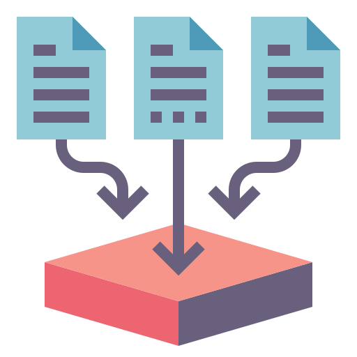

<h1 align="center"> Summarization Papers</h1>

<h3 align="center"> I am trying to collect 50 summarization papers before 2016.</h3>

Organized by [Xiachong Feng](http://xcfeng.net/).

## Contributor

[Yichong Huang](https://github.com/OrangeInSouth), [Haozheng Yang](https://github.com/hzyang95), [Jiaan Wang](https://github.com/krystalan)

## Summarization Learning Route
[Summarization Learning Route (with link)](http://xcfeng.net/res/summarization-route.pdf)

## Trending

## Presentations && Notes
* [Dialogue Summarization (2022.1)](slides/presentation/Dialogue_Summarization_DAMO.pdf) 
* [Cross-lingual Summarization](slides/presentation/Cross-lingual_Summarization.pdf)  
* [如何把DialoGPT用到对话摘要任务？@ ACL 2021](https://mp.weixin.qq.com/s/GQQRRS3F7p4Zv6wSuDh0ng)  
* [对话摘要最新进展简述](https://mp.weixin.qq.com/s/628OAOW1_-Yc_vQbeuY_uA)  
* [Dialogue Summarization (2021.5)](slides/presentation/Dialogue_Summarization.pdf)  
* [融入常识知识的生成式对话摘要](https://mp.weixin.qq.com/s/x3zqGc4pqh4x3q_uorNKcg)  
* [会议摘要有难度？快来引入对话篇章结构信息](https://mp.weixin.qq.com/s/Be7AYUPdux8NvAO4wo6_fg)  
* [文本摘要论文列表(Chinese)](https://mp.weixin.qq.com/s/tLdLGSFl229selxeogQk-w)  
* [事实感知的生成式文本摘要(Chinese)](https://mp.weixin.qq.com/s/Aye9FBwG-v2JO2MLoEjo0g)  
* [多模态摘要简述(Chinese)](https://mp.weixin.qq.com/s/Ce6jtp-gTtqeh9lgi-kHtQ)  
* [文本摘要简述](https://mp.weixin.qq.com/s/NGpDrYilAeuH6pQji0ujaA)  
* [Multi-modal Summarization](slides/presentation/Multi-modal-Summarization.pdf)  
* [ACL20 Summarization](slides/presentation/acl2020-summarization.pdf)  
* [文本摘要简述 (Chinese)](slides/presentation/文本摘要简述.pdf)  
* [ACL19 Summarization](slides/presentation/ACL19%20Summarization.pdf)  
* [Brief intro to summarization (Chinese)](slides/notes/Brief-intro-to-summarization.pdf) 
* [EMNLP19 Summarization (Chinese)](slides/notes/EMNLP19_Summarization.pdf) 
* [ACL19-A Simple Theoretical Model of Importance for Summarization](slides/paper-slides/A%20Simple%20Theoretical%20Model%20of%20Importance%20for%20Summarization.pdf) 
* [ACL19-Multimodal Abstractive Summarization for How2 Videos](slides/paper-slides/Multimodal%20Abstractive%20Summarization%20for%20How2%20Videos.pdf) 

## Benchmark
* **MuLD: The Multitask Long Document Benchmark** *G Thomas Hudson, Noura Al Moubayed* [[pdf]](https://arxiv.org/abs/2202.07362) [[data]](https://github.com/ghomasHudson/muld)
* **EXPLAINABOARD: An Explainable Leaderboard for NLP** *Pengfei Liu, Jinlan Fu, Yang Xiao, Weizhe Yuan, Shuaichen Chang, Junqi Dai, Yixin Liu, Zihuiwen Ye, Graham Neubig* [[pdf]](http://explainaboard.nlpedia.ai/ExplainaBoard.pdf) [[ExplainaBoard]](http://explainaboard.nlpedia.ai/leaderboard/task-summ/index.php)
* **GLGE: A New General Language Generation Evaluation Benchmark** *Dayiheng Liu, Yu Yan, Yeyun Gong, Weizhen Qi, Hang Zhang, Jian Jiao, Weizhu Chen, Jie Fu, Linjun Shou, Ming Gong, Pengcheng Wang, Jiusheng Chen, Daxin Jiang, Jiancheng Lv, Ruofei Zhang, Winnie Wu, Ming Zhou, Nan Duan* [[pdf]](https://arxiv.org/abs/2011.11928) [[benchmark]](https://github.com/microsoft/glge)

## Survey
1. **A Survey on Medical Document Summarization** *Raghav Jain, Anubhav Jangra, Sriparna Saha, Adam Jatowt*  [[pdf]](https://arxiv.org/abs/2212.01669)  
 
[Abs]
 The internet has had a dramatic effect on the healthcare industry, allowing documents to be saved, shared, and managed digitally. This has made it easier to locate and share important data, improving patient care and providing more opportunities for medical studies. As there is so much data accessible to doctors and patients alike, summarizing it has become increasingly necessary - this has been supported through the introduction of deep learning and transformer-based networks, which have boosted the sector significantly in recent years. This paper gives a comprehensive survey of the current techniques and trends in medical summarization 

2. **Taxonomy of Abstractive Dialogue Summarization: Scenarios, Approaches and Future Directions** *Qi Jia, Siyu Ren, Yizhu Liu, Kenny Q. Zhu* [[pdf]](https://arxiv.org/abs/2210.09894) 
 
[Abs]
 Abstractive dialogue summarization is to generate a concise and fluent summary covering the salient information in a dialogue among two or more interlocutors. It has attracted great attention in recent years based on the massive emergence of social communication platforms and an urgent requirement for efficient dialogue information understanding and digestion. Different from news or articles in traditional document summarization, dialogues bring unique characteristics and additional challenges, including different language styles and formats, scattered information, flexible discourse structures and unclear topic boundaries. This survey provides a comprehensive investigation on existing work for abstractive dialogue summarization from scenarios, approaches to evaluations. It categorizes the task into two broad categories according to the type of input dialogues, i.e., open-domain and task-oriented, and presents a taxonomy of existing techniques in three directions, namely, injecting dialogue features, designing auxiliary training tasks and using additional data.A list of datasets under different scenarios and widely-accepted evaluation metrics are summarized for completeness. After that, the trends of scenarios and techniques are summarized, together with deep insights on correlations between extensively exploited features and different scenarios. Based on these analyses, we recommend future directions including more controlled and complicated scenarios, technical innovations and comparisons, publicly available datasets in special domains, etc. 

3. **A Survey of Automatic Text Summarization Using Graph Neural Networks** *Marco Ferdinand Salchner, Adam Jatowt* `COLING 2022` [[pdf]](https://aclanthology.org/2022.coling-1.536/) 
 
[Abs]
 Although automatic text summarization (ATS) has been researched for several decades, the application of graph neural networks (GNNs) to this task started relatively recently. In this survey we provide an overview on the rapidly evolving approach of using GNNs for the task of automatic text summarization. In particular we provide detailed information on the functionality of GNNs in the context of ATS, and a comprehensive overview of models utilizing this approach. 
 
4. **A Survey on Cross-Lingual Summarization** *Jiaan Wang, Fandong Meng, Duo Zheng, Yunlong Liang, Zhixu Li, Jianfeng Qu, Jie Zhou* `TACL 2022` [[pdf]](https://arxiv.org/abs/2203.12515) 
 
[Abs]
 Cross-lingual summarization is the task of generating a summary in one language (e.g., English) for the given document(s) in a different language (e.g., Chinese). Under the globalization background, this task has attracted increasing attention of the computational linguistics community. Nevertheless, there still remains a lack of comprehensive review for this task. Therefore, we present the first systematic critical review on the datasets, approaches, and challenges in this field. Specifically, we carefully organize existing datasets and approaches according to different construction methods and solution paradigms, respectively. For each type of datasets or approaches, we thoroughly introduce and summarize previous efforts and further compare them with each other to provide deeper analyses. In the end, we also discuss promising directions and offer our thoughts to facilitate future research. This survey is for both beginners and experts in cross-lingual summarization, and we hope it will serve as a starting point as well as a source of new ideas for researchers and engineers interested in this area. 

5. **An Empirical Survey on Long Document Summarization: Datasets, Models and Metrics** *uan Yee Koh, Jiaxin Ju, Ming Liu, Shirui Pan* `ACM Computing Surveys` [[pdf]](https://arxiv.org/abs/2207.00939) 
 
[Abs]
 Long documents such as academic articles and business reports have been the standard format to detail out important issues and complicated subjects that require extra attention. An automatic summarization system that can effectively condense long documents into short and concise texts to encapsulate the most important information would thus be significant in aiding the reader's comprehension. Recently, with the advent of neural architectures, significant research efforts have been made to advance automatic text summarization systems, and numerous studies on the challenges of extending these systems to the long document domain have emerged. In this survey, we provide a comprehensive overview of the research on long document summarization and a systematic evaluation across the three principal components of its research setting: benchmark datasets, summarization models, and evaluation metrics. For each component, we organize the literature within the context of long document summarization and conduct an empirical analysis to broaden the perspective on current research progress. The empirical analysis includes a study on the intrinsic characteristics of benchmark datasets, a multi-dimensional analysis of summarization models, and a review of the summarization evaluation metrics. Based on the overall findings, we conclude by proposing possible directions for future exploration in this rapidly growing field. 

6. **Multi-document Summarization via Deep Learning Techniques: A Survey** *Congbo Ma, Wei Emma Zhang, Mingyu Guo, Hu Wang, QUAN Z. Sheng* [[pdf]](https://dl.acm.org/doi/10.1145/3529754)
7. **Embedding Knowledge for Document Summarization: A Survey** *Yutong Qu, Wei Emma Zhang, Jian Yang, Lingfei Wu, Jia Wu, Xindong Wu* [[pdf]](https://arxiv.org/abs/2204.11190)
8. **A Survey on Dialogue Summarization: Recent Advances and New Frontiers** *Xiachong Feng, Xiaocheng Feng, Bing Qin* `IJCAI 2022, Survey Track` [[pdf]](https://arxiv.org/abs/2107.03175)
9. **Automatic Text Summarization Methods: A Comprehensive Review** *Divakar Yadav, Jalpa Desai, Arun Kumar Yadav* [[pdf]](https://arxiv.org/abs/2204.01849)
10. **Faithfulness in Natural Language Generation: A Systematic Survey of Analysis, Evaluation and Optimization Methods** *Wei Li, Wenhao Wu, Moye Chen, Jiachen Liu, Xinyan Xiao, Hua Wu* [[pdf]](https://arxiv.org/abs/2203.05227)
11. **Recent Advances in Neural Text Generation: A Task-Agnostic Survey** *Chen Tang, Frank Guerin, Yucheng Li, Chenghua Lin* [[pdf]](https://arxiv.org/abs/2203.03047)
12. **Survey of Hallucination in Natural Language Generation** *Ziwei Ji, Nayeon Lee, Rita Frieske, Tiezheng Yu, Dan Su, Yan Xu, Etsuko Ishii, Yejin Bang, Andrea Madotto, Pascale Fung* [[pdf]](https://arxiv.org/abs/2202.03629)
13. **A Survey on Retrieval-Augmented Text Generation** *Huayang Li, Yixuan Su, Deng Cai, Yan Wang, Lemao Liu* [[pdf]](https://arxiv.org/abs/2202.01110)
14. **A Survey of Controllable Text Generation using Transformer-based Pre-trained Language Models** *Hanqing Zhang, Haolin Song, Shaoyu Li, Ming Zhou, Dawei Song* [[pdf]](https://arxiv.org/abs/2201.05337)
15. **A Survey of Pretrained Language Models Based Text Generation** *Junyi Li, Tianyi Tang, Wayne Xin Zhao, Jian-Yun Nie, Ji-Rong Wen* [[pdf]](https://arxiv.org/abs/2201.05273)
16. **A Comprehensive Review on Summarizing Financial News Using Deep Learning** *Saurabh Kamal, Sahil Sharma* [[pdf]](https://arxiv.org/abs/2109.10118)
17. **A Survey on Multi-modal Summarization** *Anubhav Jangra, Adam Jatowt, Sriparna Saha, Mohammad Hasanuzzaman* [[pdf]](https://arxiv.org/abs/2109.05199)
18. **Pre-train, Prompt, and Predict: A Systematic Survey of Prompting Methods in Natural Language Processing** *Pengfei Liu, Weizhe Yuan, Jinlan Fu, Zhengbao Jiang, Hiroaki Hayashi, Graham Neubig* [[pdf]](https://arxiv.org/abs/2107.13586)
19. **Pretrained Language Models for Text Generation: A Survey** *Junyi Li, Tianyi Tang, Wayne Xin Zhao, Ji-Rong Wen* `IJCAI21` [[pdf]](https://arxiv.org/abs/2105.10311)
20. **A Survey of Recent Abstract Summarization Techniques** *Diyah Puspitaningrum* `ICICT21` [[pdf]](https://arxiv.org/abs/2105.00824)
21. **A Survey of the State-of-the-Art Models in Neural Abstractive Text Summarization** *AYESHA AYUB SYED, FORD LUMBAN GAOL, TOKURO MATSUO* [[pdf]](https://ieeexplore.ieee.org/stamp/stamp.jsp?arnumber=9328413)
22. **Automatic summarization of scientific articles: A survey** *Nouf Ibrahim Altmami, Mohamed El Bachir Menai* `Journal of King Saud University - Computer and Information Sciences` [[pdf]](https://www.sciencedirect.com/science/article/pii/S1319157820303554)
23. **Multi-document Summarization via Deep Learning Techniques: A Survey** *Congbo Ma, Wei Emma Zhang, Mingyu Guo, Hu Wang, Quan Z. Sheng* [[pdf]](https://arxiv.org/abs/2011.04843) 
24. **Deep Learning Based Abstractive Text Summarization: Approaches, Datasets, Evaluation Measures, and Challenges** *Dima Suleiman, Arafat A. Awajan* [[pdf]](https://www.semanticscholar.org/paper/Deep-Learning-Based-Abstractive-Text-Summarization%3A-Suleiman-Awajan/b7da726c244287748575ef404009609afde45bea)
25. **A Survey of Knowledge-Enhanced Text Generation** *Wenhao Yu, Chenguang Zhu, Zaitang Li, Zhiting Hu, Qingyun Wang, Heng Ji, Meng Jiang* [[pdf]](https://arxiv.org/abs/2010.04389)
26. **From Standard Summarization to New Tasks and Beyond: Summarization with Manifold Information** *Shen Gao, Xiuying Chen, Zhaochun Ren, Dongyan Zhao, Rui Yan* `IJCAI20` [[pdf]](https://arxiv.org/abs/2005.04684)
27. **Neural Abstractive Text Summarization with Sequence-to-Sequence Models** *Tian Shi, Yaser Keneshloo, Naren Ramakrishnan, Chandan K. Reddy* [[pdf]](https://arxiv.org/abs/1812.02303)
28. **A Survey on Neural Network-Based Summarization Methods** *Yue Dong* [[pdf]](https://arxiv.org/abs/1804.04589)
29. **Automated text summarisation and evidence-based medicine: A survey of two domains** *Abeed Sarker, Diego Molla, Cecile Paris* [[pdf]](https://arxiv.org/abs/1706.08162)
30. **Automatic Keyword Extraction for Text Summarization: A Survey** *Santosh Kumar Bharti, Korra Sathya Babu* [[pdf]](https://arxiv.org/abs/1704.03242)
31. **Text Summarization Techniques: A Brief Survey** *Mehdi Allahyari, Seyedamin Pouriyeh, Mehdi Assefi, Saeid Safaei, Elizabeth D. Trippe, Juan B. Gutierrez, Krys Kochut* [[pdf]](https://arxiv.org/abs/1707.02268)
32. **Recent automatic text summarization techniques: a survey** *Mahak Gambhir, Vishal Gupta* [[pdf]](https://link.springer.com/article/10.1007/s10462-016-9475-9)

## Toolkit
1. **Summary Workbench: Unifying Application and Evaluation of Text Summarization Models** *Shahbaz Syed, Dominik Schwabe, Martin Potthast* `EMNLP 2022 Demo` [[pdf]](https://arxiv.org/abs/2210.09587) [[demo]](https://tldr.demo.webis.de/summarize)  
 
[Abs]
 This paper presents Summary Workbench, a new tool for developing and evaluating text summarization models. New models and evaluation measures can be easily integrated as Docker-based plugins, allowing to examine the quality of their summaries against any input and to evaluate them using various evaluation measures. Visual analyses combining multiple measures provide insights into the models' strengths and weaknesses. The tool is hosted at \url{this https URL} and also supports local deployment for private resources. 

1. **iFacetSum: Coreference-based Interactive Faceted Summarization for Multi-Document Exploration** *Eran Hirsch, Alon Eirew, Ori Shapira, Avi Caciularu, Arie Cattan, Ori Ernst, Ramakanth Pasunuru, Hadar Ronen, Mohit Bansal, Ido Dagan* `EMNLP 2021` [[pdf]](https://arxiv.org/abs/2109.11621) [[demo]](https://biu-nlp.github.io/iFACETSUM/WebApp/client/)
1. **SummerTime: Text Summarization Toolkit for Non-experts** *Ansong Ni, Zhangir Azerbayev, Mutethia Mutuma, Troy Feng, Yusen Zhang, Tao Yu, Ahmed Hassan Awadallah, Dragomir Radev* `EMNLP 2021 Demo Track` [[pdf]](https://arxiv.org/abs/2108.12738) [[Demo]](https://github.com/Yale-LILY/SummerTime)
1. **Summary Explorer: Visualizing the State of the Art in Text Summarization** *Shahbaz Syed, Tariq Yousef, Khalid Al-Khatib, Stefan Jänicke, Martin Potthast*  [[pdf]](https://arxiv.org/abs/2108.01879) [[web]](https://tldr.webis.de/)
1. **fastnlp/fastSum** [[code]](https://github.com/fastnlp/fastSum)
1. **Graph4NLP** [[code]](https://github.com/graph4ai/graph4nlp) [[summarization]](https://github.com/graph4ai/graph4nlp/tree/master/examples/pytorch/summarization)
1. **CTRLsum: Towards Generic Controllable Text Summarization** [[pdf]](https://arxiv.org/abs/2012.04281) [[code]](https://github.com/hyunwoongko/summarizers)
1. **OpenNMT-py: Open-Source Neural Machine Translation** [[pdf]](https://www.aclweb.org/anthology/W18-1817.pdf) [[code]](https://github.com/OpenNMT/OpenNMT-py)
2. **Fairseq: Facebook AI Research Sequence-to-Sequence Toolkit written in Python.**  [[code]](https://github.com/pytorch/fairseq)
3. **LeafNATS: An Open-Source Toolkit and Live Demo System for Neural Abstractive Text Summarization** *Tian Shi, Ping Wang, Chandan K. Reddy* `NAACL19` [[pdf]](https://www.aclweb.org/anthology/N19-4012/) [[code]](https://github.com/tshi04/LeafNATS)
4. **TransformerSum** [[code]](https://github.com/HHousen/TransformerSum)

## Analysis
   

1. **Analyzing Multi-Task Learning for Abstractive Text Summarization** *Frederic Kirstein, Jan Philip Wahle, Terry Ruas, Bela Gipp* `` [[pdf]](https://arxiv.org/abs/2210.14606) 
 
[Abs]
 Despite the recent success of multi-task learning and pre-finetuning for natural language understanding, few works have studied the effects of task families on abstractive text summarization. Task families are a form of task grouping during the pre-finetuning stage to learn common skills, such as reading comprehension. To close this gap, we analyze the influence of multi-task learning strategies using task families for the English abstractive text summarization task. We group tasks into one of three strategies, i.e., sequential, simultaneous, and continual multi-task learning, and evaluate trained models through two downstream tasks. We find that certain combinations of task families (e.g., advanced reading comprehension and natural language inference) positively impact downstream performance. Further, we find that choice and combinations of task families influence downstream performance more than the training scheme, supporting the use of task families for abstractive text summarization. 

1. **On Decoding Strategies for Neural Text Generators** *Gian Wiher, Clara Meister, Ryan Cotterell* [[pdf]](https://arxiv.org/abs/2203.15721) 
1. **Training Dynamics for Text Summarization Models** *Tanya Goyal, Jiacheng Xu, Junyi Jessy Li, Greg Durrett* [https://arxiv.org/abs/2110.08370]
1. **Does Summary Evaluation Survive Translation to Other Languages?** *Neslihan Iskender, Oleg Vasilyev, Tim Polzehl, John Bohannon, Sebastian Möller* [[pdf]](https://arxiv.org/abs/2109.08129)
1. **How well do you know your summarization datasets?** *Priyam Tejaswin, Dhruv Naik, Pengfei Liu* `Findings of ACL 2021` [[pdf]](https://arxiv.org/abs/2106.11388) [[code]](https://github.com/priyamtejaswin/howwelldoyouknow)
1. **Dissecting Generation Modes for Abstractive Summarization Models via Ablation and Attribution** *Jiacheng Xu, Greg Durrett* `ACL2021` [[pdf]](https://aclanthology.org/2021.acl-long.539/) [[code]](https://github.com/jiacheng-xu/sum-interpret)
1. **To Point or Not to Point: Understanding How Abstractive Summarizers Paraphrase Text** *Matt Wilber, William Timkey, Marten Van Schijndel* `Findings of ACL 2021` [[pdf]](https://arxiv.org/abs/2106.01581) [[code]](https://github.com/mwilbz/pointer-generator-analysis)
1. **What Makes a Good Summary? Reconsidering the Focus of Automatic Summarization** *Maartje ter Hoeve, Julia Kiseleva, Maarten de Rijke* [[pdf]](https://arxiv.org/abs/2012.07619)
1. **Intrinsic Evaluation of Summarization Datasets** *Rishi Bommasani, Claire Cardie* `EMNLP20` [[pdf]](https://www.aclweb.org/anthology/2020.emnlp-main.649/) 
1. **Metrics also Disagree in the Low Scoring Range: Revisiting Summarization Evaluation Metrics** *Manik Bhandari, Pranav Gour, Atabak Ashfaq, Pengfei Liu* `COLING20 Short` [[pdf]](https://arxiv.org/abs/2011.04096) [[code]](https://github.com/manikbhandari/RevisitSummEvalMetrics) 
1. **At Which Level Should We Extract? An Empirical Analysis on Extractive Document Summarization** *Qingyu Zhou, Furu Wei, Ming Zhou* `COLING20` [[pdf]](https://arxiv.org/abs/2004.02664) 
1. **Corpora Evaluation and System Bias detection in Multi Document Summarization** *Alvin Dey, Tanya Chowdhury, Yash Kumar, Tanmoy Chakraborty* `Findings of EMNLP` [[pdf]](https://www.aclweb.org/anthology/2020.findings-emnlp.254/) 
1. **Understanding the Extent to which Summarization Evaluation Metrics Measure the Information Quality of Summaries** *Daniel Deutsch, Dan Roth* [[pdf]](https://arxiv.org/abs/2010.12495) [[code]](https://github.com/CogComp/content-analysis-experiments)
1. **Understanding Neural Abstractive Summarization Models via Uncertainty** *Jiacheng Xu, Shrey Desai, Greg Durrett* `EMNLP20 Short` [[pdf]](https://arxiv.org/abs/2010.07882) [[code]](https://github.com/jiacheng-xu/text-sum-uncertainty) 
2. **Re-evaluating Evaluation in Text Summarization** *Manik Bhandari, Pranav Gour, Atabak Ashfaq, Pengfei Liu, Graham Neubig* `EMNLP20` [[pdf]](https://arxiv.org/abs/2010.07100) [[code]](https://github.com/neulab/REALSumm) 
3. **CDEvalSumm: An Empirical Study of Cross-Dataset Evaluation for Neural Summarization Systems** *Yiran Chen, Pengfei Liu, Ming Zhong, Zi-Yi Dou, Danqing Wang, Xipeng Qiu, Xuanjing Huang* `EMNLP20` [[pdf]](https://arxiv.org/abs/2010.05139) [[code]](https://github.com/zide05/CDEvalSumm) 
4. **What Have We Achieved on Text Summarization?** *Dandan Huang, Leyang Cui, Sen Yang, Guangsheng Bao, Kun Wang, Jun Xie, Yue Zhang* `EMNLP20` [[pdf]](https://arxiv.org/abs/2010.04529) 
5. **Conditional Neural Generation using Sub-Aspect Functions for Extractive News Summarization** *Zhengyuan Liu, Ke Shi, Nancy F. Chen* `Findings of EMNLP20` [[pdf]](https://arxiv.org/abs/2004.13983) 
6. **Extractive Summarization as Text Matching** *Ming Zhong, Pengfei Liu, Yiran Chen, Danqing Wang, Xipeng Qiu, Xuanjing Huang* `ACL20` [[pdf]](https://arxiv.org/abs/2004.08795) [[code]](https://github.com/maszhongming/MatchSum)  
7. **Neural Text Summarization: A Critical Evaluation** *Wojciech Kryściński, Nitish Shirish Keskar, Bryan McCann, Caiming Xiong, Richard Socher* `EMNLP19` [[pdf]](https://www.aclweb.org/anthology/D19-1051/) 
8. **Earlier Isn’t Always Better:Sub-aspect Analysis on Corpus and System Biases in Summarization** *Taehee Jung, Dongyeop Kang, Lucas Mentch, Eduard Hovy* `EMNLP19` [[pdf]](https://arxiv.org/abs/1908.11723) [[code]](https://github.com/dykang/biassum) 
9. **A Closer Look at Data Bias in Neural Extractive Summarization Models** *Ming Zhong, Danqing Wang, Pengfei Liu, Xipeng Qiu, Xuanjing Huang* `EMNLP19 Workshop` [[pdf]](https://arxiv.org/abs/1909.13705) 
10. **Countering the Effects of Lead Bias in News Summarization via Multi-Stage Training and Auxiliary Losses** *Matt Grenander, Yue Dong, Jackie Chi Kit Cheung, Annie Louis* `EMNLP19 Short` [[pdf]](https://arxiv.org/abs/1909.04028)  
11. **Searching for Effective Neural Extractive Summarization: What Works and What's Next** *Ming Zhong, Pengfei Liu, Danqing Wang, Xipeng Qiu, Xuanjing Huang* `ACL19` [[pdf]](https://arxiv.org/abs/1907.03491) [[code]](https://github.com/maszhongming/Effective_Extractive_Summarization) 
12. **Content Selection in Deep Learning Models of Summarization** *Chris Kedzie, Kathleen McKeown, Hal Daumé III* `EMNLP18` [[pdf]](https://www.aclweb.org/anthology/D18-1208/) [[code]](https://github.com/kedz/nnsum/tree/emnlp18-release) 

## Thesis
1. **Principled Approaches to Automatic Text Summarization** *Maxime Peyrard* [[pdf]](https://tuprints.ulb.tu-darmstadt.de/9012/)
2.  **Neural Text Summarization and Generation** *Piji Li* [[pdf]](http://lipiji.com/docs/thesis.pdf)

## Theory
1. **Bayesian Active Summarization** *Alexios Gidiotis, Grigorios Tsoumakas* [[pdf]](https://arxiv.org/abs/2110.04480)
1. **RefSum: Refactoring Neural Summarization** *Yixin Liu, Zi-Yi Dou, Pengfei Liu* `NAACL21` [[pdf]](https://arxiv.org/abs/2104.07210) [[code]](https://github.com/yixinL7/Refactoring-Summarization)
1. **Principled Approaches to Automatic Text Summarization** *Maxime Peyrard* [[pdf]](https://tuprints.ulb.tu-darmstadt.de/9012/) 
1. **KLearn: Background Knowledge Inference from Summarization Data** *Maxime Peyrard, Robert West* `Findings of EMNLP20` [[pdf]](https://arxiv.org/abs/2010.06213) [[code]](https://github.com/epfl-dlab/KLearn)
2. **A Simple Theoretical Model of Importance for Summarization** *Maxime Peyrard* `ACL19` [[pdf]](https://www.aclweb.org/anthology/P19-1101/)
3. **BottleSum: Unsupervised and Self-supervised Sentence Summarization using the Information Bottleneck Principle** *Peter West, Ari Holtzman, Jan Buys, Yejin Choi* `EMNLP19` [[pdf]](https://arxiv.org/abs/1909.07405) [[code]](https://github.com/peterwestuw/BottleSum)

## Dataset

|ID|Name|Description|Paper|Conference|
|:---:|:---:|:---:|:---:|:---:|
| 1 | [CNN-DailyMail](https://github.com/harvardnlp/sent-summary) | News | [Abstractive Text Summarization using Sequence\-to\-sequence RNNs and Beyond ](https://www.aclweb.org/anthology/K16-1028/)|SIGNLL16|
| 2 | [New York Times](https://catalog.ldc.upenn.edu/LDC2008T19)| News | [The New York Times Annotated Corpus](https://catalog.ldc.upenn.edu/LDC2008T19) ||
| 3 | [DUC](https://duc.nist.gov/data.html)| News | [The Effects Of Human Variation In DUC Summarization Evaluation](https://www.aclweb.org/anthology/W04-1003/) ||
| 4 | [Gigaword](https://github.com/harvardnlp/sent-summary) | News | [A Neural Attention Model For Abstractive Sentence Summarization](https://arxiv.org/abs/1509.00685) |EMNLP15|
| 5 | [Newsroom](http://lil.nlp.cornell.edu/newsroom/) | News | [Newsroom: A Dataset of 1\.3 Million Summaries with Diverse Extractive Strategies](https://www.aclweb.org/anthology/N18-1065)|NAACL18|
| 6 | [Xsum](https://github.com/EdinburghNLP/XSum) | News | [Don’t Give Me the Details, Just the Summary\! Topic\-Aware Convolutional Neural Networks for Extreme Summarization](https://www.aclweb.org/anthology/D18-1206/)|EMNLP18|
| 7 | [Multi-News](https://github.com/Alex-Fabbri/Multi-News)| Multi-document News | [Multi\-News: a Large\-Scale Multi\-Document Summarization Dataset and Abstractive Hierarchical Model](https://arxiv.org/abs/1906.01749)|ACL19|
| 8 | [SAMSum](https://arxiv.org/abs/1911.12237)| Multi-party conversation | [SAMSum Corpus: A Human\-annotated Dialogue Dataset for Abstractive Summarization](https://arxiv.org/abs/1911.12237)|EMNLP19|
| 9 | [AMI](http://groups.inf.ed.ac.uk/ami/download/) | Meeting | [The AMI Meeting Corpus: A pre\-announcement\. ](http://groups.inf.ed.ac.uk/ami/download/)||
| 10 | [ICSI](http://groups.inf.ed.ac.uk/ami/icsi/download/)| Meeting | [The ICSI Meeting Corpus](http://groups.inf.ed.ac.uk/ami/icsi/) ||
| 11 | [MSMO](http://www.nlpr.ia.ac.cn/cip/jjzhang.htm)| Multi-modal | [MSMO: Multimodal Summarization with Multimodal Output](https://www.aclweb.org/anthology/D18-1448/) |EMNLP18|
| 12 | [How2](https://github.com/srvk/how2-dataset) | Multi-modal | [How2: A Large\-scale Dataset for Multimodal Language Understanding](https://arxiv.org/abs/1811.00347)| NIPS18|
| 13 | [ScisummNet](https://cs.stanford.edu/~myasu/projects/scisumm_net/) | Scientific paper | [ScisummNet: A Large Annotated Corpus and Content\-Impact Models for Scientific Paper Summarization with Citation Networks](https://arxiv.org/abs/1909.01716) |AAAI19|
| 14 | [PubMed, ArXiv](https://github.com/armancohan/long-summarization)| Scientific paper | [A Discourse\-Aware Attention Model for Abstractive Summarization of Long Documents](https://arxiv.org/abs/1804.05685)| NAACL18 |
| 15 | [TALKSUMM](https://github.com/levguy/talksumm) | Scientific paper | [TALKSUMM: A Dataset and Scalable Annotation Method for Scientific Paper Summarization Based on Conference Talks](https://www.aclweb.org/anthology/P19-1204/) | ACL19 |
| 16 | [BillSum](https://github.com/FiscalNote/BillSum) | Legal | [BillSum: A Corpus for Automatic Summarization of US Legislation](https://www.aclweb.org/anthology/D19-5406/) |EMNLP19|
| 17 | [LCSTS](http://icrc.hitsz.edu.cn/Article/show/139.html)| Chinese Weibo| [LCSTS: A Large Scale Chinese Short Text Summarization Dataset ](https://www.aclweb.org/anthology/D15-1229/)|EMNLP15|
| 18 | [WikiHow](https://github.com/mahnazkoupaee/WikiHow-Dataset)| Online Knowledge Base | [WikiHow: A Large Scale Text Summarization Dataset](https://arxiv.org/abs/1810.09305) ||
| 19 | [Concept-map-based MDS Corpus](https://github.com/UKPLab/emnlp2017-cmapsum-corpus/)| Educational Multi-document| [Bringing Structure into Summaries : Crowdsourcing a Benchmark Corpus of Concept Maps](https://www.aclweb.org/anthology/D17-1320/)|EMNLP17|
| 20 | [WikiSum](https://github.com/tensorflow/tensor2tensor/tree/master/tensor2tensor/data_generators/wikisum) | Wikipedia Multi-document | [Generating Wikipedia By Summarizing Long Sequence](https://arxiv.org/abs/1801.10198) |ICLR18|
| 21 | [GameWikiSum](https://github.com/Diego999/GameWikiSum) | Game Multi-document | [GameWikiSum : a Novel Large Multi\-Document Summarization Dataset](https://arxiv.org/abs/2002.06851) |LREC20|
| 22 | [En2Zh CLS, Zh2En CLS](http://www.nlpr.ia.ac.cn/cip/dataset.htm)| Cross-Lingual | [NCLS: Neural Cross\-Lingual Summarization](https://arxiv.org/abs/1909.00156) |EMNLP19|
| 23 | [Timeline Summarization Dataset](https://github.com/yingtaomj/Learning-towards-Abstractive-Timeline-Summarization)| Baidu timeline| [Learning towards Abstractive Timeline Summarization ](https://www.ijcai.org/Proceedings/2019/686)|IJCAI19|
| 24 | [Reddit TIFU](https://github.com/ctr4si/MMN) | online discussion | [Abstractive Summarization of Reddit Posts with Multi\-level Memory Networks](https://arxiv.org/abs/1811.00783)| NAACL19 |
| 25 | [TripAtt](https://github.com/Junjieli0704/ASN) | Review | [Attribute\-aware Sequence Network for Review Summarization](https://www.aclweb.org/anthology/D19-1297/)|EMNLP19|
| 26 | [Reader Comments Summarization Corpus](https://drive.google.com/file/d/1_YH5cBtvNnUNJjGj7kiTMjuHydBqWYQT/view?usp=drive_open) | Comments-based Weibo | [Abstractive Text Summarization by Incorporating Reader Comments ](https://arxiv.org/abs/1812.05407)|AAAI19|
| 27 | [BIGPATENT](https://evasharma.github.io/bigpatent/) | Patent| [BIGPATENT: A Large\-Scale Dataset for Abstractive and Coherent Summarization](https://arxiv.org/abs/1906.03741)|ACL19|
| 28 | [Curation Corpus](https://github.com/CurationCorp/curation-corpus) | News | [Curation Corpus for Abstractive Text Summarisation](https://github.com/CurationCorp/curation-corpus) ||
| 29 | [MATINF](https://github.com/WHUIR/MATINF)|Multi-task|[MATINF: A Jointly Labeled Large-Scale Dataset for Classification, Question Answering and Summarization](https://arxiv.org/abs/2004.12302)|ACL20|
| 30 | [MLSUM](https://github.com/recitalAI/MLSUM) |Multi-Lingual Summarization Dataset|[MLSUM: The Multilingual Summarization Corpus](https://arxiv.org/abs/2004.14900)|EMNLP20|
| 31 | Dialogue(Debate)|Argumentative Dialogue Summary Corpus |[Using Summarization to Discover Argument Facets in Online Idealogical Dialog](https://www.aclweb.org/anthology/N15-1046/)|NAACL15|
|32|[WCEP](https://github.com/complementizer/wcep-mds-dataset)|News Multi-document|[A Large-Scale Multi-Document Summarization Dataset from the Wikipedia Current Events Portal](https://arxiv.org/abs/2005.10070)|ACL20 Short|
|33|[ArgKP](https://www.research.ibm.com/haifa/dept/vst/debating_data.shtml)|Argument-to-key Point Mapping|[From Arguments to Key Points: Towards Automatic Argument Summarization](https://arxiv.org/abs/2005.01619)|ACL20|
|34|[CRD3](https://github.com/RevanthRameshkumar/CRD3)|Dialogue|[Storytelling with Dialogue: A Critical Role Dungeons and Dragons Dataset](https://www.aclweb.org/anthology/2020.acl-main.459/)|2020|
|35|[Gazeta](https://github.com/IlyaGusev/gazeta)|Russian news|[Dataset for Automatic Summarization of Russian News](https://arxiv.org/abs/2006.11063)||
|36|[MIND](https://msnews.github.io/)|English news recommendation, Summarization, Classification, Entity|[MIND: A Large-scale Dataset for News Recommendation](https://www.aclweb.org/anthology/2020.acl-main.331/)|ACL20|
|37|[public_meetings](https://github.com/pltrdy/autoalign)|french meeting(test set)|[Align then Summarize: Automatic Alignment Methods for Summarization Corpus Creation](https://www.aclweb.org/anthology/2020.lrec-1.829)|LREC|
|38|Enron|Email|[Building a Dataset for Summarization and Keyword Extraction from Emails](https://www.aclweb.org/anthology/L14-1028/)|2014|
|39|Columbia|Email|[Summarizing Email Threads]([https://www.aclweb.org/anthology/N04-4027.pdf](https://dl.acm.org/doi/10.5555/1613984.1614011))|2004|
|40|[BC3](https://www.cs.ubc.ca/cs-research/lci/research-groups/natural-language-processing/bc3.html)|Email|[A publicly available annotated corpus for supervised email summarization](https://www.ufv.ca/media/assets/computer-information-systems/gabriel-murray/publications/aaai08.pdf)||
|41|[WikiLingua](https://github.com/esdurmus/Wikilingua)|Cross-Lingual|[WikiLingua- A New Benchmark Dataset for Cross-Lingual Abstractive Summarization](https://arxiv.org/abs/2010.03093)|Findings of EMNLP20|
|42|[LcsPIRT](http://eie.usts.edu.cn/prj/NLPoSUST/LcsPIRT.htm)|Chinese Dialogue|[Global Encoding for Long Chinese Text Summarization](https://dl.acm.org/doi/10.1145/3407911)|TALLIP|
|43|[CLTS](https://github.com/lxj5957/CLTS-Dataset)，[CLTS-plus](https://github.com/lxj5957/CLTS-plus-Dataset)|Chinese News|[CLTS: A New Chinese Long Text Summarization Dataset](https://link.springer.com/chapter/10.1007/978-3-030-60450-9_42) [CLTS+: A New Chinese Long Text Summarization Dataset with Abstractive Summaries](https://arxiv.org/abs/2206.04253)|NLPCC20|
|44|[VMSMO](https://github.com/yingtaomj/VMSMO)|Multi-modal|[VMSMO: Learning to Generate Multimodal Summary for Video-based News Articles](https://arxiv.org/abs/2010.05406)|EMNLP20 |
|45|[Multi-XScience](https://github.com/yaolu/Multi-XScience)|Multi-document|[Multi-XScience: A Large-scale Dataset for Extreme Multi-document Summarization of Scientific Articles](https://arxiv.org/abs/2010.14235)|EMNLP20 short|
|46|[SCITLDR](https://github.com/allenai/scitldr)|Scientific Document|[TLDR: Extreme Summarization of Scientific Documents](https://arxiv.org/abs/2004.15011)|Findings of EMNLP20|
|47|[scisumm-corpus](https://github.com/WING-NUS/scisumm-corpus)|Scientific Document|||
|48|[QBSUM](https://www.dropbox.com/sh/t2cp7ml1kb8ako0/AADmS2RMfJvLbukyQbb08CGGa?dl=0)|Query-Based Chinese|[QBSUM: a Large-Scale Query-Based Document Summarization Dataset from Real-world Applications](https://arxiv.org/abs/2010.14108)|Computer Speech & Language|
|49|[qMDS](https://github.com/google-research-datasets/aquamuse)|Query-Based Multi-Document|[AQuaMuSe: Automatically Generating Datasets for Query-Based Multi-Document Summarization](https://arxiv.org/abs/2010.12694)||
|50|[Liputan6](https://github.com/fajri91/sum_liputan6)|Indonesian|[Liputan6: A Large-scale Indonesian Dataset for Text Summarization](https://arxiv.org/pdf/2011.00679.pdf)|AACL20|
|51|[SportsSum](https://github.com/ej0cl6/SportsSum)|Sports Game|[Generating Sports News from Live Commentary: A Chinese Dataset for Sports Game Summarization](https://khhuang.me/docs/aacl2020sportssum.pdf)|AACL20|
|52|[WikiAsp](https://github.com/neulab/wikiasp)|Aspect-based|[WikiAsp: A Dataset for Multi-domain Aspect-based Summarization](https://arxiv.org/abs/2011.07832)|Transaction of the ACL|
|53|[DebateSum](https://github.com/Hellisotherpeople/DebateSum)|argument|[DebateSum:A large-scale argument mining and summarization dataset](https://arxiv.org/abs/2011.07251)|ARGMIN 2020|
|54|[Open4Business](https://github.com/amanpreet692/Open4Business)|Business|[Open4Business (O4B): An Open Access Dataset for Summarizing Business Documents](https://arxiv.org/abs/2011.07636)|Workshop on Dataset Curation and Security-NeurIPS 2020|
|55|[OrangeSum](https://github.com/moussaKam/OrangeSum)|French|[BARThez: a Skilled Pretrained French Sequence-to-Sequence Model](https://arxiv.org/abs/2010.12321)||
|56|[Medical Conversation](https://github.com/cuhksz-nlp/HET-MC)|medical conversation|[Summarizing Medical Conversations via Identifying Important Utterances](https://www.aclweb.org/anthology/2020.coling-main.63/)|COLING20|
|57|[SumTitles](https://github.com/huawei-noah/sumtitles)|movie dialogue|[SumTitles: a Summarization Dataset with Low Extractiveness](https://www.aclweb.org/anthology/2020.coling-main.503/)|COLING20|
|58|[BANS](https://www.kaggle.com/datasets/prithwirajsust/bengali-news-summarization-dataset)|bengali news|[Bengali Abstractive News Summarization (BANS): A Neural Attention Approach]()|TCCE-2020|
|59|[e-commerce](https://github.com/ypnlp/coling)|E-commerce|[On the Faithfulness for E-commerce Product Summarization](https://www.aclweb.org/anthology/2020.coling-main.502/)|COLING20|
|60|[TWEETSUM]()|Twitter|[TWEETSUM: Event-oriented Social Summarization Dataset](https://www.aclweb.org/anthology/2020.coling-main.504/)|COLING20|
|61|[SPACE](https://github.com/stangelid/qt)|Opinion|[Extractive Opinion Summarization in Quantized Transformer Spaces](https://arxiv.org/abs/2012.04443)|TACL|
|62|[pn-summary](https://github.com/hooshvare/pn-summary)|Persian|[Leveraging ParsBERT and Pretrained mT5 for Persian Abstractive Text Summarization](https://arxiv.org/abs/2012.11204)|csicc2021|
|63|[E-commerce1](https://github.com/RowitZou/topic-dialog-summ)*desensitized*|Dialogue|[Topic-Oriented Spoken Dialogue Summarization for Customer Service with Saliency-Aware Topic Modeling](https://arxiv.org/abs/2012.07311)|AAAI21|
|64|[E-commerce2](https://github.com/RowitZou/RankAE)*desensitized*|Dialogue|[Unsupervised Summarization for Chat Logs with Topic-Oriented Ranking and Context-Aware Auto-Encoders](https://arxiv.org/abs/2012.07300)|AAAI21|
|65|[BengaliSummarization](https://github.com/tafseer-nayeem/BengaliSummarization)|Bengali|[Unsupervised Abstractive Summarization of Bengali Text Documents](https://arxiv.org/abs/2102.04490)|EACL21|
|66|[MediaSum](https://github.com/zcgzcgzcg1/MediaSum)|Dialogue|[MediaSum: A Large-scale Media Interview Dataset for Dialogue Summarization](https://arxiv.org/abs/2103.06410)|NAACL21|
|67|[Healthline and BreastCancer](https://github.com/darsh10/Nutribullets)|multi-document|[Nutri-bullets: Summarizing Health Studies by Composing Segments](https://arxiv.org/abs/2103.11921)|AAAI21|
|68|[GOVREPORT](https://gov-report-data.github.io/)|Long Government reports|[Efficient Attentions for Long Document Summarization](https://arxiv.org/abs/2104.02112)|NAACL21|
|69|[SSN](https://github.com/ChenxinAn-fdu/CGSum)|Scientific Paper|[Enhancing Scientific Papers Summarization with Citation Graph](https://arxiv.org/abs/2104.03057)|AAAI21|
|70|[MTSamples](https://github.com/babylonhealth/medical-note-summarisation)|Medical|[Towards objectively evaluating the quality of generated medical summaries](https://arxiv.org/abs/2104.04412)||
|71|[QMSum](https://github.com/Yale-LILY/QMSum)|Meeting, Query|[QMSum: A New Benchmark for Query-based Multi-domain Meeting Summarization](https://arxiv.org/abs/2104.05938)|NAACL21|
|72|[MS2](https://github.com/allenai/ms2)|Medical, Multi-Document|[MS2: Multi-Document Summarization of Medical Studies](https://arxiv.org/abs/2104.06486)||
|73|[SummScreen](https://github.com/mingdachen/SummScreen)|Television Series|[SummScreen: A Dataset for Abstractive Screenplay Summarization](https://aclanthology.org/2022.acl-long.589/)|ACL 2022|
|74|[SciDuet](https://github.com/IBM/document2slides)|Scientific Papers and Slides|[D2S: Document-to-Slide Generation Via Query-Based Text Summarization](https://github.com/IBM/document2slides)|NAACL21|
|75|[MultiHumES](https://deephelp.zendesk.com/hc/en-us/sections/360011925552-MultiHumES)|Multilingual|[MultiHumES: Multilingual Humanitarian Dataset for Extractive Summarization](https://www.aclweb.org/anthology/2021.eacl-main.146/)|EACL21|
|76|[DialSumm](https://github.com/cylnlp/DialSumm)|Dialogue|[DialSumm: A Real-Life Scenario Dialogue Summarization Dataset](https://arxiv.org/abs/2105.06762)|Findings of ACL21|
|77|[BookSum](https://github.com/salesforce/booksum)|Book, Long-form|[BookSum: A Collection of Datasets for Long-form Narrative Summarization](https://arxiv.org/abs/2105.08209)||
|78|[CLES](http://icrc.hitsz.edu.cn/xszy/yjzy.htm)|Chinese Weibo |[A Large-Scale Chinese Long-Text Extractive Summarization Corpus](https://ieeexplore.ieee.org/abstract/document/9414946)|ICASSP|
|79|[FacetSum](https://github.com/hfthair/emerald_crawler)|Scientific Paper|[Bringing Structure into Summaries: a Faceted Summarization Dataset for Long Scientific Documents](https://aclanthology.org/2021.acl-short.137/)|ACL2021 short|
|80|[ConvoSumm](https://github.com/Yale-LILY/ConvoSumm)|Dialogue|[ConvoSumm: Conversation Summarization Benchmark and Improved Abstractive Summarization with Argument Mining](https://aclanthology.org/2021.acl-long.535/)|ACL2021|
|81|[AgreeSum](https://github.com/google-research-datasets/AgreeSum)|Multi-document with entailment annotations|[AgreeSum: Agreement-Oriented Multi-Document Summarization](https://arxiv.org/abs/2106.02278)|Findings of ACL2021|
|82|[En2De](https://github.com/ybai-nlp/MCLAS)|Cross-Lingual En2De|[Cross-Lingual Abstractive Summarization with Limited Parallel Resources](https://arxiv.org/abs/2105.13648)|ACL 2021|
|83|[VT-SSum]()|Spoken|[VT-SSum: A Benchmark Dataset for Video Transcript Segmentation and Summarization](https://arxiv.org/abs/2106.05606)||
|84|[AESLC](https://github.com/ryanzhumich/AESLC)|Email|[This Email Could Save Your Life: Introducing the Task of Email Subject Line Generation](https://www.aclweb.org/anthology/P19-1043/)|ACL 2019|
|85|[XL-Sum](https://github.com/csebuetnlp/xl-sum)|Cross-lingual|[XL-Sum: Large-Scale Multilingual Abstractive Summarization for 44 Languages](http://rifatshahriyar.github.io/files/XL-Sum.pdf)|Findings of ACL2021|
|86|[TES 2012-2016](https://github.com/JoeBloggsIR/TSSuBERT)|Tweet|[TSSuBERT: Tweet Stream Summarization Using BERT](https://arxiv.org/abs/2106.08770)||
|87|[PENS](https://msnews.github.io/pens.html)|Personalized Headline|[PENS: A Dataset and Generic Framework for Personalized News Headline Generation](https://www.microsoft.com/en-us/research/uploads/prod/2021/06/ACL2021_PENS_Camera_Ready_1862_Paper.pdf)|ACL 2021|
|88|[XSum Hallucination Annotations](https://github.com/google-research-datasets/xsum_hallucination_annotations)|Factuality|[On Faithfulness and Factuality in Abstractive Summarization](https://arxiv.org/abs/2005.00661)|ACL 2020|
|89|[factuality-datasets](https://github.com/tagoyal/factuality-datasets#factuality-datasets)|Factuality|[Annotating and Modeling Fine-grained Factuality in Summarization](https://arxiv.org/abs/2104.04302)|NAACL 2021|
|90|[frank](https://github.com/artidoro/frank)|Factuality|[Understanding Factuality in Abstractive Summarization with FRANK: A Benchmark for Factuality Metrics](https://arxiv.org/abs/2104.13346)|NAACL 2021|
|91|[TRIPOD](https://github.com/ppapalampidi/GraphTP)|Movie|[Movie Summarization via Sparse Graph Construction](https://arxiv.org/abs/2012.07536)|AAAI 2021|
|92|[AdaptSum](https://github.com/TysonYu/AdaptSum)|Low-Resource|[AdaptSum: Towards Low-Resource Domain Adaptation for Abstractive Summarization](https://arxiv.org/abs/2103.11332)|NAACL 2021|
|93|[PTS](https://github.com/FeiSun/ProductTitleSummarizationCorpus)|Product|[Multi-Source Pointer Network for Product Title Summarization](https://arxiv.org/abs/1808.06885)|CIKM 2018|
|94|[RAMDS](https://github.com/lipiji/vae-salience-ramds)|Reader-Aware|[Reader-Aware Multi-Document Summarization: An Enhanced Model and The First Dataset](https://arxiv.org/abs/1708.01065)|EMNLP 2017 Workshop|
|95|[court judgment](https://github.com/gsh199449/proto-summ)|court judgment|[How to Write Summaries with Patterns? Learning towards Abstractive Summarization through Prototype Editing](https://arxiv.org/abs/1909.08837)|EMNLP 2019|
|96|[ADEGBTS](https://github.com/MMLabTHUSZ/ADEGBTS)|gaze behaviors|[A Dataset for Exploring Gaze Behaviors in Text Summarization](https://dl.acm.org/doi/abs/10.1145/3339825.3394928)|ACM MMSys'20|
|97|[MeQSum](https://github.com/abachaa/MeQSum)|Medical|[On the Summarization of Consumer Health Questions](https://www.aclweb.org/anthology/P19-1215/)|ACL 2019|
|98|[OpoSum](https://github.com/stangelid/oposum)|Opinion|[Summarizing Opinions: Aspect Extraction Meets Sentiment Prediction and They Are Both Weakly Supervised](https://www.aclweb.org/anthology/D18-1403/)|EMNLP 2018|
|99|[MM-AVS](https://github.com/xiyan524/MM-AVS)|Multi-modal|[Multi-modal Summarization for Video-containing Documents](https://arxiv.org/abs/2009.08018)|NAACL 2021|
|100|[WikiCatSum](https://github.com/lauhaide/WikiCatSum)|multi-doc|[Generating Summaries with Topic Templates and Structured Convolutional Decoders](https://arxiv.org/abs/1906.04687)|ACL 2019|
|101|[SDF-TLS](https://github.com/MorenoLaQuatra/SDF-TLS)|Timeline|[Summarize Dates First: A Paradigm Shift in Timeline Summarization](https://dl.acm.org/doi/10.1145/3404835.3462954)|SIGIR 2021|
|102|[RWS-Cit](https://github.com/jingqiangchen/RWS-Cit)||[*Automatic generation of related work through summarizing citations](https://onlinelibrary.wiley.com/doi/epdf/10.1002/cpe.4261)|2017|
|103|[MTLS](https://yiyualt.github.io/mtlsdata/)|Timeline|[Multi-TimeLine Summarization (MTLS): Improving Timeline Summarization by Generating Multiple Summaries](https://aclanthology.org/2021.acl-long.32/)|ACL 2021|
|104|[EMAILSUM](https://github.com/ZhangShiyue/EmailSum)|Email|[EmailSum: Abstractive Email Thread Summarization](https://aclanthology.org/2021.acl-long.537/)|ACL 2021|
|105|[WikiSum](https://registry.opendata.aws/wikisum/)|WikiHow|[WikiSum: Coherent Summarization Dataset for Efficient Human-Evaluation](https://aclanthology.org/2021.acl-short.28/)|ACL 2021 Short|
|106|[SumPubMed](https://github.com/vgupta123/sumpubmed)|PubMed Scientific Article|[SumPubMed: Summarization Dataset of PubMed Scientific Articles](https://aclanthology.org/2021.acl-srw.30/)|ACL 2021 Student Research Workshop|
|107|[MLGSum](https://github.com/brxx122/CALMS)|Multi-lingual|[Contrastive Aligned Joint Learning for Multilingual Summarization](https://aclanthology.org/2021.findings-acl.242/)|ACL 2021 Findings|
|108|[SMARTPHONE,COMPUTER](https://github.com/JD-AI-Research-NLP/CUSTOM)|Product|[CUSTOM: Aspect-Oriented Product Summarization for E-Commerce](https://arxiv.org/abs/2108.08010)||
|109|[CSDS](https://github.com/xiaolinAndy/CSDS)|Customer Service Dialogue|[CSDS: A Fine-grained Chinese Dataset for Customer Service Dialogue Summarization](https://arxiv.org/abs/2108.13139)|EMNLP 2021|
|110|[persian-dataset](https://github.com/mohammadiahmad/persian-dataset)|persian|[ARMAN: Pre-training with Semantically Selecting and Reordering of Sentences for Persian Abstractive Summarization](https://arxiv.org/abs/2109.04098)||
|111|[StreamHover](https://github.com/ucfnlp/streamhover)|spoken livestream|[StreamHover: Livestream Transcript Summarization and Annotation](https://arxiv.org/abs/2109.05160)|EMNLP 2021|
|112|[CNewSum](https://dqwang122.github.io/projects/CNewSum/)|News|[CNewSum: A Large-scale Chinese News Summarization Dataset with Human-annotated Adequacy and Deducibility Level](https://lileicc.github.io/pubs/wang2021cnewsum.pdf)|NLPCC 2021|
|113|[MiRANews](https://github.com/XinnuoXu/MiRANews)|news, factual|[MiRANews: Dataset and Benchmarks for Multi-Resource-Assisted News Summarization](https://arxiv.org/abs/2109.10650)|EMNLP 2021 Findings|
|114|[HowSumm](https://github.com/odelliab/HowSumm)|query multi-doc|[HowSumm: A Multi-Document Summarization Dataset Derived from WikiHow Articles](https://arxiv.org/abs/2110.03179)||
|115|[SportsSum2.0](https://github.com/krystalan/SportsSum2.0)|Sports|[SportsSum2.0: Generating High-Quality Sports News from Live Text Commentary](https://arxiv.org/abs/2110.05750)||
|116|[CoCoSum](https://github.com/megagonlabs/cocosum)|opinion multi-ref|[Comparative Opinion Summarization via Collaborative Decoding](https://arxiv.org/abs/2110.07520)||
|117|[MReD](https://github.com/Shen-Chenhui/MReD/)|Controllable|[MReD: A Meta-Review Dataset for Controllable Text Generation](https://arxiv.org/abs/2110.07474)||
|118|[MSˆ2](https://github.com/allenai/ms2)|Multi-Document, Medical|[MSˆ2: Multi-Document Summarization of Medical Studies](https://aclanthology.org/2021.emnlp-main.594/)|EMNLP 2021|
|119|[MassiveSumm](https://github.com/danielvarab/massive-summ)||[MassiveSumm: a very large-scale, very multilingual, news summarisation dataset](https://aclanthology.org/2021.emnlp-main.797/)|EMNLP 2021|
|120|[XWikis](https://github.com/lauhaide/clads)|multilingual|[Models and Datasets for Cross-Lingual Summarisation](https://aclanthology.org/2021.emnlp-main.742/)|EMNLP 2021|
|121|[SUBSUME](https://github.com/afariha/SubSumE)|Intent, subjective|[SUBSUME: A Dataset for Subjective Summary Extraction from Wikipedia Documents](https://aclanthology.org/2021.newsum-1.14/)|EMNLP 2021 newsum|
|122|[TLDR9+](https://github.com/sajastu/reddit_collector)||[TLDR9+: A Large Scale Resource for Extreme Summarization of Social Media Posts](https://aclanthology.org/2021.newsum-1.15/)|EMNLP 2021 newsum|
|123|[20 Minuten](https://github.com/ZurichNLP/20Minuten)|German|[A New Dataset and Efficient Baselines for Document-level Text Simplification in German](https://aclanthology.org/2021.newsum-1.16/)|EMNLP 2021 newsum|
|124|[WSD](https://github.com/MehwishFatimah/wsd)|multi-lingual|[A Novel Wikipedia based Dataset for Monolingual and Cross-Lingual Summarization](https://aclanthology.org/2021.newsum-1.5/)|EMNLP 2021 newsum|
|125|[TEDSummary](https://github.com/nttcslab-sp-admin/TEDSummary)|Speech|[Attention-based Multi-hypothesis Fusion for Speech Summarization](https://arxiv.org/abs/2111.08201)||
|126|[SummaC Benchmark](https://github.com/tingofurro/summac/)|Factual, NLI|[SummaC: Re-Visiting NLI-based Models for Inconsistency Detection in Summarization](https://arxiv.org/abs/2111.09525)||
|127|[ForumSum](https://huggingface.co/datasets/forumsum)|Conversation|[ForumSum: A Multi-Speaker Conversation Summarization Dataset](ttps://aclanthology.org/2021.findings-emnlp.391/)|EMNLP 2021 Findings|
|128|[K-SportsSum](https://github.com/krystalan/K-SportsSum)|Sports|[Knowledge Enhanced Sports Game Summarization](https://arxiv.org/abs/2111.12535)|WSDM 2022|
|129|[Test-Amazon](https://github.com/abrazinskas/Copycat-abstractive-opinion-summarizer)|Opinion, New test for Amazon reviews|[Unsupervised Opinion Summarization as Copycat-Review Generation](https://aclanthology.org/2020.acl-main.461/)|ACL 2020|
|130|[Test-Amazon-Yelp](https://github.com/abrazinskas/FewSum)|Opinion, New test for  Amazon(180) and Yelp(300)|[Few-Shot Learning for Opinion Summarization](https://aclanthology.org/2020.emnlp-main.337/)|EMNLP 2020|
|131|[AmaSum](https://github.com/abrazinskas/SelSum)|Opinion|[Learning Opinion Summarizers by Selecting Informative Reviews](https://aclanthology.org/2021.emnlp-main.743/)|EMNLP 2021|
|132|[CrossSum](https://github.com/csebuetnlp/CrossSum)|Cross lingual|[CrossSum: Beyond English-Centric Cross-Lingual Abstractive Text Summarization for 1500+ Language Pairs](https://arxiv.org/abs/2112.08804)||
|133|[HCSCL-MSDataset](https://github.com/LitianD/HCSCL-MSDataset)|Multi-modal|[Hierarchical Cross-Modality Semantic Correlation Learning Model for Multimodal Summarization](https://arxiv.org/abs/2112.12072)|AAAI 2022|
|134|[Klexikon](https://github.com/dennlinger/klexikon)|German|[Klexikon: A German Dataset for Joint Summarization and Simplification](https://arxiv.org/abs/2201.07198)||
|135|[TODSum]()|Customer Service|[TODSum: Task-Oriented Dialogue Summarization with State Tracking](https://arxiv.org/abs/2110.12680)||
|136|[TWEETSUMM](https://aclanthology.org/2021.findings-emnlp.24/)|Customer Service|[TWEETSUMM - A Dialog Summarization Dataset for Customer Service](https://aclanthology.org/2021.findings-emnlp.24/)|Findings of EMNLP 2021|
|137|[PeerSum](https://github.com/oaimli/PeerSum)|Multi-document, Scientific|[PeerSum: A Peer Review Dataset for Abstractive Multi-document Summarization](https://arxiv.org/abs/2203.01769)||
|138|[Celebrity TS, Event TS, Wiki TS](https://github.com/iriscxy/Unified-Timeline-Summarizer)|Timeline, person, event|[Follow the Timeline! Generating Abstractive and Extractive Timeline Summary in Chronological Order](https://dl.acm.org/doi/abs/10.1145/3517221)|TOSI 2022|
|139|[Chart-to-Text](https://github.com/vis-nlp/Chart-to-text)|chart|[Chart-to-Text: A Large-Scale Benchmark for Chart Summarization](https://arxiv.org/abs/2203.06486)||
|140|[GovReport-QS](https://gov-report-data.github.io/)|Long Document|[HIBRIDS: Attention with Hierarchical Biases for Structure-aware Long Document Summarization](https://arxiv.org/abs/2203.10741)|ACL 2022|
|141|[EntSUM](https://zenodo.org/record/6359875)|Entity|[EntSUM: A Data Set for Entity-Centric Summarization](https://github.com/bloomberg/entsum)|ACL 2022|
|142|[ALLSIDES](https://github.com/HLTCHKUST/framing-bias-metric)|Framing Bias|[NeuS: Neutral Multi-News Summarization for Mitigating Framing Bias](https://arxiv.org/abs/2204.04902)|ACL 2022|
|143|[GRAPHELSUMS](https://github.com/maartjeth/summarization_with_graphical_elements)|graph|[Summarization with Graphical Elements](https://arxiv.org/abs/2204.07551)||
|144|[Annotated-Wikilarge-Newsela](https://github.com/AshOlogn/Evaluating-Factuality-in-Text-Simplification)|Factuality|[Evaluating Factuality in Text Simplification](https://arxiv.org/abs/2204.07562)|ACL 2022|
|145|[WikiMulti](https://github.com/tikhonovpavel/wikimulti)|Cross-lingual|[WikiMulti: a Corpus for Cross-Lingual Summarization](https://arxiv.org/abs/2204.11104)||
|146|[Welsh](https://github.com/UCREL/welsh-summarization-dataset)||[Introducing the Welsh Text Summarisation Dataset and Baseline Systems](https://arxiv.org/abs/2205.02545)||
|147|[SuMe](https://stonybrooknlp.github.io/SuMe/)|Biomedical|[SuMe: A Dataset Towards Summarizing Biomedical Mechanisms](https://arxiv.org/abs/2205.04652)|LREC 2022|
|148|[CiteSum](https://github.com/morningmoni/CiteSum)||[CiteSum: Citation Text-guided Scientific Extreme Summarization and Low-resource Domain Adaptation](https://arxiv.org/abs/2205.06207)||
|148|[MSAMSum](https://github.com/xcfcode/MSAMSum)|Dialogue|[MSAMSum: Towards Benchmarking Multi-lingual Dialogue Summarization](https://aclanthology.org/2022.dialdoc-1.1/)|ACL 2022 DialDoc|
|149|[SQuALITY](https://github.com/nyu-mll/SQuALITY)| Long-Document|[SQuALITY: Building a Long-Document Summarization Dataset the Hard Way](https://arxiv.org/abs/2205.11465)||
|150|[X-SCITLDR](https://github.com/sobamchan/xscitldr)||[X-SCITLDR: Cross-Lingual Extreme Summarization of Scholarly Documents](https://arxiv.org/abs/2205.15051)|JCDL 2022|
|151|[NEWTS](https://github.com/ali-bahrainian/NEWTS)|News|[NEWTS: A Corpus for News Topic-Focused Summarization](https://arxiv.org/abs/2205.15661)||
|152|[EntSUM](https://github.com/bloomberg/entsum)|Entity|[EntSUM: A Data Set for Entity-Centric Extractive Summarization](https://aclanthology.org/2022.acl-long.237/)|ACL 2022|
|153|[ASPECTNEWS](https://github.com/oja/aosumm)||[ASPECTNEWS: Aspect-Oriented Summarization of News Documents](https://aclanthology.org/2022.acl-long.449/)|ACL 2022|
|154|[RNSum]()|Commit Logs|[RNSum: A Large-Scale Dataset for Automatic Release Note Generation via Commit Logs Summarization](https://aclanthology.org/2022.acl-long.597/)|ACL 2022|
|155|[AnswerSumm](https://github.com/Alex-Fabbri/AnswerSumm)|query multi-doc|[AnswerSumm: A Manually-Curated Dataset and Pipeline for Answer Summarization](https://arxiv.org/abs/2111.06474)|NAACL 2022|
|156|[CHQ-Summ](https://github.com/shwetanlp/Yahoo-CHQ-Summ)||[CHQ-Summ: A Dataset for Consumer Healthcare Question Summarization](https://arxiv.org/abs/2206.06581)||
|157|[Multi-LexSum](https://github.com/multilexsum/dataset)|multi-doc|[Real-World Summaries of Civil Rights Lawsuits at Multiple Granularities](https://arxiv.org/abs/2206.10883)||
|158|[DACSA](https://xarrador.dsic.upv.es/resources/dacsa)|Catalan and Spanish|[DACSA: A large-scale Dataset for Automatic summarization of Catalan and Spanish newspaper Articles](https://aclanthology.org/2022.naacl-main.434/)|NAACL 2022|
|159|[BigSurvey](https://github.com/StevenLau6/BigSurvey)|Academic Multi-doc|[Generating a Structured Summary of Numerous Academic Papers: Dataset and Method](https://www.ijcai.org/proceedings/2022/0591.pdf)|IJCAI 2022|
|160|[CSL](https://github.com/ydli-ai/CSL)|Chinese, Academic|[CSL: A Large-scale Chinese Scientific Literature Dataset](https://arxiv.org/abs/2209.05034)|COLING 2022|
|161|[PCC Summaries](https://github.com/fhewett/pcc-summaries)|German|[Extractive Summarisation for German-language Data: A Text-level Approach with Discourse Features](https://aclanthology.org/2022.coling-1.63/)|COLING 2022|
|162|[LipKey](https://github.com/fajri91/LipKey)|abstractive summaries, absent keyphrases, and titles|[LipKey: A Large-Scale News Dataset for Absent Keyphrases Generation and Abstractive Summarization](https://aclanthology.org/2022.coling-1.303/)|COLING 2022|
|163|[PLOS](https://github.com/TGoldsack1/Corpora_for_Lay_Summarisation)|Lay summary of biomedical journal articles|[Making Science Simple: Corpora for the Lay Summarisation of Scientific Literature](https://arxiv.org/abs/2210.09932)|EMNLP 2022|
|164|[eLife](https://github.com/TGoldsack1/Corpora_for_Lay_Summarisation)|Lay summary of biomedical journal articles|[Making Science Simple: Corpora for the Lay Summarisation of Scientific Literature](https://arxiv.org/abs/2210.09932)|EMNLP 2022|
|165|[ECTSum](https://github.com/rajdeep345/ECTSum)|Long Earnings Call Transcripts|[ECTSum: A New Benchmark Dataset For Bullet Point Summarization of Long Earnings Call Transcripts](https://arxiv.org/abs/2210.12467)|EMNLP 2022|
|166|[EUR-Lex-Sum](https://github.com/achouhan93/eur-lex-sum)|Multi- and Cross-lingual Legal|[EUR-Lex-Sum: A Multi- and Cross-lingual Dataset for Long-form Summarization in the Legal Domain](https://arxiv.org/abs/2210.13448)||
|167|[CrisisLTLSum](https://github.com/CrisisLTLSum/CrisisTimelines)|Timeline|[CrisisLTLSum: A Benchmark for Local Crisis Event Timeline Extraction and Summarization](https://arxiv.org/abs/2210.14190)||
|168|LANS(`upon request`)|Arabic|[LANS: Large-scale Arabic News Summarization Corpus](https://arxiv.org/abs/2210.13600)||
|169|[MACSUM](https://github.com/psunlpgroup/MACSum)|Controllable News Dialogue|[MACSUM: Controllable Summarization with Mixed Attributes](https://arxiv.org/abs/2211.05041)||
|170|[NarraSum](https://github.com/zhaochaocs/narrasum)|Narrative|[NarraSum: A Large-Scale Dataset for Abstractive Narrative Summarization](https://arxiv.org/abs/2212.01476)|EMNLP Findings 2022|

## Dialogue 

### Dataset
1. **ECTSum: A New Benchmark Dataset For Bullet Point Summarization of Long Earnings Call Transcripts** *Rajdeep Mukherjee, Abhinav Bohra, Akash Banerjee, Soumya Sharma, Manjunath Hegde, Afreen Shaikh, Shivani Shrivastava, Koustuv Dasgupta, Niloy Ganguly, Saptarshi Ghosh, Pawan Goyal* `EMNLP 2022` [[pdf]](https://arxiv.org/abs/2210.12467) [[data]](https://github.com/rajdeep345/ECTSum) 
 
[Abs]
 Despite tremendous progress in automatic summarization, state-of-the-art methods are predominantly trained to excel in summarizing short newswire articles, or documents with strong layout biases such as scientific articles or government reports. Efficient techniques to summarize financial documents, including facts and figures, have largely been unexplored, majorly due to the unavailability of suitable datasets. In this work, we present ECTSum, a new dataset with transcripts of earnings calls (ECTs), hosted by publicly traded companies, as documents, and short experts-written telegram-style bullet point summaries derived from corresponding Reuters articles. ECTs are long unstructured documents without any prescribed length limit or format. We benchmark our dataset with state-of-the-art summarizers across various metrics evaluating the content quality and factual consistency of the generated summaries. Finally, we present a simple-yet-effective approach, ECT-BPS, to generate a set of bullet points that precisely capture the important facts discussed in the calls.

1. **TODSum: Task-Oriented Dialogue Summarization with State Tracking** *Lulu Zhao, Fujia Zheng, Keqing He, Weihao Zeng, Yuejie Lei, Huixing Jiang, Wei Wu, Weiran Xu, Jun Guo, Fanyu Meng* [[pdf]](https://arxiv.org/abs/2110.12680)
2. **TWEETSUMM - A Dialog Summarization Dataset for Customer Service** *Guy Feigenblat, Chulaka Gunasekara, Benjamin Sznajder, Sachindra Joshi, David Konopnicki, Ranit Aharonov* `Findings of EMNLP 2021` [[pdf]](https://aclanthology.org/2021.findings-emnlp.24/) [[data]](https://github.com/guyfe/Tweetsumm)
3. **ForumSum: A Multi-Speaker Conversation Summarization Dataset** *Misha Khalman, Yao Zhao, Mohammad Saleh* `EMNLP 2021 Findings` [[pdf]](https://aclanthology.org/2021.findings-emnlp.391/) [[data]](https://huggingface.co/datasets/forumsum)
4. **CSDS: A Fine-grained Chinese Dataset for Customer Service Dialogue Summarization** *Haitao Lin, Liqun Ma, Junnan Zhu, Lu Xiang, Yu Zhou, Jiajun Zhang, Chengqing Zong* `EMNLP 2021` [[pdf]](https://aclanthology.org/2021.emnlp-main.365/) [[data]](https://github.com/xiaolinAndy/CSDS)
5. **EmailSum: Abstractive Email Thread Summarization** *Shiyue Zhang, Asli Celikyilmaz, Jianfeng Gao, Mohit Bansal* `ACL 2021` [[pdf]](https://aclanthology.org/2021.acl-long.537/) [[data]](https://github.com/ZhangShiyue/EmailSum)
6. **DialSumm: A Real-Life Scenario Dialogue Summarization Dataset** *Yulong Chen, Yang Liu, Liang Chen, Yue Zhang* `Findings of ACL21` [[pdf]](https://arxiv.org/abs/2105.06762) [[data]](https://github.com/cylnlp/DialSumm)
7. **ConvoSumm: Conversation Summarization Benchmark and Improved Abstractive Summarization with Argument Mining** *Alexander R. Fabbri, Faiaz Rahman, Imad Rizvi, Borui Wang, Haoran Li, Yashar Mehdad, Dragomir Radev* `ACL 2021` [[pdf]](https://aclanthology.org/2021.acl-long.535/) [[code]](https://github.com/Yale-LILY/ConvoSumm)
8. **MediaSum: A Large-scale Media Interview Dataset for Dialogue Summarization** *Chenguang Zhu, Yang Liu, Jie Mei, Michael Zeng* `NAACL21` [[pdf]](https://arxiv.org/abs/2103.06410) [[code]](https://github.com/zcgzcgzcg1/MediaSum) 
9. **QMSum: A New Benchmark for Query-based Multi-domain Meeting Summarization** *Ming Zhong, Da Yin, Tao Yu, Ahmad Zaidi, Mutethia Mutuma, Rahul Jha, Ahmed Hassan Awadallah, Asli Celikyilmaz, Yang Liu, Xipeng Qiu, Dragomir Radev* `NAACL21` [[pdf]](https://arxiv.org/abs/2104.05938) [[data]](https://github.com/Yale-LILY/QMSum) 
10. **Storytelling with Dialogue: A Critical Role Dungeons and Dragons Dataset** *Revanth Rameshkumar, Peter Bailey* `ACL20` [[pdf]](https://www.aclweb.org/anthology/2020.acl-main.459/) [[data]](https://github.com/RevanthRameshkumar/CRD3) 
11. **SumTitles: a Summarization Dataset with Low Extractiveness** *Valentin Malykh, Konstantin Chernis, Ekaterina Artemova, Irina Piontkovskaya* `COLING20` [[pdf]](https://www.aclweb.org/anthology/2020.coling-main.503/) [[code]](https://github.com/huawei-noah/sumtitles) 
12. **Summarizing Medical Conversations via Identifying Important Utterances** *Yan Song, Yuanhe Tian, Nan Wang, Fei Xia* `COLING20` [[pdf]](https://www.aclweb.org/anthology/2020.coling-main.63/) [[code]](https://github.com/cuhksz-nlp/HET-MC) 
13. **GupShup: Summarizing Open-Domain Code-Switched Conversations** *Laiba Mehnaz, Debanjan Mahata, Rakesh Gosangi, Uma Sushmitha Gunturi, Riya Jain, Gauri Gupta, Amardeep Kumar, Isabelle G. Lee, Anish Acharya, Rajiv Ratn Shah* `EMNLP 2021` [[pdf]](https://aclanthology.org/2021.emnlp-main.499/)[[code]](https://github.com/midas-research/gupshup)
14. **SummScreen: A Dataset for Abstractive Screenplay Summarization** *Mingda Chen, Zewei Chu, Sam Wiseman, Kevin Gimpel* `ACL 2022` [[pdf]](https://aclanthology.org/2022.acl-long.589/) [[data]](https://github.com/mingdachen/SummScreen) 
 
[Abs]
 We introduce SummScreen, a summarization dataset comprised of pairs of TV series transcripts and human written recaps. The dataset provides a challenging testbed for abstractive summarization for several reasons. Plot details are often expressed indirectly in character dialogues and may be scattered across the entirety of the transcript. These details must be found and integrated to form the succinct plot descriptions in the recaps. Also, TV scripts contain content that does not directly pertain to the central plot but rather serves to develop characters or provide comic relief. This information is rarely contained in recaps. Since characters are fundamental to TV series, we also propose two entity-centric evaluation metrics. Empirically, we characterize the dataset by evaluating several methods, including neural models and those based on nearest neighbors. An oracle extractive approach outperforms all benchmarked models according to automatic metrics, showing that the neural models are unable to fully exploit the input transcripts. Human evaluation and qualitative analysis reveal that our non-oracle models are competitive with their oracle counterparts in terms of generating faithful plot events and can benefit from better content selectors. Both oracle and non-oracle models generate unfaithful facts, suggesting future research directions. 

15. **SAMSum Corpus: A Human-annotated Dialogue Dataset for Abstractive Summarization** *Bogdan Gliwa, Iwona Mochol, Maciej Biesek, Aleksander Wawer* `EMNLP19` [[pdf]](https://arxiv.org/abs/1911.12237) [[data]](https://arxiv.org/src/1911.12237v2/anc/corpus.7z) 
16. **Dial2Desc: End-to-end Dialogue Description Generation** *Haojie Pan, Junpei Zhou, Zhou Zhao, Yan Liu, Deng Cai, Min Yang* [[pdf]](https://arxiv.org/abs/1811.00185) 
17. **The AMI meeting corpus: A pre-announcement** *Carletta, Jean and Ashby, Simone and Bourban, Sebastien and Flynn, Mike and Guillemot, Mael and Hain, Thomas and Kadlec, Jaroslav and Karaiskos, Vasilis and Kraaij, Wessel and Kronenthal, Melissa and others* [[pdf]](https://link.springer.com/chapter/10.1007/11677482_3)
18. **The ICSI meeting corpus** *Janin, Adam and Baron, Don and Edwards, Jane and Ellis, Dan and Gelbart, David and Morgan, Nelson and Peskin, Barbara and Pfau, Thilo and Shriberg, Elizabeth and Stolcke, Andreas and others* [[pdf]](https://www.researchgate.net/publication/4015071_The_ICSI_meeting_corpus)

### Email Summarization
1. **Focus on the Action: Learning to Highlight and Summarize Jointly for Email To-Do Items Summarization** *Kexun Zhang, Jiaao Chen, Diyi Yang* `Findings of ACL 2022` [[pdf]](https://faculty.cc.gatech.edu/~dyang888/docs/acl22_summarization.pdf)
1. **EmailSum: Abstractive Email Thread Summarization** *Shiyue Zhang, Asli Celikyilmaz, Jianfeng Gao, Mohit Bansal* `ACL 2021` [[pdf]](https://aclanthology.org/2021.acl-long.537/) [[data]](https://github.com/ZhangShiyue/EmailSum)
2. **Smart To-Do: Automatic Generation of To-Do Items from Emails** *Sudipto Mukherjee, Subhabrata Mukherjee, Marcello Hasegawa, Ahmed Hassan Awadallah, Ryen White* `ACL 2020` [[pdf]](https://www.aclweb.org/anthology/2020.acl-main.767/) [[code]](https://github.com/MSR-LIT/SmartToDo) [[bib]](https://www.aclweb.org/anthology/2020.acl-main.767.bib)
3. **Identifying Implicit Quotes for Unsupervised Extractive Summarization of Conversations** *Ryuji Kano, Yasuhide Miura, Tomoki Taniguchi, Tomoko Ohkuma* `AACL20` [[pdf]](https://www.aclweb.org/anthology/2020.aacl-main.32/) 
4. **This Email Could Save Your Life: Introducing the Task of Email Subject Line Generation** *Rui Zhang, Joel Tetreault* `ACL 2019` [[pdf]](https://www.aclweb.org/anthology/P19-1043/) [[data]](https://github.com/ryanzhumich/AESLC) [[bib]](https://www.aclweb.org/anthology/P19-1043.bib)
5. **Building a Dataset for Summarization and Keyword Extraction from Emails** *Vanessa Loza, Shibamouli Lahiri, Rada Mihalcea, Po-Hsiang Lai* `LREC 2014` [[pdf]](https://www.aclweb.org/anthology/L14-1028/)
6. **A Publicly Available Annotated Corpus for Supervised Email Summarization** *Jan Ulrich, Gabriel Murray, Giuseppe Carenini* `AAAI 2008` [[pdf]](https://www.aaai.org/Papers/Workshops/2008/WS-08-04/WS08-04-014.pdf)
7. **Summarizing Email Conversations with Clue Words** *Giuseppe Carenini, Raymond T. Ng, Xiaodong Zhou* `WWW 2007` [[pdf]](https://www2007.org/papers/paper631.pdf)
8. **Task-focused Summarization of Email** *Simon H. Corston-Oliver Eric Ringger Michael Gamon Richard Campbell* `ACL 2004` [[pdf]](https://www.aclweb.org/anthology/W04-1008.pdf)
9. **Summarizing email threads** *Owen Rambow, Lokesh Shrestha, John Chen, Chirsty Lauridsen* `NAACL 2004` [[pdf]](https://www.aclweb.org/anthology/N04-4027/) [[bib]](https://www.aclweb.org/anthology/N04-4027.bib)
10. **Facilitating email thread access by extractive summary generation** *Ani Nenkova* `Recent advances in natural language processing III: selected papers from RANLP` [[pdf]](https://www.academia.edu/21603342/Facilitating_email_thread_access_by_extractive_summary_generation)
11. **Summarizing Archived Discussions: A Beginning** *Paula S. Newman, John C. Blitzer* `Proceedings of the 8th international conference on Intelligent user interfaces` [[pdf]](http://john.blitzer.com/papers/iui.pdf)
12. **Combining linguistic and machine learning techniques for email summarization** *Smaranda Muresan, Evelyne Tzoukermann, Judith L. Klavans* `Proceedings of the ACL 2001 Workshop on Computational Natural Language Learning (ConLL) 2001` [[pdf]](https://www.aclweb.org/anthology/W01-0719/) [[bib]](https://www.aclweb.org/anthology/W01-0719.bib)

### Meeting Summarization
1. **Meeting Decision Tracker: Making Meeting Minutes with De-Contextualized Utterances** *Shumpei Inoue, Hy Nguyen, Pham Viet Hoang, Tsungwei Liu, Minh-Tien Nguyen* `AACL-IJCNLP 2022` [[pdf]](https://arxiv.org/abs/2210.11374) [[demo]](https://www.youtube.com/watch?v=TG1pJJo0Iqo&feature=youtu.be) 
 
[Abs]
 Meetings are a universal process to make decisions in business and project collaboration. The capability to automatically itemize the decisions in daily meetings allows for extensive tracking of past discussions. To that end, we developed Meeting Decision Tracker, a prototype system to construct decision items comprising decision utterance detector (DUD) and decision utterance rewriter (DUR). We show that DUR makes a sizable contribution to improving the user experience by dealing with utterance collapse in natural conversation. An introduction video of our system is also available at this https URL. 

1. **ESSumm: Extractive Speech Summarization from Untranscribed Meeting** *Jun Wang* `Interspeech 2022` [[pdf]](https://arxiv.org/abs/2209.06913) 
 
[Abs]
 In this paper, we propose a novel architecture for direct extractive speech-to-speech summarization, ESSumm, which is an unsupervised model without dependence on intermediate transcribed text. Different from previous methods with text presentation, we are aimed at generating a summary directly from speech without transcription. First, a set of smaller speech segments are extracted based on speech signal's acoustic features. For each candidate speech segment, a distance-based summarization confidence score is designed for latent speech representation measure. Specifically, we leverage the off-the-shelf self-supervised convolutional neural network to extract the deep speech features from raw audio. Our approach automatically predicts the optimal sequence of speech segments that capture the key information with a target summary length. Extensive results on two well-known meeting datasets (AMI and ICSI corpora) show the effectiveness of our direct speech-based method to improve the summarization quality with untranscribed data. We also observe that our unsupervised speech-based method even performs on par with recent transcript-based summarization approaches, where extra speech recognition is required. 

1. **Abstractive Meeting Summarization: A Survey** *Virgile Rennard, Guokan Shang, Julie Hunter, Michalis Vazirgiannis* [[pdf]](https://arxiv.org/abs/2208.04163) 
 
[Abs]
 Recent advances in deep learning, and especially the invention of encoder-decoder architectures, has significantly improved the performance of abstractive summarization systems. While the majority of research has focused on written documents, we have observed an increasing interest in the summarization of dialogues and multi-party conversation over the past few years. A system that could reliably transform the audio or transcript of a human conversation into an abridged version that homes in on the most important points of the discussion would be valuable in a wide variety of real-world contexts, from business meetings to medical consultations to customer service calls. This paper focuses on abstractive summarization for multi-party meetings, providing a survey of the challenges, datasets and systems relevant to this task and a discussion of promising directions for future study. 

1. **ALIGNMEET: A Comprehensive Tool for Meeting Annotation, Alignment, and Evaluation** *Peter Polák, Muskaan Singh, Anna Nedoluzhko, Ondřej Bojar* `LREC 2022` [[pdf]](https://arxiv.org/abs/2205.05433) [[data]](https://github.com/ELITR/alignmeet)
1. **TANet: Thread-Aware Pretraining for Abstractive Conversational Summarization** *Ze Yang, Liran Wang, Zhoujin Tian, Wei Wu, Zhoujun Li* `Findings of NAACL 2022` [[pdf]](https://aclanthology.org/2022.findings-naacl.198/) 
 
[Abs]
 Although pre-trained language models (PLMs) have achieved great success and become a milestone in NLP, abstractive conversational summarization remains a challenging but less studied task. The difficulty lies in two aspects. One is the lack of large-scale conversational summary data. Another is that applying the existing pre-trained models to this task is tricky because of the structural dependence within the conversation and its informal expression, etc. In this work, we first build a large-scale (11M) pretraining dataset called RCSum, based on the multi-person discussions in the Reddit community. We then present TANet, a thread-aware Transformer-based network. Unlike the existing pre-trained models that treat a conversation as a sequence of sentences, we argue that the inherent contextual dependency among the utterances plays an essential role in understanding the entire conversation and thus propose two new techniques to incorporate the structural information into our model. The first is thread-aware attention which is computed by taking into account the contextual dependency within utterances. Second, we apply thread prediction loss to predict the relations between utterances. We evaluate our model on four datasets of real conversations, covering types of meeting transcripts, customer-service records, and forum threads. Experimental results demonstrate that TANet achieves a new state-of-the-art in terms of both automatic evaluation and human judgment. 

3. **Summ^N: A Multi-Stage Summarization Framework for Long Input Dialogues and Documents** *Yusen Zhang, Ansong Ni, Ziming Mao, Chen Henry Wu, Chenguang Zhu, Budhaditya Deb, Ahmed H. Awadallah, Dragomir Radev, Rui Zhang* `ACL 2022` [[pdf]](https://aclanthology.org/2022.acl-long.112/) [[code]](https://github.com/psunlpgroup/Summ-N) 
 
[Abs]
 Text summarization helps readers capture salient information from documents, news, interviews, and meetings. However, most state-of-the-art pretrained language models (LM) are unable to efficiently process long text for many summarization tasks. In this paper, we propose SummN, a simple, flexible, and effective multi-stage framework for input texts that are longer than the maximum context length of typical pretrained LMs. SummN first splits the data samples and generates a coarse summary in multiple stages and then produces the final fine-grained summary based on it. Our framework can process input text of arbitrary length by adjusting the number of stages while keeping the LM input size fixed. Moreover, it can deal with both single-source documents and dialogues, and it can be used on top of different backbone abstractive summarization models. To the best of our knowledge, SummN is the first multi-stage split-then-summarize framework for long input summarization. Our experiments demonstrate that SummN outperforms previous state-of-the-art methods by improving ROUGE scores on three long meeting summarization datasets AMI, ICSI, and QMSum, two long TV series datasets from SummScreen, and a long document summarization dataset GovReport. Our data and code are available at https://github.com/psunlpgroup/Summ-N. 

4. **Exploring Neural Models for Query-Focused Summarization** *Jesse Vig, Alexander R. Fabbri, Wojciech Kryściński* [[pdf]](https://arxiv.org/abs/2112.07637) [[code]](https://github.com/salesforce/query-focused-sum)
5. **Improving Abstractive Dialogue Summarization with Hierarchical Pretraining and Topic Segment** *MengNan Qi, Hao Liu, YuZhuo Fu, Ting Liu* `EMNLP 2021 Findings` [[pdf]](https://aclanthology.org/2021.findings-emnlp.97/)
6. **Meeting Summarization with Pre-training and Clustering Methods** *Andras Huebner, Wei Ji, Xiang Xiao* [[pdf]](https://arxiv.org/abs/2111.08210) [[code]](https://github.com/wxj77/MeetingSummarization)
7. **Context or No Context? A preliminary exploration of human-in-the-loop approach for Incremental Temporal Summarization in meetings** *Nicole Beckage, Shachi H Kumar, Saurav Sahay, Ramesh Manuvinakurike* `EMNLP 2021| newsum` [[pdf]](https://aclanthology.org/2021.newsum-1.11/)
8. **RetrievalSum: A Retrieval Enhanced Framework for Abstractive Summarization** *Chenxin An, Ming Zhong, Zhichao Geng, Jianqiang Yang, Xipeng Qiu* [[pdf]](https://arxiv.org/abs/2109.07943)
9. **An Exploratory Study on Long Dialogue Summarization: What Works and What's Next** *Yusen Zhang, Ansong Ni, Tao Yu, Rui Zhang, Chenguang Zhu, Budhaditya Deb, Asli Celikyilmaz, Ahmed Hassan Awadallah, Dragomir Radev* `Findings of EMNLP 2021 Short` [[pdf]](https://arxiv.org/abs/2109.04609)
10. **DialogLM: Pre-trained Model for Long Dialogue Understanding and Summarization** *Ming Zhong, Yang Liu, Yichong Xu, Chenguang Zhu, Michael Zeng* `AAAI 2022` [[pdf]](https://arxiv.org/abs/2109.02492) [[code]](https://github.com/microsoft/DialogLM)
11. **Dynamic Sliding Window for Meeting Summarization** *Zhengyuan Liu, Nancy F. Chen* `SummDial@SIGDial 2021` [[pdf]](https://arxiv.org/abs/2108.13629)
12. **MeetSum: Transforming Meeting Transcript Summarization using Transformers!** *Nima Sadri, Bohan Zhang, Bihan Liu* [[pdf]](https://arxiv.org/abs/2108.06310)
13. **Incremental temporal summarization in multiparty meetings** *Ramesh Manuvinakurike, Saurav Sahay, Wenda Chen, Lama Nachman* `SIGIR 2021` [[pdf]](https://sigdial.org/sites/default/files/workshops/conference22/Proceedings/pdf/2021.sigdial-1.56.pdf)
14. **Abstractive Spoken Document Summarization using Hierarchical Model with Multi-stage Attention Diversity Optimization** *Potsawee Manakul, Mark J. F. Gales, Linlin Wang* `INTERSPEECH 2020` [[pdf]](http://www.interspeech2020.org/uploadfile/pdf/Thu-2-6-2.pdf) [[code]](https://github.com/potsawee/spoken_summ_div)
15. **What are meeting summaries? An analysis of human extractive summaries in meeting corpus** *Fei Liu, Yang Liu* `SIGDIAL 2008` [[pdf]](https://www.aclweb.org/anthology/W08-0112/)
16. **Exploring Speaker Characteristics for Meeting Summarization** *Fei Liu, Yang Liu* `INTERSPEECH 2010` [[pdf]](https://www.isca-speech.org/archive/archive_papers/interspeech_2010/i10_2518.pdf)
17. **Automatic meeting summarization and topic detection system** *Tai-Chia Huang, Chia-Hsuan Hsieh, Hei-Chia Wang* [[pdf]](https://www.emerald.com/insight/content/doi/10.1108/DTA-09-2017-0062/full/html) 
18. **A keyphrase based approach to interactive meeting summarization** *Korbinian Riedhammer, Benoit Favre, Dilek Hakkani-T¨ur* `2008 IEEE Spoken Language Technology Workshop` [[pdf]](https://ieeexplore.ieee.org/document/4777863) 
19. **A global optimization framework for meeting summarization** *Dan Gillick, Korbinian Riedhammerm, Benoit Favre, Dilek Hakkani-Tur* `2009 IEEE International Conference on Acoustics, Speech and Signal Processing` [[pdf]](https://ieeexplore.ieee.org/document/4960697) 
20. **Evaluating the effectiveness of features and sampling in extractive meeting summarization** *Shasha Xie, Yang Liu, Hui Lin* `SLT 2008` [[pdf]](https://ieeexplore.ieee.org/document/4777864)
21. **Abstractive Meeting Summarization Using Dependency Graph Fusion** *Siddhartha Banerjee, Prasenjit Mitra, Kazunari Sugiyama* `WWW 2015` [[pdf]](https://arxiv.org/abs/1609.07035)
22. **Automatic Community Creation for Abstractive Spoken Conversation Summarization** *Karan Singla, Evgeny Stepanov, Ali Orkan Bayer, Giuseppe Carenini, Giuseppe Riccardi* `ACL 2017 workshop` [[pdf]](https://www.aclweb.org/anthology/W17-4506/) [[bib]](https://www.aclweb.org/anthology/W17-4506.bib)
23. **Unsupervised Abstractive Meeting Summarization with Multi-Sentence Compression and Budgeted Submodular Maximization** *Guokan Shang, Wensi Ding, Zekun Zhang, Antoine Jean-Pierre Tixier, Polykarpos Meladianos, Michalis Vazirgiannis, Jean-Pierre Lorré* `ACL18` [[pdf]](https://arxiv.org/abs/1805.05271) [[code]](https://bitbucket.org/dascim/acl2018_abssumm/src)
24. **Abstractive meeting summarization based on an attentional neural model** *Nouha Dammak, Yassine BenAyed* [[pdf]](https://www.spiedigitallibrary.org/conference-proceedings-of-spie/11605/1160504/Abstractive-meeting-summarization-based-on-an-attentional-neural-model/10.1117/12.2587172.full)
25. **A Study of Text Summarization Techniques for Generating Meeting Minutes** *Tu My Doan, Francois Jacquenet,  Christine Largeron, Marc Bernard* `RCIS 2020` [[pdf]](https://link.springer.com/chapter/10.1007/978-3-030-50316-1_33)
26. **Meeting Summarization, A Challenge for Deep Learning** *Francois Jacquenet, Marc Bernard, Christine Largeron* `IWANN 2019` [[pdf]](https://link.springer.com/chapter/10.1007/978-3-030-20521-8_53) 
27. **Generating Abstractive Summaries from Meeting Transcripts** *Siddhartha Banerjee, Prasenjit Mitra, Kazunari Sugiyama* `Proceedings of the 2015 ACM Symposium on Document Engineering, DocEng' 2015` [[pdf]](https://arxiv.org/abs/1609.07033)
28. **Align then Summarize: Automatic Alignment Methods for Summarization Corpus Creation** *Paul Tardy, David Janiszek, Yannick Estève, Vincent Nguyen* `LREC 2020` [[pdf]](https://www.aclweb.org/anthology/2020.lrec-1.829) [[bib]](https://www.aclweb.org/anthology/2020.lrec-1.829.bib)
29. **Dialogue Discourse-Aware Graph Model and Data Augmentation for Meeting Summarization** *Xiachong Feng, Xiaocheng Feng, Bing Qin, Xinwei Geng* `IJCAI21` [[pdf]](https://arxiv.org/abs/2012.03502) [[code]](https://github.com/xcfcode/DDAMS)
30. **How Domain Terminology Affects Meeting Summarization Performance** *Jia Jin Koay, Alexander Roustai, Xiaojin Dai, Dillon Burns, Alec Kerrigan, Fei Liu* `COLING20 Short` [[pdf]](https://arxiv.org/abs/2011.00692) [[code]](https://github.com/ucfnlp/meeting-domain-terminology)
31. **How to Interact and Change? Abstractive Dialogue Summarization with Dialogue Act Weight and Topic Change Info** *Jiasheng Di, Xiao Wei, Zhenyu Zhang* `KSEM 2020` [[pdf]](https://link.springer.com/content/pdf/10.1007/978-3-030-55393-7_22.pdf) [[code]](https://github.com/d1jiasheng/DialogueSum)
32. **Abstractive Dialogue Summarization with Sentence-Gated Modeling Optimized by Dialogue Acts** *Chih-Wen Goo, Yun-Nung Chen* `SLT18` [[pdf]](https://arxiv.org/abs/1809.05715) [[code]](https://github.com/MiuLab/DialSum)
33. **A Sliding-Window Approach to Automatic Creation of Meeting Minutes** *Jia Jin Koay, Alexander Roustai, Xiaojin Dai, Fei Liu* [[pdf]](https://arxiv.org/abs/2104.12324)
34. **Hierarchical Learning for Generation with Long Source Sequences** *Tobias Rohde, Xiaoxia Wu, Yinhan Liu* [[pdf]](https://arxiv.org/abs/2104.07545) [[code]](https://github.com/birch-research/hierarchical-learning)
35. **A Hierarchical Network for Abstractive Meeting Summarization with Cross-Domain Pretraining** *Chenguang Zhu, Ruochen Xu, Michael Zeng, Xuedong Huang* `Findings of EMNLP20` [[pdf]](https://arxiv.org/abs/2004.02016) [[code]](https://github.com/microsoft/HMNet) [[unofficial-code]](https://github.com/JudeLee19/HMNet-End-to-End-Abstractive-Summarization-for-Meetings)
36. **Abstractive Meeting Summarization via Hierarchical Adaptive Segmental Network Learning** *Zhou Zhao, Haojie Pan, Changjie Fan, Yan Liu, Linlin Li, Min Yang* `WWW19` [[pdf]](https://dl.acm.org/doi/10.1145/3308558.3313619)
37. **Restructuring Conversations using Discourse Relations for Zero-shot Abstractive Dialogue Summarization** *Prakhar Ganesh, Saket Dingliwal* [[pdf]](https://arxiv.org/abs/1902.01615)
38. **Keep Meeting Summaries on Topic: Abstractive Multi-Modal Meeting Summarization** *Manling Li, Lingyu Zhang, Heng Ji, Richard J. Radke* `ACL19` [[pdf]](https://www.aclweb.org/anthology/P19-1210/)
39. **Automatic analysis of multiparty meetings** *STEVE RENALS* [[pdf]](https://link.springer.com/article/10.1007/s12046-011-0051-3)
40. **A Multimodal Meeting Browser that Implements an Important Utterance Detection Model based on Multimodal Information** *Fumio Nihei, Yukiko I. Nakano* [[pdf]](https://dl.acm.org/doi/abs/10.1145/3379336.3381491)
41. **Exploring Methods for Predicting Important Utterances Contributing to Meeting Summarization** *Fumio Nihei, Yukiko I. Nakano* [[pdf]](https://www.mdpi.com/2414-4088/3/3/50)
42. **Fusing Verbal and Nonverbal Information for Extractive Meeting Summarization** *Fumio Nihei, Yukiko I. Nakano, Yutaka Takase* `GIFT18` [[pdf]](https://dl.acm.org/doi/10.1145/3279981.3279987)
43. **Meeting Extracts for Discussion Summarization Based on Multimodal Nonverbal Information** *Fumio Nihei, Yukiko I. Nakano, Yutaka Takase* `ICMI16` [[pdf]](https://dl.acm.org/doi/10.1145/2993148.2993160)
44. **Extractive Summarization of Meeting Recordings** *Gabriel Murray, Steve Renals, Jean Carletta* [[pdf]](https://www.cstr.ed.ac.uk/downloads/publications/2005/murray-eurospeech05.pdf)
45. **Multimodal Summarization of Meeting Recordings** *Bema Erol, Dar-Shyang Lee, Jonathan Hull* `ICME 2003` [[pdf]](https://ieeexplore.ieee.org/document/1221239)
46. **Few-Shot Learning of an Interleaved Text Summarization Model by Pretraining with Synthetic Data** *Sanjeev Kumar Karn, Francine Chen, Yan-Ying Chen, Ulli Waltinger, Hinrich Schütze* `EACL21` [[pdf]](https://www.aclweb.org/anthology/2021.adaptnlp-1.24/)
47. **Leverage Unlabeled Data for Abstractive Speech Summarization with Self-Supervised Learning and Back-Summarization** *SPECOM 2020* `SPECOM 2020` [[pdf]](https://arxiv.org/abs/2007.15296)
48. **Focused Meeting Summarization via Unsupervised Relation Extraction** *Lu Wang, Claire Cardie* `SIGDIAL 2012` [[pdf]](https://www.aclweb.org/anthology/W12-1642.pdf)
49. **QMSum: A New Benchmark for Query-based Multi-domain Meeting Summarization** *Ming Zhong, Da Yin, Tao Yu, Ahmad Zaidi, Mutethia Mutuma, Rahul Jha, Ahmed Hassan Awadallah, Asli Celikyilmaz, Yang Liu, Xipeng Qiu, Dragomir Radev* `NAACL21` [[pdf]](https://arxiv.org/abs/2104.05938) [[data]](https://github.com/Yale-LILY/QMSum)
50. **Domain-Independent Abstract Generation for Focused Meeting Summarization** *Lu Wang, Claire Cardie* `ACL 2013` [[pdf]](https://www.aclweb.org/anthology/P13-1137.pdf) 
51. **Summarizing Decisions in Spoken Meetings** *Lu Wang, Claire Cardie* `ACL 2011` [[pdf]](https://arxiv.org/abs/1606.07965)
52. **Extracting Decisions from Multi-Party Dialogue Using Directed Graphical Models and Semantic Similarity** *Trung Bui, Matthew Frampton, John Dowding, Stanley Peters* `SIGDIAL 2009` [[pdf]](https://www.aclweb.org/anthology/W09-3934/) [[bib]](https://www.aclweb.org/anthology/W09-3934.bib)
53. **ConvoSumm: Conversation Summarization Benchmark and Improved Abstractive Summarization with Argument Mining** *Alexander R. Fabbri, Faiaz Rahman, Imad Rizvi, Borui Wang, Haoran Li, Yashar Mehdad, Dragomir Radev* `ACL2021` [[pdf]](https://arxiv.org/abs/2106.00829) [[code]](https://github.com/Yale-LILY/ConvoSumm)

### Chat Summarization
1. **Mind the Gap! Injecting Commonsense Knowledge for Abstractive Dialogue Summarization** *Seungone Kim, Se June Joo, Hyungjoo Chae, Chaehyeong Kim, Seung-won Hwang, Jinyoung Yeo* `COLING 2022` [[pdf]](https://aclanthology.org/2022.coling-1.548/) 
 
[Abs]
 In this paper, we propose to leverage the unique characteristics of dialogues sharing commonsense knowledge across participants, to resolve the difficulties in summarizing them. We present SICK, a framework that uses commonsense inferences as additional context. Compared to previous work that solely relies on the input dialogue, SICK uses an external knowledge model to generate a rich set of commonsense inferences and selects the most probable one with a similarity-based selection method. Built upon SICK, SICK++ utilizes commonsense as supervision, where the task of generating commonsense inferences is added upon summarizing the dialogue in a multi-task learning setting. Experimental results show that with injected commonsense knowledge, our framework generates more informative and consistent summaries than existing methods. 

1. **A Finer-grain Universal Dialogue Semantic Structures based Model For Abstractive Dialogue Summarization** *Yuejie Lei, Fujia Zheng, Yuanmeng Yan, Keqing He, Weiran Xu* `EMNLP 2021 Findings` [[pdf]](https://aclanthology.org/2021.findings-emnlp.117/) [[code]](https://github.com/apexmeister/FINDS)
1. **Capturing Speaker Incorrectness: Speaker-Focused Post-Correction for Abstractive Dialogue Summarization** *Dongyub Lee, Jungwoo Lim, Taesun Whang, Chanhee Lee, Seungwoo Cho, Mingun Park, Heuiseok Lim* `EMNLP 2021| newsum` [[pdf]](https://aclanthology.org/2021.newsum-1.8/)
1. **Who says like a style of Vitamin: Towards Syntax-Aware DialogueSummarization using Multi-task Learning** *Seolhwa Lee, Kisu Yang, Chanjun Park, João Sedoc, Heuiseok Lim* [[pdf]](https://arxiv.org/abs/2109.14199)
1. **Controllable Neural Dialogue Summarization with Personal Named Entity Planning** *Zhengyuan Liu, Nancy F. Chen* `EMNLP 2021` [[pdf]](https://arxiv.org/abs/2109.13070)
8. **GupShup: Summarizing Open-Domain Code-Switched Conversations** *Laiba Mehnaz, Debanjan Mahata, Rakesh Gosangi, Uma Sushmitha Gunturi, Riya Jain, Gauri Gupta, Amardeep Kumar, Isabelle G. Lee, Anish Acharya, Rajiv Ratn Shah* `EMNLP 2021` [[pdf]](https://aclanthology.org/2021.emnlp-main.499/)[[code]](https://github.com/midas-research/gupshup)
1. **Topic-Aware Contrastive Learning for Abstractive Dialogue Summarization** *Junpeng Liu, Yanyan Zou, Hainan Zhang, Hongshen Chen, Zhuoye Ding, Caixia Yuan, Xiaojie Wang* `EMNLP 2021 Findings` [[pdf]](https://arxiv.org/abs/2109.04994) [[code]](https://github.com/Junpliu/ConDigSum)
1. **Give the Truth: Incorporate Semantic Slot into Abstractive Dialogue Summarization** *Lulu Zhao, Weihao Zeng, Weiran Xu, Jun Guo* `EMNLP 2021 Findings` [[pdf]](https://www.researchgate.net/publication/354162497_Give_the_Truth_Incorporate_Semantic_Slot_into_Abstractive_Dialogue_Summarization)
1. **Low-Resource Dialogue Summarization with Domain-Agnostic Multi-Source Pretraining** *Yicheng Zou, Bolin Zhu, Xingwu Hu, Tao Gui, Qi Zhang* `EMNLP 2021` [[pdf]](https://arxiv.org/abs/2109.04080) [[code]](https://github.com/RowitZou/DAMS)
1. **Enhancing Semantic Understanding with Self-Supervised Methods for Abstractive Dialogue Summarization** *Hyunjae Lee, Jaewoong Yun, Hyunjin Choi, Seongho Joe, Youngjune L. Gwon* `Interspeech 2021` [[pdf]](https://www.isca-speech.org/archive/interspeech_2021/lee21_interspeech.html)
1. **Dialogue summarization with supporting utterance flow modeling and fact regularization** *Wang Chen, Piji Li, Hou PongChan, Irwin King* `Knowledge-Based Systems` [[pdf]](https://www.sciencedirect.com/science/article/pii/S0950705121005906) 
1. **Situation-Based Multiparticipant Chat Summarization: a Concept, an Exploration-Annotation Tool and an Example Collection** *Anna Smirnova, Evgeniy Slobodkin, George Chernishev* `ACL 2021 Student Research Workshop` [[pdf]](https://aclanthology.org/2021.acl-srw.14/) [[tool]](https://github.com/mechanicpanic/Chat-Corpora-Annotator) [[data]](https://github.com/mechanicpanic/Situation_Dataset)
1. **Coreference-Aware Dialogue Summarization** *Zhengyuan Liu, Ke Shi, Nancy F. Chen* `SIGDIAL 2021` [[pdf]](https://arxiv.org/abs/2106.08556)
1. **Incorporating Commonsense Knowledge into Abstractive Dialogue Summarization via Heterogeneous Graph Networks** *Xiachong Feng, Xiaocheng Feng, Bing Qin* `CCL 2021` [[pdf]](https://arxiv.org/abs/2010.10044)  
1. **Hierarchical Speaker-Aware Sequence-to-Sequence Model for Dialogue Summarization** *Yuejie Lei, Yuanmeng Yan, Zhiyuan Zeng, Keqing He, Ximing Zhang, Weiran Xu* `ICASSP21` [[pdf]](https://ieeexplore.ieee.org/document/9414547) 
1. **Summary Grounded Conversation Generation** *Chulaka Gunasekara, Guy Feigenblat, Benjamin Sznajder, Sachindra Joshi, David Konopnicki* `Findings of ACL 2021` [[pdf]](https://arxiv.org/abs/2106.03337)
1. **Controllable Abstractive Dialogue Summarization with Sketch Supervision** *Chien-Sheng Wu, Linqing Liu, Wenhao Liu, Pontus Stenetorp, Caiming Xiong* `ACL-Findings 2021` [[pdf]](https://arxiv.org/abs/2105.14064) [[code]](https://github.com/salesforce/ConvSumm) 
1. **Structure-Aware Abstractive Conversation Summarization via Discourse and Action Graphs** *Jiaao Chen, Diyi Yang* `NAACL21` [[pdf]](https://arxiv.org/abs/2104.08400) [[code]](https://github.com/GT-SALT/Structure-Aware-BART) 
2. **Planning with Learned Entity Prompts for Abstractive Summarization** *Shashi Narayan, Yao Zhao, Joshua Maynez, Gonçalo Simoes, Ryan McDonald*  `TACL 2021` [[pdf]](https://aclanthology.org/2021.tacl-1.88/)
3. **Improving Abstractive Dialogue Summarization with Graph Structures and Topic Words** *Lulu Zhao, Weiran Xu, Jun Guo* `COLING20` [[pdf]](https://www.aclweb.org/anthology/2020.coling-main.39/) 
3. **Multi-View Sequence-to-Sequence Models with Conversational Structure for Abstractive Dialogue Summarization** *Jiaao Chen, Diyi Yang* `EMNLP20` [[pdf]](https://arxiv.org/abs/2010.01672) [[code]](https://github.com/GT-SALT/Multi-View-Seq2Seq)
4. **SAMSum Corpus: A Human-annotated Dialogue Dataset for Abstractive Summarization** *Bogdan Gliwa, Iwona Mochol, Maciej Biesek, Aleksander Wawer* `EMNLP19` [[pdf]](https://arxiv.org/abs/1911.12237) [[data]](https://arxiv.org/src/1911.12237v2/anc/corpus.7z) 

### Medical Dialogue Summarization
1. **COSSUM: Towards Conversation-Oriented Structured Summarization for Automatic Medical Insurance Assessment** *Sheng Xu, Xiaojun Wan, Sen Hu, Mengdi Zhou, Teng Xu, Hongbin Wang, Haitao Mi* `KDD 2022` [[pdf]](https://dl.acm.org/doi/abs/10.1145/3534678.3539116) 
 
[Abs]
 In medical insurance industry, a lot of human labor is required to collect information of claimants. Human assessors need to converse with claimants in order to record key information and organize it into a structured summary. With the purpose of helping save human labor, we propose the task of conversation-oriented structured summarization which aims to automatically produce the desired structured summary from a conversation automatically. One major challenge of the task is that the structured summary contains multiple fields of different types. To tackle this problem, we propose a unified approach COSSUM based on prompting to generate the values of all fields simultaneously. By learning all fields together, our approach can capture the inherent relationship between them. Moreover, we propose a specially designed curriculum learning strategy for model training. Both automatic and human evaluations are performed, and the results show the effectiveness of our proposed approach. 

1. **Counseling Summarization using Mental Health Knowledge Guided Utterance Filtering** *Aseem Srivastava, Tharun Suresh, Sarah Peregrine (Grin)Lord, Md. Shad Akhtar, Tanmoy Chakraborty* `KDD 2022 ADS Track` [[pdf]](https://arxiv.org/abs/2206.03886) 
 
[Abs]
 The psychotherapy intervention technique is a multifaceted conversation between a therapist and a patient. Unlike general clinical discussions, psychotherapy's core components (viz. symptoms) are hard to distinguish, thus becoming a complex problem to summarize later. A structured counseling conversation may contain discussions about symptoms, history of mental health issues, or the discovery of the patient's behavior. It may also contain discussion filler words irrelevant to a clinical summary. We refer to these elements of structured psychotherapy as counseling components. In this paper, the aim is mental health counseling summarization to build upon domain knowledge and to help clinicians quickly glean meaning. We create a new dataset after annotating 12.9K utterances of counseling components and reference summaries for each dialogue. Further, we propose ConSum, a novel counseling-component guided summarization model. ConSum undergoes three independent modules. First, to assess the presence of depressive symptoms, it filters utterances utilizing the Patient Health Questionnaire (PHQ-9), while the second and third modules aim to classify counseling components. At last, we propose a problem-specific Mental Health Information Capture (MHIC) evaluation metric for counseling summaries. Our comparative study shows that we improve on performance and generate cohesive, semantic, and coherent summaries. We comprehensively analyze the generated summaries to investigate the capturing of psychotherapy elements. Human and clinical evaluations on the summary show that ConSum generates quality summary. Further, mental health experts validate the clinical acceptability of the ConSum. Lastly, we discuss the uniqueness in mental health counseling summarization in the real world and show evidences of its deployment on an online application with the support of http://mpathic.ai/ 

1. **Adding more data does not always help: A study in medical conversation summarization with PEGASUS** *Varun Nair, Namit Katariya, Xavier Amatriain, Ilya Valmianski, Anitha Kannan* [[pdf]](https://arxiv.org/abs/2111.07564)
1. **Leveraging Pretrained Models for Automatic Summarization of Doctor-Patient Conversations** *Longxiang Zhang, Renato Negrinho, Arindam Ghosh, Vasudevan Jagannathan, Hamid Reza Hassanzadeh, Thomas Schaaf, and Matthew R. Gormley* `Findings of EMNLP 2021` [[pdf]](https://www.cs.cmu.edu/~mgormley/papers/zhang+al.emnlp.2021.pdf)
1. **Medically Aware GPT-3 as a Data Generator for Medical Dialogue Summarization** *Bharath Chintagunta, Namit Katariya, Xavier Amatriain, Anitha Kannan* `NAACL | NLPMC 2021` [[pdf1]](https://aclanthology.org/2021.nlpmc-1.9/) [[pdf2]](https://arxiv.org/abs/2110.07356)
1. **Generating SOAP Notes from Doctor-Patient Conversations Using Modular Summarization Techniques** *Kundan Krishna, Sopan Khosla, Jeffrey P. Bigham, Zachary C. Lipton* `ACL 2021` [[pdf]](https://aclanthology.org/2021.acl-long.384/) [[code]](https://github.com/acmi-lab/modular-summarization)
1. **Summarizing Medical Conversations via Identifying Important Utterances** *Yan Song, Yuanhe Tian, Nan Wang, Fei Xia* `COLING 2020` [[pdf]](https://www.aclweb.org/anthology/2020.coling-main.63/) [[code]](https://github.com/cuhksz-nlp/HET-MC) [[bib]](https://www.aclweb.org/anthology/2020.coling-main.63.bib)
2. **Dr.Summarize: Global Summarization of Medical Dialogue by Exploiting Local Structures** *Anirudh Joshi, Namit Katariya, Xavier Amatriain, Anitha Kannan* `Findings of EMNLP 2020` [[pdf]](https://arxiv.org/abs/2009.08666) [[bib]](https://www.aclweb.org/anthology/2020.findings-emnlp.335.bib)
3. **Medical Dialogue Summarization for Automated Reporting in Healthcare** *Sabine Molenaar, Lientje Maas, Verónica Burriel, Fabiano Dalpiaz,Sjaak Brinkkemper* `Advanced Information Systems Engineering Workshops 2020` [[pdf]](https://www.ncbi.nlm.nih.gov/pmc/articles/PMC7225507/) [[bib]]()
4. **Generating Medical Reports from Patient-Doctor Conversations using Sequence-to-Sequence Models** *Seppo Enarvi, Marilisa Amoia, Miguel Del-Agua Teba, Brian Delaney, Frank Diehl, Stefan Hahn, Kristina Harris, Liam McGrath, Yue Pan, Joel Pinto, Luca Rubini, Miguel Ruiz, Gagandeep Singh, Fabian Stemmer, Weiyi Sun, Paul Vozila, Thomas Lin, Ranjani Ramamurthy* `ACL 2020 Short` [[pdf]](https://www.aclweb.org/anthology/2020.nlpmc-1.4/) [[bib]](https://www.aclweb.org/anthology/2020.nlpmc-1.4.bib)
5. **Automatically Generating Psychiatric Case Notes From Digital Transcripts of Doctor-Patient Conversations** *Nazmul Kazi, Indika Kahanda* `NAACL 2019` [[pdf]](https://www.aclweb.org/anthology/W19-1918/) [[bib]](https://www.aclweb.org/anthology/W19-1918.bib)
7. **Alignment Annotation for Clinic Visit Dialogue to Clinical Note Sentence Language Generation** *Wen-wai Yim, Meliha Yetisgen, Jenny Huang, Micah Grossman* `LREC 2020` [[pdf]](https://www.aclweb.org/anthology/2020.lrec-1.52/) [[bib]](https://www.aclweb.org/anthology/2020.lrec-1.52.bib)
8. **Topic-aware Pointer-Generator Networks for Summarizing Spoken Conversations** *Zhengyuan Liu, Angela Ng, Sheldon Lee, Ai Ti Aw, Nancy F. Chen* ` ASRU 2019` [[pdf]](https://arxiv.org/abs/1910.01335)

### Customer Service Summarization
1. **Other Roles Matter! Enhancing Role-Oriented Dialogue Summarization via Role Interactions** *Haitao Lin, Junnan Zhu, Lu Xiang, Yu Zhou, Jiajun Zhang, Chengqing Zong* `ACL 2022` [[pdf]](https://aclanthology.org/2022.acl-long.182/) [[code]](https://github.com/xiaolinandy/rods) 
 
[Abs]
 Role-oriented dialogue summarization is to generate summaries for different roles in the dialogue, e.g., merchants and consumers. Existing methods handle this task by summarizing each role’s content separately and thus are prone to ignore the information from other roles. However, we believe that other roles’ content could benefit the quality of summaries, such as the omitted information mentioned by other roles. Therefore, we propose a novel role interaction enhanced method for role-oriented dialogue summarization. It adopts cross attention and decoder self-attention interactions to interactively acquire other roles’ critical information. The cross attention interaction aims to select other roles’ critical dialogue utterances, while the decoder self-attention interaction aims to obtain key information from other roles’ summaries. Experimental results have shown that our proposed method significantly outperforms strong baselines on two public role-oriented dialogue summarization datasets. Extensive analyses have demonstrated that other roles’ content could help generate summaries with more complete semantics and correct topic structures. 

1. **An End-to-End Dialogue Summarization System for Sales Calls** *Abedelkadir Asi, Song Wang, Roy Eisenstadt, Dean Geckt, Yarin Kuper, Yi Mao, Royi Ronen* `NAACL 2022` [[pdf]](https://arxiv.org/abs/2204.12951)
1. **Heuristic-based Inter-training to Improve Few-shot Multi-perspective Dialog Summarization** *Benjamin Sznajder, Chulaka Gunasekara, Guy Lev, Sachin Joshi, Eyal Shnarch, Noam Slonim* [[pdf]](https://arxiv.org/abs/2203.15590)
1. **Dialogue Summaries as Dialogue States (DS2), Template-Guided Summarization for Few-shot Dialogue State Tracking** *Jamin Shin, Hangyeol Yu, Hyeongdon Moon, Andrea Madotto, Juneyoung Park* `Findings of ACL 2022` [[pdf]](https://arxiv.org/abs/2203.01552) [[code]](https://github.com/jshin49/ds2)
1. **TWEETSUMM - A Dialog Summarization Dataset for Customer Service** *Guy Feigenblat, Chulaka Gunasekara, Benjamin Sznajder, Sachindra Joshi, David Konopnicki, Ranit Aharonov* [[pdf]](https://aclanthology.org/2021.findings-emnlp.24/) [[data]](https://github.com/guyfe/Tweetsumm)
1. **Extractive Dialogue Summarization Without Annotation Based on Distantly Supervised Machine Reading Comprehension in Customer Service** *Bing Ma, Haifeng Sun , Jingyu Wang , Qi Qi, and Jianxin Liao* `TASLP` [[pdf]](https://ieeexplore.ieee.org/document/9645319/authors#authors) 
1. **TODSum: Task-Oriented Dialogue Summarization with State Tracking** *Lulu Zhao, Fujia Zheng, Keqing He, Weihao Zeng, Yuejie Lei, Huixing Jiang, Wei Wu, Weiran Xu, Jun Guo, Fanyu Meng* [[pdf]](https://arxiv.org/abs/2110.12680)
1. **CSDS: A Fine-grained Chinese Dataset for Customer Service Dialogue Summarization** *Haitao Lin, Liqun Ma, Junnan Zhu, Lu Xiang, Yu Zhou, Jiajun Zhang, Chengqing Zong* `EMNLP 2021` [[pdf]](https://arxiv.org/abs/2108.13139) [[data]](https://github.com/xiaolinAndy/CSDS)
1. **Distant Supervision based Machine Reading Comprehension for Extractive Summarization in Customer Service** *Bing Ma, Cao Liu, Jingyu Wang, Shujie Hu, Fan Yang, Xunliang Cai, Guanglu Wan, Jiansong Chen, Jianxin Liao* `SIGIR 2021` [[pdf]](https://dl.acm.org/doi/10.1145/3404835.3463046)
1. **Unsupervised Abstractive Dialogue Summarization for Tete-a-Tetes** *Xinyuan Zhang, Ruiyi Zhang, Manzil Zaheer, Amr Ahmed* `AAAI21` [[pdf]](https://arxiv.org/abs/2009.06851) 
1. **Topic-Oriented Spoken Dialogue Summarization for Customer Service with Saliency-Aware Topic Modeling** *Yicheng Zou, Lujun Zhao, Yangyang Kang, Jun Lin, Minlong Peng, Zhuoren Jiang, Changlong Sun, Qi Zhang, Xuanjing Huang, Xiaozhong Liu* `AAAI21` [[pdf]](https://arxiv.org/abs/2012.07311) [[code]](https://github.com/RowitZou/topic-dialog-summ) 
1. **Unsupervised Summarization for Chat Logs with Topic-Oriented Ranking and Context-Aware Auto-Encoders** *Yicheng Zou, Jun Lin, Lujun Zhao, Yangyang Kang, Zhuoren Jiang, Changlong Sun, Qi Zhang, Xuanjing Huang, Xiaozhong Liu* `AAAI21` [[pdf]](https://arxiv.org/abs/2012.07300) [[code]](https://github.com/RowitZou/RankAE) 
1. **Abstractive Dialog Summarization with Semantic Scaffolds** *Lin Yuan, Zhou Yu* [[pdf]](https://arxiv.org/abs/1910.00825) 
1. **Automatic Dialogue Summary Generation for Customer Service** *Chunyi Liu, Peng Wang, Jiang Xu, Zang Li and Jieping Ye* `KDD19` [[pdf]](https://dl.acm.org/doi/10.1145/3292500.3330683) 

### Domain Adaption
1. **Domain-Oriented Prefix-Tuning: Towards Efficient and Generalizable Fine-tuning for Zero-Shot Dialogue Summarization** *Lulu Zhao, Fujia Zheng, Weihao Zeng, Keqing He, Weiran Xu, Huixing Jiang, Wei Wu, Yanan Wu* `NAACL 2022` [[pdf]](https://arxiv.org/abs/2204.04362) [[code]](https://github.com/Zeng-WH/DOP-Tuning)
1. **AdaptSum: Towards Low-Resource Domain Adaptation for Abstractive Summarization** *Tiezheng Yu, Zihan Liu, Pascale Fung* `NAACL21` [[pdf]](https://arxiv.org/abs/2103.11332) [[code]](https://github.com/TysonYu/AdaptSum)
2. **Domain Adaptation to Summarize Human Conversations** *Oana Sandu, Giuseppe Carenini, Gabriel Murray, Raymond Ng* `ACL2010 Workshop` [[pdf]](https://www.aclweb.org/anthology/W10-2603/)

### Others
1. **ED-FAITH: Evaluating Dialogue Summarization on Faithfulness** *Sicong Huang, Asli Celikyilmaz, Haoran Li* [[pdf]](https://arxiv.org/pdf/2211.08464.pdf) 
 
[Abs]
 Abstractive summarization models typically generate content unfaithful to the input, thus highlighting the significance of evaluating the faithfulness of generated summaries. Most faithfulness metrics are only evaluated on news domain, can they be transferred to other summarization tasks? In this work, we first present a systematic study of faithfulness metrics for dialogue summarization. We evaluate common faithfulness metrics on dialogue datasets and observe that most metrics correlate poorly with human judgements despite performing well on news datasets. Given these findings, to improve existing metrics’ performance on dialogue summarization, we first finetune on in-domain dataset, then apply unlikelihood training on negative samples, and show that they can successfully improve metric performance on dialogue data. Inspired by the strong zero-shot performance of the T0 language model, we further propose T0-Score – a new metric for faithfulness evaluation, which shows consistent improvement against baseline metrics across multiple domains. 

1. **Towards Understanding Omission in Dialogue Summarization** *Yicheng Zou, Kaitao Song, Xu Tan, Zhongkai Fu, Tao Gui, Qi Zhang, Dongsheng Li* `` [[pdf]](https://arxiv.org/abs/2211.07145) 
 
[Abs]
 Dialogue summarization aims to condense the lengthy dialogue into a concise summary, and has recently achieved significant progress. However, the result of existing methods is still far from satisfactory. Previous works indicated that omission is a major factor in affecting the quality of summarization, but few of them have further explored the omission problem, such as how omission affects summarization results and how to detect omission, which is critical for reducing omission and improving summarization quality. Moreover, analyzing and detecting omission relies on summarization datasets with omission labels (i.e., which dialogue utterances are omitted in the summarization), which are not available in the current literature. In this paper, we propose the OLDS dataset, which provides high-quality Omission Labels for Dialogue Summarization. By analyzing this dataset, we find that a large improvement in summarization quality can be achieved by providing ground-truth omission labels for the summarization model to recover omission information, which demonstrates the importance of omission detection for omission mitigation in dialogue summarization. Therefore, we formulate an omission detection task and demonstrate our proposed dataset can support the training and evaluation of this task well. We also call for research action on omission detection based on our proposed datasets. Our dataset and codes are publicly available. 

1. **Analyzing and Evaluating Faithfulness in Dialogue Summarization** *Bin Wang, Chen Zhang, Yan Zhang, Yiming Chen, Haizhou Li* `EMNLP 2022` [[pdf]](https://arxiv.org/abs/2210.11777) [[code]](https://github.com/BinWang28/FacEval) 
 
[Abs]
 Dialogue summarization is abstractive in nature, making it suffer from factual errors. The factual correctness of summaries has the highest priority before practical applications. Many efforts have been made to improve faithfulness in text summarization. However, there is a lack of systematic study on dialogue summarization systems. In this work, we first perform the fine-grained human analysis on the faithfulness of dialogue summaries and observe that over 35% of generated summaries are faithfully inconsistent respective the source dialogues. Furthermore, we present a new model-level faithfulness evaluation method. It examines generation models with multi-choice questions created by rule-based transformations. Experimental results show that our evaluation schema is a strong proxy for the factual correctness of summarization models. The human-annotated faithfulness samples and the evaluation toolkit are released to facilitate future research toward faithful dialogue summarization. 

1. **Taxonomy of Abstractive Dialogue Summarization: Scenarios, Approaches and Future Directions** *Qi Jia, Siyu Ren, Yizhu Liu, Kenny Q. Zhu* [[pdf]](https://arxiv.org/abs/2210.09894) 
 
[Abs]
 Abstractive dialogue summarization is to generate a concise and fluent summary covering the salient information in a dialogue among two or more interlocutors. It has attracted great attention in recent years based on the massive emergence of social communication platforms and an urgent requirement for efficient dialogue information understanding and digestion. Different from news or articles in traditional document summarization, dialogues bring unique characteristics and additional challenges, including different language styles and formats, scattered information, flexible discourse structures and unclear topic boundaries. This survey provides a comprehensive investigation on existing work for abstractive dialogue summarization from scenarios, approaches to evaluations. It categorizes the task into two broad categories according to the type of input dialogues, i.e., open-domain and task-oriented, and presents a taxonomy of existing techniques in three directions, namely, injecting dialogue features, designing auxiliary training tasks and using additional data.A list of datasets under different scenarios and widely-accepted evaluation metrics are summarized for completeness. After that, the trends of scenarios and techniques are summarized, together with deep insights on correlations between extensively exploited features and different scenarios. Based on these analyses, we recommend future directions including more controlled and complicated scenarios, technical innovations and comparisons, publicly available datasets in special domains, etc. 

1. **Leveraging Non-dialogue Summaries for Dialogue Summarization** *Seongmin Park, Dongchan Shin, Jihwa Lee* `Transcript Understanding Workshop at COLING 2022` [[pdf]](https://arxiv.org/abs/2210.09474) 
 
[Abs]
 To mitigate the lack of diverse dialogue summarization datasets in academia, we present methods to utilize non-dialogue summarization data for enhancing dialogue summarization systems. We apply transformations to document summarization data pairs to create training data that better befit dialogue summarization. The suggested transformations also retain desirable properties of non-dialogue datasets, such as improved faithfulness to the source text. We conduct extensive experiments across both English and Korean to verify our approach. Although absolute gains in ROUGE naturally plateau as more dialogue summarization samples are introduced, utilizing non-dialogue data for training significantly improves summarization performance in zero- and few-shot settings and enhances faithfulness across all training regimes. 

1. **Improving Abstractive Dialogue Summarization with Speaker-Aware Supervised Contrastive Learning** *Zhichao Geng, Ming Zhong, Zhangyue Yin, Xipeng Qiu, Xuanjing Huang* `COLING 2022` [[pdf]](https://aclanthology.org/2022.coling-1.569/) 
 
[Abs]
 Pre-trained models have brought remarkable success on the text summarization task. For dialogue summarization, the subdomain of text summarization, utterances are concatenated to flat text before being processed. As a result, existing summarization systems based on pre-trained models are unable to recognize the unique format of the speaker-utterance pair well in the dialogue. To investigate this issue, we conduct probing tests and manual analysis, and find that the powerful pre-trained model can not identify different speakers well in the conversation, which leads to various factual errors. Moreover, we propose three speaker-aware supervised contrastive learning (SCL) tasks: Token-level SCL, Turn-level SCL, and Global-level SCL. Comprehensive experiments demonstrate that our methods achieve significant performance improvement on two mainstream dialogue summarization datasets. According to detailed human evaluations, pre-trained models equipped with SCL tasks effectively generate summaries with better factual consistency. 

3. **View Dialogue in 2D: A Two-stream Model in Time-speaker Perspective for Dialogue Summarization and beyond** *Keli Xie, Dongchen He, Jiaxin Zhuang, Siyuan Lu, Zhongfeng Wang* `COLING 2022` [[pdf]](https://aclanthology.org/2022.coling-1.531/) [[code]](https://github.com/shakeley/View2dSum) 
 
[Abs]
 Existing works on dialogue summarization often follow the common practice in document summarization and view the dialogue, which comprises utterances of different speakers, as a single utterance stream ordered by time. However, this single-stream approach without specific attention to the speaker-centered points has limitations in fully understanding the dialogue. To better capture the dialogue information, we propose a 2D view of dialogue based on a time-speaker perspective, where the time and speaker streams of dialogue can be obtained as strengthened input. Based on this 2D view, we present an effective two-stream model called ATM to combine the two streams. Extensive experiments on various summarization datasets demonstrate that ATM significantly surpasses other models regarding diverse metrics and beats the state-of-the-art models on the QMSum dataset in ROUGE scores. Besides, ATM achieves great improvements in summary faithfulness and human evaluation. Moreover, results on machine reading comprehension datasets show the generalization ability of the proposed methods and shed light on other dialogue-based tasks. Our code will be publicly available online. 

4. **Summarizing Dialogues with Negative Cues** *Junpeng Liu, Yanyan Zou, Yuxuan Xi, Shengjie Li, Mian Ma, Zhuoye Ding* `COLING 2022` [[pdf]](https://aclanthology.org/2022.coling-1.528/) 
 
[Abs]
 Abstractive dialogue summarization aims to convert a long dialogue content into its short form where the salient information is preserved while the redundant pieces are ignored. Different from the well-structured text, such as news and scientific articles, dialogues often consist of utterances coming from two or more interlocutors, where the conversations are often informal, verbose, and repetitive, sprinkled with false-starts, backchanneling, reconfirmations, hesitations, speaker interruptions and the salient information is often scattered across the whole chat. The above properties of conversations make it difficult to directly concentrate on scattered outstanding utterances and thus present new challenges of summarizing dialogues. In this work, rather than directly forcing a summarization system to merely pay more attention to the salient pieces, we propose to explicitly have the model perceive the redundant parts of an input dialogue history during the training phase. To be specific, we design two strategies to construct examples without salient pieces as negative cues. Then, the sequence-to-sequence likelihood loss is cooperated with the unlikelihood objective to drive the model to focus less on the unimportant information and also pay more attention to the salient pieces. Extensive experiments on the benchmark dataset demonstrate that our simple method significantly outperforms the baselines with regard to both semantic matching and factual consistent based metrics. The human evaluation also proves the performance gains. 

5. **ClidSum: A Benchmark Dataset for Cross-Lingual Dialogue Summarization** *Jiaan Wang, Fandong Meng, Ziyao Lu, Duo Zheng, Zhixu Li, Jianfeng Qu, Jie Zhou* `EMNLP 2022` [[pdf]](https://arxiv.org/abs/2202.05599) [[code]](https://github.com/krystalan/ClidSum) 
 
[Abs]
 We present ClidSum, a benchmark dataset for building cross-lingual summarization systems on dialogue documents. It consists of 67k+ dialogue documents from two subsets (i.e., SAMSum and MediaSum) and 112k+ annotated summaries in different target languages. Based on the proposed ClidSum, we introduce two benchmark settings for supervised and semi-supervised scenarios, respectively. We then build various baseline systems in different paradigms (pipeline and end-to-end) and conduct extensive experiments on ClidSum to provide deeper analyses. Furthermore, we propose mDialBART which extends mBART-50 (a multi-lingual BART) via further pre-training. The multiple objectives used in the further pre-training stage help the pre-trained model capture the structural characteristics as well as important content in dialogues and the transformation from source to the target language. Experimental results show the superiority of mDialBART, as an end-to-end model, outperforms strong pipeline models on ClidSum. Finally, we discuss specific challenges that current approaches faced with this task and give multiple promising directions for future research. 

6. **A Focused Study on Sequence Length for Dialogue Summarization** *Bin Wang, Chen Zhang, Chengwei Wei, Haizhou Li* [[pdf]](https://arxiv.org/abs/2209.11910) 
 
[Abs]
 Output length is critical to dialogue summarization systems. The dialogue summary length is determined by multiple factors, including dialogue complexity, summary objective, and personal preferences. In this work, we approach dialogue summary length from three perspectives. First, we analyze the length differences between existing models' outputs and the corresponding human references and find that summarization models tend to produce more verbose summaries due to their pretraining objectives. Second, we identify salient features for summary length prediction by comparing different model settings. Third, we experiment with a length-aware summarizer and show notable improvement on existing models if summary length can be well incorporated. Analysis and experiments are conducted on popular DialogSum and SAMSum datasets to validate our findings. 

7. **DialogSum Challenge: Results of the Dialogue Summarization Shared Task** *Yulong Chen, Naihao Deng, Yang Liu, Yue Zhang* [[pdf]](https://arxiv.org/abs/2208.03898) 
 
[Abs]
 We report the results of DialogSum Challenge, the shared task on summarizing real-life scenario dialogues at INLG 2022. Four teams participate in this shared task and three submit their system reports, exploring different methods to improve the performance of dialogue summarization. Although there is a great improvement over the baseline models regarding automatic evaluation metrics, such as Rouge scores, we find that there is a salient gap between model generated outputs and human annotated summaries by human evaluation from multiple aspects. These findings demonstrate the difficulty of dialogue summarization and suggest that more fine-grained evaluatuion metrics are in need. 

8. **Effectiveness of French Language Models on Abstractive Dialogue Summarization Task** *Yongxin Zhou, François Portet, Fabien Ringeval* `LREC 2022` [[pdf]](https://arxiv.org/abs/2207.08305) 
 
[Abs]
 Pre-trained language models have established the state-of-the-art on various natural language processing tasks, including dialogue summarization, which allows the reader to quickly access key information from long conversations in meetings, interviews or phone calls. However, such dialogues are still difficult to handle with current models because the spontaneity of the language involves expressions that are rarely present in the corpora used for pre-training the language models. Moreover, the vast majority of the work accomplished in this field has been focused on English. In this work, we present a study on the summarization of spontaneous oral dialogues in French using several language specific pre-trained models: BARThez, and BelGPT-2, as well as multilingual pre-trained models: mBART, mBARThez, and mT5. Experiments were performed on the DECODA (Call Center) dialogue corpus whose task is to generate abstractive synopses from call center conversations between a caller and one or several agents depending on the situation. Results show that the BARThez models offer the best performance far above the previous state-of-the-art on DECODA. We further discuss the limits of such pre-trained models and the challenges that must be addressed for summarizing spontaneous dialogues. 

9. **Data Augmentation for Low-Resource Dialogue Summarization** *Yongtai Liu, Joshua Maynez, Gonçalo Simões, Shashi Narayan* `Findings of NAACL 2022` [[pdf]](https://aclanthology.org/2022.findings-naacl.53/) 
 
[Abs]
 We present DADS, a novel Data Augmentation technique for low-resource Dialogue Summarization. Our method generates synthetic examples by replacing sections of text from both the input dialogue and summary while preserving the augmented summary to correspond to a viable summary for the augmented dialogue. We utilize pretrained language models that produce highly likely dialogue alternatives while still being free to generate diverse alternatives. We applied our data augmentation method to the SAMSum dataset in low resource scenarios, mimicking real world problems such as chat, thread, and meeting summarization where large scale supervised datasets with human-written summaries are scarce. Through both automatic and human evaluations, we show that DADS shows strong improvements for low resource scenarios while generating topically diverse summaries without introducing additional hallucinations to the summaries. 

10. **An End-to-End Dialogue Summarization System for Sales Calls** *Abedelkadir Asi, Song Wang, Roy Eisenstadt, Dean Geckt, Yarin Kuper, Yi Mao, Royi Ronen* `NAACL 2022 Industry Track` [[pdf]](https://aclanthology.org/2022.naacl-industry.6/) 
 
[Abs]
 Summarizing sales calls is a routine task performed manually by salespeople. We present a production system which combines generative models fine-tuned for customer-agent setting, with a human-in-the-loop user experience for an interactive summary curation process. We address challenging aspects of dialogue summarization task in a real-world setting including long input dialogues, content validation, lack of labeled data and quality evaluation. We show how GPT-3 can be leveraged as an offline data labeler to handle training data scarcity and accommodate privacy constraints in an industrial setting. Experiments show significant improvements by our models in tackling the summarization and content validation tasks on public datasets. 

11. **Few-shot fine-tuning SOTA summarization models for medical dialogues** *David Fraile Navarro, Mark Dras, Shlomo Berkovsky* `NAACL 2022 Student Research Workshop` [[pdf]](https://aclanthology.org/2022.naacl-srw.32/) [[code]](https://github.com/dafraile/Clinical-Dialogue-Summarization) 
 
[Abs]
 Abstractive summarization of medical dialogues presents a challenge for standard training approaches, given the paucity of suitable datasets. We explore the performance of state-of-the-art models with zero-shot and few-shot learning strategies and measure the impact of pretraining with general domain and dialogue-specific text on the summarization performance. 

12. **DialSummEval: Revisiting Summarization Evaluation for Dialogues** *Mingqi Gao, Xiaojun Wan* `NAACL 2022` [[pdf]](https://aclanthology.org/2022.naacl-main.418/) [[code]](https://github.com/kite99520/DialSummEval) 
 
[Abs]
 Dialogue summarization is receiving increasing attention from researchers due to its extraordinary difficulty and unique application value. We observe that current dialogue summarization models have flaws that may not be well exposed by frequently used metrics such as ROUGE. In our paper, we re-evaluate 18 categories of metrics in terms of four dimensions: coherence, consistency, fluency and relevance, as well as a unified human evaluation of various models for the first time. Some noteworthy trends which are different from the conventional summarization tasks are identified. We will release DialSummEval, a multi-faceted dataset of human judgments containing the outputs of 14 models on SAMSum. 

13. **Domain-Oriented Prefix-Tuning: Towards Efficient and Generalizable Fine-tuning for Zero-Shot Dialogue Summarization** *Lulu Zhao, Fujia Zheng, Weihao Zeng, Keqing He, Weiran Xu, Huixing Jiang, Wei Wu, Yanan Wu* `NAACL 2022` [[pdf]](https://aclanthology.org/2022.naacl-main.357/) [[code]](https://github.com/Zeng-WH/DOP-Tuning) 
 
[Abs]
 The most advanced abstractive dialogue summarizers lack generalization ability on new domains and the existing researches for domain adaptation in summarization generally rely on large-scale pre-trainings. To explore the lightweight fine-tuning methods for domain adaptation of dialogue summarization, in this paper, we propose an efficient and generalizable Domain-Oriented Prefix-tuning model, which utilizes a domain word initialized prefix module to alleviate domain entanglement and adopts discrete prompts to guide the model to focus on key contents of dialogues and enhance model generalization. We conduct zero-shot experiments and build domain adaptation benchmarks on two multi-domain dialogue summarization datasets, TODSum and QMSum. Adequate experiments and qualitative analysis prove the effectiveness of our methods. 

14. **From spoken dialogue to formal summary: An utterance rewriting for dialogue summarization** *Yue Fang, Hainan Zhang, Hongshen Chen, Zhuoye Ding, Bo Long, Yanyan Lan, Yanquan Zhou* `NAACL 2022` [[pdf]](https://aclanthology.org/2022.naacl-main.283/) 
 
[Abs]
 Due to the dialogue characteristics of unstructured contexts and multi-parties with first-person perspective, many successful text summarization works have failed when dealing with dialogue summarization. In dialogue summarization task, the input dialogue is usually spoken style with ellipsis and co-references but the output summaries are more formal and complete. Therefore, the dialogue summarization model should be able to complete the ellipsis content and co-reference information and then produce a suitable summary accordingly. However, the current state-of-the-art models pay more attention on the topic or structure of summary, rather than the consistency of dialogue summary with its input dialogue context, which may suffer from the personal and logical inconsistency problem. In this paper, we propose a new model, named ReWriteSum, to tackle this problem. Firstly, an utterance rewriter is conducted to complete the ellipsis content of dialogue content and then obtain the rewriting utterances. Then, the co-reference data augmentation mechanism is utilized to replace the referential person name with its specific name to enhance the personal information. Finally, the rewriting utterances and the co-reference replacement data are used in the standard BART model. Experimental results on both SAMSum and DialSum datasets show that our ReWriteSum significantly outperforms baseline models, in terms of both metric-based and human evaluations. Further analysis on multi-speakers also shows that ReWriteSum can obtain relatively higher improvement with more speakers, validating the correctness and property of ReWriteSum. 

15. **Unsupervised Abstractive Dialogue Summarization with Word Graphs and POV Conversion** *Seongmin Park, Jihwa Lee* `WIT Workshop @ ACL2022` [[pdf]](https://arxiv.org/abs/2205.13108) [[code]](https://github.com/seongminp/graph-dialogue-summary)
16. **MSAMSum: Towards Benchmarking Multi-lingual Dialogue Summarization** *Xiachong Feng, Xiaocheng Feng, Bing Qin* `ACL 2022 DialDoc Workshop` [[pdf]](https://aclanthology.org/2022.dialdoc-1.1/) [[data]](https://github.com/xcfcode/MSAMSum)
17. **The Cross-lingual Conversation Summarization Challenge** *Yulong Chen, Ming Zhong, Xuefeng Bai, Naihao Deng, Jing Li, Xianchao Zhu, Yue Zhang* [[pdf]](https://arxiv.org/abs/2205.00379)
18. **Post-Training Dialogue Summarization using Pseudo-Paraphrasing** *Qi Jia, Yizhu Liu, Haifeng Tang, Kenny Q. Zhu* `Findings of NAACL 2022` [[pdf]](https://aclanthology.org/2022.findings-naacl.125/) [[code]](https://github.com/JiaQiSJTU/DialSent-PGG) 
 
[Abs]
 Previous dialogue summarization techniques adapt large language models pretrained on the narrative text by injecting dialogue-specific features into the models. These features either require additional knowledge to recognize or make the resulting models harder to tune. To bridge the format gap between dialogues and narrative summaries in dialogue summarization tasks, we propose to post-train pretrained language models (PLMs) to rephrase from dialogue to narratives. After that, the model is fine-tuned for dialogue summarization as usual. Comprehensive experiments show that our approach significantly improves vanilla PLMs on dialogue summarization and outperforms other SOTA models by the summary quality and implementation costs. 

19. **CONFIT: Toward Faithful Dialogue Summarization with Linguistically-Informed Contrastive Fine-tuning** *Xiangru Tang, Arjun Nair, Borui Wang, Bingyao Wang, Jai Desai, Aaron Wade, Haoran Li, Asli Celikyilmaz, Yashar Mehdad, Dragomir Radev* [[pdf]](https://arxiv.org/abs/2112.08713)
20. **Are We Summarizing the Right Way? A Survey of Dialogue Summarization Data Sets** *Don Tuggener, Margot Mieskes, Jan Deriu, Mark Cieliebak* `EMNLP 2021| newsum` [[pdf]](https://aclanthology.org/2021.newsum-1.12/)
21. **Dialogue Inspectional Summarization with Factual Inconsistency Awareness** *Leilei Gan, Yating Zhang, Kun Kuang, Lin Yuan, Shuo Li, Changlong Sun, Xiaozhong Liu, Fei Wu* [[pdf]](https://arxiv.org/abs/2111.03284)
22. **Do Boat and Ocean Suggest Beach? Dialogue Summarization with External Knowledge** *Tianqing Fang, Haojie Pan, Hongming Zhang, Yangqiu Song, Kun Xu, Dong Yu* `AKBC 2021` [[pdf]](https://www.akbc.ws/2021/papers/AJKd0iIFMDc) [[code]](https://github.com/HKUST-KnowComp/CODC-Dialogue-Summarization)
23. **Prompt scoring system for dialogue summarization using GPT3** *Prodan, George; Pelican, Elena* [[pdf]](https://www.techrxiv.org/articles/preprint/Prompt_scoring_system_for_dialogue_summarization_using_GPT-3/16652392)
24. **Simple Conversational Data Augmentation for Semi-supervised Abstractive Dialogue SummarizationJiaao** *Jiaao Chen, Diyi Yang* `EMNLP 2021` [[pdf]](https://www.cc.gatech.edu/~dyang888/docs/emnlp21_chen_coda.pdf) [[code]](https://github.com/GT-SALT/CODA)
25. **A Bag of Tricks for Dialogue Summarization** *Muhammad Khalifa, Miguel Ballesteros, Kathleen McKeown* `EMNLP 2021 Short` [[pdf]](https://arxiv.org/abs/2109.08232) 
26. **Hierarchical Summarization for Longform Spoken Dialog** *Daniel Li, Thomas Chen, Albert Tung, Lydia Chilton* `UIST 2021` [[pdf]](https://arxiv.org/abs/2108.09597)
27. **RepSum: Unsupervised Dialogue Summarization based on Replacement Strategy** *Xiyan Fu, Yating Zhang, Tianyi Wang, Xiaozhong Liu, Changlong Sun, Zhenglu Yang* `ACL 2021` [[pdf]](https://aclanthology.org/2021.acl-long.471/) [[code]](https://github.com/xiyan524/RepSum)
28. **Language Model as an Annotator: Exploring DialoGPT for Dialogue Summarization** *Xiachong Feng, Xiaocheng Feng, Libo Qin, Bing Qin, Ting Liu* `ACL 2021` [[pdf]](https://aclanthology.org/2021.acl-long.117/) [[code]](https://github.com/xcfcode/PLM_annotator)
29. **A Two-Phase Approach for Abstractive Podcast Summarization** *Chujie Zheng, Kunpeng Zhang, Harry Jiannan Wang, Ling Fan* `TREC 2020 Podcasts Track` [[pdf]](https://arxiv.org/abs/2011.08291) 
30. **Hierarchical Learning for Generation with Long Source Sequences** *Tobias Rohde, Xiaoxia Wu, Yinhan Liu* [[pdf]](https://arxiv.org/abs/2104.07545) [[code]](https://github.com/birch-research/hierarchical-learning)
31. **Improving Online Forums Summarization via Unifying Hierarchical Attention Networks with Convolutional Neural Networks** *Sansiri Tarnpradab, Fereshteh Jafariakinabad, Kien A. Hua* [[pdf]](https://arxiv.org/abs/2103.13587) [[code]](https://github.com/sansiri20/forums_summ)
32. **Extractive Summarization of Call Transcripts** *Pratik K. Biswas, Aleksandr Iakubovich* [[pdf]](https://arxiv.org/abs/2103.10599)
33. **Legal Summarization for Multi-role Debate Dialogue via Controversy Focus Mining and Multi-task Learning** *Xinyu Duan, Yating Zhang, Lin Yuan, Xin Zhou, Xiaozhong Liu, Tianyi Wang, Ruocheng Wang, Qiong Zhang, Changlong Sun, Fei Wu* `CIKM 2019` [[pdf]](https://dl.acm.org/doi/10.1145/3357384.3357940)
34. **Collabot: Personalized Group Chat Summarization** *Naama Tepper, Anat Hashavit, Maya Barnea, Inbal Ronen, Lior Leiba* `WSDM 2018` [[pdf]](https://dl.acm.org/doi/10.1145/3159652.3160588)
35. **Summarizing Dialogic Arguments from Social Media** *Amita Misra, Shereen Oraby, Shubhangi Tandon, Sharath TS, Pranav Anand, Marilyn Walker* `SemDial 2017` [[pdf]](https://arxiv.org/abs/1711.00092)
36. **The SENSEI Annotated Corpus: Human Summaries of Reader Comment Conversations in On-line News** *Emma Barker, Monica Lestari Paramita, Ahmet Aker, Emina Kurtic, Mark Hepple, Robert Gaizauskas* `SIGDIAL 2016` [[pdf]](https://www.aclweb.org/anthology/W16-3605/)
37. **Semantic Similarity Applied to Spoken Dialogue Summarization** *Iryna Gurevych, Michael Strube* `COLING 2004` [[pdf]](https://www.aclweb.org/anthology/C04-1110/) [[bib]](https://www.aclweb.org/anthology/C04-1110.bib) Switchboard dialogues

## Long Document
1. **GoSum: Extractive Summarization of Long Documents by Reinforcement Learning and Graph Organized discourse state** *Junyi Bian, Xiaodi Huang, Hong Zhou, Shanfeng Zhu* [[pdf]](https://arxiv.org/abs/2211.10247) 
 
[Abs]
 Handling long texts with structural information and excluding redundancy between summary sentences are essential in extractive document summarization. In this work, we propose GoSum, a novel reinforcement-learning-based extractive model for long-paper summarization. GoSum encodes states by building a heterogeneous graph from different discourse levels for each input document. We evaluate the model on two datasets of scientific articles summarization: PubMed and arXiv where it outperforms all extractive summarization models and most of the strong abstractive baselines. 
 
1. **Novel Chapter Abstractive Summarization using Spinal Tree Aware Sub-Sentential Content Selection** *Hardy Hardy, Miguel Ballesteros, Faisal Ladhak, Muhammad Khalifa, Vittorio Castelli, Kathleen McKeown* [[pdf]](https://arxiv.org/abs/2211.04903) 
 
[Abs]
 Summarizing novel chapters is a difficult task due to the input length and the fact that sentences that appear in the desired summaries draw content from multiple places throughout the chapter. We present a pipelined extractive-abstractive approach where the extractive step filters the content that is passed to the abstractive component. Extremely lengthy input also results in a highly skewed dataset towards negative instances for extractive summarization; we thus adopt a margin ranking loss for extraction to encourage separation between positive and negative examples. Our extraction component operates at the constituent level; our approach to this problem enriches the text with spinal tree information which provides syntactic context (in the form of constituents) to the extraction model. We show an improvement of 3.71 Rouge-1 points over best results reported in prior work on an existing novel chapter dataset. 
 
1. **How Far are We from Robust Long Abstractive Summarization?** *Huan Yee Koh, Jiaxin Ju, He Zhang, Ming Liu, Shirui Pan* `EMNLP 2022` [[pdf]](https://arxiv.org/abs/2210.16732) [[code]](https://github.com/huankoh/How-Far-are-We-from-Robust-Long-Abstractive-Summarization) 
 
[Abs]
 Abstractive summarization has made tremendous progress in recent years. In this work, we perform fine-grained human annotations to evaluate long document abstractive summarization systems (i.e., models and metrics) with the aim of implementing them to generate reliable summaries. For long document abstractive models, we show that the constant strive for state-of-the-art ROUGE results can lead us to generate more relevant summaries but not factual ones. For long document evaluation metrics, human evaluation results show that ROUGE remains the best at evaluating the relevancy of a summary. It also reveals important limitations of factuality metrics in detecting different types of factual errors and the reasons behind the effectiveness of BARTScore. We then suggest promising directions in the endeavor of developing factual consistency metrics. Finally, we release our annotated long document dataset with the hope that it can contribute to the development of metrics across a broader range of summarization settings. 
 
1. **Toward Unifying Text Segmentation and Long Document Summarization** *Sangwoo Cho, Kaiqiang Song, Xiaoyang Wang, Fei Liu, Dong Yu* `EMNLP 2022` [[pdf]](https://arxiv.org/abs/2210.16422) [[code]](https://github.com/tencent-ailab/Lodoss) 
 
[Abs]
 Text segmentation is important for signaling a document's structure. Without segmenting a long document into topically coherent sections, it is difficult for readers to comprehend the text, let alone find important information. The problem is only exacerbated by a lack of segmentation in transcripts of audio/video recordings. In this paper, we explore the role that section segmentation plays in extractive summarization of written and spoken documents. Our approach learns robust sentence representations by performing summarization and segmentation simultaneously, which is further enhanced by an optimization-based regularizer to promote selection of diverse summary sentences. We conduct experiments on multiple datasets ranging from scientific articles to spoken transcripts to evaluate the model's performance. Our findings suggest that the model can not only achieve state-of-the-art performance on publicly available benchmarks, but demonstrate better cross-genre transferability when equipped with text segmentation. We perform a series of analyses to quantify the impact of section segmentation on summarizing written and spoken documents of substantial length and complexity. 
 
1. **HeterGraphLongSum: Heterogeneous Graph Neural Network with Passage Aggregation for Extractive Long Document Summarization** *Tuan-Anh Phan, Ngoc-Dung Ngoc Nguyen, Khac-Hoai Nam Bui* `COLING 2022` [[pdf]](https://aclanthology.org/2022.coling-1.545/) [[code]](https://github.com/tuananhphan97vn/HeterGraphLongSum) 
 
[Abs]
 Graph Neural Network (GNN)-based models have proven effective in various Natural Language Processing (NLP) tasks in recent years. Specifically, in the case of the Extractive Document Summarization (EDS) task, modeling documents under graph structure is able to analyze the complex relations between semantic units (e.g., word-to-word, word-to-sentence, sentence-to-sentence) and enrich sentence representations via valuable information from their neighbors. However, long-form document summarization using graph-based methods is still an open research issue. The main challenge is to represent long documents in a graph structure in an effective way. In this regard, this paper proposes a new heterogeneous graph neural network (HeterGNN) model to improve the performance of long document summarization (HeterGraphLongSum). Specifically, the main idea is to add the passage nodes into the heterogeneous graph structure of word and sentence nodes for enriching the final representation of sentences. In this regard, HeterGraphLongSum is designed with three types of semantic units such as word, sentence, and passage. Experiments on two benchmark datasets for long documents such as Pubmed and Arxiv indicate promising results of the proposed model for the extractive long document summarization problem. Especially, HeterGraphLongSum is able to achieve state-of-the-art performance without relying on any pre-trained language models (e.g., BERT). The source code is available for further exploitation on the Github. 

1. **Multi Graph Neural Network for Extractive Long Document Summarization** *Xuan-Dung Doan, Le-Minh Nguyen, Khac-Hoai Nam Bui* `COLING 2022` [[pdf]](https://aclanthology.org/2022.coling-1.512/) [[code]](https://github.com/dungdx34/MTGNN-SUM)  
 
[Abs]
 Heterogeneous Graph Neural Networks (HeterGNN) have been recently introduced as an emergent approach for extracting document summarization (EDS) by exploiting the cross-relations between words and sentences. However, applying HeterGNN for long documents is still an open research issue. One of the main majors is the lacking of inter-sentence connections. In this regard, this paper exploits how to apply HeterGNN for long documents by building a graph on sentence-level nodes (homogeneous graph) and combine with HeterGNN for capturing the semantic information in terms of both inter and intra-sentence connections. Experiments on two benchmark datasets of long documents such as PubMed and ArXiv show that our method is able to achieve state-of-the-art results in this research field. 

1. **HEGEL: Hypergraph Transformer for Long Document Summarization** *Haopeng Zhang, Xiao Liu, Jiawei Zhang* `EMNLP 2022` [[pdf]](https://arxiv.org/abs/2210.04126) 
 
[Abs]
 Extractive summarization for long documents is challenging due to the extended structured input context. The long-distance sentence dependency hinders cross-sentence relations modeling, the critical step of extractive summarization. This paper proposes HEGEL, a hypergraph neural network for long document summarization by capturing high-order cross-sentence relations. HEGEL updates and learns effective sentence representations with hypergraph transformer layers and fuses different types of sentence dependencies, including latent topics, keywords coreference, and section structure. We validate HEGEL by conducting extensive experiments on two benchmark datasets, and experimental results demonstrate the effectiveness and efficiency of HEGEL. 

1. **GRETEL: Graph Contrastive Topic Enhanced Language Model for Long Document Extractive Summarization** *Qianqian Xie, Jimin Huang, Tulika Saha, Sophia Ananiadou* `COLING2022` [[pdf]](https://aclanthology.org/2022.coling-1.546/) [[code]](https://github.com/xashely/GRETEL_extractive) 
 
[Abs]
 Recently, neural topic models (NTMs) have been incorporated into pre-trained language models (PLMs), to capture the global semantic information for text summarization. However, in these methods, there remain limitations in the way they capture and integrate the global semantic information. In this paper, we propose a novel model, the graph contrastive topic enhanced language model (GRETEL), that incorporates the graph contrastive topic model with the pre-trained language model, to fully leverage both the global and local contextual semantics for long document extractive summarization. To better capture and incorporate the global semantic information into PLMs, the graph contrastive topic model integrates the hierarchical transformer encoder and the graph contrastive learning to fuse the semantic information from the global document context and the gold summary. To this end, GRETEL encourages the model to efficiently extract salient sentences that are topically related to the gold summary, rather than redundant sentences that cover sub-optimal topics. Experimental results on both general domain and biomedical datasets demonstrate that our proposed method outperforms SOTA methods. 

1. **Sparse Optimization for Unsupervised Extractive Summarization of Long Documents with the Frank-Wolfe Algorithm** *Alicia Y. Tsai, Laurent El Ghaoui* `SustaiNLP at EMNLP 2020` [[pdf]](https://arxiv.org/abs/2208.09454) 
 
[Abs]
 We address the problem of unsupervised extractive document summarization, especially for long documents. We model the unsupervised problem as a sparse auto-regression one and approximate the resulting combinatorial problem via a convex, norm-constrained problem. We solve it using a dedicated Frank-Wolfe algorithm. To generate a summary with k sentences, the algorithm only needs to execute ≈k iterations, making it very efficient. We explain how to avoid explicit calculation of the full gradient and how to include sentence embedding information. We evaluate our approach against two other unsupervised methods using both lexical (standard) ROUGE scores, as well as semantic (embedding-based) ones. Our method achieves better results with both datasets and works especially well when combined with embeddings for highly paraphrased summaries. 

1. **An Efficient Coarse-to-Fine Facet-Aware Unsupervised Summarization Framework based on Semantic Blocks** *Xinnian Liang, Jing Li, Shuangzhi Wu, Jiali Zeng, Yufan Jiang, Mu Li, Zhoujun Li* `COLING 2022` [[pdf]](https://aclanthology.org/2022.coling-1.558/) [[code]](https://github.com/xnliang98/c2f-far) 
 
[Abs]
 Unsupervised summarization methods have achieved remarkable results by incorporating representations from pre-trained language models. However, existing methods fail to consider efficiency and effectiveness at the same time when the input document is extremely long. To tackle this problem, in this paper, we proposed an efficient Coarse-to-Fine Facet-Aware Ranking (C2F-FAR) framework for unsupervised long document summarization, which is based on the semantic block. The semantic block refers to continuous sentences in the document that describe the same facet. Specifically, we address this problem by converting the one-step ranking method into the hierarchical multi-granularity two-stage ranking. In the coarse-level stage, we propose a new segment algorithm to split the document into facet-aware semantic blocks and then filter insignificant blocks. In the fine-level stage, we select salient sentences in each block and then extract the final summary from selected sentences. We evaluate our framework on four long document summarization datasets: Gov-Report, BillSum, arXiv, and PubMed. Our C2F-FAR can achieve new state-of-the-art unsupervised summarization results on Gov-Report and BillSum. In addition, our method speeds up 4-28 times more than previous methods.\footnote{\url{this https URL}} 

1. **Investigating Efficiently Extending Transformers for Long Input Summarization** *Jason Phang, Yao Zhao, Peter J. Liu* [[pdf]](https://arxiv.org/abs/2208.04347) [[code]](https://github.com/google-research/pegasus/tree/main/pegasus/flax) 
 
[Abs]
 While large pretrained Transformer models have proven highly capable at tackling natural language tasks, handling long sequence inputs continues to be a significant challenge. One such task is long input summarization, where inputs are longer than the maximum input context of most pretrained models. Through an extensive set of experiments, we investigate what model architectural changes and pretraining paradigms can most efficiently adapt a pretrained Transformer for long input summarization. We find that a staggered, block-local Transformer with global encoder tokens strikes a good balance of performance and efficiency, and that an additional pretraining phase on long sequences meaningfully improves downstream summarization performance. Based on our findings, we introduce PEGASUS-X, an extension of the PEGASUS model with additional long input pretraining to handle inputs of up to 16K tokens. PEGASUS-X achieves strong performance on long input summarization tasks comparable with much larger models while adding few additional parameters and not requiring model parallelism to train. 

1. **An Empirical Survey on Long Document Summarization: Datasets, Models and Metrics** *uan Yee Koh, Jiaxin Ju, Ming Liu, Shirui Pan* `ACM Computing Surveys` [[pdf]](https://arxiv.org/abs/2207.00939) 
 
[Abs]
 Long documents such as academic articles and business reports have been the standard format to detail out important issues and complicated subjects that require extra attention. An automatic summarization system that can effectively condense long documents into short and concise texts to encapsulate the most important information would thus be significant in aiding the reader's comprehension. Recently, with the advent of neural architectures, significant research efforts have been made to advance automatic text summarization systems, and numerous studies on the challenges of extending these systems to the long document domain have emerged. In this survey, we provide a comprehensive overview of the research on long document summarization and a systematic evaluation across the three principal components of its research setting: benchmark datasets, summarization models, and evaluation metrics. For each component, we organize the literature within the context of long document summarization and conduct an empirical analysis to broaden the perspective on current research progress. The empirical analysis includes a study on the intrinsic characteristics of benchmark datasets, a multi-dimensional analysis of summarization models, and a review of the summarization evaluation metrics. Based on the overall findings, we conclude by proposing possible directions for future exploration in this rapidly growing field. 

1. **MemSum: Extractive Summarization of Long Documents Using Multi-Step Episodic Markov Decision Processes** *Nianlong Gu, Elliott Ash, Richard Hahnloser* `ACL 2022` [[pdf]](https://aclanthology.org/2022.acl-long.450/) [[code]](https://github.com/nianlonggu/memsum) 
 
[Abs]
 We introduce MemSum (Multi-step Episodic Markov decision process extractive SUMmarizer), a reinforcement-learning-based extractive summarizer enriched at each step with information on the current extraction history. When MemSum iteratively selects sentences into the summary, it considers a broad information set that would intuitively also be used by humans in this task: 1) the text content of the sentence, 2) the global text context of the rest of the document, and 3) the extraction history consisting of the set of sentences that have already been extracted. With a lightweight architecture, MemSum obtains state-of-the-art test-set performance (ROUGE) in summarizing long documents taken from PubMed, arXiv, and GovReport. Ablation studies demonstrate the importance of local, global, and history information. A human evaluation confirms the high quality and low redundancy of the generated summaries, stemming from MemSum’s awareness of extraction history. 

1. **Semantic Self-Segmentation for Abstractive Summarization of Long Legal Documents in Low-Resource Regimes** *Gianluca Moro, Luca Ragazzi* `AAAI 2022` [[pdf]](https://www.aaai.org/AAAI22Papers/AAAI-3882.MoroG.pdf)
1. **Factorizing Content and Budget Decisions in Abstractive Summarization of Long Documents by Sampling Summary Views** *Marcio Fonseca, Yftah Ziser, Shay B. Cohen* `` [[pdf]](https://arxiv.org/abs/2205.12486)
1. **Leveraging Locality in Abstractive Text Summarization** *Yixin Liu, Ansong Ni, Linyong Nan, Budhaditya Deb, Chenguang Zhu, Ahmed H. Awadallah, Dragomir Radev* [[pdf]](https://arxiv.org/abs/2205.12476)
1. **SNaC: Coherence Error Detection for Narrative Summarization** *Tanya Goyal, Junyi Jessy Li, Greg Durrett* [[pdf]](https://arxiv.org/abs/2205.09641)
1. **Sequence-Based Extractive Summarisation for Scientific Articles** *Daniel Kershaw, Rob Koeling* `` [[pdf]](https://arxiv.org/abs/2204.03301)
1. **LDKP: A Dataset for Identifying Keyphrases from Long Scientific Documents** *Debanjan Mahata, Naveen Agarwal, Dibya Gautam, Amardeep Kumar, Swapnil Parekh, Yaman Kumar Singla, Anish Acharya, Rajiv Ratn Shah* [[pdf]](https://arxiv.org/abs/2203.15349) [[data1]](https://huggingface.co/datasets/midas/ldkp3k) [[data2]](https://huggingface.co/datasets/midas/ldkp10k)
1. **HIBRIDS: Attention with Hierarchical Biases for Structure-aware Long Document Summarization** *Shuyang Cao, Lu Wang* `ACL 2022` [[pdf]](https://aclanthology.org/2022.acl-long.58/) [[code]](https://github.com/ShuyangCao/hibrids_summ) [[data]](https://gov-report-data.github.io/) 
 
[Abs]
 Document structure is critical for efficient information consumption. However, it is challenging to encode it efficiently into the modern Transformer architecture. In this work, we present HIBRIDS, which injects Hierarchical Biases foR Incorporating Document Structure into attention score calculation. We further present a new task, hierarchical question-summary generation, for summarizing salient content in the source document into a hierarchy of questions and summaries, where each follow-up question inquires about the content of its parent question-summary pair. We also annotate a new dataset with 6,153 question-summary hierarchies labeled on government reports. Experiment results show that our model produces better question-summary hierarchies than comparisons on both hierarchy quality and content coverage, a finding also echoed by human judges. Additionally, our model improves the generation of long-form summaries from long government reports and Wikipedia articles, as measured by ROUGE scores. 

1. **HiStruct+: Improving Extractive Text Summarization with Hierarchical Structure Information** *Qian Ruan, Malte Ostendorff, Georg Rehm* [[pdf]](https://arxiv.org/abs/2203.09629) [[code]](https://github.com/QianRuan/histruct)
1. **Long Document Summarization with Top-down and Bottom-up Inference** *Bo Pang, Erik Nijkamp, Wojciech Kryściński, Silvio Savarese, Yingbo Zhou, Caiming Xiong* [[pdf]](https://arxiv.org/abs/2203.07586)
1. **Summ^N: A Multi-Stage Summarization Framework for Long Input Dialogues and Documents** *Yusen Zhang, Ansong Ni, Ziming Mao, Chen Henry Wu, Chenguang Zhu, Budhaditya Deb, Ahmed H. Awadallah, Dragomir Radev, Rui Zhang* `ACL 2022` [[pdf]](https://arxiv.org/abs/2110.10150)
1. **DYLE: Dynamic Latent Extraction for Abstractive Long-Input Summarization** *Ziming Mao, Chen Henry Wu, Ansong Ni, Yusen Zhang, Rui Zhang, Tao Yu, Budhaditya Deb, Chenguang Zhu, Ahmed H. Awadallah, Dragomir Radev* `ACL 2022` [[pdf]](https://aclanthology.org/2022.acl-long.118/) [[code]](https://github.com/Yale-LILY/DYLE) 
 
[Abs]
 Transformer-based models have achieved state-of-the-art performance on short-input summarization. However, they still struggle with summarizing longer text. In this paper, we present DYLE, a novel dynamic latent extraction approach for abstractive long-input summarization. DYLE jointly trains an extractor and a generator and treats the extracted text snippets as the latent variable, allowing dynamic snippet-level attention weights during decoding. To provide adequate supervision, we propose simple yet effective heuristics for oracle extraction as well as a consistency loss term, which encourages the extractor to approximate the averaged dynamic weights predicted by the generator. We evaluate our method on different long-document and long-dialogue summarization tasks: GovReport, QMSum, and arXiv. Experiment results show that DYLE outperforms all existing methods on GovReport and QMSum, with gains up to 6.1 ROUGE, while yielding strong results on arXiv. Further analysis shows that the proposed dynamic weights provide interpretability of our generation process. 

1. **SciBERTSUM: Extractive Summarization for Scientific Documents** *Athar Sefid, C Lee Giles* [[pdf]](https://arxiv.org/abs/2201.08495) [[code]](https://github.com/atharsefid/SciBERTSUM)
1. **Neural Content Extraction for Poster Generation of Scientific Papers** *Sheng Xu, Xiaojun Wan* [[pdf]](https://arxiv.org/abs/2112.08550)
1. **LongT5: Efficient Text-To-Text Transformer for Long Sequences** *Mandy Guo, Joshua Ainslie, David Uthus, Santiago Ontanon, Jianmo Ni, Yun-Hsuan Sung, Yinfei Yang* [[pdf]](https://arxiv.org/abs/2112.07916)
1. **The Influence of Data Pre-processing and Post-processing on Long Document Summarization** *Xinwei Du, Kailun Dong, Yuchen Zhang, Yongsheng Li, Ruei-Yu Tsay* [[pdf]](https://arxiv.org/abs/2112.01660)
1. **End-to-End Segmentation-based News Summarization** *Yang Liu, Chenguang Zhu, Michael Zeng* [[pdf]](https://arxiv.org/abs/2110.07850)
1. **Leveraging Information Bottleneck for Scientific Document Summarization** *Jiaxin Ju, Ming Liu, Huan Yee Koh, Yuan Jin, Lan Du, Shirui Pan* `EMNLP 2021 Findings` [[pdf]](https://arxiv.org/abs/2110.01280)
1. **Generating Summaries for Scientific Paper Review** *Ana Sabina Uban, Cornelia Caragea* [[pdf]](https://arxiv.org/abs/2109.14059)
1. **Sparsity and Sentence Structure in Encoder-Decoder Attention of Summarization Systems** *Potsawee Manakul, Mark J. F. Gales* `EMNLP 2021 short paper` [[pdf]](https://arxiv.org/abs/2109.03888) [[code]](https://github.com/potsawee/encdec_attn_sparse)
1. **Bringing Structure into Summaries: a Faceted Summarization Dataset for Long Scientific Documents** *Rui Meng, Khushboo Thaker, Lei Zhang, Yue Dong, Xingdi Yuan, Tong Wang, Daqing He* `ACL 2021 short` [[pdf]](https://aclanthology.org/2021.acl-short.137/) [[data]](https://github.com/hfthair/emerald_crawler)
1. **Sliding Selector Network with Dynamic Memory for Extractive Summarization of Long Documents** *Peng Cui, Le Hu* `NAACL21` [[pdf]](https://www.aclweb.org/anthology/2021.naacl-main.470/) [[code]](https://github.com/pcui-nlp/SSN_DM)
1. **Long-Span Summarization via Local Attention and Content Selection** *Potsawee Manakul, Mark J. F. Gales* `ACL 2021` [[pdf]](https://aclanthology.org/2021.acl-long.470/)
1. **Globalizing BERT-based Transformer Architectures for Long Document Summarization** *Quentin Grail, Julien Perez, Eric Gaussier* `EACL 2021` [[pdf]](https://www.aclweb.org/anthology/2021.eacl-main.154/)
1. **Discourse-Aware Unsupervised Summarization for Long Scientific Documents** *Yue Dong, Andrei Mircea Romascanu, Jackie Chi Kit Cheung* `EACL21` [[pdf]](https://www.aclweb.org/anthology/2021.eacl-main.93/) [[code]](https://github.com/mirandrom/HipoRank)
1. **Enhancing Scientific Papers Summarization with Citation Graph** *Chenxin An, Ming Zhong, Yiran Chen, Danqing Wang, Xipeng Qiu, Xuanjing Huang*  `AAAI 2021` [[pdf]](https://arxiv.org/abs/2104.03057) [[code]](https://github.com/ChenxinAn-fdu/CGSum)
1. **Efficient Attentions for Long Document Summarization** *Luyang Huang, Shuyang Cao, Nikolaus Parulian, Heng Ji, Lu Wang* `NAACL 2021` [[pdf]](https://arxiv.org/abs/2104.02112) [[code]](https://github.com/luyang-huang96/LongDocSum) [[data]](https://gov-report-data.github.io/)
1. **Can We Automate Scientific Reviewing?** *Weizhe Yuan, Pengfei Liu, and Graham Neubig* [[pdf]](https://arxiv.org/abs/2102.00176) [[code]](https://github.com/neulab/ReviewAdvisor)
1. **Long Document Summarization in a Low Resource Setting using Pretrained Language Models** *Ahsaas Bajaj, Pavitra Dangati, Kalpesh Krishna, Pradhiksha Ashok Kumar, Rheeya Uppaal, Bradford Windsor, Eliot Brenner, Dominic Dotterrer, Rajarshi Das, Andrew McCallum* `ACL 2021 Student Research Workshop` [[pdf]](https://aclanthology.org/2021.acl-srw.7/)
1. **Summaformers @ LaySumm 20, LongSumm 20** *Sayar Ghosh Roy, Nikhil Pinnaparaju, Risubh Jain, Manish Gupta, Vasudeva Varma* `SDP EMNLP 2020` [[pdf]](https://arxiv.org/abs/2101.03553)
1. **On Generating Extended Summaries of Long Documents** *Sajad Sotudeh, Arman Cohan, Nazli Goharian* `SDU21` [[pdf]](https://arxiv.org/abs/2012.14136) [[code]](https://github.com/Georgetown-IR-Lab/ExtendedSumm)
1. **Self-Supervised Learning for Visual Summary Identification in Scientific Publications** *Shintaro Yamamoto, Anne Lauscher, Simone Paolo Ponzetto, Goran Glavaš, Shigeo Morishima* [[pdf]](https://arxiv.org/abs/2012.11213)
1. **Systematically Exploring Redundancy Reduction in Summarizing Long Documents** *Wen Xiao, Giuseppe Carenini* `AACL20` [[pdf](https://www.aclweb.org/anthology/2020.aacl-main.51/) [[code]](http://www.cs.ubc.ca/cs-research/lci/research-groups/natural-language-processing/)
1. **On Extractive and Abstractive Neural Document Summarization with Transformer Language Models** *Sandeep Subramanian, Raymond Li, Jonathan Pilault, Christopher Pal* `EMNLP20` [[pdf]](https://arxiv.org/abs/1909.03186) 
2. **Dimsum @LaySumm 20: BART-based Approach for Scientific Document Summarization** *Tiezheng Yu, Dan Su, Wenliang Dai, Pascale Fung* [[pdf]](https://arxiv.org/abs/2010.09252) [[code]](https://github.com/TysonYu/Laysumm)
2. **SciSummPip: An Unsupervised Scientific Paper Summarization Pipeline** *Jiaxin Ju, Ming Liu, Longxiang Gao, Shirui Pan* [[pdf]](https://arxiv.org/abs/2010.09190) [[code]](https://github.com/mingzi151/SummPip)
3. **Enhancing Extractive Text Summarization with Topic-Aware Graph Neural Networks** *Peng Cui, Le Hu, Yuanchao Liu* `COLING20` [[pdf]](https://arxiv.org/abs/2010.06253) 
4. **Multi-XScience: A Large-scale Dataset for Extreme Multi-document Summarization of Scientific Articles** *Yao Lu, Yue Dong, Laurent Charlin* `EMNLP20 Short` [[pdf]](https://arxiv.org/abs/2010.14235) [[data]](https://github.com/yaolu/Multi-XScience)
5. **A Divide-and-Conquer Approach to the Summarization of Long Documents** *Alexios Gidiotis, Grigorios Tsoumakas* `IEEE/ACM TRANSACTIONS ON AUDIO, SPEECH, AND LANGUAGE PROCESSING` [[pdf]](https://arxiv.org/abs/2004.06190)
5. **TLDR: Extreme Summarization of Scientific Documents** *Isabel Cachola, Kyle Lo, Arman Cohan, Daniel S. Weld* `Findings of EMNLP20` [[pdf]](https://arxiv.org/abs/2004.15011) [[data]](https://github.com/allenai/scitldr)
6. **Extractive Summarization of Long Documents by Combining Global and Local Context** *Wen Xiao, Giuseppe Carenini* `EMNLP19` [[pdf]](https://arxiv.org/abs/1909.08089) [[code]](https://github.com/Wendy-Xiao/Extsumm_local_global_context)
7. **ScisummNet: A Large Annotated Corpus and Content\-Impact Models for Scientific Paper Summarization with Citation Networks** *Michihiro Yasunaga, Jungo Kasai, Rui Zhang, Alexander R. Fabbri, Irene Li, Dan Friedman, Dragomir R. Radev* `AAAI19` [[pdf]](https://arxiv.org/abs/1909.01716) [[data]](https://cs.stanford.edu/~myasu/projects/scisumm_net/)
8. **TalkSumm: A Dataset and Scalable Annotation Method for Scientific Paper Summarization Based on Conference Talks** *Guy Lev, Michal Shmueli-Scheuer, Jonathan Herzig, Achiya Jerbi, David Konopnicki* `ACL19` [[pdf]](https://www.aclweb.org/anthology/P19-1204/) [[data]](https://github.com/levguy/talksumm)
9. **A Discourse-Aware Attention Model for Abstractive Summarization of Long Documents** *Arman Cohan, Franck Dernoncourt, Doo Soon Kim, Trung Bui, Seokhwan Kim, Walter Chang, Nazli Goharian* `NAACL18` [[pdf]](https://arxiv.org/abs/1804.05685) [[data]](https://github.com/armancohan/long-summarization)

## Factual Consistency
 
 
 
 

Toolkit: [factsumm](https://github.com/Huffon/factsumm)

1. **Improved Beam Search for Hallucination Mitigation in Abstractive Summarization** *Arvind Krishna Sridhar, Erik Visser*  [[pdf]](https://arxiv.org/abs/2212.02712)
 
[Abs]
 Advancement in large pretrained language models has significantly improved their performance for conditional language generation tasks including summarization albeit with hallucinations. To reduce hallucinations, conventional methods proposed improving beam search or using a fact checker as a postprocessing step. In this paper, we investigate the use of the Natural Language Inference (NLI) entailment metric to detect and prevent hallucinations in summary generation. We propose an NLI-assisted beam re-ranking mechanism by computing entailment probability scores between the input context and summarization model-generated beams during saliency-enhanced greedy decoding. Moreover, a diversity metric is introduced to compare its effectiveness against vanilla beam search. Our proposed algorithm significantly outperforms vanilla beam decoding on XSum and CNN/DM datasets. 

1. **Revisiting text decomposition methods for NLI-based factuality scoring of summaries** *John Glover, Federico Fancellu, Vasudevan Jagannathan, Matthew R. Gormley, Thomas Schaaf* [[pdf]](https://arxiv.org/abs/2211.16853) 
 
[Abs]
 Scoring the factuality of a generated summary involves measuring the degree to which a target text contains factual information using the input document as support. Given the similarities in the problem formulation, previous work has shown that Natural Language Inference models can be effectively repurposed to perform this task. As these models are trained to score entailment at a sentence level, several recent studies have shown that decomposing either the input document or the summary into sentences helps with factuality scoring. But is fine-grained decomposition always a winning strategy? In this paper we systematically compare different granularities of decomposition -- from document to sub-sentence level, and we show that the answer is no. Our results show that incorporating additional context can yield improvement, but that this does not necessarily apply to all datasets. We also show that small changes to previously proposed entailment-based scoring methods can result in better performance, highlighting the need for caution in model and methodology selection for downstream tasks.

1. **HaRiM+: Evaluating Summary Quality with Hallucination Risk** *Seonil Son, Junsoo Park, Jeong-in Hwang, Junghwa Lee, Hyungjong Noh, Yeonsoo Lee* `AACL 2022` [[pdf]](https://arxiv.org/abs/2211.12118) 
 
[Abs]
 One of the challenges of developing a summarization model arises from the difficulty in measuring the factual inconsistency of the generated text. In this study, we reinterpret the decoder overconfidence-regularizing objective suggested in (Miao et al., 2021) as a hallucination risk measurement to better estimate the quality of generated summaries. We propose a reference-free metric, HaRiM+, which only requires an off-the-shelf summarization model to compute the hallucination risk based on token likelihoods. Deploying it requires no additional training of models or ad-hoc modules, which usually need alignment to human judgments. For summary-quality estimation, HaRiM+ records state-of-the-art correlation to human judgment on three summary-quality annotation sets: FRANK, QAGS, and SummEval. We hope that our work, which merits the use of summarization models, facilitates the progress of both automated evaluation and generation of summary. 

1. **ED-FAITH: Evaluating Dialogue Summarization on Faithfulness** *Sicong Huang, Asli Celikyilmaz, Haoran Li* [[pdf]](https://arxiv.org/pdf/2211.08464.pdf) 
 
[Abs]
 Abstractive summarization models typically generate content unfaithful to the input, thus highlighting the significance of evaluating the faithfulness of generated summaries. Most faithfulness metrics are only evaluated on news domain, can they be transferred to other summarization tasks? In this work, we first present a systematic study of faithfulness metrics for dialogue summarization. We evaluate common faithfulness metrics on dialogue datasets and observe that most metrics correlate poorly with human judgements despite performing well on news datasets. Given these findings, to improve existing metrics’ performance on dialogue summarization, we first finetune on in-domain dataset, then apply unlikelihood training on negative samples, and show that they can successfully improve metric performance on dialogue data. Inspired by the strong zero-shot performance of the T0 language model, we further propose T0-Score – a new metric for faithfulness evaluation, which shows consistent improvement against baseline metrics across multiple domains. 

1. **Evaluating the Factual Consistency of Large Language Models Through Summarization** *Derek Tam, Anisha Mascarenhas, Shiyue Zhang, Sarah Kwan, Mohit Bansal, Colin Raffel* [[pdf]](https://arxiv.org/abs/2211.08412) 
 
[Abs]
 While large language models (LLMs) have proven to be effective on a large variety of tasks, they are also known to hallucinate information. To measure whether an LLM prefers factually consistent continuations of its input, we propose a new benchmark called FIB(Factual Inconsistency Benchmark) that focuses on the task of summarization. Specifically, our benchmark involves comparing the scores an LLM assigns to a factually consistent versus a factually inconsistent summary for an input news article. For factually consistent summaries, we use human-written reference summaries that we manually verify as factually consistent. To generate summaries that are factually inconsistent, we generate summaries from a suite of summarization models that we have manually annotated as factually inconsistent. A model's factual consistency is then measured according to its accuracy, i.e.\ the proportion of documents where it assigns a higher score to the factually consistent summary. To validate the usefulness of FIB, we evaluate 23 large language models ranging from 1B to 176B parameters from six different model families including BLOOM and OPT. We find that existing LLMs generally assign a higher score to factually consistent summaries than to factually inconsistent summaries. However, if the factually inconsistent summaries occur verbatim in the document, then LLMs assign a higher score to these factually inconsistent summaries than factually consistent summaries. We validate design choices in our benchmark including the scoring method and source of distractor summaries. Our code and benchmark data can be found at this https URL. 

1. **Improving Factual Consistency in Summarization with Compression-Based Post-Editing** *Alexander R. Fabbri, Prafulla Kumar Choubey, Jesse Vig, Chien-Sheng Wu, Caiming Xiong* `EMNLP 2022` [[pdf]](https://arxiv.org/abs/2211.06196) [[code]](https://github.com/salesforce/CompEdit) 
 
[Abs]
 State-of-the-art summarization models still struggle to be factually consistent with the input text. A model-agnostic way to address this problem is post-editing the generated summaries. However, existing approaches typically fail to remove entity errors if a suitable input entity replacement is not available or may insert erroneous content. In our work, we focus on removing extrinsic entity errors, or entities not in the source, to improve consistency while retaining the summary's essential information and form. We propose to use sentence-compression data to train the post-editing model to take a summary with extrinsic entity errors marked with special tokens and output a compressed, well-formed summary with those errors removed. We show that this model improves factual consistency while maintaining ROUGE, improving entity precision by up to 30% on XSum, and that this model can be applied on top of another post-editor, improving entity precision by up to a total of 38%. We perform an extensive comparison of post-editing approaches that demonstrate trade-offs between factual consistency, informativeness, and grammaticality, and we analyze settings where post-editors show the largest improvements. 

1. **Evaluating and Improving Factuality in Multimodal Abstractive Summarization** *David Wan, Mohit Bansal* `EMNLP 2022` [[pdf]](https://arxiv.org/abs/2211.02580) [[code]](https://github.com/meetdavidwan/faithful-multimodal-summ) 
 
[Abs]
 Current metrics for evaluating factuality for abstractive document summarization have achieved high correlations with human judgment, but they do not account for the vision modality and thus are not adequate for vision-and-language summarization. We propose CLIPBERTScore, a simple weighted combination of CLIPScore and BERTScore to leverage the robustness and strong factuality detection performance between image-summary and document-summary, respectively. Next, due to the lack of meta-evaluation benchmarks to evaluate the quality of multimodal factuality metrics, we collect human judgments of factuality with respect to documents and images. We show that this simple combination of two metrics in the zero-shot setting achieves higher correlations than existing factuality metrics for document summarization, outperforms an existing multimodal summarization metric, and performs competitively with strong multimodal factuality metrics specifically fine-tuned for the task. Our thorough analysis demonstrates the robustness and high correlation of CLIPBERTScore and its components on four factuality metric-evaluation benchmarks. Finally, we demonstrate two practical downstream applications of our CLIPBERTScore metric: for selecting important images to focus on during training, and as a reward for reinforcement learning to improve factuality of multimodal summary generation w.r.t automatic and human evaluation. Our data and code are publicly available at this https URL 

1. **FRSUM: Towards Faithful Abstractive Summarization via Enhancing Factual Robustness** *Wenhao Wu, Wei Li, Jiachen Liu, Xinyan Xiao, Ziqiang Cao, Sujian Li, Hua Wu* `EMNLP 2022` [[pdf]](https://arxiv.org/abs/2211.00294) 
 
[Abs]
 Despite being able to generate fluent and grammatical text, current Seq2Seq summarization models still suffering from the unfaithful generation problem. In this paper, we study the faithfulness of existing systems from a new perspective of factual robustness which is the ability to correctly generate factual information over adversarial unfaithful information. We first measure a model's factual robustness by its success rate to defend against adversarial attacks when generating factual information. The factual robustness analysis on a wide range of current systems shows its good consistency with human judgments on faithfulness. Inspired by these findings, we propose to improve the faithfulness of a model by enhancing its factual robustness. Specifically, we propose a novel training strategy, namely FRSUM, which teaches the model to defend against both explicit adversarial samples and implicit factual adversarial perturbations. Extensive automatic and human evaluation results show that FRSUM consistently improves the faithfulness of various Seq2Seq models, such as T5, BART. 

1. **Questioning the Validity of Summarization Datasets and Improving Their Factual Consistency** *Yanzhu Guo, Chloé Clavel, Moussa Kamal Eddine, Michalis Vazirgiannis* `EMNLP 2022` [[pdf]](https://arxiv.org/abs/2210.17378) [[data]](https://github.com/YanzhuGuo/SummFC) 
 
[Abs]
 The topic of summarization evaluation has recently attracted a surge of attention due to the rapid development of abstractive summarization systems. However, the formulation of the task is rather ambiguous, neither the linguistic nor the natural language processing community has succeeded in giving a mutually agreed-upon definition. Due to this lack of well-defined formulation, a large number of popular abstractive summarization datasets are constructed in a manner that neither guarantees validity nor meets one of the most essential criteria of summarization: factual consistency. In this paper, we address this issue by combining state-of-the-art factual consistency models to identify the problematic instances present in popular summarization datasets. We release SummFC, a filtered summarization dataset with improved factual consistency, and demonstrate that models trained on this dataset achieve improved performance in nearly all quality aspects. We argue that our dataset should become a valid benchmark for developing and evaluating summarization systems. 

1. **Mutual Information Alleviates Hallucinations in Abstractive Summarization** *Liam van der Poel, Ryan Cotterell, Clara Meister* `EMNLP 2022` [[pdf]](https://arxiv.org/abs/2210.13210) [[code]](https://github.com/VanderpoelLiam/CPMI) 
 
[Abs]
 Despite significant progress in the quality of language generated from abstractive summarization models, these models still exhibit the tendency to hallucinate, i.e., output content not supported by the source document. A number of works have tried to fix--or at least uncover the source of--the problem with limited success. In this paper, we identify a simple criterion under which models are significantly more likely to assign more probability to hallucinated content during generation: high model uncertainty. This finding offers a potential explanation for hallucinations: models default to favoring text with high marginal probability, i.e., high-frequency occurrences in the training set, when uncertain about a continuation. It also motivates possible routes for real-time intervention during decoding to prevent such hallucinations. We propose a decoding strategy that switches to optimizing for pointwise mutual information of the source and target token--rather than purely the probability of the target token--when the model exhibits uncertainty. Experiments on the XSum dataset show that our method decreases the probability of hallucinated tokens while maintaining the Rouge and BertS scores of top-performing decoding strategies. 

1. **Correcting Diverse Factual Errors in Abstractive Summarization via Post-Editing and Language Model Infilling** *Vidhisha Balachandran, Hannaneh Hajishirzi, William Cohen, Yulia Tsvetkov* `EMNLP 2022` [[pdf]](https://arxiv.org/abs/2210.12378) [[code]](https://github.com/vidhishanair/FactEdit) 
 
[Abs]
 Abstractive summarization models often generate inconsistent summaries containing factual errors or hallucinated content. Recent works focus on correcting factual errors in generated summaries via post-editing. Such correction models are trained using adversarial non-factual summaries constructed using heuristic rules for injecting errors. However, generating non-factual summaries using heuristics often does not generalize well to actual model errors. In this work, we propose to generate hard, representative synthetic examples of non-factual summaries through infilling language models. With this data, we train a more robust fact-correction model to post-edit the summaries to improve factual consistency. Through quantitative and qualitative experiments on two popular summarization datasets -- CNN/DM and XSum -- we show that our approach vastly outperforms prior methods in correcting erroneous summaries. Our model -- FactEdit -- improves factuality scores by over ~11 points on CNN/DM and over ~31 points on XSum on average across multiple summarization models, producing more factual summaries while maintaining competitive summarization quality. 

1. **Phrase-Level Localization of Inconsistency Errors in Summarization by Weak Supervision** *Masato Takatsuka, Tetsunori Kobayashi, Yoshihiko Hayashi* `COLING 2022` [[pdf]](https://aclanthology.org/2022.coling-1.537/) [[code]](https://github.com/taka2946/sumphrase) 
 
[Abs]
 Although the fluency of automatically generated abstractive summaries has improved significantly with advanced methods, the inconsistency that remains in summarization is recognized as an issue to be addressed. In this study, we propose a methodology for localizing inconsistency errors in summarization. A synthetic dataset that contains a variety of factual errors likely to be produced by a common summarizer is created by applying sentence fusion, compression, and paraphrasing operations. In creating the dataset, we automatically label erroneous phrases and the dependency relations between them as “inconsistent,” which can contribute to detecting errors more adequately than existing models that rely only on dependency arc-level labels. Subsequently, this synthetic dataset is employed as weak supervision to train a model called SumPhrase, which jointly localizes errors in a summary and their corresponding sentences in the source document. The empirical results demonstrate that our SumPhrase model can detect factual errors in summarization more effectively than existing weakly supervised methods owing to the phrase-level labeling. Moreover, the joint identification of error-corresponding original sentences is proven to be effective in improving error detection accuracy. 

1. **Just ClozE! A Fast and Simple Method for Evaluating the Factual Consistency in Abstractive Summarization** *Yiyang Li, Lei Li, Qing Yang, Marina Litvak, Natalia Vanetik, Dingxin Hu, Yuze Li, Yanquan Zhou, Dongliang Xu, Xuanyu Zhang* `EMNLP 2022` [[pdf]](https://arxiv.org/abs/2210.02804) 
 
[Abs]
 The issue of factual consistency in abstractive summarization has attracted much attention in recent years, and the evaluation of factual consistency between summary and document has become an important and urgent task. Most of the current evaluation metrics are adopted from the question answering (QA). However, the application of QA-based metrics is extremely time-consuming in practice, causing the iteration cycle of abstractive summarization research to be severely prolonged. In this paper, we propose a new method called ClozE to evaluate factual consistency by cloze model, instantiated based on masked language model(MLM), with strong interpretability and substantially higher speed. We demonstrate that ClozE can reduce the evaluation time by nearly 96% relative to QA-based metrics while retaining their interpretability and performance through experiments on six human-annotated datasets and a meta-evaluation benchmark GO FIGURE \citep{gabriel2020go}. We also implement experiments to further demonstrate more characteristics of ClozE in terms of performance and speed. In addition, we conduct an experimental analysis of the limitations of ClozE, which suggests future research directions. The code and models for ClozE will be released upon the paper acceptance. 

1. **Extractive is not Faithful: An Investigation of Broad Unfaithfulness Problems in Extractive Summarization** *Shiyue Zhang, David Wan, Mohit Bansal* [[pdf]](https://arxiv.org/abs/2209.03549) [[code]](https://github.com/ZhangShiyue/extractive_is_not_faithful) 
 
[Abs]
 The problems of unfaithful summaries have been widely discussed under the context of abstractive summarization. Though extractive summarization is less prone to the common unfaithfulness issues of abstractive summaries, does that mean extractive is equal to faithful? Turns out that the answer is no. In this work, we define a typology with five types of broad unfaithfulness problems (including and beyond not-entailment) that can appear in extractive summaries, including incorrect coreference, incomplete coreference, incorrect discourse, incomplete discourse, as well as other misleading information. We ask humans to label these problems out of 1500 English summaries produced by 15 diverse extractive systems. We find that 33% of the summaries have at least one of the five issues. To automatically detect these problems, we find that 5 existing faithfulness evaluation metrics for summarization have poor correlations with human judgment. To remedy this, we propose a new metric, ExtEval, that is designed for detecting unfaithful extractive summaries and is shown to have the best performance. We hope our work can increase the awareness of unfaithfulness problems in extractive summarization and help future work to evaluate and resolve these issues. Our data and code are publicly available at this https URL 

1. **Entity-based SpanCopy for Abstractive Summarization to Improve the Factual Consistency** *Wen Xiao, Giuseppe Carenini* [[pdf]](https://arxiv.org/abs/2209.03479) [[code]](https://github.com/Wendy-Xiao/Entity-based-SpanCopy) 
 
[Abs]
 Despite the success of recent abstractive summarizers on automatic evaluation metrics, the generated summaries still present factual inconsistencies with the source document. In this paper, we focus on entity-level factual inconsistency, i.e. reducing the mismatched entities between the generated summaries and the source documents. We therefore propose a novel entity-based SpanCopy mechanism, and explore its extension with a Global Relevance component. Experiment results on four summarization datasets show that SpanCopy can effectively improve the entity-level factual consistency with essentially no change in the word-level and entity-level saliency. The code is available at this https URL 

1. **Jointly Learning Guidance Induction and Faithful Summary Generation via Conditional Variational Autoencoders** *Wang Xu, Tiejun Zhao* `Findings of NAACL 2022` [[pdf]](https://aclanthology.org/2022.findings-naacl.180/) 
 
[Abs]
 Abstractive summarization can generate high quality results with the development of the neural network. However, generating factual consistency summaries is a challenging task for abstractive summarization. Recent studies extract the additional information with off-the-shelf tools from the source document as a clue to guide the summary generation, which shows effectiveness to improve the faithfulness. Unlike these work, we present a novel framework based on conditional variational autoencoders, which induces the guidance information and generates the summary equipment with the guidance synchronously. Experiments on XSUM and CNNDM dataset show that our approach can generate relevant and fluent summaries which is more faithful than the existing state-of-the-art approaches, according to multiple factual consistency metrics. 

1. **Masked Summarization to Generate Factually Inconsistent Summaries for Improved Factual Consistency Checking** *Hwanhee Lee, Kang Min Yoo, Joonsuk Park, Hwaran Lee, Kyomin Jung* `Findings of NAACL 2022` [[pdf]](https://aclanthology.org/2022.findings-naacl.76/) [[code]](https://github.com/hwanheelee1993/MFMA) 
 
[Abs]
 Despite the recent advances in abstractive summarization systems, it is still difficult to determine whether a generated summary is factual consistent with the source text. To this end, the latest approach is to train a factual consistency classifier on factually consistent and inconsistent summaries. Luckily, the former is readily available as reference summaries in existing summarization datasets. However, generating the latter remains a challenge, as they need to be factually inconsistent, yet closely relevant to the source text to be effective. In this paper, we propose to generate factually inconsistent summaries using source texts and reference summaries with key information masked. Experiments on seven benchmark datasets demonstrate that factual consistency classifiers trained on summaries generated using our method generally outperform existing models and show a competitive correlation with human judgments. We also analyze the characteristics of the summaries generated using our method. We will release the pre-trained model and the code at https://github.com/hwanheelee1993/MFMA. 

1. **Improving the Faithfulness of Abstractive Summarization via Entity Coverage Control** *Haopeng Zhang, Semih Yavuz, Wojciech Kryscinski, Kazuma Hashimoto, Yingbo Zhou* `Findings of NAACL 2022` [[pdf]](https://aclanthology.org/2022.findings-naacl.40/) [[code]]() 
 
[Abs]
 Abstractive summarization systems leveraging pre-training language models have achieved superior results on benchmark datasets. However, such models have been shown to be more prone to hallucinate facts that are unfaithful to the input context. In this paper, we propose a method to remedy entity-level extrinsic hallucinations with Entity Coverage Control (ECC). We first compute entity coverage precision and prepend the corresponding control code for each training example, which implicitly guides the model to recognize faithfulness contents in the training phase. We further extend our method via intermediate fine-tuning on large but noisy data extracted from Wikipedia to unlock zero-shot summarization. We show that the proposed method leads to more faithful and salient abstractive summarization in supervised fine-tuning and zero-shot settings according to our experimental results on three benchmark datasets XSum, Pubmed, and SAMSum of very different domains and styles. 

1. **FactPEGASUS: Factuality-Aware Pre-training and Fine-tuning for Abstractive Summarization** *David Wan, Mohit Bansal* `NAACL 2022` [[pdf]](https://aclanthology.org/2022.naacl-main.74/) [[code]](https://github.com/meetdavidwan/factpegasus) 
 
[Abs]
 We present FactPEGASUS, an abstractive summarization model that addresses the problem of factuality during pre-training and fine-tuning: (1) We augment the sentence selection strategy of PEGASUS’s (Zhang et al., 2019) pre-training objective to create pseudo-summaries that are both important and factual; (2) We introduce three complementary components for fine-tuning. The corrector removes hallucinations present in the reference summary, the contrastor uses contrastive learning to better differentiate nonfactual summaries from factual ones, and the connector bridges the gap between the pre-training and fine-tuning for better transfer of knowledge. Experiments on three downstream tasks demonstrate that FactPEGASUS substantially improves factuality evaluated by multiple automatic metrics and humans. Our thorough analysis suggests that FactPEGASUS is more factual than using the original pre-training objective in zero-shot and few-shot settings, retains factual behavior more robustly than strong baselines, and does not rely entirely on becoming more extractive to improve factuality. 

1. **Improving the Faithfulness of Abstractive Summarization via Entity Coverage Control** *Haopeng Zhang, Semih Yavuz, Wojciech Kryscinski, Kazuma Hashimoto, Yingbo Zhou* 	`NAACL 2022 findings` [[pdf]](https://arxiv.org/abs/2207.02263) 
 
[Abs]
 Abstractive summarization systems leveraging pre-training language models have achieved superior results on benchmark datasets. However, such models have been shown to be more prone to hallucinate facts that are unfaithful to the input context. In this paper, we propose a method to remedy entity-level extrinsic hallucinations with Entity Coverage Control (ECC). We first compute entity coverage precision and prepend the corresponding control code for each training example, which implicitly guides the model to recognize faithfulness contents in the training phase. We further extend our method via intermediate fine-tuning on large but noisy data extracted from Wikipedia to unlock zero-shot summarization. We show that the proposed method leads to more faithful and salient abstractive summarization in supervised fine-tuning and zero-shot settings according to our experimental results on three benchmark datasets XSum, Pubmed, and SAMSum of very different domains and styles. 

1. **SummaC: Re-Visiting NLI-based Models for Inconsistency Detection in Summarization** *Philippe Laban, Tobias Schnabel, Paul N. Bennett, Marti A. Hearst* `TACL 2022 Volume 10` [[pdf]](https://aclanthology.org/2022.tacl-1.10/) [[code]](https://github.com/tingofurro/summac/) 
 
[Abs]
 In the summarization domain, a key requirement for summaries is to be factually consistent with the input document. Previous work has found that natural language inference (NLI) models do not perform competitively when applied to inconsistency detection. In this work, we revisit the use of NLI for inconsistency detection, finding that past work suffered from a mismatch in input granularity between NLI datasets (sentence-level), and inconsistency detection (document level). We provide a highly effective and light-weight method called SummaCConv that enables NLI models to be successfully used for this task by segmenting documents into sentence units and aggregating scores between pairs of sentences. We furthermore introduce a new benchmark called SummaC (Summary Consistency) which consists of six large inconsistency detection datasets. On this dataset, SummaCConv obtains state-of-the-art results with a balanced accuracy of 74.4%, a 5% improvement compared with prior work. 

1. **Hallucinated but Factual! Inspecting the Factuality of Hallucinations in Abstractive Summarization** *Meng Cao, Yue Dong, Jackie Cheung* `ACL 2022` [[pdf]](https://aclanthology.org/2022.acl-long.236/) [[code]](https://github.com/mcao516/entfa) 
 
[Abs]
 State-of-the-art abstractive summarization systems often generate hallucinations; i.e., content that is not directly inferable from the source text. Despite being assumed to be incorrect, we find that much hallucinated content is actually consistent with world knowledge, which we call factual hallucinations. Including these factual hallucinations in a summary can be beneficial because they provide useful background information. In this work, we propose a novel detection approach that separates factual from non-factual hallucinations of entities. Our method is based on an entity’s prior and posterior probabilities according to pre-trained and finetuned masked language models, respectively. Empirical results suggest that our method vastly outperforms two baselines in both accuracy and F1 scores and has a strong correlation with human judgments on factuality classification tasks.Furthermore, we use our method as a reward signal to train a summarization system using an off-line reinforcement learning (RL) algorithm that can significantly improve the factuality of generated summaries while maintaining the level of abstractiveness. 

1. **Understanding Factual Errors in Summarization: Errors, Summarizers, Datasets, Error Detectors** *Liyan Tang, Tanya Goyal, Alexander R. Fabbri, Philippe Laban, Jiacheng Xu, Semih Yahvuz, Wojciech Kryściński, Justin F. Rousseau, Greg Durrett* [[pdf]](https://arxiv.org/abs/2205.12854) [[code]](https://github.com/Liyan06/AggreFact)
1. **Falsesum: Generating Document-level NLI Examples for Recognizing Factual Inconsistency in Summarization** *Prasetya Ajie Utama, Joshua Bambrick, Nafise Sadat Moosavi, Iryna Gurevych* `NAACL 2022` [[pdf]](https://aclanthology.org/2022.naacl-main.199/) [[code]](https://github.com/joshbambrick/Falsesum) 
 
[Abs]
 Neural abstractive summarization models are prone to generate summaries that are factually inconsistent with their source documents. Previous work has introduced the task of recognizing such factual inconsistency as a downstream application of natural language inference (NLI). However, state-of-the-art NLI models perform poorly in this context due to their inability to generalize to the target task. In this work, we show that NLI models can be effective for this task when the training data is augmented with high-quality task-oriented examples. We introduce Falsesum, a data generation pipeline leveraging a controllable text generation model to perturb human-annotated summaries, introducing varying types of factual inconsistencies. Unlike previously introduced document-level NLI datasets, our generated dataset contains examples that are diverse and inconsistent yet plausible. We show that models trained on a Falsesum-augmented NLI dataset improve the state-of-the-art performance across four benchmarks for detecting factual inconsistency in summarization. 

1. **Masked Summarization to Generate Factually Inconsistent Summaries for Improved Factual Consistency Checking** *Hwanhee Lee, Kang Min Yoo, Joonsuk Park, Hwaran Lee, Kyomin Jung* `NAACL 2022 Findings` [[pdf]](https://arxiv.org/abs/2205.02035) [[code]](https://github.com/hwanheelee1993/MFMA)
1. **Faithful to the Document or to the World? Mitigating Hallucinations via Entity-linked Knowledge in Abstractive Summarization** *Yue Dong, John Wieting, Pat Verga* [[pdf]](https://arxiv.org/abs/2204.13761)
1. **Learning to Revise References for Faithful Summarization** *Griffin Adams, Han-Chin Shing, Qing Sun, Christopher Winestock, Kathleen McKeown, Noémie Elhadad* [[pdf]](https://arxiv.org/abs/2204.10290) [[code]](https://github.com/amazon-research/summary-reference-revision)
1. **Factual Error Correction for Abstractive Summaries Using Entity Retrieval** *Hwanhee Lee, Cheoneum Park, Seunghyun Yoon, Trung Bui, Franck Dernoncourt, Juae Kim, Kyomin Jung* [[pdf]](https://arxiv.org/abs/2204.08263)
1. **Evaluating Factuality in Text Simplification** *Ashwin Devaraj, William Sheffield, Byron C. Wallace, Junyi Jessy Li* `ACL 2022` [[pdf]](https://arxiv.org/abs/2204.07562) [[code]](https://github.com/AshOlogn/Evaluating-Factuality-in-Text-Simplification)
1. **FactGraph: Evaluating Factuality in Summarization with Semantic Graph Representations** *Leonardo F. R. Ribeiro, Mengwen Liu, Iryna Gurevych, Markus Dreyer, Mohit Bansal* `NAACL 2022` [[pdf]](https://aclanthology.org/2022.naacl-main.236/) [[code]](https://github.com/amazon-research/fact-graph)
 
[Abs]
 Despite recent improvements in abstractive summarization, most current approaches generate summaries that are not factually consistent with the source document, severely restricting their trust and usage in real-world applications. Recent works have shown promising improvements in factuality error identification using text or dependency arc entailments; however, they do not consider the entire semantic graph simultaneously. To this end, we propose FactGraph, a method that decomposes the document and the summary into structured meaning representations (MR), which are more suitable for factuality evaluation. MRs describe core semantic concepts and their relations, aggregating the main content in both document and summary in a canonical form, and reducing data sparsity. FactGraph encodes such graphs using a graph encoder augmented with structure-aware adapters to capture interactions among the concepts based on the graph connectivity, along with text representations using an adapter-based text encoder. Experiments on different benchmarks for evaluating factuality show that FactGraph outperforms previous approaches by up to 15%. Furthermore, FactGraph improves performance on identifying content verifiability errors and better captures subsentence-level factual inconsistencies. 

1. **Don't Say What You Don't Know: Improving the Consistency of Abstractive Summarization by Constraining Beam Search** *Daniel King, Zejiang Shen, Nishant Subramani, Daniel S. Weld, Iz Beltagy, Doug Downey* [[pdf]](https://arxiv.org/abs/2203.08436) [[code]](https://github.com/allenai/pinocchio)
1. **CONFIT: Toward Faithful Dialogue Summarization with Linguistically-Informed Contrastive Fine-tuning** *Xiangru Tang, Arjun Nair, Borui Wang, Bingyao Wang, Jai Desai, Aaron Wade, Haoran Li, Asli Celikyilmaz, Yashar Mehdad, Dragomir Radev* `NAACL 2022` [[pdf]](https://aclanthology.org/2022.naacl-main.415/) 
 
[Abs]
 Factual inconsistencies in generated summaries severely limit the practical applications of abstractive dialogue summarization. Although significant progress has been achieved by using pre-trained neural language models, substantial amounts of hallucinated content are found during the human evaluation. In this work, we first devised a typology of factual errors to better understand the types of hallucinations generated by current models and conducted human evaluation on popular dialog summarization dataset. We further propose a training strategy that improves the factual consistency and overall quality of summaries via a novel contrastive fine-tuning, called CONFIT. To tackle top factual errors from our annotation, we introduce additional contrastive loss with carefully designed hard negative samples and self-supervised dialogue-specific loss to capture the key information between speakers. We show that our model significantly reduces all kinds of factual errors on both SAMSum dialogue summarization and AMI meeting summarization. On both datasets, we achieve significant improvements over state-of-the-art baselines using both automatic metrics, ROUGE and BARTScore, and human evaluation. 

1. **QAFactEval: Improved QA-Based Factual Consistency Evaluation for Summarization** *Alexander R. Fabbri, Chien-Sheng Wu, Wenhao Liu, Caiming Xiong* `NAACL 2022` [[pdf]](https://aclanthology.org/2022.naacl-main.187/) [[code]](https://github.com/salesforce/QAFactEval) 
 
[Abs]
 Factual consistency is an essential quality of text summarization models in practical settings. Existing work in evaluating this dimension can be broadly categorized into two lines of research, entailment-based and question answering (QA)-based metrics, and different experimental setups often lead to contrasting conclusions as to which paradigm performs the best. In this work, we conduct an extensive comparison of entailment and QA-based metrics, demonstrating that carefully choosing the components of a QA-based metric, especially question generation and answerability classification, is critical to performance. Building on those insights, we propose an optimized metric, which we call QAFactEval, that leads to a 14% average improvement over previous QA-based metrics on the SummaC factual consistency benchmark, and also outperforms the best-performing entailment-based metric. Moreover, we find that QA-based and entailment-based metrics can offer complementary signals and be combined into a single metric for a further performance boost. 

1. **CO2Sum:Contrastive Learning for Factual-Consistent Abstractive Summarization** *Wei Liu, Huanqin Wu, Wenjing Mu, Zhen Li, Tao Chen, Dan Nie* [[pdf]](https://arxiv.org/abs/2112.01147)
1. **Are Factuality Checkers Reliable? Adversarial Meta-evaluation of Factuality in Summarization** *Yiran Chen, Pengfei Liu, Xipeng Qiu* `EMNLP 2021 Findings` [[pdf]](https://aclanthology.org/2021.findings-emnlp.179/) [[code]](https://github.com/zide05/AdvFact)
1. **SummaC: Re-Visiting NLI-based Models for Inconsistency Detection in Summarization** *Philippe Laban, Tobias Schnabel, Paul N. Bennett, Marti A. Hearst* [[pdf]](https://arxiv.org/abs/2111.09525) [[code]](https://github.com/tingofurro/summac/)
2. **Dialogue Inspectional Summarization with Factual Inconsistency Awareness** *Leilei Gan, Yating Zhang, Kun Kuang, Lin Yuan, Shuo Li, Changlong Sun, Xiaozhong Liu, Fei Wu* [[pdf]](https://arxiv.org/abs/2111.03284)
1. **Fine-grained Factual Consistency Assessment for Abstractive Summarization Models** *Sen Zhang, Jianwei Niu, Chuyuan Wei* `` [[pdf]](https://aclanthology.org/2021.emnlp-main.9/)
1. **MoFE: Mixture of Factual Experts for Controlling Hallucinations in Abstractive Summarization** *Prafulla Kumar Choubey, Jesse Vig, Wenhao Liu, Nazneen Fatema Rajani* [[pdf]](https://arxiv.org/abs/2110.07166)
1. **Investigating Crowdsourcing Protocols for Evaluating the Factual Consistency of Summaries** *Xiangru Tang, Alexander R. Fabbri, Ziming Mao, Griffin Adams, Borui Wang, Haoran Li, Yashar Mehdad, Dragomir Radev* `NAACL 2022` [[pdf]](https://aclanthology.org/2022.naacl-main.417/) 
 
[Abs]
 Current pre-trained models applied for summarization are prone to factual inconsistencies that misrepresent the source text. Evaluating the factual consistency of summaries is thus necessary to develop better models. However, the human evaluation setup for evaluating factual consistency has not been standardized. To determine the factors that affect the reliability of the human evaluation, we crowdsource evaluations for factual consistency across state-of-the-art models on two news summarization datasets using the rating-based Likert Scale and ranking-based Best-Worst Scaling. Our analysis reveals that the ranking-based Best-Worst Scaling offers a more reliable measure of summary quality across datasets and that the reliability of Likert ratings highly depends on the target dataset and the evaluation design. To improve crowdsourcing reliability, we extend the scale of the Likert rating and present a scoring algorithm for Best-Worst Scaling that we call value learning. Our crowdsourcing guidelines will be publicly available to facilitate future work on factual consistency in summarization. 

1. **MiRANews: Dataset and Benchmarks for Multi-Resource-Assisted News Summarization** *Xinnuo Xu, Ondřej Dušek, Shashi Narayan, Verena Rieser, Ioannis Konstas* `EMNLP2021 Findings` [[pdf]](https://arxiv.org/abs/2109.10650) [[data]](https://github.com/XinnuoXu/MiRANews)
1. **Inspecting the Factuality of Hallucinated Entities in Abstractive Summarization** *Meng Cao, Yue Dong, Jackie Chi Kit Cheung* [[pdf]](https://arxiv.org/abs/2109.09784)
1. **CLIFF: Contrastive Learning for Improving Faithfulness and Factuality in Abstractive Summarization** *Shuyang Cao, Lu Wang* `EMNLP 2021` [[pdf]](https://arxiv.org/abs/2109.09209) [[code]](https://shuyangcao.github.io/projects/cliff_summ)
1. **Faithful or Extractive? On Mitigating the Faithfulness-Abstractiveness Trade-off in Abstractive Summarization** *Faisal Ladhak, Esin Durmus, He He, Claire Cardie, Kathleen McKeown* `ACL 2022` [[pdf]](https://aclanthology.org/2022.acl-long.100/) [[code]](https://github.com/fladhak/effective-faithfulness) 
 
[Abs]
 Despite recent progress in abstractive summarization, systems still suffer from faithfulness errors. While prior work has proposed models that improve faithfulness, it is unclear whether the improvement comes from an increased level of extractiveness of the model outputs as one naive way to improve faithfulness is to make summarization models more extractive. In this work, we present a framework for evaluating the effective faithfulness of summarization systems, by generating a faithfulness-abstractiveness trade-off curve that serves as a control at different operating points on the abstractiveness spectrum. We then show that the Maximum Likelihood Estimation (MLE) baseline as well as recently proposed methods for improving faithfulness, fail to consistently improve over the control at the same level of abstractiveness. Finally, we learn a selector to identify the most faithful and abstractive summary for a given document, and show that this system can attain higher faithfulness scores in human evaluations while being more abstractive than the baseline system on two datasets. Moreover, we show that our system is able to achieve a better faithfulness-abstractiveness trade-off than the control at the same level of abstractiveness. 

1. **Factual Consistency Evaluation for Text Summarization via Counterfactual Estimation** *Yuexiang Xie, Fei Sun, Yang Deng, Yaliang Li, Bolin Ding* `EMNLP 2021 Findings` [[pdf]](https://arxiv.org/abs/2108.13134) [[code]](https://github.com/xieyxclack/factual_coco)
1. **Improving Factual Consistency of Abstractive Summarization on Customer Feedback** *Yang Liu, Yifei Sun, Vincent Gao* `ACL 2021 Proceedings of The 4th Workshop on e-Commerce and NLP` [[pdf]](https://aclanthology.org/2021.ecnlp-1.19/)
1. **AgreeSum: Agreement-Oriented Multi-Document Summarization** *Richard Yuanzhe Pang, Adam D. Lelkes, Vinh Q. Tran, Cong Yu* `Findings of ACL 2021` [[pdf]](https://arxiv.org/abs/2106.02278) [[data]](https://github.com/google-research-datasets/AgreeSum)
1. **Focus Attention: Promoting Faithfulness and Diversity in Summarization** *Rahul Aralikatte, Shashi Narayan, Joshua Maynez, Sascha Rothe, Ryan McDonald* `ACL 2021` [[pdf]](https://aclanthology.org/2021.acl-long.474/) 
1. **Improving Factual Consistency of Abstractive Summarization via Question Answering** *Feng Nan, Cicero Nogueira dos Santos, Henghui Zhu, Patrick Ng, Kathleen McKeown, Ramesh Nallapati, Dejiao Zhang, Zhiguo Wang, Andrew O. Arnold, Bing Xiang* `ACL 2021` [[pdf]](https://aclanthology.org/2021.acl-long.536/) [[code]](https://github.com/amazon-research/fact-check-summarization)
1. **Discourse Understanding and Factual Consistency in Abstractive Summarization** *Saadia Gabriel, Antoine Bosselut, Jeff Da, Ari Holtzman, Jan Buys, Kyle Lo, Asli Celikyilmaz, Yejin Choi* `EACL21` [[pdf]](https://www.aclweb.org/anthology/2021.eacl-main.34/) [[code]](https://github.com/skgabriel/coopnet)
1. **Improving Faithfulness in Abstractive Summarization with Contrast Candidate Generation and Selection** *Sihao Chen, Fan Zhang, Kazoo Sone and Dan Roth* `NAACL21` [[pdf]](https://arxiv.org/abs/2104.09061) [[code]](https://github.com/CogComp/faithful_summarization) 
2. **Understanding Factuality in Abstractive Summarization with FRANK: A Benchmark for Factuality Metrics** *Artidoro Pagnoni, Vidhisha Balachandran and Yulia Tsvetkov* `NAACL21` [[pdf]](https://arxiv.org/abs/2104.13346) [[code]](https://github.com/artidoro/frank) 
3. **Annotating and Modeling Fine-grained Factuality in Summarization** *Tanya Goyal, Greg Durrett* `NAACL21` [[pdf]](https://arxiv.org/abs/2104.04302) [[code]](https://github.com/tagoyal/factuality-datasets)
4. **SAFEval: Summarization Asks for Fact-based Evaluation** *Thomas Scialom, Paul-Alexis Dray, Patrick Gallinari, Sylvain Lamprier, Benjamin Piwowarski, Jacopo Staiano, Alex Wang* [[pdf]](https://arxiv.org/abs/2103.12693) [[code]](https://github.com/recitalAI/QuestEval) 
5. **Enhancing Factual Consistency of Abstractive Summarization** *Chenguang Zhu, William Hinthorn, Ruochen Xu, Qingkai Zeng, Michael Zeng, Xuedong Huang, Meng Jiang* `NAACL21` [[pdf]](https://arxiv.org/abs/2003.08612) 
6. **Entity-level Factual Consistency of Abstractive Text Summarization** *Feng Nan, Ramesh Nallapati, Zhiguo Wang, Cicero Nogueira dos Santos, Henghui Zhu, Dejiao Zhang, Kathleen McKeown, Bing Xiang* `EACL21` [[pdf]](https://www.aclweb.org/anthology/2021.eacl-main.235/) [[code]](https://github.com/amazon-research/fact-check-summarization) 
7. **On the Faithfulness for E-commerce Product Summarization** *Peng Yuan, Haoran Li, Song Xu, Youzheng Wu, Xiaodong He, Bowen Zhou* `COLING20` [[pdf]](https://www.aclweb.org/anthology/2020.coling-main.502/) [[code]](https://github.com/ypnlp/coling) 
8. **FFCI: A Framework for Interpretable Automatic Evaluation of Summarization** *Fajri Koto, Jey Han Lau, Timothy Baldwin* [[pdf]](https://arxiv.org/abs/2011.13662) [[code]](https://github.com/fajri91/ffci) 
9. **GSum: A General Framework for Guided Neural Abstractive Summarization** *Zi-Yi Dou, Pengfei Liu, Hiroaki Hayashi, Zhengbao Jiang, Graham Neubig* `NAACL21` [[pdf]](https://arxiv.org/abs/2010.08014) [[code]](https://github.com/neulab/guided_summarization) 
10. **Truth or Error? Towards systematic analysis of factual errors in abstractive summaries** *Klaus-Michael Lux, Maya Sappelli, Martha Larson* `EMNLP | Eval4NLP 20` [[pdf]](https://www.aclweb.org/anthology/2020.eval4nlp-1.1/)
11. **Detecting Hallucinated Content in Conditional Neural Sequence Generation** *Chunting Zhou, Jiatao Gu, Mona Diab, Paco Guzman, Luke Zettlemoyer, Marjan Ghazvininejad* [[pdf]](https://arxiv.org/abs/2011.02593) [[code]](https://github.com/violet-zct/fairseq-detect-hallucination)
12. **Go Figure! A Meta Evaluation of Factuality in Summarization** *Saadia Gabriel, Asli Celikyilmaz, Rahul Jha, Yejin Choi, Jianfeng Gao* `Findings of ACL 2021` [[pdf]](https://arxiv.org/abs/2010.12834) 
13. **Constrained Abstractive Summarization: Preserving Factual Consistency with Constrained Generation** *Yuning Mao, Xiang Ren, Heng Ji, Jiawei Han* [[pdf]](https://arxiv.org/abs/2010.12723) 
14. **Factual Error Correction for Abstractive Summarization Models** *Meng Cao, Yue Dong, Jiapeng Wu, Jackie Chi Kit Cheung* `EMNLP20 short` [[pdf]](https://arxiv.org/abs/2010.08712) [[code]](https://github.com/mcao610/Factual-Error-Correction) 
15. **Multi-Fact Correction in Abstractive Text Summarization.** *Yue Dong, Shuohang Wang, Zhe Gan, Yu Cheng, Jackie Chi Kit Cheung, Jingjing Liu* `EMNLP20` [[pdf]](https://arxiv.org/abs/2010.02443) 
16. **Factual Error Correction for Abstractive Summarization Models** *Cao Meng, Yue Cheung Dong, Jiapeng Wu, and Jackie Chi Kit* `EMNLP20` [[pdf]]() 
17. **Evaluating the Factual Consistency of Abstractive Text Summarization** *Wojciech Kryściński, Bryan McCann, Caiming Xiong, Richard Socher* `EMNLP20` [[pdf]](https://arxiv.org/abs/1910.12840) [[code]](https://github.com/salesforce/factCC)
18. **Reducing Quantity Hallucinations in Abstractive Summarization** *Zheng Zhao, Shay B. Cohen, Bonnie Webber* `Findings of EMNLP` [[pdf]](https://arxiv.org/abs/2009.13312) 
19. **On Faithfulness and Factuality in Abstractive Summarization**  *Joshua Maynez, Shashi Narayan, Bernd Bohnet, Ryan McDonald*`ACL20` [[pdf]](https://arxiv.org/abs/2005.00661) [[data]](https://github.com/google-research-datasets/xsum_hallucination_annotations) 
20. **Improving Truthfulness of Headline Generation**  *Kazuki Matsumaru, Sho Takase, Naoaki Okazaki* `ACL20`[[pdf]](https://arxiv.org/abs/2005.00882) 
21. **Optimizing the Factual Correctness of a Summary: A Study of Summarizing Radiology Reports**  *Yuhao Zhang, Derek Merck, Emily Bao Tsai, Christopher D. Manning, Curtis P. Langlotz* `ACL20`[[pdf]](https://arxiv.org/abs/1911.02541) 
22. **FEQA: A Question Answering Evaluation Framework for Faithfulness Assessment in Abstractive Summarization** *Esin Durmus, He He, Mona Diab* `ACL20` [[pdf]](https://arxiv.org/abs/2005.03754) [[code]](https://github.com/esdurmus/feqa) 
23. **Asking and Answering Questions to Evaluate the Factual Consistency of Summaries** *Alex Wang, Kyunghyun Cho, Mike Lewis* `ACL20` [[pdf]](https://arxiv.org/abs/2004.04228) [[code]](https://github.com/W4ngatang/qags)
24. **Knowledge Graph-Augmented Abstractive Summarization with Semantic-Driven Cloze Reward** *Luyang Huang, Lingfei Wu, Lu Wang* `ACL20` [[pdf]](https://arxiv.org/abs/2005.01159) 
25. **Mind The Facts: Knowledge-Boosted Coherent Abstractive Text Summarization** *Beliz Gunel, Chenguang Zhu, Michael Zeng, Xuedong Huang* `NIPS19` [[pdf]](https://arxiv.org/abs/2006.15435) 
26. **Assessing The Factual Accuracy of Generated Text** *Ben Goodrich, Vinay Rao, Mohammad Saleh, Peter J Liu* `KDD19` [[pdf]](https://arxiv.org/abs/1905.13322) 
27. **Ranking Generated Summaries by Correctness: An Interesting but Challenging Application for Natural Language Inference** *Tobias Falke, Leonardo F. R. Ribeiro, Prasetya Ajie Utama, Ido Dagan, Iryna Gurevych* `ACL19` [[pdf]](https://www.aclweb.org/anthology/P19-1213/) [[data]](https://tudatalib.ulb.tu-darmstadt.de/handle/tudatalib/2002) 
28. **Ensure the Correctness of the Summary: Incorporate Entailment Knowledge into Abstractive Sentence Summarization** *Haoran Li, Junnan Zhu, Jiajun Zhang, Chengqing Zong* `COLING18` [[pdf]](https://www.aclweb.org/anthology/C18-1121/) [[code]](https://github.com/hrlinlp/entail_sum) 
29. **Faithful to the Original: Fact-Aware Neural Abstractive Summarization** *Ziqiang Cao, Furu Wei, Wenjie Li, Sujian Li* `AAAI18` [[pdf]](https://arxiv.org/abs/1711.04434) 
30. **FAR-ASS：Fact-aware reinforced abstractive sentence summarization** *MengLi Zhanga, Gang Zhoua, Wanting Yua, Wenfen Liub* [[pdf]](https://www.sciencedirect.com/science/article/abs/pii/S0306457320309675) 

## Contrastive Learning
1. **COLO: A Contrastive Learning based Re-ranking Framework for One-Stage Summarization** *COLO: A Contrastive Learning based Re-ranking Framework for One-Stage Summarization* `COLING 2022` [[pdf]](https://aclanthology.org/2022.coling-1.508/) [[code]](https://github.com/ChenxinAn-fdu/CoLo) 
 
[Abs]
 Traditional training paradigms for extractive and abstractive summarization systems always only use token-level or sentence-level training objectives. However, the output summary is always evaluated from summary-level which leads to the inconsistency in training and evaluation. In this paper, we propose a Contrastive Learning based re-ranking framework for one-stage summarization called COLO. By modeling a contrastive objective, we show that the summarization model is able to directly generate summaries according to the summary-level score without additional modules and parameters. Extensive experiments demonstrate that COLO boosts the extractive and abstractive results of one-stage systems on CNN/DailyMail benchmark to 44.58 and 46.33 ROUGE-1 score while preserving the parameter efficiency and inference efficiency. Compared with state-of-the-art multi-stage systems, we save more than 100 GPU training hours and obtaining 3~8 speed-up ratio during inference while maintaining comparable results.

1. **CLIFF: Contrastive Learning for Improving Faithfulness and Factuality in Abstractive Summarization** *Shuyang Cao, Lu Wang* `EMNLP 2021` [[pdf]](https://arxiv.org/abs/2109.09209) [[code]](https://shuyangcao.github.io/projects/cliff_summ)
1. **Sequence Level Contrastive Learning for Text Summarization** *Shusheng Xu, Xingxing Zhang, Yi Wu, Furu Wei* `AAAI 2022` [pdf]](https://arxiv.org/abs/2109.03481)
1. **Enhanced Seq2Seq Autoencoder via Contrastive Learning for Abstractive Text Summarization** *Chujie Zheng, Kunpeng Zhang, Harry Jiannan Wang, Ling Fan, Zhe Wang* [[pdf]](https://arxiv.org/abs/2108.11992) [[code]](https://github.com/chz816/esacl)
1. **Constructing Contrastive samples via Summarization for Text Classification with limited annotations** *Yangkai Du, Tengfei Ma, Lingfei Wu, Fangli Xu, Xuhong Zhang, Shouling Ji* `Findings of EMNLP 2021 Short` [[pdf]](https://arxiv.org/abs/2104.05094)
1. **Alleviating Exposure Bias via Contrastive Learning for Abstractive Text Summarization** *Shichao Sun, Wenjie Li* [[pdf]](https://arxiv.org/abs/2108.11846) [[code]](https://github.com/ShichaoSun/ConAbsSum)
1. **SimCLS: A Simple Framework for Contrastive Learning of Abstractive Summarization** *Yixin Liu, Pengfei Liu* `ACL 2021 short` [[pdf]](https://aclanthology.org/2021.acl-short.135/) [[code]](https://github.com/yixinL7/SimCLS)
1. **Contrastive Learning with Adversarial Perturbations for Conditional Text Generation** *Seanie Lee, Dong Bok Lee, Sung Ju Hwang* `ICLR 2021` [[pdf]](https://arxiv.org/abs/2012.07280)
1. **DeepChannel: Salience Estimation by Contrastive Learning for Extractive Document Summarization** *Jiaxin Shi, Chen Liang, Lei Hou, Juanzi Li, Zhiyuan Liu, Hanwang Zhang* `AAAI 2019` [[pdf]](https://arxiv.org/abs/1811.02394) [[code]](https://github.com/lliangchenc/DeepChannel)
3. **Unsupervised Reference-Free Summary Quality Evaluation via Contrastive Learning** *Hanlu Wu, Tengfei Ma, Lingfei Wu, Tariro Manyumwa, Shouling Ji* `EMNLP 2020` [[pdf]](https://arxiv.org/abs/2010.01781) [[code]](https://github.com/whl97/LS-Score)
4. **Contrastive Attention Mechanism for Abstractive Sentence Summarization** *Xiangyu Duan, Hongfei Yu, Mingming Yin, Min Zhang, Weihua Luo, Yue Zhang* `EMNLP 2019` [[pdf]](https://www.aclweb.org/anthology/D19-1301/) [[code]](https://github.com/travel-go/Abstractive-Text-Summarization)

## Evaluation
1. **Universal Evasion Attacks on Summarization Scoring** *Wenchuan Mu, Kwan Hui Lim* [[pdf]](https://arxiv.org/abs/2210.14260) 
 
[Abs]
 The automatic scoring of summaries is important as it guides the development of summarizers. Scoring is also complex, as it involves multiple aspects such as fluency, grammar, and even textual entailment with the source text. However, summary scoring has not been considered a machine learning task to study its accuracy and robustness. In this study, we place automatic scoring in the context of regression machine learning tasks and perform evasion attacks to explore its robustness. Attack systems predict a non-summary string from each input, and these non-summary strings achieve competitive scores with good summarizers on the most popular metrics: ROUGE, METEOR, and BERTScore. Attack systems also "outperform" state-of-the-art summarization methods on ROUGE-1 and ROUGE-L, and score the second-highest on METEOR. Furthermore, a BERTScore backdoor is observed: a simple trigger can score higher than any automatic summarization method. The evasion attacks in this work indicate the low robustness of current scoring systems at the system level. We hope that our highlighting of these proposed attacks will facilitate the development of summary scores. 

1. **Self-Repetition in Abstractive Neural Summarizers** *Nikita Salkar, Thomas Trikalinos, Byron C. Wallace, Ani Nenkova* [[pdf]](https://arxiv.org/abs/2210.08145) 
 
[Abs]
 We provide a quantitative and qualitative analysis of self-repetition in the output of neural summarizers. We measure self-repetition as the number of n-grams of length four or longer that appear in multiple outputs of the same system. We analyze the behavior of three popular architectures (BART, T5, and Pegasus), fine-tuned on five datasets. In a regression analysis, we find that the three architectures have different propensities for repeating content across output summaries for inputs, with BART being particularly prone to self-repetition. Fine-tuning on more abstractive data, and on data featuring formulaic language, is associated with a higher rate of self-repetition. In qualitative analysis we find systems produce artefacts such as ads and disclaimers unrelated to the content being summarized, as well as formulaic phrases common in the fine-tuning domain. Our approach to corpus-level analysis of self-repetition may help practitioners clean up training data for summarizers and ultimately support methods for minimizing the amount of self-repetition. 

1. **How to Find Strong Summary Coherence Measures? A Toolbox and a Comparative Study for Summary Coherence Measure Evaluation** *Julius Steen, Katja Markert* `COLING 2022` [[pdf]](https://aclanthology.org/2022.coling-1.527/) [[code]](https://github.com/julmaxi/summary_coherence_evaluation) 
 
[Abs]
 Automatically evaluating the coherence of summaries is of great significance both to enable cost-efficient summarizer evaluation and as a tool for improving coherence by selecting high-scoring candidate summaries. While many different approaches have been suggested to model summary coherence, they are often evaluated using disparate datasets and metrics. This makes it difficult to understand their relative performance and identify ways forward towards better summary coherence modelling. In this work, we conduct a large-scale investigation of various methods for summary coherence modelling on an even playing field. Additionally, we introduce two novel analysis measures, _intra-system correlation_ and _bias matrices_, that help identify biases in coherence measures and provide robustness against system-level confounders. While none of the currently available automatic coherence measures are able to assign reliable coherence scores to system summaries across all evaluation metrics, large-scale language models fine-tuned on self-supervised tasks show promising results, as long as fine-tuning takes into account that they need to generalize across different summary lengths. 

1. **PrefScore: Pairwise Preference Learning for Reference-free Summarization Quality Assessment** *Ge Luo, Hebi Li, Youbiao He, Forrest Sheng Bao* `COLING 2022` [[pdf]](https://aclanthology.org/2022.coling-1.515/) [[code]](https://github.com/NKWBTB/PrefScore) 
 
[Abs]
 Evaluating machine-generated summaries without a human-written reference summary has been a need for a long time. Inspired by preference labeling in existing work of summarization evaluation, we propose to judge summary quality by learning the preference rank of summaries using the Bradley-Terry power ranking model from inferior summaries generated by corrupting base summaries. Extensive experiments on several datasets show that our weakly supervised scheme can produce scores highly correlated with human ratings. 

1. **How to Find Strong Summary Coherence Measures? A Toolbox and a Comparative Study for Summary Coherence Measure Evaluation** *Julius Steen, Katja Markert* `COLING 2022` [[pdf]](https://arxiv.org/abs/2209.06517) [[code]](https://github.com/julmaxi/summary_coherence_evaluation) 
 
[Abs]
 Automatically evaluating the coherence of summaries is of great significance both to enable cost-efficient summarizer evaluation and as a tool for improving coherence by selecting high-scoring candidate summaries. While many different approaches have been suggested to model summary coherence, they are often evaluated using disparate datasets and metrics. This makes it difficult to understand their relative performance and identify ways forward towards better summary coherence modelling. In this work, we conduct a large-scale investigation of various methods for summary coherence modelling on an even playing field. Additionally, we introduce two novel analysis measures, intra-system correlation and bias matrices, that help identify biases in coherence measures and provide robustness against system-level confounders. While none of the currently available automatic coherence measures are able to assign reliable coherence scores to system summaries across all evaluation metrics, large-scale language models fine-tuned on self-supervised tasks show promising results, as long as fine-tuning takes into account that they need to generalize across different summary lengths.

1. **SummScore: A Comprehensive Evaluation Metric for Summary Quality Based on Cross-Encoder** *Wuhang Lin, Shasha Li, Chen Zhang, Bin Ji, Jie Yu, Jun Ma, Zibo Yi* `APWeb-WAIM2022` [[pdf]](https://arxiv.org/abs/2207.04660) 
 
[Abs]
 Text summarization models are often trained to produce summaries that meet human quality requirements. However, the existing evaluation metrics for summary text are only rough proxies for summary quality, suffering from low correlation with human scoring and inhibition of summary diversity. To solve these problems, we propose SummScore, a comprehensive metric for summary quality evaluation based on CrossEncoder. Firstly, by adopting the original-summary measurement mode and comparing the semantics of the original text, SummScore gets rid of the inhibition of summary diversity. With the help of the text-matching pre-training Cross-Encoder, SummScore can effectively capture the subtle differences between the semantics of summaries. Secondly, to improve the comprehensiveness and interpretability, SummScore consists of four fine-grained submodels, which measure Coherence, Consistency, Fluency, and Relevance separately. We use semi-supervised multi-rounds of training to improve the performance of our model on extremely limited annotated data. Extensive experiments show that SummScore significantly outperforms existing evaluation metrics in the above four dimensions in correlation with human scoring. We also provide the quality evaluation results of SummScore on 16 mainstream summarization models for later research. 

1. **Does Summary Evaluation Survive Translation to Other Languages?** *Spencer Braun, Oleg Vasilyev, Neslihan Iskender, John Bohannon* `NAACL 2022` [[pdf]](https://aclanthology.org/2022.naacl-main.173/) [[code]](https://github.com/PrimerAI/primer-research/) 
 
[Abs]
 The creation of a quality summarization dataset is an expensive, time-consuming effort, requiring the production and evaluation of summaries by both trained humans and machines. The returns to such an effort would increase significantly if the dataset could be used in additional languages without repeating human annotations. To investigate how much we can trust machine translation of summarization datasets, we translate the English SummEval dataset to seven languages and compare performances across automatic evaluation measures. We explore equivalence testing as the appropriate statistical paradigm for evaluating correlations between human and automated scoring of summaries. We also consider the effect of translation on the relative performance between measures. We find some potential for dataset reuse in languages similar to the source and along particular dimensions of summary quality. Our code and data can be found at https://github.com/PrimerAI/primer-research/. 

1. **Re-Examining System-Level Correlations of Automatic Summarization Evaluation Metrics** *Daniel Deutsch, Rotem Dror, Dan Roth* `NAACL 2022` [[pdf]](https://aclanthology.org/2022.naacl-main.442/) [[code]](https://cogcomp.seas.upenn.edu/page/publication_view/973) 
 
[Abs]
 How reliably an automatic summarization evaluation metric replicates human judgments of summary quality is quantified by system-level correlations. We identify two ways in which the definition of the system-level correlation is inconsistent with how metrics are used to evaluate systems in practice and propose changes to rectify this disconnect. First, we calculate the system score for an automatic metric using the full test set instead of the subset of summaries judged by humans, which is currently standard practice. We demonstrate how this small change leads to more precise estimates of system-level correlations. Second, we propose to calculate correlations only on pairs of systems that are separated by small differences in automatic scores which are commonly observed in practice. This allows us to demonstrate that our best estimate of the correlation of ROUGE to human judgments is near 0 in realistic scenarios. The results from the analyses point to the need to collect more high-quality human judgments and to improve automatic metrics when differences in system scores are small. 

1. **SueNes: A Weakly Supervised Approach to Evaluating Single-Document Summarization via Negative Sampling** *Forrest Bao, Ge Luo, Hebi Li, Minghui Qiu, Yinfei Yang, Youbiao He, Cen Chen* `NAACL 2022` [[pdf]](https://aclanthology.org/2022.naacl-main.175/) [[code]](https://github.com/forrestbao/SueNes/) 
 
[Abs]
 Canonical automatic summary evaluation metrics, such as ROUGE, focus on lexical similarity which cannot well capture semantics nor linguistic quality and require a reference summary which is costly to obtain. Recently, there have been a growing number of efforts to alleviate either or both of the two drawbacks. In this paper, we present a proof-of-concept study to a weakly supervised summary evaluation approach without the presence of reference summaries. Massive data in existing summarization datasets are transformed for training by pairing documents with corrupted reference summaries. In cross-domain tests, our strategy outperforms baselines with promising improvements, and show a great advantage in gauging linguistic qualities over all metrics. 

1. **Reference-free Summarization Evaluation via Semantic Correlation and Compression Ratio** *Yizhu Liu, Qi Jia, Kenny Zhu* `NAACL 2022` [[pdf]](https://aclanthology.org/2022.naacl-main.153/) [[code]](https://github.com/YizhuLiu/summeval) 
 
[Abs]
 A document can be summarized in a number of ways. Reference-based evaluation of summarization has been criticized for its inflexibility. The more sufficient the number of abstracts, the more accurate the evaluation results. However, it is difficult to collect sufficient reference summaries. In this paper, we propose a new automatic reference-free evaluation metric that compares semantic distribution between source document and summary by pretrained language models and considers summary compression ratio. The experiments show that this metric is more consistent with human evaluation in terms of coherence, consistency, relevance and fluency. 

1. **MaskEval: Weighted MLM-Based Evaluation for Text Summarization and Simplification** *Yu Lu Liu, Rachel Bawden, Thomas Scaliom, Benoît Sagot, Jackie Chi Kit Cheung* [[pdf]](https://arxiv.org/abs/2205.12394) [[code]](https://github.com/YuLuLiu/MaskEval)
1. **TRUE: Re-evaluating Factual Consistency Evaluation** `NAACL 2022` [[pdf]](https://arxiv.org/abs/2204.04991)
1. **Play the Shannon Game With Language Models: A Human-Free Approach to Summary Evaluation** *Nicholas Egan, Oleg Vasilyev, John Bohannon* `AAAI 2022` [[pdf]](https://arxiv.org/abs/2103.10918) [[code]](https://github.com/PrimerAI/blanc/tree/master/shannon)
1. **Differentiable N-gram Objective on Abstractive Summarization** *Yunqi Zhu, Wensheng Zhang, Mingjin Zhu* [[pdf]](https://arxiv.org/abs/2202.04003) [[code]](https://github.com/zhuyunqi96/ngramObj)
1. **DiscoScore: Evaluating Text Generation with BERT and Discourse Coherence** *Wei Zhao, Michael Strube, Steffen Eger* [[pdf]](https://arxiv.org/abs/2201.11176) [[code]](https://github.com/AIPHES/DiscoScore)
1. **WIDAR -- Weighted Input Document Augmented ROUGE** *Raghav Jain, Vaibhav Mavi, Anubhav Jangra, Sriparna Saha* `ECIR 2022` [[pdf]](https://arxiv.org/abs/2201.09282) [[code]](https://github.com/Raghav10j/WIDAR)
1. **InfoLM: A New Metric to Evaluate Summarization & Data2Text Generation** *Pierre Colombo, Chloe Clave, Pablo Piantanida* `AAAI 2022` [[pdf]](https://arxiv.org/abs/2112.01589)
1. **Evaluation of Summarization Systems across Gender, Age, and Race** *Anna Jørgensen, Anders Søgaard* `EMNLP 2021| newsum` [[pdf]](https://aclanthology.org/2021.newsum-1.6/)
1. **Evaluation of Abstractive Summarisation Models with Machine Translation in Deliberative Processes** *M. Arana-Catania, Rob Procter, Yulan He, Maria Liakata* `EMNLP 2021 New Frontiers in Summarization Workshop` [[pdf]](https://arxiv.org/abs/2110.05847)
1. **Evaluation of Summarization Systems across Gender, Age, and Race** *Anna Jørgensen, Anders Søgaard* [[pdf]](https://arxiv.org/abs/2110.04384)
1. **Finding a Balanced Degree of Automation for Summary Evaluation** *Shiyue Zhang, Mohit Bansal* `EMNLP 2021` [[pdf]](https://arxiv.org/abs/2109.11503) [[code]](https://github.com/ZhangShiyue/Lite2-3Pyramid)
1. **QuestEval: Summarization Asks for Fact-based Evaluation** *Thomas Scialom, Paul-Alexis Dray, Patrick Gallinari, Sylvain Lamprier, Benjamin Piwowarski, Jacopo Staiano, Alex Wang* `EMNLP 2021` [[pdf]](https://arxiv.org/abs/2103.12693) [[code]](https://github.com/recitalAI/QuestEval)
1. **BARTScore: Evaluating Generated Text as Text Generation** *Weizhe Yuan, Graham Neubig, Pengfei Liu* [[pdf]](https://arxiv.org/abs/2106.11520) [[code]](https://github.com/neulab/BARTScore)
1. **A Training-free and Reference-free Summarization Evaluation Metric via Centrality-weighted Relevance and Self-referenced Redundancy** *Wang Chen, Piji Li, Irwin King* `ACL 2021` [[pdf]](https://aclanthology.org/2021.acl-long.34/) [[code]](https://github.com/Chen-Wang-CUHK/Training-Free-and-Ref-Free-Summ-Evaluation)
1. **Evaluating the Efficacy of Summarization Evaluation across Languages** *Fajri Koto, Jey Han Lau, Timothy Baldwin* `Findings of ACL 2021` [[pdf]](https://arxiv.org/abs/2106.01478)
1. **Question-aware Transformer Models for Consumer Health Question Summarization** *Shweta Yadav, Deepak Gupta, Asma Ben Abacha, Dina Demner-Fushman* [[pdf]](https://arxiv.org/abs/2106.00219)
1. **Towards Human-Free Automatic Quality Evaluation of German Summarization** *Neslihan Iskender, Oleg Vasilyev, Tim Polzehl, John Bohannon, Sebastian Möller* [[pdf]](https://arxiv.org/abs/2105.06027)
1. **Reliability of Human Evaluation for Text Summarization: Lessons Learned and Challenges Ahead** *Neslihan Iskender, Tim Polzehl, Sebastian Möller* `EACL21` [[pdf]](https://www.aclweb.org/anthology/2021.humeval-1.10/) [[code]](https://github.com/nesliskender/reliability_humeval_summarization)
1. **SummVis: Interactive Visual Analysis of Models, Data, and Evaluation for Text Summarization** *Jesse Vig, Wojciech Kryscinski, Karan Goel, Nazneen Fatema Rajani* `ACL 2021 demo` [[pdf]](https://aclanthology.org/2021.acl-demo.18/) [[data]](https://github.com/robustness-gym/summvis)
1. **Is human scoring the best criteria for summary evaluation?** `Findings of ACL 2021` *Oleg Vasilyev, John Bohannon* [[pdf]](https://arxiv.org/abs/2012.14602)
1. **How to Evaluate a Summarizer: Study Design and Statistical Analysis for Manual Linguistic Quality Evaluation** *Julius Steen, Katja Markert* `EACL21` [[pdf]](https://www.aclweb.org/anthology/2021.eacl-main.160/) [[code]](https://github.com/julmaxi/summary_lq_analysis)
1. **HOLMS: Alternative Summary Evaluation with Large Language Models** *Yassine Mrabet, Dina Demner-Fushman* `COLING20` [[pdf]](https://www.aclweb.org/anthology/2020.coling-main.498/) [[bib]](https://www.aclweb.org/anthology/2020.coling-main.498.bib)
1. **FFCI: A Framework for Interpretable Automatic Evaluation of Summarization** *Fajri Koto, Jey Han Lau, Timothy Baldwin* [[pdf]](https://arxiv.org/abs/2011.13662) [[code]](https://github.com/fajri91/ffci) 
1. **Unsupervised Reference-Free Summary Quality Evaluation via Contrastive Learning** *Hanlu Wu, Tengfei Ma, Lingfei Wu, Tariro Manyumwa, Shouling Ji* `EMNLP20` [[pdf]](https://arxiv.org/abs/2010.01781) [[code]](https://github.com/whl97/LS-Score)
2. **SacreROUGE: An Open-Source Library for Using and Developing Summarization Evaluation Metrics** *Daniel Deutsch, Dan Roth* [[pdf]](https://arxiv.org/abs/2007.05374) [[code]](https://github.com/danieldeutsch/sacrerouge)
3. **SummEval: Re-evaluating Summarization Evaluation** *Alexander R. Fabbri, Wojciech Kryściński, Bryan McCann, Caiming Xiong, Richard Socher, Dragomir Radev* [[pdf]](https://arxiv.org/abs/2007.12626) [[code]](https://github.com/Yale-LILY/SummEval)
4. **HIGHRES: Highlight-based Reference-less Evaluation of Summarization** *Hardy, Shashi Narayan, Andreas Vlachos* `ACL19` [[pdf]](https://arxiv.org/abs/1906.01361) [[code]](https://github.com/sheffieldnlp/highres)

## Multi-Document
1. **How "Multi" is Multi-Document Summarization?** *Ruben Wolhandler, Arie Cattan, Ori Ernst, Ido Dagan* `EMNLP 2022` [[pdf]](https://arxiv.org/abs/2210.12688) [[code]](https://github.com/ariecattan/multi_mds) 
 
[Abs]
 The task of multi-document summarization (MDS) aims at models that, given multiple documents as input, are able to generate a summary that combines disperse information, originally spread across these documents. Accordingly, it is expected that both reference summaries in MDS datasets, as well as system summaries, would indeed be based on such dispersed information. In this paper, we argue for quantifying and assessing this expectation. To that end, we propose an automated measure for evaluating the degree to which a summary is ``disperse'', in the sense of the number of source documents needed to cover its content. We apply our measure to empirically analyze several popular MDS datasets, with respect to their reference summaries, as well as the output of state-of-the-art systems. Our results show that certain MDS datasets barely require combining information from multiple documents, where a single document often covers the full summary content. Overall, we advocate using our metric for assessing and improving the degree to which summarization datasets require combining multi-document information, and similarly how summarization models actually meet this challenge. Our code is available in this https URL. 

1. **Analyzing the Dialect Diversity in Multi-document Summaries** *Olubusayo Olabisi, Aaron Hudson, Antonie Jetter, Ameeta Agrawal* `COLING 2022` [[pdf]](https://aclanthology.org/2022.coling-1.542/) [[code]](https://github.com/PortNLP/DivSumm) 
 
[Abs]
 Social media posts provide a compelling, yet challenging source of data of diverse perspectives from many socially salient groups. Automatic text summarization algorithms make this data accessible at scale by compressing large collections of documents into short summaries that preserve salient information from the source text. In this work, we take a complementary approach to analyzing and improving the quality of summaries generated from social media data in terms of their ability to represent salient as well as diverse perspectives. We introduce a novel dataset, DivSumm, of dialect diverse tweets and human-written extractive and abstractive summaries. Then, we study the extent of dialect diversity reflected in human-written reference summaries as well as system-generated summaries. The results of our extensive experiments suggest that humans annotate fairly well-balanced dialect diverse summaries, and that cluster-based pre-processing approaches seem beneficial in improving the overall quality of the system-generated summaries without loss in diversity. 

1. **Document-aware Positional Encoding and Linguistic-guided Encoding for Abstractive Multi-document Summarization** *Congbo Ma, Wei Emma Zhang, Pitawelayalage Dasun Dileepa Pitawela, Yutong Qu, Haojie Zhuang, Hu Wang* [[pdf]](https://arxiv.org/abs/2209.05929) 
 
[Abs]
 One key challenge in multi-document summarization is to capture the relations among input documents that distinguish between single document summarization (SDS) and multi-document summarization (MDS). Few existing MDS works address this issue. One effective way is to encode document positional information to assist models in capturing cross-document relations. However, existing MDS models, such as Transformer-based models, only consider token-level positional information. Moreover, these models fail to capture sentences' linguistic structure, which inevitably causes confusions in the generated summaries. Therefore, in this paper, we propose document-aware positional encoding and linguistic-guided encoding that can be fused with Transformer architecture for MDS. For document-aware positional encoding, we introduce a general protocol to guide the selection of document encoding functions. For linguistic-guided encoding, we propose to embed syntactic dependency relations into the dependency relation mask with a simple but effective non-linear encoding learner for feature learning. Extensive experiments show the proposed model can generate summaries with high quality. 

1. **Multi-Document Scientific Summarization from a Knowledge Graph-Centric View** *Pancheng Wang, Shasha Li, Kunyuan Pang, Liangliang He, Dong Li, Jintao Tang, Ting Wang* `COLING 2022` [[pdf]](https://aclanthology.org/2022.coling-1.543/) [[code]](https://github.com/muguruzawang/KGSum) 
 
[Abs]
 Multi-Document Scientific Summarization (MDSS) aims to produce coherent and concise summaries for clusters of topic-relevant scientific papers. This task requires precise understanding of paper content and accurate modeling of cross-paper relationships. Knowledge graphs convey compact and interpretable structured information for documents, which makes them ideal for content modeling and relationship modeling. In this paper, we present KGSum, an MDSS model centred on knowledge graphs during both the encoding and decoding process. Specifically, in the encoding process, two graph-based modules are proposed to incorporate knowledge graph information into paper encoding, while in the decoding process, we propose a two-stage decoder by first generating knowledge graph information of summary in the form of descriptive sentences, followed by generating the final summary. Empirical results show that the proposed architecture brings substantial improvements over baselines on the Multi-Xscience dataset. 

1. **Generating a Structured Summary of Numerous Academic Papers: Dataset and Method** *Shuaiqi LIU, Jiannong Cao, Ruosong Yang, Zhiyuan Wen* `IJCAI 2022` [[pdf]](https://www.ijcai.org/proceedings/2022/591) [[data]](https://github.com/StevenLau6/BigSurvey) 
 
[Abs]
 Writing a survey paper on one research topic usually needs to cover the salient content from numerous related papers, which can be modeled as a multi-document summarization (MDS) task. Existing MDS datasets usually focus on producing the structureless summary covering a few input documents. Meanwhile, previous structured summary generation works focus on summarizing a single document into a multi-section summary. These existing datasets and methods cannot meet the requirements of summarizing numerous academic papers into a structured summary. To deal with the scarcity of available data, we propose BigSurvey, the first large-scale dataset for generating comprehensive summaries of numerous academic papers on each topic. We collect target summaries from more than seven thousand survey papers and utilize their 430 thousand reference papers’ abstracts as input documents. To organize the diverse content from dozens of input documents and ensure the efficiency of processing long text sequences, we propose a summarization method named category-based alignment and sparse transformer (CAST). The experimental results show that our CAST method outperforms various advanced summarization methods. 

1. **Proposition-Level Clustering for Multi-Document Summarization** *Ori Ernst, Avi Caciularu, Ori Shapira, Ramakanth Pasunuru, Mohit Bansal, Jacob Goldberger, Ido Dagan* `NAACL 2022` [[pdf]](https://aclanthology.org/2022.naacl-main.128/) [[code]](https://github.com/oriern/ProCluster) 
 
[Abs]
 Text clustering methods were traditionally incorporated into multi-document summarization (MDS) as a means for coping with considerable information repetition. Particularly, clusters were leveraged to indicate information saliency as well as to avoid redundancy. Such prior methods focused on clustering sentences, even though closely related sentences usually contain also non-aligned parts. In this work, we revisit the clustering approach, grouping together sub-sentential propositions, aiming at more precise information alignment. Specifically, our method detects salient propositions, clusters them into paraphrastic clusters, and generates a representative sentence for each cluster via text fusion.Our summarization method improves over the previous state-of-the-art MDS method in the DUC 2004 and TAC 2011 datasets, both in automatic ROUGE scores and human preference. 

1. **Multi-LexSum: Real-World Summaries of Civil Rights Lawsuits at Multiple Granularities** *Zejiang Shen, Kyle Lo, Lauren Yu, Nathan Dahlberg, Margo Schlanger, Doug Downey* [[pdf]](https://arxiv.org/abs/2206.10883) [[data]](https://github.com/multilexsum/dataset) 
 
[Abs]
 With the advent of large language models, methods for abstractive summarization have made great strides, creating potential for use in applications to aid knowledge workers processing unwieldy document collections. One such setting is the Civil Rights Litigation Clearinghouse (CRLC) (this https URL),which posts information about large-scale civil rights lawsuits, serving lawyers, scholars, and the general public. Today, summarization in the CRLC requires extensive training of lawyers and law students who spend hours per case understanding multiple relevant documents in order to produce high-quality summaries of key events and outcomes. Motivated by this ongoing real-world summarization effort, we introduce Multi-LexSum, a collection of 9,280 expert-authored summaries drawn from ongoing CRLC writing. Multi-LexSum presents a challenging multi-document summarization task given the length of the source documents, often exceeding two hundred pages per case. Furthermore, Multi-LexSum is distinct from other datasets in its multiple target summaries, each at a different granularity (ranging from one-sentence "extreme" summaries to multi-paragraph narrations of over five hundred words). We present extensive analysis demonstrating that despite the high-quality summaries in the training data (adhering to strict content and style guidelines), state-of-the-art summarization models perform poorly on this task. We release Multi-LexSum for further research in summarization methods as well as to facilitate development of applications to assist in the CRLC's mission at this https URL. 

1. **AnswerSumm: A Manually-Curated Dataset and Pipeline for Answer Summarization** *Alexander R. Fabbri, Xiaojian Wu, Srini Iyer, Haoran Li, Mona Diab* `NAACL 2022` [[pdf]](https://aclanthology.org/2022.naacl-main.180/) [[code]](https://github.com/Alex-Fabbri/AnswerSumm) 
 
[Abs]
 Community Question Answering (CQA) fora such as Stack Overflow and Yahoo! Answers contain a rich resource of answers to a wide range of community-based questions. Each question thread can receive a large number of answers with different perspectives. One goal of answer summarization is to produce a summary that reflects the range of answer perspectives. A major obstacle for this task is the absence of a dataset to provide supervision for producing such summaries. Recent works propose heuristics to create such data, but these are often noisy and do not cover all answer perspectives present. This work introduces a novel dataset of 4,631 CQA threads for answer summarization curated by professional linguists. Our pipeline gathers annotations for all subtasks of answer summarization, including relevant answer sentence selection, grouping these sentences based on perspectives, summarizing each perspective, and producing an overall summary. We analyze and benchmark state-of-the-art models on these subtasks and introduce a novel unsupervised approach for multi-perspective data augmentation that boosts summarization performance according to automatic evaluation. Finally, we propose reinforcement learning rewards to improve factual consistency and answer coverage and analyze areas for improvement. 

1. **The patient is more dead than alive: exploring the current state of the multi-document summarisation of the biomedical literature** *Yulia Otmakhova, Karin Verspoor, Timothy Baldwin, Jey Han Lau* `ACL 2022` [[pdf]](https://aclanthology.org/2022.acl-long.350/) 
 
[Abs]
 Although multi-document summarisation (MDS) of the biomedical literature is a highly valuable task that has recently attracted substantial interest, evaluation of the quality of biomedical summaries lacks consistency and transparency. In this paper, we examine the summaries generated by two current models in order to understand the deficiencies of existing evaluation approaches in the context of the challenges that arise in the MDS task. Based on this analysis, we propose a new approach to human evaluation and identify several challenges that must be overcome to develop effective biomedical MDS systems. 

1. **Predicting Intervention Approval in Clinical Trials through Multi-Document Summarization** *Georgios Katsimpras, Georgios Paliouras* `ACL 2022` [[pdf]](https://aclanthology.org/2022.acl-long.137/) [[code]]() 
 
[Abs]
 Clinical trials offer a fundamental opportunity to discover new treatments and advance the medical knowledge. However, the uncertainty of the outcome of a trial can lead to unforeseen costs and setbacks. In this study, we propose a new method to predict the effectiveness of an intervention in a clinical trial. Our method relies on generating an informative summary from multiple documents available in the literature about the intervention under study. Specifically, our method first gathers all the abstracts of PubMed articles related to the intervention. Then, an evidence sentence, which conveys information about the effectiveness of the intervention, is extracted automatically from each abstract. Based on the set of evidence sentences extracted from the abstracts, a short summary about the intervention is constructed. Finally, the produced summaries are used to train a BERT-based classifier, in order to infer the effectiveness of an intervention. To evaluate our proposed method, we introduce a new dataset which is a collection of clinical trials together with their associated PubMed articles. Our experiments, demonstrate the effectiveness of producing short informative summaries and using them to predict the effectiveness of an intervention. 

1. **Discriminative Marginalized Probabilistic Neural Method for Multi-Document Summarization of Medical Literature** *Gianluca Moro, Luca Ragazzi, Lorenzo Valgimigli, Davide Freddi* `ACL 2022` [[pdf]](https://aclanthology.org/2022.acl-long.15/) [[code]](https://disi-unibo-nlp.github.io/projects/damen/) 
 
[Abs]
 Although current state-of-the-art Transformer-based solutions succeeded in a wide range for single-document NLP tasks, they still struggle to address multi-input tasks such as multi-document summarization. Many solutions truncate the inputs, thus ignoring potential summary-relevant contents, which is unacceptable in the medical domain where each information can be vital. Others leverage linear model approximations to apply multi-input concatenation, worsening the results because all information is considered, even if it is conflicting or noisy with respect to a shared background. Despite the importance and social impact of medicine, there are no ad-hoc solutions for multi-document summarization. For this reason, we propose a novel discriminative marginalized probabilistic method (DAMEN) trained to discriminate critical information from a cluster of topic-related medical documents and generate a multi-document summary via token probability marginalization. Results prove we outperform the previous state-of-the-art on a biomedical dataset for multi-document summarization of systematic literature reviews. Moreover, we perform extensive ablation studies to motivate the design choices and prove the importance of each module of our method. 

1. **ACM -- Attribute Conditioning for Abstractive Multi Document Summarization** *Aiswarya Sankar, Ankit Chadha* [[pdf]](https://arxiv.org/abs/2205.03978)
1. **Improving Multi-Document Summarization through Referenced Flexible Extraction with Credit-Awareness** *Yun-Zhu Song, Yi-Syuan Chen, Hong-Han Shuai* `NAACL 2022` [[pdf]](https://aclanthology.org/2022.naacl-main.120/) [[code]](https://github.com/yunzhusong/NAACL2022-REFLECT) 
 
[Abs]
 A notable challenge in Multi-Document Summarization (MDS) is the extremely-long length of the input. In this paper, we present an extract-then-abstract Transformer framework to overcome the problem. Specifically, we leverage pre-trained language models to construct a hierarchical extractor for salient sentence selection across documents and an abstractor for rewriting the selected contents as summaries. However, learning such a framework is challenging since the optimal contents for the abstractor are generally unknown. Previous works typically create pseudo extraction oracle to enable the supervised learning for both the extractor and the abstractor. Nevertheless, we argue that the performance of such methods could be restricted due to the insufficient information for prediction and inconsistent objectives between training and testing. To this end, we propose a loss weighting mechanism that makes the model aware of the unequal importance for the sentences not in the pseudo extraction oracle, and leverage the fine-tuned abstractor to generate summary references as auxiliary signals for learning the extractor. Moreover, we propose a reinforcement learning method that can efficiently apply to the extractor for harmonizing the optimization between training and testing. Experiment results show that our framework substantially outperforms strong baselines with comparable model sizes and achieves the best results on the Multi-News, Multi-XScience, and WikiCatSum corpora. 

1. **NeuS: Neutral Multi-News Summarization for Mitigating Framing Bias** *Nayeon Lee, Yejin Bang, Tiezheng Yu, Andrea Madotto, Pascale Fung* `NAACL 2022` [[pdf]](https://aclanthology.org/2022.naacl-main.228/) [[code]](https://github.com/HLTCHKUST/framing-bias-metric) 
 
[Abs]
 Media news framing bias can increase political polarization and undermine civil society. The need for automatic mitigation methods is therefore growing. We propose a new task, a neutral summary generation from multiple news articles of the varying political leaningsto facilitate balanced and unbiased news reading.In this paper, we first collect a new dataset, illustrate insights about framing bias through a case study, and propose a new effective metric and model (NeuS-Title) for the task. Based on our discovery that title provides a good signal for framing bias, we present NeuS-Title that learns to neutralize news content in hierarchical order from title to article. Our hierarchical multi-task learning is achieved by formatting our hierarchical data pair (title, article) sequentially with identifier-tokens (“TITLE=>”, “ARTICLE=>”) and fine-tuning the auto-regressive decoder with the standard negative log-likelihood objective.We then analyze and point out the remaining challenges and future directions. One of the most interesting observations is that neural NLG models can hallucinate not only factually inaccurate or unverifiable content but also politically biased content. 

1. **Read Top News First: A Document Reordering Approach for Multi-Document News Summarization** *Chao Zhao, Tenghao Huang, Somnath Basu Roy Chowdhury, Muthu Kumar Chandrasekaran, Kathleen McKeown, Snigdha Chaturvedi* `Findings of ACL 2022` [[pdf]](https://arxiv.org/abs/2203.10254) [[code]](https://github.com/zhaochaocs/MDS-DR)
1. **A Multi-Document Coverage Reward for RELAXed Multi-Document Summarization** *Jacob Parnell, Inigo Jauregi Unanue, Massimo Piccardi* `ACL 2022` [[pdf]](https://aclanthology.org/2022.acl-long.351/) [[code]](https://github.com/jacob-parnell-rozetta/longformer_coverage/) 
 
[Abs]
 Multi-document summarization (MDS) has made significant progress in recent years, in part facilitated by the availability of new, dedicated datasets and capacious language models. However, a standing limitation of these models is that they are trained against limited references and with plain maximum-likelihood objectives. As for many other generative tasks, reinforcement learning (RL) offers the potential to improve the training of MDS models; yet, it requires a carefully-designed reward that can ensure appropriate leverage of both the reference summaries and the input documents. For this reason, in this paper we propose fine-tuning an MDS baseline with a reward that balances a reference-based metric such as ROUGE with coverage of the input documents. To implement the approach, we utilize RELAX (Grathwohl et al., 2018), a contemporary gradient estimator which is both low-variance and unbiased, and we fine-tune the baseline in a few-shot style for both stability and computational efficiency. Experimental results over the Multi-News and WCEP MDS datasets show significant improvements of up to +0.95 pp average ROUGE score and +3.17 pp METEOR score over the baseline, and competitive results with the literature. In addition, they show that the coverage of the input documents is increased, and evenly across all documents. 

1. **PRIMER: Pyramid-based Masked Sentence Pre-training for Multi-document Summarization** *Wen Xiao, Iz Beltagy, Giuseppe Carenini, Arman Cohan* `ACL 2022` [[pdf]](https://aclanthology.org/2022.acl-long.360/) [[code]](https://github.com/allenai/PRIMER) 
 
[Abs]
 We introduce PRIMERA, a pre-trained model for multi-document representation with a focus on summarization that reduces the need for dataset-specific architectures and large amounts of fine-tuning labeled data. PRIMERA uses our newly proposed pre-training objective designed to teach the model to connect and aggregate information across documents. It also uses efficient encoder-decoder transformers to simplify the processing of concatenated input documents. With extensive experiments on 6 multi-document summarization datasets from 3 different domains on zero-shot, few-shot and full-supervised settings, PRIMERA outperforms current state-of-the-art dataset-specific and pre-trained models on most of these settings with large margins. 

1. **PeerSum: A Peer Review Dataset for Abstractive Multi-document Summarization** *Miao Li, Jianzhong Qi, Jey Han Lau* [[pdf]](https://arxiv.org/abs/2203.01769) [[data]](https://github.com/oaimli/PeerSum)
1. **A Proposition-Level Clustering Approach for Multi-Document Summarization** *Ori Ernst, Avi Caciularu, Ori Shapira, Ramakanth Pasunuru, Mohit Bansal, Jacob Goldberger, Ido Dagan* [[pdf]](https://arxiv.org/abs/2112.08770) [[code]](https://github.com/oriern/ClusterProp)
1. **MSˆ2: Multi-Document Summarization of Medical Studies** *Jay DeYoung, Iz Beltagy, Madeleine van Zuylen, Bailey Kuehl, Lucy Wang* `EMNLP 2021` [[pdf]](https://aclanthology.org/2021.emnlp-main.594/) [[data]](https://github.com/allenai/ms2)
1. **SgSum: Transforming Multi-document Summarization into Sub-graph Selection** *Moye Chen, Wei Li, Jiachen Liu, Xinyan Xiao, Hua Wu, Haifeng Wang* `EMNLP 2021` [[pdf]](https://arxiv.org/abs/2110.12645) [[code]](https://github.com/PaddlePaddle/Research/tree/master/NLP/EMNLP2021-SgSum)
1. **Topic-Guided Abstractive Multi-Document Summarization** *Peng Cui, Le Hu* `Findings of EMNLP 2021` [[pdf]](https://arxiv.org/abs/2110.11207)
1. **Modeling Endorsement for Multi-Document Abstractive Summarization** *Logan Lebanoff, Bingqing Wang, Zhe Feng, Fei Liu* `EMNLP 2021|newsum` [[pdf]](https://aclanthology.org/2021.newsum-1.13/) 
1. **Incorporating Linguistic Knowledge for Abstractive Multi-document Summarization** *Congbo Ma, Wei Emma Zhang, Hu Wang, Shubham Gupta, Mingyu Guo*  [[pdf]](https://arxiv.org/abs/2109.11199)
1. **Capturing Relations between Scientific Papers: An Abstractive Model for Related Work Section Generation** *Xiuying Chen, Hind Alamro, Mingzhe Li, Shen Gao, Xiangliang Zhang, Dongyan Zhao, Rui Yan* `ACL 2021` [[pdf]](https://aclanthology.org/2021.acl-long.473/) [[data]](https://github.com/iriscxy/relatedworkgeneration)
1. **Highlight-Transformer: Leveraging Key Phrase Aware Attention to Improve Abstractive Multi-Document Summarization** *Shuaiqi Liu, Jiannong Cao, Ruosong Yang, Zhiyuan Wen* `ACL 2021 Findings` [[pdf]](https://aclanthology.org/2021.findings-acl.445/)
1. **Entity-Aware Abstractive Multi-Document Summarization** *Hao Zhou, Weidong Ren, Gongshen Liu, Bo Su, Wei Lu* `ACL 2021 Findings` [[pdf]](https://aclanthology.org/2021.findings-acl.30/) [[code]](https://github.com/Oceandam/EMSum)
1. **TWAG: A Topic-Guided Wikipedia Abstract Generator** *Fangwei Zhu, Shangqing Tu, Jiaxin Shi, Juanzi Li, Lei Hou, Tong Cui* `ACL 2021` [[pdf]](https://aclanthology.org/2021.acl-long.356/) [[code]](https://github.com/THU-KEG/TWAG)
1. **AgreeSum: Agreement-Oriented Multi-Document Summarization** *Richard Yuanzhe Pang, Adam D. Lelkes, Vinh Q. Tran, Cong Yu* `Findings of ACL 2021` [[pdf]](https://arxiv.org/abs/2106.02278) [[data]](https://github.com/google-research-datasets/AgreeSum)
1. **Analysis of GraphSum's Attention Weights to Improve the Explainability of Multi-Document Summarization** *M. Lautaro Hickmann, Fabian Wurzberger, Megi Hoxhalli, Arne Lochner, Jessica Töllich, Ansgar Scherp* [[pdf]](https://arxiv.org/abs/2105.11908)
1. **Extending Multi-Document Summarization Evaluation to the Interactive Setting** *Ori Shapira, Ramakanth Pasunuru, Hadar Ronen, Mohit Bansal, Yael Amsterdamer, Ido Dagan* `NAACL21` [[pdf]](https://www.aclweb.org/anthology/2021.naacl-main.54/) [[code]](https://github.com/OriShapira/InterExp)
1. **Efficiently Summarizing Text and Graph Encodings of Multi-Document Clusters** *Ramakanth Pasunuru, Mengwen Liu, Mohit Bansal, Sujith Ravi, Markus Dreyer* `NAACL21` [[pdf]](https://www.aclweb.org/anthology/2021.naacl-main.380/) [[code]](https://github.com/amazon-research/BartGraphSumm)
1. **Self-Supervised and Controlled Multi-Document Opinion Summarization** *Hady Elsahar, Maximin Coavoux, Jos Rozen, Matthias Gallé* `EACL 2021` [[pdf]](https://www.aclweb.org/anthology/2021.eacl-main.141/)
1. **MS2: Multi-Document Summarization of Medical Studies** *Jay DeYoung, Iz Beltagy, Madeleine van Zuylen, Bailey Keuhl, Lucy Lu Wang* [[pdf]](https://arxiv.org/abs/2104.06486) [[data]](https://github.com/allenai/ms2)
1. **Nutri-bullets: Summarizing Health Studies by Composing Segments** *Darsh J Shah, Lili Yu, Tao Lei, Regina Barzilay* `AAAI21` [[pdf]](https://arxiv.org/abs/2103.11921) [[code]](https://github.com/darsh10/Nutribullets)
1. **Multi-document Summarization using Semantic Role Labeling and Semantic Graph for Indonesian News Article** *Yuly Haruka Berliana Gunawan, Masayu Leylia Khodra* [[pdf]](https://arxiv.org/abs/2103.03736)
1. **Flight of the PEGASUS? Comparing Transformers on Few-Shot and Zero-Shot Multi-document Abstractive Summarization** *Travis Goodwin, Max Savery, Dina Demner-Fushman* `COLING20` [[pdf]](https://www.aclweb.org/anthology/2020.coling-main.494/) 
2. **Abstractive Multi-Document Summarization via Joint Learning with Single-Document Summarization** *Hanqi Jin, Xiaojun Wan* `Findings of EMNLP` [[pdf]](https://www.aclweb.org/anthology/2020.findings-emnlp.231/) [[code]](https://github.com/zhongxia96/MDS-and-SDS)
3. **Coarse-to-Fine Query Focused Multi-Document Summarization** *Yumo Xu, Mirella Lapata* `EMNLP20` [[pdf]](https://www.aclweb.org/anthology/2020.emnlp-main.296/) [[code]](https://github.com/yumoxu/querysum) [[code]](https://github.com/yumoxu/querysum)
4. **WSL-DS: Weakly Supervised Learning with Distant Supervision for Query Focused Multi-Document Abstractive Summarization** *Md Tahmid Rahman Laskar, Enamul Hoque, Jimmy Xiangji Huang* `COLING20 Short` [[pdf]](https://arxiv.org/abs/2011.01421) [[code]](https://github.com/tahmedge/WSL-DS-COLING-2020)
5. **AQuaMuSe: Automatically Generating Datasets for Query-Based Multi-Document Summarization** *Sayali Kulkarni, Sheide Chammas, Wan Zhu, Fei Sha, Eugene Ie* [[pdf]](https://arxiv.org/abs/2010.12694) [[data]](https://github.com/google-research-datasets/aquamuse)
6. **Multi-document Summarization with Maximal Marginal Relevance-guided Reinforcement Learning** *Yuning Mao, Yanru Qu, Yiqing Xie, Xiang Ren, Jiawei Han* `EMNLP20` [[pdf]](https://arxiv.org/abs/2010.00117) [[code]](https://github.com/morningmoni/RL-MMR.git)
7. **Heterogeneous Graph Neural Networks for Extractive Document Summarization** *Danqing Wang, Pengfei Liu, Yining Zheng, Xipeng Qiu, Xuanjing Huang* `ACL20` [[pdf]](https://arxiv.org/abs/2004.12393v1) [[code]](https://github.com/brxx122/HeterSUMGraph)
8. **Multi-Granularity Interaction Network for Extractive and Abstractive Multi-Document Summarization** *Hanqi Jin, Tianming Wang, Xiaojun Wan* `ACL20` [[pdf]](https://www.aclweb.org/anthology/2020.acl-main.556/)
9. **SUPERT: Towards New Frontiers in Unsupervised Evaluation Metrics for Multi-Document Summarization** *Yang Gao, Wei Zhao, Steffen Eger* `ACL20` [[pdf]](https://arxiv.org/abs/2005.03724) [[code]](https://github.com/yg211/acl20-ref-free-eval.git)
10. **Leveraging Graph to Improve Abstractive Multi-Document Summarization** *Wei Li, Xinyan Xiao, Jiachen Liu, Hua Wu, Haifeng Wang, Junping Du* `ACL20` [[pdf]](https://arxiv.org/abs/2005.10043) [[code]](https://github.com/PaddlePaddle/Research/tree/master/NLP/ACL2020-GraphSum)
11. **Generating Representative Headlines for News Stories** *Xiaotao Gu, Yuning Mao, Jiawei Han, Jialu Liu, Hongkun Yu, You Wu, Cong Yu, Daniel Finnie, Jiaqi Zhai, Nicholas Zukoski* `WWW20` [[pdf]](https://arxiv.org/abs/2001.09386) [[code]](https://github.com/google-research-datasets/NewSHead.git)
12. **Learning to Create Sentence Semantic Relation Graphs for Multi-Document Summarization** *Diego Antognini, Boi Faltings* `EMNLP19` [[pdf]](https://arxiv.org/abs/1909.12231)
13. **Improving the Similarity Measure of Determinantal Point Processes for Extractive Multi-Document Summarization** *Sangwoo Cho, Logan Lebanoff, Hassan Foroosh, Fei Liu* `ACL19` [[pdf]](https://arxiv.org/abs/1906.00072) [[code]](https://github.com/ucfnlp/summarization-dpp-capsnet)
14. **Hierarchical Transformers for Multi-Document Summarization** *Yang Liu, Mirella Lapata* `ACL19` [[pdf]](https://arxiv.org/abs/1905.13164) [[code]](https://github.com/nlpyang/hiersumm)
15. **MeanSum: A Neural Model for Unsupervised Multi-Document Abstractive Summarization** *Eric Chu, Peter J. Liu* `ICML19` [[pdf]](https://arxiv.org/abs/1810.05739) [[code]](https://github.com/sosuperic/MeanSum)
16. **Generating Wikipedia By Summarizing Long Sequence** *Peter J. Liu, Mohammad Saleh, Etienne Pot, Ben Goodrich, Ryan Sepassi, Lukasz Kaiser, Noam Shazeer* `ICLR18` [[pdf]](https://arxiv.org/abs/1801.10198) [[code]](https://github.com/lucidrains/memory-compressed-attention.git)
17. **Adapting the Neural Encoder-Decoder Framework from Single to Multi-Document Summarization** *Logan Lebanoff, Kaiqiang Song, Fei Liu* `EMNLP18` [[pdf]](https://www.aclweb.org/anthology/D18-1446/) [[code]](https://github.com/ucfnlp/multidoc_summarization)
18. **Graph-based Neural Multi-Document Summarization** *Michihiro Yasunaga, Rui Zhang, Kshitijh Meelu, Ayush Pareek, Krishnan Srinivasan, Dragomir Radev* `CoNLL17` [[pdf]](https://www.aclweb.org/anthology/K17-1045/)
19. **Improving Multi-Document Summarization via Text Classification** *Ziqiang Cao, Wenjie Li, Sujian Li, Furu Wei* `AAAI17` [[pdf]](https://arxiv.org/abs/1611.09238)
20. **Automatic generation of related work through summarizing citations** *Jingqiang Chen, Hai Zhuge* [[pdf]](https://onlinelibrary.wiley.com/doi/epdf/10.1002/cpe.4261) [[data]](https://github.com/jingqiangchen/RWS-Cit)
20. **An Unsupervised Multi-Document Summarization Framework Based on Neural Document Model** *Shulei Ma, Zhi-Hong Deng, Yunlun Yang* `COLING16` [[pdf]](https://www.aclweb.org/anthology/C16-1143/)
21. **Event-Centric Summary Generation** *Lucy Vanderwende Michele Banko Arul Menezes* `ACL04` [[pdf]](https://www.microsoft.com/en-us/research/publication/event-centric-summary-generation/) 

## Cross-Lingual
1. **Understanding Translationese in Cross-Lingual Summarization** *Jiaan Wang, Fandong Meng, Tingyi Zhang, Yunlong Liang, Jiarong Xu, Zhixu Li, Jie Zhou*  [[pdf]](https://arxiv.org/abs/2212.07220) 
 
[Abs]
 Given a document in a source language, cross-lingual summarization (CLS) aims at generating a concise summary in a different target language. Unlike monolingual summarization (MS), naturally occurring source-language documents paired with target-language summaries are rare. To collect large-scale CLS samples, existing datasets typically involve translation in their creation. However, the translated text is distinguished from the text originally written in that language, i.e., translationese. Though many efforts have been devoted to CLS, none of them notice the phenomenon of translationese. In this paper, we first confirm that the different approaches to constructing CLS datasets will lead to different degrees of translationese. Then we design systematic experiments to investigate how translationese affects CLS model evaluation and performance when it appears in source documents or target summaries. In detail, we find that (1) the translationese in documents or summaries of test sets might lead to the discrepancy between human judgment and automatic evaluation; (2) the translationese in training sets would harm model performance in the real scene; (3) though machine-translated documents involve translationese, they are very useful for building CLS systems on low-resource languages under specific training strategies. Furthermore, we give suggestions for future CLS research including dataset and model developments. We hope that our work could let researchers notice the phenomenon of translationese in CLS and take it into account in the future. 

1. **Searching for Effective Multilingual Fine-Tuning Methods: A Case Study in Summarization** *Yiwei Qin, Graham Neubig, Pengfei Liu* `` [[pdf]](https://arxiv.org/abs/2212.05740) [[code]](https://github.com/qinyiwei/Multi-Sum) 
 
[Abs]
 Recently, a large number of tuning strategies have been proposed to adapt pre-trained language models to downstream tasks. In this paper, we perform an extensive empirical evaluation of various tuning strategies for multilingual learning, particularly in the context of text summarization. Specifically, we explore the relative advantages of three families of multilingual tuning strategies (a total of five models) and empirically evaluate them for summarization over 45 languages. Experimentally, we not only established a new state-of-the-art on the XL-Sum dataset but also derive a series of observations that hopefully can provide hints for future research on the design of multilingual tuning strategies. 

1. **ClidSum: A Benchmark Dataset for Cross-Lingual Dialogue Summarization** *Jiaan Wang, Fandong Meng, Ziyao Lu, Duo Zheng, Zhixu Li, Jianfeng Qu, Jie Zhou* `EMNLP 2022` [[pdf]](https://arxiv.org/abs/2202.05599) [[code]](https://github.com/krystalan/ClidSum)
1. **A Survey on Cross-Lingual Summarization** *Jiaan Wang, Fandong Meng, Duo Zheng, Yunlong Liang, Zhixu Li, Jianfeng Qu, Jie Zhou* `TACL 2022` [[pdf]](https://arxiv.org/abs/2203.12515)
1. **Overcoming Catastrophic Forgetting in Zero-Shot Cross-Lingual Generation** *Tu Vu, Aditya Barua, Brian Lester, Daniel Cer, Mohit Iyyer, Noah Constant* [[pdf]](https://arxiv.org/abs/2205.12647)
1. **MSAMSum: Towards Benchmarking Multi-lingual Dialogue Summarization** *Xiachong Feng, Xiaocheng Feng, Bing Qin* `ACL 2022 DialDoc Workshop` [[pdf]](https://aclanthology.org/2022.dialdoc-1.1/) [[data]](https://github.com/xcfcode/MSAMSum)
1. **The Cross-lingual Conversation Summarization Challenge** *Yulong Chen, Ming Zhong, Xuefeng Bai, Naihao Deng, Jing Li, Xianchao Zhu, Yue Zhang* [[pdf]](https://arxiv.org/abs/2205.00379)
1. **Neural Label Search for Zero-Shot Multi-Lingual Extractive Summarization** *Ruipeng Jia, Xingxing Zhang, Yanan Cao, Shi Wang, Zheng Lin, Furu Wei* `ACL 2022` [[pdf]](https://aclanthology.org/2022.acl-long.42/) 
 
[Abs]
 In zero-shot multilingual extractive text summarization, a model is typically trained on English summarization dataset and then applied on summarization datasets of other languages. Given English gold summaries and documents, sentence-level labels for extractive summarization are usually generated using heuristics. However, these monolingual labels created on English datasets may not be optimal on datasets of other languages, for that there is the syntactic or semantic discrepancy between different languages. In this way, it is possible to translate the English dataset to other languages and obtain different sets of labels again using heuristics. To fully leverage the information of these different sets of labels, we propose NLSSum (Neural Label Search for Summarization), which jointly learns hierarchical weights for these different sets of labels together with our summarization model. We conduct multilingual zero-shot summarization experiments on MLSUM and WikiLingua datasets, and we achieve state-of-the-art results using both human and automatic evaluations across these two datasets. 

1. **Bridging Cross-Lingual Gaps During Leveraging the Multilingual Sequence-to-Sequence Pretraining for Text Generation** *Changtong Zan, Liang Ding, Li Shen, Yu Cao, Weifeng Liu, Dacheng Tao* [[pdf]](https://arxiv.org/abs/2204.07834)
1. **A Variational Hierarchical Model for Neural Cross-Lingual Summarization** *Yunlong Liang, Fandong Meng, Chulun Zhou, Jinan Xu, Yufeng Chen, Jinsong Su, Jie Zhou* `ACL 2022` [[pdf]](https://aclanthology.org/2022.acl-long.148/) [[code]](https://github.com/XL2248/VHM) 
 
[Abs]
 The goal of the cross-lingual summarization (CLS) is to convert a document in one language (e.g., English) to a summary in another one (e.g., Chinese). The CLS task is essentially the combination of machine translation (MT) and monolingual summarization (MS), and thus there exists the hierarchical relationship between MT&MS and CLS. Existing studies on CLS mainly focus on utilizing pipeline methods or jointly training an end-to-end model through an auxiliary MT or MS objective. However, it is very challenging for the model to directly conduct CLS as it requires both the abilities to translate and summarize. To address this issue, we propose a hierarchical model for the CLS task, based on the conditional variational auto-encoder. The hierarchical model contains two kinds of latent variables at the local and global levels, respectively. At the local level, there are two latent variables, one for translation and the other for summarization. As for the global level, there is another latent variable for cross-lingual summarization conditioned on the two local-level variables. Experiments on two language directions (English-Chinese) verify the effectiveness and superiority of the proposed approach. In addition, we show that our model is able to generate better cross-lingual summaries than comparison models in the few-shot setting. 

1. **CptGraphSum: Let key clues guide the cross-lingual abstractive summarization** *Shuyu Jiang, Dengbiao Tu, Xingshu Chen, Rui Tang, Wenxian Wang, Haizhou Wang* [[pdf]](https://arxiv.org/abs/2203.02797)
1. **CrossSum: Beyond English-Centric Cross-Lingual Abstractive Text Summarization for 1500+ Language Pairs** *Tahmid Hasan, Abhik Bhattacharjee, Wasi Uddin Ahmad, Yuan-Fang Li, Yong-Bin Kang, Rifat Shahriyar* [[pdf]](https://arxiv.org/abs/2112.08804) [[code]](https://github.com/csebuetnlp/CrossSum)
1. **Improving Neural Cross-Lingual Summarization via Employing Optimal Transport Distance for Knowledge Distillation** *Thong Nguyen, Luu Anh Tuan* `AAAI 2022` [[pdf]](https://arxiv.org/abs/2112.03473) [[code]](https://github.com/nguyentthong/CrossSummOptimalTransport)
1. **Evaluation of Abstractive Summarisation Models with Machine Translation in Deliberative Processes** *Miguel Arana-Catania, Rob Procter, Yulan He, Maria Liakata* `EMNLP 2021| newsum` [[pdf]](https://aclanthology.org/2021.newsum-1.7/)
1. **Models and Datasets for Cross-Lingual Summarisation** *Laura Perez-Beltrachini, Mirella Lapata* `EMNLP 2021` [[pdf]](https://aclanthology.org/2021.emnlp-main.742/) [[data]](https://github.com/lauhaide/clads)
1. **MassiveSumm: a very large-scale, very multilingual, news summarisation dataset** *Daniel Varab, Natalie Schluter* `EMNLP 2021` [[pdf]](https://aclanthology.org/2021.emnlp-main.797/) [[code]](https://github.com/danielvarab/massive-summ)
1. **Bridging the Gap: Cross-Lingual Summarization with Compression Rate** *Yu Bai, Heyan Huang, Kai Fan, Yang Gao, Zewen Chi, Boxing Chen* [[pdf]](https://arxiv.org/abs/2110.07936)
1. **Contrastive Aligned Joint Learning for Multilingual Summarization** *Danqing Wang, Jiaze Chen, Hao Zhou, Xipeng Qiu, Lei Li* `ACL 2021 Findings` [[pdf]](https://aclanthology.org/2021.findings-acl.242/) [[data]](https://github.com/brxx122/CALMS)
1. **XL-Sum: Large-Scale Multilingual Abstractive Summarization for 44 Languages** *T. Hasan, A. Bhattacharjee, M. S. Islam, K. Samin, Y. Li, Y. Kang, M. S. Rahman, R. Shahriyar* `Findings of ACL 2021` [[pdf]](https://arxiv.org/abs/2106.13822) [[data]](https://github.com/csebuetnlp/xl-sum)
1. **ZmBART: An Unsupervised Cross-lingual Transfer Framework for Language Generation** *Kaushal Kumar Maurya, Maunendra Sankar Desarkar, Yoshinobu Kano, Kumari Deepshikha* `Findings of ACL 2021` [[pdf]](https://arxiv.org/abs/2106.01597) [[code]](https://github.com/kaushal0494/ZmBART)
1. **mT6: Multilingual Pretrained Text-to-Text Transformer with Translation Pairs** *Zewen Chi, Li Dong, Shuming Ma, Shaohan Huang Xian-Ling Mao, Heyan Huang, Furu Wei* [[pdf]](https://arxiv.org/abs/2104.08692) [[code]](https://github.com/microsoft/unilm)
1. **Evaluating the Efficacy of Summarization Evaluation across Languages** *Fajri Koto, Jey Han Lau, Timothy Baldwin* `Findings of ACL 2021` [[pdf]](https://arxiv.org/abs/2106.01478)
1. **Cross-Lingual Abstractive Summarization with Limited Parallel Resources** *Yu Bai, Yang Gao, Heyan Huang* `ACL 2021` [[pdf]](https://aclanthology.org/2021.acl-long.538/) [[code]](https://github.com/WoodenWhite/MCLAS)
1. **Unsupervised Approach to Multilingual User Comments Summarization** *Aleš Žagar, Marko Robnik-Šikonja* `EACL21` [[pdf]](https://www.aclweb.org/anthology/2021.hackashop-1.13/) [[code]](https://colab.research.google.com/drive/12wUDg64k4oK24rNSd4DRZL9xywNMiPil?usp=sharing)
1. **MultiHumES: Multilingual Humanitarian Dataset for Extractive Summarization** *Jenny Paola Yela-Bello, Ewan Oglethorpe, Navid Rekabsaz* `EACL21` [[pdf]](https://www.aclweb.org/anthology/2021.eacl-main.146/) [[data]](https://deephelp.zendesk.com/hc/en-us/sections/360011925552-MultiHumES)
1. **Cross-lingual Approach to Abstractive Summarization** *Aleš Žagar, Marko Robnik-Šikonja* [[pdf]](https://arxiv.org/abs/2012.04307)
1. **Mixed-Lingual Pre-training for Cross-lingual Summarization** *Ruochen Xu, Chenguang Zhu, Yu Shi, Michael Zeng, Xuedong Huang* `AACL20` [[pdf]](https://arxiv.org/abs/2010.08892)
2. **Multi-Task Learning for Cross-Lingual Abstractive Summarization** *Sho Takase, Naoaki Okazaki* [[pdf]](https://arxiv.org/abs/2010.07503)
3. **WikiLingua: A New Benchmark Dataset for Cross-Lingual Abstractive Summarization** *Faisal Ladhak, Esin Durmus, Claire Cardie, Kathleen McKeown* `Findings of EMNLP20` [[pdf]](https://arxiv.org/abs/2010.03093) [[data]](https://github.com/esdurmus/Wikilingua)
4. **A Deep Reinforced Model for Zero-Shot Cross-Lingual Summarization with Bilingual Semantic Similarity Rewards** *Zi-Yi Dou, Sachin Kumar, Yulia Tsvetkov* `ACL20 workshop` [[pdf]](https://www.aclweb.org/anthology/2020.ngt-1.7/) [[code]](https://github.com/zdou0830/crosslingual_summarization_semantic)
5. **Jointly Learning to Align and Summarize for Neural Cross-Lingual Summarization** *Yue Cao, Hui Liu, Xiaojun Wan* `ACL20` [[pdf]](https://www.aclweb.org/anthology/2020.acl-main.554/)
6. **Attend, Translate and Summarize: An Efficient Method for Neural Cross-Lingual Summarization** *Junnan Zhu, Yu Zhou, Jiajun Zhang, Chengqing Zong* `ACL20` [[pdf]](https://www.aclweb.org/anthology/2020.acl-main.121/) [[code]](https://github.com/ZNLP/ATSum)
7. **MultiSumm: Towards a Unified Model for Multi-Lingual Abstractive Summarization** *Yue Cao, Xiaojun Wan, Jinge Yao, Dian Yu* `AAAI20` [[pdf]](https://aaai.org/ojs/index.php/AAAI/article/view/5328) [[code]](https://github.com/ycao1996/Multi-Lingual-Summarization)
8. **Cross-Lingual Natural Language Generation via Pre-Training** *Zewen Chi, Li Dong, Furu Wei, Wenhui Wang, Xian-Ling Mao, Heyan Huang* `AAAI 2020` [[pdf]](https://arxiv.org/abs/1909.10481) [[code]](https://github.com/CZWin32768/XNLG)
8. **Global Voices: Crossing Borders in Automatic News Summarization** *Khanh Nguyen, Hal Daumé III* `EMNLP19 workshop ` [[pdf]](https://arxiv.org/abs/1910.00421) [[data]](https://forms.gle/gpkJDT6RJWHM1Ztz9)
9. **NCLS: Neural Cross-Lingual Summarization** *Junnan Zhu, Qian Wang, Yining Wang, Yu Zhou, Jiajun Zhang, Shaonan Wang, Chengqing Zong* `EMNLP19` [[pdf]](https://arxiv.org/abs/1909.00156) [[code]](http://www.nlpr.ia.ac.cn/cip/dataset.htm)
10. **Zero-Shot Cross-Lingual Abstractive Sentence Summarization through Teaching Generation and Attention** *Xiangyu Duan, Mingming Yin, Min Zhang, Boxing Chen, Weihua Luo* `ACL19` [[pdf]](https://www.aclweb.org/anthology/P19-1305/) [[code]](https://github.com/KelleyYin/Cross-lingual-Summarization)
11. **A Robust Abstractive System for Cross-Lingual Summarization** *Jessica Ouyang, Boya Song, Kathy McKeown* `NAACL19` [[pdf]](https://www.aclweb.org/anthology/N19-1204/)
12. **Cross-Lingual Korean Speech-to-Text Summarization** *HyoJeon Yoon, Dinh Tuyen Hoang, Ngoc Thanh Nguyen, Dosam Hwang* `ACIIDS19` [[pdf]](https://link.springer.com/chapter/10.1007/978-3-030-14799-0_17)
13. **Cross-language document summarization via extraction and ranking of multiple summaries** *Xiaojun Wan, Fuli Luo, Xue Sun, Songfang Huang & Jin-ge Yao* [[pdf]](https://link.springer.com/article/10.1007/s10115-018-1152-7)
14. **Zero-Shot Cross-Lingual Neural Headline Generation** *Shi-qi Shen, Yun Chen, Cheng Yang, Zhi-yuan Liu, Mao-song Sun* `TASLP18` [[pdf]](https://dl.acm.org/doi/10.1109/TASLP.2018.2842432)
15. **Cross-Language Text Summarization using Sentence and Multi-Sentence Compression** *Elvys Linhares Pontes, Stéphane Huet, Juan-Manuel Torres-Moreno, Andréa Carneiro Linhares* `NLDB18` [[pdf]](https://hal.archives-ouvertes.fr/hal-01779465/document)
16. **Abstractive Cross-Language Summarization via Translation Model Enhanced Predicate Argument Structure Fusing** *Jiajun Zhang, Yu Zhou, Chengqing Zong* `TASLP16` [[pdf]](http://www.nlpr.ia.ac.cn/cip/ZhangPublications/zhang-taslp-2016.pdf)
17. **Phrase-based Compressive Cross-Language Summarization** *Jin-ge Yao ,Xiaojun Wan ,Jianguo Xiao* `EMNLP15` [[pdf]](https://www.aclweb.org/anthology/D15-1012.pdf)
18. **Multilingual Single-Document Summarization with MUSE** *Marina Litvak, Mark Last* `MultiLing13` [[pdf]](https://www.aclweb.org/anthology/W13-3111/)
19. **Using bilingual information for cross-language document summarization** *Xiaojun Wan* `ACL11` [[pdf]](https://www.aclweb.org/anthology/P11-1155.pdf)
1. **A Graph-based Approach to Cross-language Multi-document Summarization** *Florian Boudin, Stéphane Huet, Juan-Manuel Torres-Moreno* [[pdf]](https://hal.archives-ouvertes.fr/hal-02021891/file/Polibits11.pdf)
1. **Cross-language document summarization based on machine translation quality prediction** *Xiaojun Wan, Huiying Li, Jianguo Xiao* `ACL10` [[pdf]](https://www.aclweb.org/anthology/P10-1094/)
1. **Evaluation of a Cross-lingual Romanian-English Multi-document Summariser** *Constantin Orasan, Oana Andreea Chiorean* `LREC08` [[pdf]](http://www.lrec-conf.org/proceedings/lrec2008/pdf/539_paper.pdf)
1. **Cross-lingual C\*ST\*RD: English access to Hindi information** *Anton Leuski, Chin-Yew Lin, Liang Zhou, Ulrich Germann, Franz Josef Och, Eduard Hovy* [[pdf]](https://dl.acm.org/doi/10.1145/979872.979877)  

## Multi-modal
1. **TLDW: Extreme Multimodal Summarisation of News Videos** *Peggy Tang, Kun Hu, Lei Zhang, Jiebo Luo, Zhiyong Wang* [[pdf]](https://arxiv.org/abs/2210.08481) 
 
[Abs]
 Multimodal summarisation with multimodal output is drawing increasing attention due to the rapid growth of multimedia data. While several methods have been proposed to summarise visual-text contents, their multimodal outputs are not succinct enough at an extreme level to address the information overload issue. To the end of extreme multimodal summarisation, we introduce a new task, eXtreme Multimodal Summarisation with Multimodal Output (XMSMO) for the scenario of TL;DW - Too Long; Didn't Watch, akin to TL;DR. XMSMO aims to summarise a video-document pair into a summary with an extremely short length, which consists of one cover frame as the visual summary and one sentence as the textual summary. We propose a novel unsupervised Hierarchical Optimal Transport Network (HOT-Net) consisting of three components: hierarchical multimodal encoders, hierarchical multimodal fusion decoders, and optimal transport solvers. Our method is trained, without using reference summaries, by optimising the visual and textual coverage from the perspectives of the distance between the semantic distributions under optimal transport plans. To facilitate the study on this task, we collect a large-scale dataset XMSMO-News by harvesting 4,891 video-document pairs. The experimental results show that our method achieves promising performance in terms of ROUGE and IoU metrics. 

1. **Hierarchical3D Adapters for Long Video-to-text Summarization** *Pinelopi Papalampidi, Mirella Lapata* [[pdf]](https://arxiv.org/abs/2210.04829) 
 
[Abs]
 In this paper, we focus on video-to-text summarization and investigate how to best utilize multimodal information for summarizing long inputs (e.g., an hour-long TV show) into long outputs (e.g., a multi-sentence summary). We extend SummScreen (Chen et al., 2021), a dialogue summarization dataset consisting of transcripts of TV episodes with reference summaries, and create a multimodal variant by collecting corresponding full-length videos. We incorporate multimodal information into a pre-trained textual summarizer efficiently using adapter modules augmented with a hierarchical structure while tuning only 3.8\% of model parameters. Our experiments demonstrate that multimodal information offers superior performance over more memory-heavy and fully fine-tuned textual summarization methods. 

1. **Modeling Paragraph-Level Vision-Language Semantic Alignment for Multi-Modal Summarization** *Xinnian Liang, Chenhao Cui, Shuangzhi Wu, Jiali Zeng, Yufan Jiang, Zhoujun Li* [[pdf]](https://arxiv.org/abs/2208.11303) 
 
[Abs]
 Most current multi-modal summarization methods follow a cascaded manner, where an off-the-shelf object detector is first used to extract visual features, then these features are fused with language representations to generate the summary with an encoder-decoder model. The cascaded way cannot capture the semantic alignments between images and paragraphs, which are crucial to a precise summary. In this paper, we propose ViL-Sum to jointly model paragraph-level \textbf{Vi}sion-\textbf{L}anguage Semantic Alignment and Multi-Modal \textbf{Sum}marization. The core of ViL-Sum is a joint multi-modal encoder with two well-designed tasks, image reordering and image selection. The joint multi-modal encoder captures the interactions between modalities, where the reordering task guides the model to learn paragraph-level semantic alignment and the selection task guides the model to selected summary-related images in the final summary. Experimental results show that our proposed ViL-Sum significantly outperforms current state-of-the-art methods. In further analysis, we find that two well-designed tasks and joint multi-modal encoder can effectively guide the model to learn reasonable paragraphs-images and summary-images relations. 

1. **MHMS: Multimodal Hierarchical Multimedia Summarization** *Jielin Qiu, Jiacheng Zhu, Mengdi Xu, Franck Dernoncourt, Trung Bui, Zhaowen Wang, Bo Li, Ding Zhao, Hailin Jin* [[pdf]](https://arxiv.org/abs/2204.03734)
1. **Video Summarization Based on Video-text Representation** *Li Haopeng, Ke Qiuhong, Gong Mingming, Zhang Rui* [[pdf]](https://arxiv.org/abs/2201.02494)
1. **UniMS: A Unified Framework for Multimodal Summarization with Knowledge Distillation** *Zhengkun Zhang, Xiaojun Meng, Yasheng Wang, Xin Jiang, Qun Liu, Zhenglu Yang* `AAAI 2022` [[pdf]](https://arxiv.org/abs/2109.05812)
1. **Hierarchical Cross-Modality Semantic Correlation Learning Model for Multimodal Summarization** *Litian Zhang, Xiaoming Zhang, Junshu Pan, Feiran Huang* `AAAI 2022` [[pdf]](https://arxiv.org/abs/2112.12072) [[data]](https://github.com/LitianD/HCSCL-MSDataset)
1. **Attention-based Multi-hypothesis Fusion for Speech Summarization** *Takatomo Kano, Atsunori Ogawa, Marc Delcroix, Shinji Watanabe* [[pdf]](https://arxiv.org/abs/2111.08201) 
1. **Vision Guided Generative Pre-trained Language Models for Multimodal Abstractive Summarization** *Tiezheng Yu, Wenliang Dai, Zihan Liu, Pascale Fung* `EMNLP 2021` [[pdf]](https://arxiv.org/abs/2109.02401) [[code]](https://github.com/HLTCHKUST/VG-GPLMs)
1. **Multi-Modal Supplementary-Complementary Summarization using Multi-Objective Optimization** *Anubhav Jangra, Sriparna Saha, Adam Jatowt, Mohammad Hasanuzzaman* `SIGIR 2021` [[pdf]](https://dl.acm.org/doi/10.1145/3404835.3462877)
1. **Self-Supervised Multimodal Opinion Summarization** *Jinbae Im, Moonki Kim, Hoyeop Lee, Hyunsouk Cho, Sehee Chung* `ACL21` [[pdf]](https://aclanthology.org/2021.acl-long.33/) [[code]](https://github.com/nc-ai/knowledge/tree/master/publications/MultimodalSum)
1. **GPT2MVS: Generative Pre-trained Transformer-2 for Multi-modal Video Summarization** *Jia-Hong Huang, Luka Murn, Marta Mrak, Marcel Worring* `ICMR21` [[pdf]](https://arxiv.org/abs/2104.12465)
1. **Multimodal Sentence Summarization via Multimodal Selective Encoding** *Haoran Li, Junnan Zhu, Jiajun Zhang, Xiaodong He, Chengqing Zong* `COLING20` [[pdf]](https://www.aclweb.org/anthology/2020.coling-main.496/)
1. **Multistage Fusion with Forget Gate for Multimodal Summarization in Open-Domain Videos** *Nayu Liu, Xian Sun, Hongfeng Yu, Wenkai Zhang, Guangluan Xu* `EMNLP20` [[pdf]](https://www.aclweb.org/anthology/2020.emnlp-main.144/)
1. **MAST: Multimodal Abstractive Summarization with Trimodal Hierarchical Attention** *Aman Khullar, Udit Arora* `EMNLP20 Workshop` [[pdf]](https://arxiv.org/abs/2010.08021) [[code]](https://github.com/amankhullar/mast)
2. **VMSMO: Learning to Generate Multimodal Summary for Video-based News Articles** *Mingzhe Li, Xiuying Chen, Shen Gao, Zhangming Chan, Dongyan Zhao, Rui Yan* `EMNLP20` [[pdf]](https://arxiv.org/abs/2010.05406) [[data]](https://github.com/yingtaomj/VMSMO)
3. **Multi-modal Summarization for Video-containing Documents** *Xiyan Fu, Jun Wang, Zhenglu Yang* [[pdf]](https://arxiv.org/abs/2009.08018) [[code]](https://github.com/xiyan524/MM-AVS)
4. **Text-Image-Video Summary Generation Using Joint Integer Linear Programming** *Anubhav Jangra, Adam Jatowt, Mohammad Hasanuzzaman, Sriparna Saha* `ECIR20` [[pdf]](https://link.springer.com/chapter/10.1007/978-3-030-45442-5_24)
5. **Aspect-Aware Multimodal Summarization for Chinese E-Commerce Products** *Haoran Li, Peng Yuan, Song Xu, Youzheng Wu, Xiaodong He, Bowen Zhou* `AAAI20` [[pdf]](https://aaai.org/ojs/index.php/AAAI/article/view/6332/6188) [[code]](https://github.com/hrlinlp/cepsum)
6. **Convolutional Hierarchical Attention Network for Query-Focused Video Summarization** *Shuwen Xiao, Zhou Zhao, Zijian Zhang, Xiaohui Yan, Min Yang* `AAAI20` [[pdf]](https://arxiv.org/abs/2002.03740)
7. **Multimodal Summarization with Guidance of Multimodal Reference** *Junnan Zhu, Yu Zhou, Jiajun Zhang, Haoran Li, Chengqing Zong, Changliang Li* `AAAI20` [[pdf]](https://aaai.org/ojs/index.php/AAAI/article/view/6525/6381)
8. **EmotionCues: Emotion-Oriented Visual Summarization of Classroom Videos** *Haipeng Zeng, Xinhuan Shu, Yanbang Wang, Yong Wang, Liguo Zhang, Ting-Chuen Pong, Huamin Qu*  [[pdf]](https://ieeexplore.ieee.org/document/8948010) 
9. **A Survey on Automatic Summarization Using Multi-Modal Summarization System for Asynchronous Collections** *Shilpadevi Vasant Bhagwat, Sheetal .S. Thokal* [[pdf]](http://www.ijirset.com/upload/2019/february/4_shilpa_IEEE.pdf)
10. **Extractive summarization of documents with images based on multi-modal RNN** *Jingqiang Chen, Hai Zhuge*  [[pdf]](https://research.aston.ac.uk/en/publications/extractive-summarization-of-documents-with-images-based-on-multi-)
11. **Keep Meeting Summaries on Topic: Abstractive Multi-Modal Meeting Summarization** *Manling Li, Lingyu Zhang, Heng Ji, Richard J. Radke* `ACL19` [[pdf]](https://www.aclweb.org/anthology/P19-1210/)
12. **Multimodal Abstractive Summarization for How2 Videos** *Shruti Palaskar, Jindřich Libovický, Spandana Gella, Florian Metze* `ACL19` [[pdf]](https://www.aclweb.org/anthology/P19-1659/)
13. **MSMO: Multimodal Summarization with Multimodal Output** *Junnan Zhu, Haoran Li, Tianshang Liu, Yu Zhou, Jiajun Zhang, Chengqing Zong* `EMNLP18` [[pdf]](https://www.aclweb.org/anthology/D18-1448/) [[data]](http://www.nlpr.ia.ac.cn/cip/jjzhang.htm)
14. **Abstractive Text-Image Summarization Using Multi-Modal Attentional Hierarchical RNN** *Jingqiang Chen, Hai Zhuge* `EMNLP18` [[pdf]](https://www.aclweb.org/anthology/D18-1438/)
15. **Multi-modal Sentence Summarization with Modality Attention and Image Filtering** *Haoran Li, Junnan Zhu, Tianshang Liu, Jiajun Zhang, Chengqing Zong* `IJCAI18` [[pdf]](https://www.ijcai.org/Proceedings/2018/0577.pdf) 
16. **Multimodal Abstractive Summarization for Open-Domain Videos** *Jindrich Libovický, Shruti Palaskar, Spandana Gella, Florian Metze* `NIPS18` [[pdf]](https://nips2018vigil.github.io/static/papers/accepted/8.pdf) [[data]](https://github.com/srvk/how2-dataset)
17. **Read, Watch, Listen, and Summarize: Multi-Modal Summarization for Asynchronous Text, Image, Audio and Video** *Haoran Li, Junnan Zhu, Cong Ma, Jiajun Zhang, Chengqing Zong* [[pdf]](https://ieeexplore.ieee.org/document/8387512)
18. **Fusing Verbal and Nonverbal Information for Extractive Meeting Summarization** *Fumio Nihei, Yukiko  Nakano, Yukiko I. Nakano, Yutaka  Takase, Yutaka Takase* `GIFT18` [[pdf]](https://dl.acm.org/doi/10.1145/3279981.3279987)
19. **Multi-modal Summarization for Asynchronous Collection of Text, Image, Audio and Video** *Haoran Li, Junnan Zhu, Cong Ma, Jiajun Zhang, Chengqing Zong* `EMNLP17` [[pdf]](https://www.aclweb.org/anthology/D17-1114/) 
20. **Meeting Extracts for Discussion Summarization Based on Multimodal Nonverbal Information** *Fumio Nihei, Yukiko  Nakano, Yukiko I. Nakano, Yutaka  Takase, Yutaka Takase* `ICMI16` [[pdf]](https://dl.acm.org/doi/10.1145/2993148.2993160) 
21. **Summarizing a multimodal set of documents in a Smart Room** *Maria Fuentes, Horacio Rodríguez, Jordi Turmo* `LREC12` [[pdf]](https://www.aclweb.org/anthology/L12-1524/)
22. **Multi-modal summarization of key events and top players in sports tournament videos** *Dian Tjondronegoro, Xiaohui Tao, Johannes Sasongko and Cher Han Lau* [[pdf]](https://eprints.qut.edu.au/43479/1/WACV_266_%281%29.pdf) 
23. **Multimodal Summarization of Complex Sentences** *Naushad UzZaman, Jeffrey P. Bigham, James F. Allen* [[pdf]](https://www.cs.cmu.edu/~jbigham/pubs/pdfs/2011/multimodal_summarization.pdf)
24. **Summarization of Multimodal Information** *Saif Ahmad, Paulo C F de Oliveira, Khurshid Ahmad* `LREC04` [[pdf]](http://www.lrec-conf.org/proceedings/lrec2004/pdf/502.pdf)
25. **Multimodal Summarization of Meeting Recordings** *Berna Erol, Dar-Shyang Lee, and Jonathan Hull* `ICME03` [[pdf]](http://citeseerx.ist.psu.edu/viewdoc/download?doi=10.1.1.862.6509&rep=rep1&type=pdf)

## Sentiment Related
1. **Making the Best Use of Review Summary for Sentiment Analysis** *Sen Yang, Leyang Cui, Jun Xie, Yue Zhang* `COLING20` [[pdf]](https://www.aclweb.org/anthology/2020.coling-main.15/) [[code]](https://github.com/RingoS/sentiment-review-summary) [[bib]](https://www.aclweb.org/anthology/2020.coling-main.15.bib)
1. **A Unified Dual-view Model for Review Summarization and Sentiment Classification with Inconsistency Loss** *Hou Pong Chan, Wang Chen, Irwin King* `SIGIR20` [[pdf]](https://arxiv.org/abs/2006.01592) [[code]](https://github.com/kenchan0226/dual_view_review_sum)
2. **A Hierarchical End-to-End Model for Jointly Improving Text Summarization and Sentiment Classification** *Shuming Ma, Xu Sun, Junyang Lin, Xuancheng Ren* `IJCAI18` [[pdf]](https://arxiv.org/abs/1805.01089) 
3. **Two-level Text Summarization from Online News Sources with Sentiment Analysis** *Tarun B. Mirani, Sreela Sasi* `IEEE17` [[pdf]](https://ieeexplore.ieee.org/document/8076735)
4. **Creating Video Summarization From Emotion Perspective** *Yijie Lan, Shikui Wei, Ruoyu Liu, Yao Zhao* `ICSP16` [[pdf]](https://ieeexplore.ieee.org/document/7878001/)

## Pre-trained Language Model Based
1. **Z-Code++: A Pre-trained Language Model Optimized for Abstractive Summarization** *Pengcheng He, Baolin Peng, Liyang Lu, Song Wang, Jie Mei, Yang Liu, Ruochen Xu, Hany Hassan Awadalla, Yu Shi, Chenguang Zhu, Wayne Xiong, Michael Zeng, Jianfeng Gao, Xuedong Huang* [[pdf]](https://arxiv.org/abs/2208.09770) 
 
[Abs]
 This paper presents Z-Code++, a new pre-trained language model optimized for abstractive text summarization. The model extends the state of the art encoder-decoder model using three techniques. First, we use a two-phase pre-training process to improve model's performance on low-resource summarization tasks. The model is first pre-trained using text corpora for language understanding, and then is continually pre-trained on summarization corpora for grounded text generation. Second, we replace self-attention layers in the encoder with disentangled attention layers, where each word is represented using two vectors that encode its content and position, respectively. Third, we use fusion-in-encoder, a simple yet effective method of encoding long sequences in a hierarchical manner. Z-Code++ creates new state of the art on 9 out of 13 text summarization tasks across 5 languages. Our model is parameter-efficient in that it outperforms the 600x larger PaLM-540B on XSum, and the finetuned 200x larger GPT3-175B on SAMSum. In zero-shot and few-shot settings, our model substantially outperforms the competing models. 

1. **MVP: Multi-task Supervised Pre-training for Natural Language Generation** *Tianyi Tang, Junyi Li, Wayne Xin Zhao, Ji-Rong Wen* [[pdf]](https://arxiv.org/abs/2206.12131) [[code]](https://github.com/RUCAIBox/MVP) 
 
[Abs]
 Pre-trained language models (PLMs) have achieved notable success in natural language generation (NLG) tasks. Up to now, most of the PLMs are pre-trained in an unsupervised manner using large-scale general corpus. In the meanwhile, an increasing number of models pre-trained with less labeled data showcase superior performance compared to unsupervised models. Motivated by the success of supervised pre-training, we propose Multi-task superVised Pre-training (MVP) for natural language generation. For pre-training the text generation model MVP, we collect a labeled pre-training corpus from 45 datasets over seven generation tasks. For each task, we further pre-train specific soft prompts to stimulate the model capacity in performing a specific task. Extensive experiments have demonstrated the effectiveness of our supervised pre-training in a number of NLG tasks, and our general methods achieve state-of-the-art performance on 12 of 17 datasets. 

1. **E2S2: Encoding-Enhanced Sequence-to-Sequence Pretraining for Language Understanding and Generation** *Qihuang Zhong, Liang Ding, Juhua Liu, Bo Du, Dacheng Tao* [[pdf]](https://arxiv.org/abs/2205.14912)
2. **Does Pretraining for Summarization Require Knowledge Transfer?** *Kundan Krishna, Jeffrey Bigham, Zachary C. Lipton* `EMNLP 2021 Findings` [[pdf]](https://aclanthology.org/2021.findings-emnlp.273/) [[code]](https://github.com/acmi-lab/pretraining-with-nonsense)
3. **ARMAN: Pre-training with Semantically Selecting and Reordering of Sentences for Persian Abstractive Summarization** *Alireza Salemi, Emad Kebriaei, Ghazal Neisi Minaei, Azadeh Shakery* `EMNLP 2021` [[pdf]](https://aclanthology.org/2021.emnlp-main.741/) [[code]](https://github.com/alirezasalemi7/ARMAN)
4. **Leveraging Lead Bias for Zero-shot Abstractive News Summarization** *Chenguang Zhu, Ziyi Yang, Robert Gmyr, Michael Zeng, Xuedong Huang* `SIGIR 2021` [[pdf]](https://dl.acm.org/doi/10.1145/3404835.3462846) 
5. **ERNIE 3.0: Large-scale Knowledge Enhanced Pre-training for Language Understanding and Generation** *Yu Sun, Shuohuan Wang, Shikun Feng, Siyu Ding, Chao Pang, Junyuan Shang, Jiaxiang Liu, Xuyi Chen, Yanbin Zhao, Yuxiang Lu, Weixin Liu, Zhihua Wu, Weibao Gong, Jianzhong Liang, Zhizhou Shang, Peng Sun, Wei Liu, Xuan Ouyang, Dianhai Yu, Hao Tian, Hua Wu, Haifeng Wang* [[pdf]](https://arxiv.org/abs/2107.02137)
6. **BANG: Bridging Autoregressive and Non-autoregressive Generation with Large Scale Pretraining** *Weizhen Qi, Yeyun Gong, Jian Jiao, Yu Yan, Weizhu Chen, Dayiheng Liu, Kewen Tang, Houqiang Li, Jiusheng Chen, Ruofei Zhang, Ming Zhou, Nan Duan* `ICML 2021` [[pdf]](https://arxiv.org/abs/2012.15525) [[code]](https://github.com/microsoft/BANG)
7. **Fact-level Extractive Summarization with Hierarchical Graph Mask on BERT** *Ruifeng Yuan, Zili Wang, Wenjie Li* `COLING20` [[pdf]](https://arxiv.org/abs/2011.09739) [[code]](https://github.com/Ruifeng-paper/FactExsum-coling2020)
8. **Towards Zero-Shot Conditional Summarization with Adaptive Multi-Task Fine-Tuning** *Travis Goodwin, Max Savery, Dina Demner-Fushman* `Findings of EMNLP` [[pdf]](https://www.aclweb.org/anthology/2020.findings-emnlp.289/) [[code]](https://github.com/h4ste/mtft_zsl)
9. **Improving Zero and Few-Shot Abstractive Summarization with Intermediate Fine-tuning and Data Augmentation** *Alexander R. Fabbri, Simeng Han, Haoyuan Li, Haoran Li, Marjan Ghazvininejad, Shafiq Joty, Dragomir Radev, Yashar Mehdad* [[pdf]](https://arxiv.org/abs/2010.12836)
10. **Pre-trained Summarization Distillation** *Sam Shleifer, Alexander M. Rush* [[pdf]](https://arxiv.org/abs/2010.13002) [[code]](https://github.com/huggingface/transformers)
11. **Pre-training for Abstractive Document Summarization by Reinstating Source Text** *Yanyan Zou, Xingxing Zhang, Wei Lu, Furu Wei, Ming Zhou* `EMNLP20` [[pdf]](https://arxiv.org/abs/2004.01853v3) [[code]](https://github.com/zoezou2015/abs_pretraining)
12. **PALM: Pre-training an Autoencoding&Autoregressive Language Model for Context-conditioned Generation** *Bin Bi, Chenliang Li, Chen Wu, Ming Yan, Wei Wang, Songfang Huang, Fei Huang, Luo Si* `EMNLP20` [[pdf]](https://arxiv.org/abs/2004.07159)
13. **TED: A Pretrained Unsupervised Summarization Model with Theme Modeling and Denoising** *Ziyi Yang Chenguang Zhu Robert Gmyr Michael Zeng Xuedong Huang Eric Darve* `Findings of EMNLP20` [[pdf]](https://arxiv.org/abs/2001.00725)
14. **QURIOUS: Question Generation Pretraining for Text Generation** *Shashi Narayan, Gonçalo Simoes, Ji Ma, Hannah Craighead, Ryan Mcdonald* `ACL20 Short` [[pdf]](https://arxiv.org/abs/2004.11026)
15. **PEGASUS: Pre-training with Extracted Gap-sentences for Abstractive Summarization** *Jingqing Zhang, Yao Zhao, Mohammad Saleh, Peter J. Liu* `ICML20` [[pdf]](https://arxiv.org/abs/1912.08777) [[code]](https://github.com/google-research/pegasus)
16. **Abstractive Text Summarization based on Language Model Conditioning and Locality Modeling** *Dmitrii Aksenov, Julián Moreno-Schneider, Peter Bourgonje, Robert Schwarzenberg, Leonhard Hennig, Georg Rehm* `LREC20` [[pdf]](https://arxiv.org/abs/2003.13027)
17. **Abstractive Summarization with Combination of Pre-trained Sequence-to-Sequence and Saliency Models** *Dmitrii Aksenov, Julián Moreno-Schneider, Peter Bourgonje, Robert Schwarzenberg, Leonhard Hennig, Georg Rehm* [[pdf]](https://arxiv.org/abs/2003.13028)
18. **Learning by Semantic Similarity Makes Abstractive Summarization Better** *Wonjin Yoon, Yoon Sun Yeo, Minbyul Jeong, Bong-Jun Yi, Jaewoo Kang* `ICML20` [[pdf]](https://arxiv.org/abs/2002.07767) [[code]](https://github.com/icml-2020-nlp/semsim)
19. **Text Summarization with Pretrained Encoders** *Yang Liu, Mirella Lapata* `EMNLP19` [[pdf]](https://arxiv.org/abs/1908.08345) [[code]](https://github.com/nlpyang/PreSumm)
20. **HIBERT: Document Level Pre-training of Hierarchical Bidirectional Transformers for Document Summarization** *Xingxing Zhang, Furu Wei, Ming Zhou* `ACL19` [[pdf]](https://www.aclweb.org/anthology/P19-1499/)
21. **MASS: Masked Sequence to Sequence Pre-training for Language Generation** *Kaitao Song, Xu Tan, Tao Qin, Jianfeng Lu, Tie-Yan Liu* `ICML19` [[pdf]](https://arxiv.org/abs/1905.02450) [[code]](https://github.com/microsoft/MASS)
22. **Pretraining-Based Natural Language Generation for Text Summarization** *Haoyu Zhang, Jianjun Xu, Ji Wang* [[pdf]](https://arxiv.org/abs/1902.09243) 
23. **Fine-tune BERT for Extractive Summarization** *Yang Liu* [[pdf]](https://arxiv.org/abs/1903.10318) [[code]](https://github.com/nlpyang/BertSum)
24. **Unified Language Model Pre-training for Natural Language Understanding and Generation** *Li Dong, Nan Yang, Wenhui Wang, Furu Wei, Xiaodong Liu, Yu Wang, Jianfeng Gao, Ming Zhou, Hsiao-Wuen Hon* `NIPS19` [[pdf]](https://arxiv.org/abs/1905.03197) [[code]](https://github.com/microsoft/unilm)
25. **Self-Supervised Learning for Contextualized Extractive Summarization** *Hong Wang, Xin Wang, Wenhan Xiong, Mo Yu, Xiaoxiao Guo, Shiyu Chang, William Yang Wang* `ACL19` [[pdf]](https://arxiv.org/abs/1906.04466) [[code]](https://github.com/hongwang600/Summarization)
26. **Efficient Adaptation of Pretrained Transformers for Abstractive Summarization** *Andrew Hoang, Antoine Bosselut, Asli Celikyilmaz, Yejin Choi* [[pdf]](https://arxiv.org/abs/1906.00138) [[code]](https://github.com/Andrew03/transformer-abstractive-summarization)

## Controllable
1. **MACSUM: Controllable Summarization with Mixed Attributes** *Yusen Zhang, Yang Liu, Ziyi Yang, Yuwei Fang, Yulong Chen, Dragomir Radev, Chenguang Zhu, Michael Zeng, Rui Zhang* [[pdf]](https://arxiv.org/abs/2211.05041) [[code]](https://github.com/psunlpgroup/MACSum) 
 
[Abs]
 Controllable summarization allows users to generate customized summaries with specified attributes. However, due to the lack of designated annotations of controlled summaries, existing works have to craft pseudo datasets by adapting generic summarization benchmarks. Furthermore, most research focuses on controlling single attributes individually (e.g., a short summary or a highly abstractive summary) rather than controlling a mix of attributes together (e.g., a short and highly abstractive summary). In this paper, we propose MACSum, the first human-annotated summarization dataset for controlling mixed attributes. It contains source texts from two domains, news articles and dialogues, with human-annotated summaries controlled by five designed attributes (Length, Extractiveness, Specificity, Topic, and Speaker). We propose two simple and effective parameter-efficient approaches for the new task of mixed controllable summarization based on hard prompt tuning and soft prefix tuning. Results and analysis demonstrate that hard prompt models yield the best performance on all metrics and human evaluations. However, mixed-attribute control is still challenging for summarization tasks. Our dataset and code are available at this https URL. 

1. **SentBS: Sentence-level Beam Search for Controllable Summarization** *Chenhui Shen, Liying Cheng, Lidong Bing, Yang You, Luo Si* `EMNLP 2022` [[pdf]](https://arxiv.org/abs/2210.14502) [[code]](https://github.com/Shen-Chenhui/SentBS) 
 
[Abs]
 A wide range of control perspectives have been explored in controllable text generation. Structure-controlled summarization is recently proposed as a useful and interesting research direction. However, current structure-controlling methods have limited effectiveness in enforcing the desired structure. To address this limitation, we propose a sentence-level beam search generation method (SentBS), where evaluation is conducted throughout the generation process to select suitable sentences for subsequent generations. We experiment with different combinations of decoding methods to be used as subcomponents by SentBS and evaluate results on the structure-controlled dataset MReD. Experiments show that all explored combinations for SentBS can improve the agreement between the generated text and the desired structure, with the best method significantly reducing the structural discrepancies suffered by the existing model, by approximately 68%. 

1. **Readability Controllable Biomedical Document Summarization** *Readability Controllable Biomedical Document Summarization* `Findings of EMNLP 2022` [[pdf]](https://arxiv.org/abs/2210.04705) 
 
[Abs]
 Different from general documents, it is recognised that the ease with which people can understand a biomedical text is eminently varied, owing to the highly technical nature of biomedical documents and the variance of readers' domain knowledge. However, existing biomedical document summarization systems have paid little attention to readability control, leaving users with summaries that are incompatible with their levels of expertise. In recognition of this urgent demand, we introduce a new task of readability controllable summarization for biomedical documents, which aims to recognise users' readability demands and generate summaries that better suit their needs: technical summaries for experts and plain language summaries (PLS) for laymen. To establish this task, we construct a corpus consisting of biomedical papers with technical summaries and PLSs written by the authors, and benchmark multiple advanced controllable abstractive and extractive summarization models based on pre-trained language models (PLMs) with prevalent controlling and generation techniques. Moreover, we propose a novel masked language model (MLM) based metric and its variant to effectively evaluate the readability discrepancy between lay and technical summaries. Experimental results from automated and human evaluations show that though current control techniques allow for a certain degree of readability adjustment during generation, the performance of existing controllable summarization methods is far from desirable in this task. 

1. **EDU-level Extractive Summarization with Varying Summary Lengths** *Yuping Wu, Ching-Hsun Tseng, Jiayu Shang, Shengzhong Mao, Goran Nenadic, Xiao-Jun Zeng* `` [[pdf]](https://arxiv.org/abs/2210.04029) 
 
[Abs]
 Extractive models usually formulate text summarization as extracting top-k important sentences from document as summary. Few work exploited extracting finer-grained Elementary Discourse Unit (EDU) and there is little analysis and justification for the extractive unit selection. To fill such a gap, this paper firstly conducts oracle analysis to compare the upper bound of performance for models based on EDUs and sentences. The analysis provides evidences from both theoretical and experimental perspectives to justify that EDUs make more concise and precise summary than sentences without losing salient information. Then, considering this merit of EDUs, this paper further proposes EDU-level extractive model with Varying summary Lengths (EDU-VL) and develops the corresponding learning algorithm. EDU-VL learns to encode and predict probabilities of EDUs in document, and encode EDU-level candidate summaries with different lengths based on various k values and select the best candidate summary in an end-to-end training manner. Finally, the proposed and developed approach is experimented on single and multi-document benchmark datasets and shows the improved performances in comparison with the state-of-the-art models. 

1. **Topic-Aware Evaluation and Transformer Methods for Topic-Controllable Summarization** *Tatiana Passali, Grigorios Tsoumakas* `` [[pdf]](https://arxiv.org/abs/2206.04317) [[code]]() 
 
[Abs]
 Topic-controllable summarization is an emerging research area with a wide range of potential applications. However, existing approaches suffer from significant limitations. First, there is currently no established evaluation metric for this task. Furthermore, existing methods built upon recurrent architectures, which can significantly limit their performance compared to more recent Transformer-based architectures, while they also require modifications to the model's architecture for controlling the topic. In this work, we propose a new topic-oriented evaluation measure to automatically evaluate the generated summaries based on the topic affinity between the generated summary and the desired topic. We also conducted a user study that validates the reliability of this measure. Finally, we propose simple, yet powerful methods for topic-controllable summarization either incorporating topic embeddings into the model's architecture or employing control tokens to guide the summary generation. Experimental results show that control tokens can achieve better performance compared to more complicated embedding-based approaches while being at the same time significantly faster. 

1. **Length Control in Abstractive Summarization by Pretraining Information Selection** *Yizhu Liu, Qi Jia, Kenny Zhu* `ACL 2022` [[pdf]](https://aclanthology.org/2022.acl-long.474/) [[code]](https://github.com/yizhuliu/lengthcontrol) 
 
[Abs]
 Previous length-controllable summarization models mostly control lengths at the decoding stage, whereas the encoding or the selection of information from the source document is not sensitive to the designed length. They also tend to generate summaries as long as those in the training data. In this paper, we propose a length-aware attention mechanism (LAAM) to adapt the encoding of the source based on the desired length. Our approach works by training LAAM on a summary length balanced dataset built from the original training data, and then fine-tuning as usual. Results show that this approach is effective in generating high-quality summaries with desired lengths and even those short lengths never seen in the original training set.

3. **A Character-Level Length-Control Algorithm for Non-Autoregressive Sentence Summarization** *Puyuan Liu, Xiang Zhang, Lili Mou* [[pdf]](https://arxiv.org/abs/2205.14522) [[code]](https://github.com/MANGA-UOFA/NACC)
4. **EntSUM: A Data Set for Entity-Centric Summarization** *Mounica Maddela, Mayank Kulkarni, Daniel Preotiuc-Pietro* `ACL 2022` [[pdf]](https://arxiv.org/abs/2204.02213) [[code]](https://github.com/bloomberg/entsum) [[data]](https://zenodo.org/record/6359875)
5. **Reinforced Abstractive Summarization with Adaptive Length Controlling** *Mingyang Song, Yi Feng, Liping Jing* [[pdf]](https://arxiv.org/abs/2112.07534) 
6. **HydraSum -- Disentangling Stylistic Features in Text Summarization using Multi-Decoder Models** *Tanya Goyal, Nazneen Fatema Rajani, Wenhao Liu, Wojciech Kryściński* [[pdf]](https://arxiv.org/abs/2110.04400)
7. **RetrievalSum: A Retrieval Enhanced Framework for Abstractive Summarization** *Chenxin An, Ming Zhong, Zhichao Geng, Jianqiang Yang, Xipeng Qiu* [[pdf]](https://arxiv.org/abs/2109.07943)
8. **Aspect-Controllable Opinion Summarization** *Reinald Kim Amplayo, Stefanos Angelidis, Mirella Lapata* `EMNLP 2021` [[pdf]](https://arxiv.org/abs/2109.03171) [[code]](https://github.com/rktamplayo/AceSum)
9. **Extract, Denoise, and Enforce: Evaluating and Predicting Lexical Constraints for Conditional Text Generation** *Yuning Mao, Wenchang Ma, Deren Lei, Xiang Ren* [[pdf]](https://arxiv.org/abs/2104.08724) [[code]](https://github.com/morningmoni/LCGen-eval)
10. **Planning with Learned Entity Prompts for Abstractive Summarization** *Shashi Narayan, Yao Zhao, Joshua Maynez, Gonçalo Simoes, Ryan McDonald* `TACL` [[pdf]](https://arxiv.org/abs/2104.07606)
11. **GSum: A General Framework for Guided Neural Abstractive Summarization** *Zi-Yi Dou, Pengfei Liu, Hiroaki Hayashi, Zhengbao Jiang, Graham Neubig* `NAACL21` [[pdf]](https://arxiv.org/abs/2010.08014) [[code]](https://github.com/neulab/guided_summarization)    
12. **Abstractive summarization with combination of pre-trained sequence-to-sequence and saliency models** *Itsumi Saito, Kyosuke Nishida, Kosuke Nishida, Junji Tomita* [[pdf]](https://arxiv.org/abs/2003.13028)  
13. **Self-Supervised and Controlled Multi-Document Opinion Summarization** *Hady Elsahar, Maximin Coavoux, Jos Rozen, Matthias Gallé* `EACL 2021` [[pdf]](https://www.aclweb.org/anthology/2021.eacl-main.141/)
14. **Controllable Summarization with Constrained Markov Decision Process** *Hou Pong Chan, Lu Wang, Irwin King* `TACL 2021` [[pdf]](https://arxiv.org/abs/2108.03405) [[code]](https://github.com/kenchan0226/control-sum-cmdp)
15. **LenAtten: An Effective Length Controlling Unit For Text Summarization** *Zhongyi Yu, Zhenghao Wu, Hao Zheng, Zhe XuanYuan, Jefferson Fong, Weifeng Su* ` Findings of ACL 2021 (short)` [[pdf]](https://arxiv.org/abs/2106.00316) [[code]](https://github.com/X-AISIG/LenAtten)
16. **Controllable Abstractive Dialogue Summarization with Sketch Supervision** *Chien-Sheng Wu, Linqing Liu, Wenhao Liu, Pontus Stenetorp, Caiming Xiong* `ACL-Findings 2021` [[pdf]](https://arxiv.org/abs/2105.14064) [[code]](https://github.com/salesforce/ConvSumm) 
17. **Enhancing Factual Consistency of Abstractive Summarization** *Chenguang Zhu, William Hinthorn, Ruochen Xu, Qingkai Zeng, Michael Zeng, Xuedong Huang, Meng Jiang* `NAACL21` [[pdf]](https://arxiv.org/abs/2003.08612) 
18. **Inference Time Style Control for Summarization** *Shuyang Cao, Lu Wang* `NAACL21 short` [[pdf]](https://arxiv.org/abs/2104.01724) [[code]](https://shuyangcao.github.io/projects/inference_style_control/)
19. **CTRLsum: Towards Generic Controllable Text Summarization** *Junxian He, Wojciech Kryściński, Bryan McCann, Nazneen Rajani, Caiming Xiong* [[pdf]](https://arxiv.org/abs/2012.04281) [[code]](https://github.com/salesforce/ctrl-sum)
20. **Constrained Abstractive Summarization: Preserving Factual Consistency with Constrained Generation** *Yuning Mao, Xiang Ren, Heng Ji, Jiawei Han* [[pdf]](https://arxiv.org/abs/2010.12723) 
21. **Keywords-Guided Abstractive Sentence Summarization** *Haoran Li, Junnan Zhu, Jiajun Zhang, Chengqing Zong, Xiaodong He* `AAAI20` [[pdf]](https://ojs.aaai.org/index.php/AAAI/article/view/6333) 
22. **SemSUM: Semantic Dependency Guided Neural Abstractive Summarization** *Hanqi Jin, Tianming Wang, Xiaojun Wan* `AAAI2020` [[pdf]](https://ojs.aaai.org//index.php/AAAI/article/view/6312) [[code]](https://github.com/zhongxia96/SemSUM) 
23. **Interpretable Multi-Headed Attention for Abstractive Summarization at Controllable Lengths** *Ritesh Sarkhel, Moniba Keymanesh, Arnab Nandi, Srinivasan Parthasarathy* `COLING20` [[pdf]](https://www.aclweb.org/anthology/2020.coling-main.606/)
24. **Controllable Abstractive Sentence Summarization with Guiding Entities** *Changmeng Zheng, Yi Cai, Guanjie Zhang, Qing Li* `COLING20` [[pdf]](https://www.aclweb.org/anthology/2020.coling-main.497/) [[code]](https://github.com/thecharm/Abs-LRModel) 
25. **Summarizing Text on Any Aspects: A Knowledge-Informed Weakly-Supervised Approach** *Bowen Tan, Lianhui Qin, Eric P. Xing, Zhiting Hu* `EMNLP20 Short` [[pdf]](https://arxiv.org/abs/2010.06792) [[code]](https://github.com/tanyuqian/aspect-based-summarization)
26. **Length-controllable Abstractive Summarization by Guiding with Summary Prototype** *Itsumi Saito, Kyosuke Nishida, Kosuke Nishida, Atsushi Otsuka, Hisako Asano, Junji Tomita, Hiroyuki Shindo, Yuji Matsumoto* [[pdf]](https://arxiv.org/abs/2001.07331)
27. **The Summary Loop: Learning to Write Abstractive Summaries Without Examples** *Philippe Laban, Andrew Hsi, John Canny, Marti A. Hearst* `ACL20` [[pdf]](https://www.aclweb.org/anthology/2020.acl-main.460/)
28. **Hooks in the Headline: Learning to Generate Headlines with Controlled Styles** *Di Jin, Zhijing Jin, Joey Tianyi Zhou, Lisa Orii, Peter Szolovits* `ACL20` [[pdf]](https://arxiv.org/abs/2004.01980) [[code]](https://github.com/jind11/TitleStylist)
29. **BiSET: Bi-directional Selective Encoding with Template for Abstractive Summarization** *Kai Wang, Xiaojun Quan, Rui Wang* `ACL19` [[pdf]](https://www.aclweb.org/anthology/P19-1207/) [[code]](https://github.com/InitialBug/BiSET) 
30. **Improving Abstractive Document Summarization with Salient Information Modeling** *Yongjian You, Weijia Jia, Tianyi Liu, Wenmian Yang* `ACL19` [[pdf]](https://www.aclweb.org/anthology/P19-1205/) [[code]](https://github.com/StevenWD/ETADS)
31. **Positional Encoding to Control Output Sequence Length** *Sho Takase, Naoaki Okazaki* `NAACL19` [[pdf]](https://www.aclweb.org/anthology/N19-1401/) [[code]](https://github.com/takase/control-length)
32. **Query Focused Abstractive Summarization: Incorporating Query Relevance, Multi-Document Coverage, and Summary Length Constraints into seq2seq Models** *Tal Baumel, Matan Eyal, Michael Elhadad* [[pdf]](https://arxiv.org/abs/1801.07704)
33. **Guiding Generation for Abstractive Text Summarization based on Key Information Guide Network** *Chenliang Li, Weiran Xu, Si Li, Sheng Gao* `NAACL18` [[pdf]](https://www.aclweb.org/anthology/N18-2009/) 
34. **Controllable Abstractive Summarization** *Angela Fan, David Grangier, Michael Auli* `ACL2018 Workshop` [[pdf]](https://arxiv.org/abs/1711.05217)
35. **Retrieve, Rerank and Rewrite: Soft Template Based Neural Summarization** *Ziqiang Cao, Wenjie Li, Sujian Li, Furu Wei* `ACL18` [[pdf]](https://www.aclweb.org/anthology/P18-1015/) 
36. **Controlling Length in Abstractive Summarization Using a Convolutional Neural Network** *Yizhu Liu, Zhiyi Luo, Kenny Zhu* `EMNLP18` [[pdf]](https://www.aclweb.org/anthology/D18-1444/) [[code]](http://202.120.38.146/sumlen)
37. **Generating Wikipedia By Summarizing Long Sequence** *Peter J. Liu, Mohammad Saleh, Etienne Pot, Ben Goodrich, Ryan Sepassi, Lukasz Kaiser, Noam Shazeer* `ICLR18` [[pdf]](https://arxiv.org/abs/1801.10198) [[code]](https://github.com/lucidrains/memory-compressed-attention.git) 
38. **Controlling Output Length in Neural Encoder-Decoders** *Yuta Kikuchi, Graham Neubig, Ryohei Sasano, Hiroya Takamura, Manabu Okumura* `EMNLP16` [[pdf]](https://www.aclweb.org/anthology/D16-1140/) [[code]](https://github.com/kiyukuta/lencon)

## Abstractive
1. **Improving abstractive summarization with energy-based re-ranking** *Diogo Pernes, Afonso Mendes, André F.T. Martins* `GEM at EMNLP 2022` [[pdf]](https://arxiv.org/abs/2210.15553) [[code]](https://github.com/Priberam/SummEBR) 
 
[Abs]
 Current abstractive summarization systems present important weaknesses which prevent their deployment in real-world applications, such as the omission of relevant information and the generation of factual inconsistencies (also known as hallucinations). At the same time, automatic evaluation metrics such as CTC scores have been recently proposed that exhibit a higher correlation with human judgments than traditional lexical-overlap metrics such as ROUGE. In this work, we intend to close the loop by leveraging the recent advances in summarization metrics to create quality-aware abstractive summarizers. Namely, we propose an energy-based model that learns to re-rank summaries according to one or a combination of these metrics. We experiment using several metrics to train our energy-based re-ranker and show that it consistently improves the scores achieved by the predicted summaries. Nonetheless, human evaluation results show that the re-ranking approach should be used with care for highly abstractive summaries, as the available metrics are not yet sufficiently reliable for this purpose. 
 
1. **Salience Allocation as Guidance for Abstractive Summarization** *Fei Wang, Kaiqiang Song, Hongming Zhang, Lifeng Jin, Sangwoo Cho, Wenlin Yao, Xiaoyang Wang, Muhao Chen, Dong Yu* `EMNLP 2022` [[pdf]](https://arxiv.org/abs/2210.12330) [[code]](https://github.com/tencent-ailab/season) 
 
[Abs]
 Abstractive summarization models typically learn to capture the salient information from scratch implicitly. Recent literature adds extractive summaries as guidance for abstractive summarization models to provide hints of salient content and achieves better performance. However, extractive summaries as guidance could be over strict, leading to information loss or noisy signals. Furthermore, it cannot easily adapt to documents with various abstractiveness. As the number and allocation of salience content pieces vary, it is hard to find a fixed threshold deciding which content should be included in the guidance. In this paper, we propose a novel summarization approach with a flexible and reliable salience guidance, namely SEASON (SaliencE Allocation as Guidance for Abstractive SummarizatiON). SEASON utilizes the allocation of salience expectation to guide abstractive summarization and adapts well to articles in different abstractiveness. Automatic and human evaluations on two benchmark datasets show that the proposed method is effective and reliable. Empirical results on more than one million news articles demonstrate a natural fifteen-fifty salience split for news article sentences, providing a useful insight for composing news articles. 
 
1. **Towards Summary Candidates Fusion** *Mathieu Ravaut, Shafiq Joty, Nancy F. Chen* `EMNLP 2022` [[pdf]](https://arxiv.org/abs/2210.08779) [[code]](https://github.com/ntunlp/SummaFusion/) 
 
[Abs]
 Sequence-to-sequence deep neural models fine-tuned for abstractive summarization can achieve great performance on datasets with enough human annotations. Yet, it has been shown that they have not reached their full potential, with a wide gap between the top beam search output and the oracle beam. Recently, re-ranking methods have been proposed, to learn to select a better summary candidate. However, such methods are limited by the summary quality aspects captured by the first-stage candidates. To bypass this limitation, we propose a new paradigm in second-stage abstractive summarization called SummaFusion that fuses several summary candidates to produce a novel abstractive second-stage summary. Our method works well on several summarization datasets, improving both the ROUGE scores and qualitative properties of fused summaries. It is especially good when the candidates to fuse are worse, such as in the few-shot setup where we set a new state-of-the-art. We will make our code and checkpoints available at this https URL. 
 
1. **Generation of Patient After-Visit Summaries to Support Physicians** *Pengshan Cai, Fei Liu, Adarsha Bajracharya, Joe Sills, Alok Kapoor, Weisong Liu, Dan Berlowitz, David Levy, Richeek Pradhan, Hong Yu* `` [[pdf]](https://aclanthology.org/2022.coling-1.544/) [[code]](https://github.com/pengshancai/AVS_gen) 
 
[Abs]
 An after-visit summary (AVS) is a summary note given to patients after their clinical visit. It recaps what happened during their clinical visit and guides patients’ disease self-management. Studies have shown that a majority of patients found after-visit summaries useful. However, many physicians face excessive workloads and do not have time to write clear and informative summaries. In this paper, we study the problem of automatic generation of after-visit summaries and examine whether those summaries can convey the gist of clinical visits. We report our findings on a new clinical dataset that contains a large number of electronic health record (EHR) notes and their associated summaries. Our results suggest that generation of lay language after-visit summaries remains a challenging task. Crucially, we introduce a feedback mechanism that alerts physicians when an automatic summary fails to capture the important details of the clinical notes or when it contains hallucinated facts that are potentially detrimental to the summary quality. Automatic and human evaluation demonstrates the effectiveness of our approach in providing writing feedback and supporting physicians. 
 
1. **Semantic Overlap Summarization among Multiple Alternative Narratives: An Exploratory Study** *Naman Bansal, Mousumi Akter, Shubhra Kanti Karmaker* `COLING 2022` [[pdf]](https://aclanthology.org/2022.coling-1.541/) [[data]](https://karmake2.github.io/publications/) 
 
[Abs]
 In this paper, we introduce an important yet relatively unexplored NLP task called Semantic Overlap Summarization (SOS), which entails generating a single summary from multiple alternative narratives which can convey the common information provided by those narratives. As no benchmark dataset is readily available for this task, we created one by collecting 2,925 alternative narrative pairs from the web and then, went through the tedious process of manually creating 411 different reference summaries by engaging human annotators. As a way to evaluate this novel task, we first conducted a systematic study by borrowing the popular ROUGE metric from text-summarization literature and discovered that ROUGE is not suitable for our task. Subsequently, we conducted further human annotations to create 200 document-level and 1,518 sentence-level ground-truth overlap labels. Our experiments show that the sentence-wise annotation technique with three overlap labels, i.e., Absent (A), Partially-Present (PP), and Present (P), yields a higher correlation with human judgment and higher inter-rater agreement compared to the ROUGE metric. 
 
1. **ArgLegalSumm: Improving Abstractive Summarization of Legal Documents with Argument Mining** *Mohamed Elaraby, Diane Litman* `COLING 2022` [[pdf]](https://aclanthology.org/2022.coling-1.540/) [[code]](https://github.com/EngSalem/arglegalsumm) 
 
[Abs]
 A challenging task when generating summaries of legal documents is the ability to address their argumentative nature. We introduce a simple technique to capture the argumentative structure of legal documents by integrating argument role labeling into the summarization process. Experiments with pretrained language models show that our proposed approach improves performance over strong baselines. 
 
1. **Source-summary Entity Aggregation in Abstractive Summarization** *José Ángel González, Annie Louis, Jackie Chi Kit Cheung* `COLING 2022` [[pdf]](https://aclanthology.org/2022.coling-1.526/) [[code]]() 
 
[Abs]
 In a text, entities mentioned earlier can be referred to in later discourse by a more general description. For example, Celine Dion and Justin Bieber can be referred to by Canadian singers or celebrities. In this work, we study this phenomenon in the context of summarization, where entities from a source text are generalized in the summary. We call such instances source-summary entity aggregations. We categorize these aggregations into two types and analyze them in the Cnn/Dailymail corpus, showing that they are reasonably frequent. We then examine how well three state-of-the-art summarization systems can generate such aggregations within summaries. We also develop techniques to encourage them to generate more aggregations. Our results show that there is significant room for improvement in producing semantically correct aggregations. 
 
1. **Summarizing Patients Problems from Hospital Progress Notes Using Pre-trained Sequence-to-Sequence Models** *Yanjun Gao, Dmitry Dligach, Timothy Miller, Dongfang Xu, Matthew M. Churpek, Majid Afshar* `COLING 2022` [[pdf]](https://aclanthology.org/2022.coling-1.264/) 
 
[Abs]
 Automatically summarizing patients' main problems from daily progress notes using natural language processing methods helps to battle against information and cognitive overload in hospital settings and potentially assists providers with computerized diagnostic decision support. Problem list summarization requires a model to understand, abstract, and generate clinical documentation. In this work, we propose a new NLP task that aims to generate a list of problems in a patient's daily care plan using input from the provider's progress notes during hospitalization. We investigate the performance of T5 and BART, two state-of-the-art seq2seq transformer architectures, in solving this problem. We provide a corpus built on top of progress notes from publicly available electronic health record progress notes in the Medical Information Mart for Intensive Care (MIMIC)-III. T5 and BART are trained on general domain text, and we experiment with a data augmentation method and a domain adaptation pre-training method to increase exposure to medical vocabulary and knowledge. Evaluation methods include ROUGE, BERTScore, cosine similarity on sentence embedding, and F-score on medical concepts. Results show that T5 with domain adaptive pre-training achieves significant performance gains compared to a rule-based system and general domain pre-trained language models, indicating a promising direction for tackling the problem summarization task. 
 
1. **Semantic-Preserving Abstractive Text Summarization with Siamese Generative Adversarial Net** *Xin Sheng, Linli Xu, Yinlong Xu, Deqiang Jiang, Bo Ren* `Findings of NAACL 2022` [[pdf]](https://aclanthology.org/2022.findings-naacl.163/) 
 
[Abs]
 We propose a novel siamese generative adversarial net for abstractive text summarization (SSPGAN), which can preserve the main semantics of the source text. Different from previous generative adversarial net based methods, SSPGAN is equipped with a siamese semantic-preserving discriminator, which can not only be trained to discriminate the machine-generated summaries from the human-summarized ones, but also ensure the semantic consistency between the source text and target summary. As a consequence of the min-max game between the generator and the siamese semantic-preserving discriminator, the generator can generate a summary that conveys the key content of the source text more accurately. Extensive experiments on several text summarization benchmarks in different languages demonstrate that the proposed model can achieve significant improvements over the state-of-the-art methods. 
 
1. **ExtraPhrase: Efficient Data Augmentation for Abstractive Summarization** *Mengsay Loem, Sho Takase, Masahiro Kaneko, Naoaki Okazaki* `NAACL 2022 Student Research Workshop` [[pdf]](https://aclanthology.org/2022.naacl-srw.3/) [[code]](https://github.com/loem-ms/ExtraPhrase) 
 
[Abs]
 TNeural models trained with large amount of parallel data have achieved impressive performance in abstractive summarization tasks. However, large-scale parallel corpora are expensive and challenging to construct. In this work, we introduce a low-cost and effective strategy, ExtraPhrase, to augment training data for abstractive summarization tasks. ExtraPhrase constructs pseudo training data in two steps: extractive summarization and paraphrasing. We extract major parts of an input text in the extractive summarization step and obtain its diverse expressions with the paraphrasing step. Through experiments, we show that ExtraPhrase improves the performance of abstractive summarization tasks by more than 0.50 points in ROUGE scores compared to the setting without data augmentation. ExtraPhrase also outperforms existing methods such as back-translation and self-training. We also show that ExtraPhrase is significantly effective when the amount of genuine training data is remarkably small, i.e., a low-resource setting. Moreover, ExtraPhrase is more cost-efficient than the existing approaches 
 
1. **BRIO: Bringing Order to Abstractive Summarization** *Yixin Liu, Pengfei Liu, Dragomir Radev, Graham Neubig* `ACL 2022` [[pdf]](https://aclanthology.org/2022.acl-long.207/) [[code]](https://github.com/yixinL7/BRIO) 
 
[Abs]
 Abstractive summarization models are commonly trained using maximum likelihood estimation, which assumes a deterministic (one-point) target distribution in which an ideal model will assign all the probability mass to the reference summary. This assumption may lead to performance degradation during inference, where the model needs to compare several system-generated (candidate) summaries that have deviated from the reference summary. To address this problem, we propose a novel training paradigm which assumes a non-deterministic distribution so that different candidate summaries are assigned probability mass according to their quality. Our method achieves a new state-of-the-art result on the CNN/DailyMail (47.78 ROUGE-1) and XSum (49.07 ROUGE-1) datasets. Further analysis also shows that our model can estimate probabilities of candidate summaries that are more correlated with their level of quality. 
 
1. **SummaReranker: A Multi-Task Mixture-of-Experts Re-ranking Framework for Abstractive Summarization** *Mathieu Ravaut, Shafiq Joty, Nancy F. Chen* `ACL 2022` [[pdf]](https://aclanthology.org/2022.acl-long.309/) [[code]](https://github.com/ntunlp/SummaReranker) 
 
[Abs]
 Sequence-to-sequence neural networks have recently achieved great success in abstractive summarization, especially through fine-tuning large pre-trained language models on the downstream dataset. These models are typically decoded with beam search to generate a unique summary. However, the search space is very large, and with the exposure bias, such decoding is not optimal. In this paper, we show that it is possible to directly train a second-stage model performing re-ranking on a set of summary candidates. Our mixture-of-experts SummaReranker learns to select a better candidate and consistently improves the performance of the base model. With a base PEGASUS, we push ROUGE scores by 5.44% on CNN- DailyMail (47.16 ROUGE-1), 1.31% on XSum (48.12 ROUGE-1) and 9.34% on Reddit TIFU (29.83 ROUGE-1), reaching a new state-of-the-art. Our code and checkpoints will be available at https://github.com/ntunlp/SummaReranker. 

1. **Adaptive Beam Search to Enhance On-device Abstractive Summarization** *Harichandana B S S, Sumit Kumar* `IEEE INDICON 2021` [[pdf]](https://arxiv.org/abs/2201.02739)
1. **PLSUM: Generating PT-BR Wikipedia by Summarizing Multiple Websites** *André Seidel Oliveira, Anna Helena Reali Costa* `ENIAC 2021` [[pdf]](https://arxiv.org/abs/2112.01591) 
1. **Pointer over Attention: An Improved Bangla Text Summarization Approach Using Hybrid Pointer Generator Network** *Nobel Dhar, Gaurob Saha, Prithwiraj Bhattacharjee, Avi Mallick, Md Saiful Islam* [[pdf]](https://arxiv.org/abs/2111.10269)
1. **Template-aware Attention Model for Earnings Call Report Generation** *Yangchen Huang, Prashant K. Dhingra, Seyed Danial Mohseni Taheri* `EMNLP 2021| newsum` [[pdf]](https://aclanthology.org/2021.newsum-1.2/)
1. **Rewards with Negative Examples for Reinforced Topic-Focused Abstractive Summarization** *Khalil Mrini, Can Liu, Markus Dreyer* `EMNLP 2021| newsum` [[pdf]](https://aclanthology.org/2021.newsum-1.4/)
1. **Knowledge and Keywords Augmented Abstractive Sentence Summarization** *Shuo Guan, Ping Zhu, Zhihua Wei* `EMNLP 2021| newsum` [[pdf]](https://aclanthology.org/2021.newsum-1.3.pdf) [[code]](https://github.com/SeanG-325/KAS)
1. **Sentence-level Planning for Especially Abstractive Summarization** *Andreas Marfurt, James Henderson* `EMNLP 2021| newsum` [[pdf]](https://aclanthology.org/2021.newsum-1.1/) [[code]](https://github.com/idiap/sentence-planner)
1. **Learn to Copy from the Copying History: Correlational Copy Network for Abstractive Summarization** *Haoran Li, Song Xu, Peng Yuan, Yujia Wang, Youzheng Wu, Xiaodong He, Bowen Zhou* `EMNLP 2021` [[pdf]](https://aclanthology.org/2021.emnlp-main.336/) [[code]](https://github.com/hrlinlp/coconet)
1. **Enhance Long Text Understanding via Distilled Gist Detector from Abstractive Summarization** *Yan Liu, Yazheng Yang* [[pdf]](https://arxiv.org/abs/2110.04741)
1. **VieSum: How Robust Are Transformer-based Models on Vietnamese Summarization?** *Hieu Nguyen, Long Phan, James Anibal, Alec Peltekian, Hieu Tran* [[pdf]](https://arxiv.org/abs/2110.04257)
1. **Enriching and Controlling Global Semantics for Text Summarization** *Thong Nguyen, Anh Tuan Luu, Truc Lu, Tho Quan* `EMNLP 2021` [[pdf]](https://arxiv.org/abs/2109.10616)
1. **Augmented Abstractive Summarization With Document-LevelSemantic Graph** *Qiwei Bi, Haoyuan Li, Kun Lu, Hanfang Yang* `Journal of Data Science` [[pdf]](https://arxiv.org/abs/2109.06046)
1. **ARMAN: Pre-training with Semantically Selecting and Reordering of Sentences for Persian Abstractive Summarization** *Alireza Salemi, Emad Kebriaei, Ghazal Neisi Minaei, Azadeh Shakery* [[pdf]](https://arxiv.org/abs/2109.04098) [[data]](https://github.com/mohammadiahmad/persian-dataset)
1. **Subjective Bias in Abstractive Summarization** *Lei Li, Wei Liu, Marina Litvak, Natalia Vanetik, Jiacheng Pei, Yinan Liu, Siya Qi* [[pdf]](https://arxiv.org/abs/2106.10084) [[code]](https://github.com/thinkwee/SubjectiveBiasABS)
1. **Neural Abstractive Unsupervised Summarization of Online News Discussions** *Ignacio Tampe Palma, Marcelo Mendoza, Evangelos Milios* [[pdf]](https://arxiv.org/abs/2106.03953)
1. **Attention Temperature Matters in Abstractive Summarization Distillation** *Shengqiang Zhang, Xingxing Zhang, Hangbo Bao, Furu Wei* `ACL 2022` [[pdf]](https://aclanthology.org/2022.acl-long.11/) [[code]](https://github.com/Shengqiang-Zhang/plate) 
 
[Abs]
 Recent progress of abstractive text summarization largely relies on large pre-trained sequence-to-sequence Transformer models, which are computationally expensive. This paper aims to distill these large models into smaller ones for faster inference and with minimal performance loss. Pseudo-labeling based methods are popular in sequence-to-sequence model distillation. In this paper, we find simply manipulating attention temperatures in Transformers can make pseudo labels easier to learn for student models. Our experiments on three summarization datasets show our proposed method consistently improves vanilla pseudo-labeling based methods. Further empirical analysis shows that both pseudo labels and summaries produced by our students are shorter and more abstractive. 

1. **BASS: Boosting Abstractive Summarization with Unified Semantic Graph** *Wenhao Wu, Wei Li, Xinyan Xiao, Jiachen Liu, Ziqiang Cao, Sujian Li, Hua Wu, Haifeng Wang* `ACL21` [[pdf]](https://aclanthology.org/2021.acl-long.472/)
1. **Enriching Transformers with Structured Tensor-Product Representations for Abstractive Summarization** *Yichen Jiang, Asli Celikyilmaz, Paul Smolensky, Paul Soulos, Sudha Rao, Hamid Palangi, Roland Fernandez, Caitlin Smith, Mohit Bansal, Jianfeng Gao* `NAACL21` [[pdf]](https://www.aclweb.org/anthology/2021.naacl-main.381/) [[code]](https://github.com/jiangycTarheel/TPT-Summ)
1. **Uncertainty-Aware Abstractive Summarization** *Alexios Gidiotis, Grigorios Tsoumakas* [[pdf]](https://arxiv.org/abs/2105.10155)
1. **What's in a Summary? Laying the Groundwork for Advances in Hospital-Course Summarization** *Griffin Adams, Emily Alsentzer, Mert Ketenci, Jason Zucker, Noémie Elhadad* `NAACL21` [[pdf]](https://arxiv.org/abs/2105.00816)
1. **Generating abstractive summaries of Lithuanian news articles using a transformer model** *Lukas Stankevičius, Mantas Lukoševičius* [[pdf]](https://arxiv.org/abs/2105.03279)
1. **Summarization, Simplification, and Generation: The Case of Patents** *Silvia Casola, Alberto Lavelli* [[pdf]](https://arxiv.org/abs/2104.14860)
1. **Quantifying Appropriateness of Summarization Data for Curriculum Learning** *Ryuji Kano, Takumi Takahashi, Toru Nishino, Motoki Taniguchi, Tomoki Taniguchi, Tomoko Ohkuma* `EACL21` [[pdf]](https://www.aclweb.org/anthology/2021.eacl-main.119/)
1. **Text Summarization of Czech News Articles Using Named Entities** *Petr Marek, Štěpán Müller, Jakub Konrád, Petr Lorenc, Jan Pichl, Jan Šedivý* `Journal` [[pdf]](https://arxiv.org/abs/2104.10454)
1. **Planning with Entity Chains for Abstractive Summarization** *Shashi Narayan, Yao Zhao, Joshua Maynez, Gonçalo Simoes, Ryan McDonald* [[pdf]](https://arxiv.org/abs/2104.07606)
1. **Attention Head Masking for Inference Time Content Selection in Abstractive Summarization** *Shuyang Cao, Lu Wang* `NAACL21 short` [[pdf]](https://arxiv.org/abs/2104.02205) [[code]](https://shuyangcao.github.io/projects/inference_head_masking/)
1. **A New Approach to Overgenerating and Scoring Abstractive Summaries** *Kaiqiang Song, Bingqing Wang, Zhe Feng, Fei Liu* `NAACL21` [[pdf]](https://arxiv.org/abs/2104.01726) [[code]](https://github.com/ucfnlp/varying-length-summ)
1. **Exploring Explainable Selection to Control Abstractive Summarization** *Wang Haonan, Gao Yang, Bai Yu, Mirella Lapata, Huang Heyan* `AAAI21` [[pdf]](https://arxiv.org/abs/2004.11779) [[code]](https://github.com/Wanghn95/Esca_Code)
1. **Friendly Topic Assistant for Transformer Based Abstractive Summarization** *Zhengjue Wang, Zhibin Duan, Hao Zhang, Chaojie Wang, Long Tian, Bo Chen, Mingyuan Zhou* `EMNLP20` [[pdf]](https://www.aclweb.org/anthology/2020.emnlp-main.35/) [[code]](https://github.com/BoChenGroup/TA)
1. **Neural Abstractive Text Summarizer for Telugu Language** *Mohan Bharath B, Aravindh Gowtham B, Akhil M* `ICSCSP20` [[pdf]](https://arxiv.org/abs/2101.07120)
1. **Topic-Aware Abstractive Text Summarization** *Chujie Zheng, Kunpeng Zhang, Harry Jiannan Wang, Ling Fan* [[pdf]](https://arxiv.org/abs/2010.10323) [[code]](https://github.com/taas-www21/taas)
2. **Multi-hop Inference for Question-driven Summarization** *Yang Deng, Wenxuan Zhang, Wai Lam* `EMNLP20` [[pdf]](https://arxiv.org/abs/2010.03738)
3. **Quantitative Argument Summarization and Beyond-Cross-Domain Key Point Analysis** *Roy Bar-Haim, Yoav Kantor, Lilach Eden, Roni Friedman, Dan Lahav, Noam Slonim* `EMNLP20` [[pdf]](https://arxiv.org/abs/2010.05369) 
4. **Learning to Fuse Sentences with Transformers for Summarization** *Logan Lebanoff, Franck Dernoncourt, Doo Soon Kim, Lidan Wang, Walter Chang, Fei Liu* `EMNLP20 short` [[pdf]](https://arxiv.org/abs/2010.03726) [[code]](https://github.com/ucfnlp/sent-fusion-transformers)
5. **A Cascade Approach to Neural Abstractive Summarization with Content Selection and Fusion** *Logan Lebanoff, Franck Dernoncourt, Doo Soon Kim, Walter Chang, Fei Liu* `AACL20` [[pdf]](https://arxiv.org/abs/2010.03722) [[code]](https://github.com/ucfnlp/cascaded-summ) 
5. **AutoSurvey: Automatic Survey Generation based on a Research Draft** *Hen-Hsen Huang* `IJCAI20` [[pdf]](https://www.ijcai.org/Proceedings/2020/0761.pdf) [[code]](http://www.cs.nccu.edu.tw/~hhhuang/auto_survey/)
6. **Neural Abstractive Summarization with Structural Attention** *Tanya Chowdhury, Sachin Kumar, Tanmoy Chakraborty* `IJCAI20` [[pdf]](https://arxiv.org/abs/2004.09739)
7. **A Unified Model for Financial Event Classification, Detection and Summarization** *Quanzhi Li, Qiong Zhang* `IJCAI20 Special Track on AI in FinTech` [[pdf]](https://www.ijcai.org/Proceedings/2020/644)
9. **Discriminative Adversarial Search for Abstractive Summarization** *Thomas Scialom, Paul-Alexis Dray, Sylvain Lamprier, Benjamin Piwowarski, Jacopo Staiano* `ICML20` [[pdf]](https://arxiv.org/abs/2002.10375)
10. **Controlling the Amount of Verbatim Copying in Abstractive Summarization** *Kaiqiang Song, Bingqing Wang, Zhe Feng, Liu Ren, Fei Liu* `AAAI20` [[pdf]](https://arxiv.org/abs/1911.10390) [[code]](https://github.com/ucfnlp/control-over-copying)
11. **GRET：Global Representation Enhanced Transformer** *Rongxiang Weng, Haoran Wei, Shujian Huang, Heng Yu, Lidong Bing, Weihua Luo, Jiajun Chen* `AAAI20` [[pdf]](https://arxiv.org/abs/2002.10101)
12. **Abstractive Summarization of Spoken and Written Instructions with BERT** *Alexandra Savelieva, Bryan Au-Yeung, Vasanth Ramani* `KDD Converse 2020` [[pdf]](https://arxiv.org/abs/2008.09676)
13. **Concept Pointer Network for Abstractive Summarization** *Wang Wenbo, Gao Yang, Huang Heyan, Zhou Yuxiang* `EMNLP19` [[pdf]](https://arxiv.org/abs/1910.08486) [[code]](https://github.com/wprojectsn/codes)
14. **Co-opNet: Cooperative Generator–Discriminator Networks for Abstractive Summarization with Narrative Flow** *Saadia Gabriel, Antoine Bosselut, Ari Holtzman, Kyle Lo, Asli Celikyilmaz, Yejin Choi* [[pdf]](https://arxiv.org/abs/1907.01272)
15. **Contrastive Attention Mechanism for Abstractive Sentence Summarization** *Xiangyu Duan, Hongfei Yu, Mingming Yin, Min Zhang, Weihua Luo, Yue Zhang* `EMNLP19` [[pdf]](https://www.aclweb.org/anthology/D19-1301/) [[code]](https://github.com/travel-go/Abstractive-Text-Summarization)
16. **An Entity-Driven Framework for Abstractive Summarization** *Eva Sharma, Luyang Huang, Zhe Hu, Lu Wang* `EMNLP19` [[pdf]](https://arxiv.org/abs/1909.02059) [[code]](https://evasharma.github.io/SENECA/)
17. **Abstract Text Summarization: A Low Resource Challenge** *Shantipriya Parida, Petr Motlicek* `EMNLP19` [[pdf]](https://www.aclweb.org/anthology/D19-1616/) [[code]]()
18. **Attention Optimization for Abstractive Document Summarization** *Min Gui, Junfeng Tian, Rui Wang, Zhenglu Yang* `EMNLP19` [[pdf]](https://arxiv.org/abs/1910.11491) [[code]]()
20. **Scoring Sentence Singletons and Pairs for Abstractive Summarization** *Logan Lebanoff, Kaiqiang Song, Franck Dernoncourt, Doo Soon Kim, Seokhwan Kim, Walter Chang, Fei Liu* `ACL19` [[pdf]](https://www.aclweb.org/anthology/P19-1209/) [[code]](https://github.com/ucfnlp/summarization-sing-pair-mix)
21. **Inducing Document Structure for Aspect-based Summarization** *Lea Frermann, Alexandre Klementiev* `ACL19` [[pdf]](https://www.aclweb.org/anthology/P19-1630/) [[code]](https://github.com/ColiLea/aspect_based_summarization) 
22. **Generating Summaries with Topic Templates and Structured Convolutional Decoders** *Laura Perez-Beltrachini, Yang Liu, Mirella Lapata* `ACL19` [[pdf]](https://arxiv.org/abs/1906.04687) [[code]](https://github.com/lauhaide/WikiCatSum) 
24. **Summary Refinement through Denoising** *Nikola I. Nikolov, Alessandro Calmanovici, Richard H.R. Hahnloser* `RANLP19` [[pdf]](https://arxiv.org/abs/1907.10873) [[code]](https://github.com/ninikolov/summary-denoising) 
25. **Closed-Book Training to Improve Summarization Encoder Memory** *Yichen Jiang, Mohit Bansal* `EMNLP18` [[pdf]](https://arxiv.org/abs/1809.04585)
26. **Improving Neural Abstractive Document Summarization with Structural Regularization** *Wei Li, Xinyan Xiao, Yajuan Lyu, Yuanzhuo Wang* `EMNLP18` [[pdf]](https://www.aclweb.org/anthology/D18-1441/)
26. **Bottom-Up Abstractive Summarization** *Sebastian Gehrmann, Yuntian Deng, Alexander M. Rush* `EMNLP18` [[pdf]](https://arxiv.org/abs/1808.10792) [[code]](https://github.com/sebastianGehrmann/bottom-up-summary) 
27. **A Unified Model for Extractive and Abstractive Summarization using Inconsistency Loss** *Wan-Ting Hsu, Chieh-Kai Lin, Ming-Ying Lee, Kerui Min, Jing Tang, Min Sun* `ACL18` [[pdf]](https://www.aclweb.org/anthology/P18-1013/)
28. **Soft Layer-Specific Multi-Task Summarization with Entailment and Question Generation** *Han Guo, Ramakanth Pasunuru, Mohit Bansal* `ACL18` [[pdf]](https://www.aclweb.org/anthology/P18-1064/)
30. **Abstractive Document Summarization via Bidirectional Decoder** *Xin WanChen LiRuijia WangDing XiaoChuan Shi* `ADMA18` [[pdf]](https://link.springer.com/chapter/10.1007/978-3-030-05090-0_31)
32. **Entity Commonsense Representation for Neural Abstractive Summarization** *Reinald Kim Amplayo, Seonjae Lim, Seung-won Hwang* `NAACL18` [[pdf]](https://www.aclweb.org/anthology/N18-1064/)
33. **Get To The Point: Summarization with Pointer-Generator Networks** *Abigail See, Peter J. Liu, Christopher D. Manning* `ACL17` [[pdf]](https://arxiv.org/abs/1704.04368) [[code]](https://github.com/abisee/pointer-generator) 
34. **Selective Encoding for Abstractive Sentence Summarization** *Qingyu Zhou, Nan Yang, Furu Wei, Ming Zhou* `ACL17` [[pdf]](https://arxiv.org/abs/1704.07073)
35. **Abstractive Document Summarization with a Graph-Based Attentional Neural Model** *Jiwei Tan, Xiaojun Wan, Jianguo Xiao* `ACL17` [[pdf]](https://www.aclweb.org/anthology/P17-1108/)
39. **Toward Abstractive Summarization Using Semantic Representations** *Fei Liu, Jeffrey Flanigan, Sam Thomson, Norman Sadeh, Noah A. Smith* `NAACL15` [[pdf]](https://www.aclweb.org/anthology/N15-1114/)
40. **Abstractive Meeting Summarization with Entailment and Fusion** *Yashar Mehdad, Giuseppe Carenini, Frank Tompa, Raymond T. Ng* `ENLG13` [[pdf]](https://www.aclweb.org/anthology/W13-2117/)

## Graph-Based
1. **Abstractive Summarization Guided by Latent Hierarchical Document Structure** *Yifu Qiu, Shay B. Cohen* `EMNLP 2022` [[pdf]](https://arxiv.org/abs/2211.09458) [[code]](https://github.com/yfqiu-nlp/hiergnn) 
 
[Abs]
 Sequential abstractive neural summarizers often do not use the underlying structure in the input article or dependencies between the input sentences. This structure is essential to integrate and consolidate information from different parts of the text. To address this shortcoming, we propose a hierarchy-aware graph neural network (HierGNN) which captures such dependencies through three main steps: 1) learning a hierarchical document structure through a latent structure tree learned by a sparse matrix-tree computation; 2) propagating sentence information over this structure using a novel message-passing node propagation mechanism to identify salient information; 3) using graph-level attention to concentrate the decoder on salient information. Experiments confirm HierGNN improves strong sequence models such as BART, with a 0.55 and 0.75 margin in average ROUGE-1/2/L for CNN/DM and XSum. Further human evaluation demonstrates that summaries produced by our model are more relevant and less redundant than the baselines, into which HierGNN is incorporated. We also find HierGNN synthesizes summaries by fusing multiple source sentences more, rather than compressing a single source sentence, and that it processes long inputs more effectively. 

1. **Hierarchical Heterogeneous Graph Attention Network for Syntax-Aware Summarization** *Zixing Song, Irwin King* `AAAI 2022` [[pdf]](https://www.aaai.org/AAAI22Papers/AAAI-6812.SongZ.pdf)
1. **Summarization with Graphical Elements** *Maartje ter Hoeve, Julia Kiseleva, Maarten de Rijke* [[pdf]](https://arxiv.org/abs/2204.07551) [[code]](https://github.com/maartjeth/summarization_with_graphical_elements)
1. **HETFORMER: Heterogeneous Transformer with Sparse Attention for Long-Text Extractive Summarization** *Ye Liu, Jian-Guo Zhang, Yao Wan, Congying Xia, Lifang He, Philip S. Yu* `EMNLP 2021 short` [[pdf]](https://arxiv.org/abs/2110.06388)
1. **Centrality Meets Centroid: A Graph-based Approach for Unsupervised Document Summarization** *Haopeng Zhang, Jiawei Zhang* [[pdf]](https://arxiv.org/abs/2103.15327)
1. **Neural Extractive Summarization with Hierarchical Attentive Heterogeneous Graph Network** *Ruipeng Jia, Yanan Cao, Hengzhu Tang, Fang Fang, Cong Cao, Shi Wang* `EMNLP20` [[pdf]](https://www.aclweb.org/anthology/2020.emnlp-main.295/) [[code]](https://github.com/coder352/HAHSum)
1. **Enhancing Extractive Text Summarization with Topic-Aware Graph Neural Networks** *Peng Cui, Le Hu, Yuanchao Liu* `COLING20` [[pdf]](https://arxiv.org/abs/2010.06253) 
2. **Heterogeneous Graph Neural Networks for Extractive Document Summarization** *Danqing Wang, Pengfei Liu, Yining Zheng, Xipeng Qiu, Xuanjing Huang* `ACL20` [[pdf]](https://arxiv.org/abs/2004.12393) [[code]](https://github.com/brxx122/HeterSUMGraph)
3. **Structured Neural Summarization** *Patrick Fernandes, Miltiadis Allamanis, Marc Brockschmidt* `ICLR19` [[pdf]](https://arxiv.org/abs/1811.01824) [[code]](https://github.com/CoderPat/structured-neural-summarization)
4. **Hierarchical Transformers for Multi-Document Summarization** *Yang Liu, Mirella Lapata* `ACL19` [[pdf]](https://arxiv.org/abs/1905.13164) [[code]](https://github.com/nlpyang/hiersumm)
5. **Learning to Create Sentence Semantic Relation Graphs for Multi-Document Summarization** *Diego Antognini, Boi Faltings* `EMNLP19` [[pdf]](https://arxiv.org/abs/1909.12231)
6. **Graph-based Neural Multi-Document Summarization** *Michihiro Yasunaga, Rui Zhang, Kshitijh Meelu, Ayush Pareek, Krishnan Srinivasan, Dragomir Radev* `CoNLL17` [[pdf]](https://www.aclweb.org/anthology/K17-1045/) 
7. **Abstractive Document Summarization with a Graph-Based Attentional Neural Model** *Jiwei Tan, Xiaojun Wan, Jianguo Xiao* `ACL17` [[pdf]](https://www.aclweb.org/anthology/P17-1108/)

## Unsupervised
1. **Referee: Reference-Free Sentence Summarization with Sharper Controllability through Symbolic Knowledge Distillation** *Melanie Sclar, Peter West, Sachin Kumar, Yulia Tsvetkov, Yejin Choi* `EMNLP 2022` [[pdf]](https://arxiv.org/abs/2210.13800) [[code]](https://github.com/msclar/referee) 
 
[Abs]
 We present Referee, a novel framework for sentence summarization that can be trained reference-free (i.e., requiring no gold summaries for supervision), while allowing direct control for compression ratio. Our work is the first to demonstrate that reference-free, controlled sentence summarization is feasible via the conceptual framework of Symbolic Knowledge Distillation (West et al., 2022), where latent knowledge in pre-trained language models is distilled via explicit examples sampled from the teacher models, further purified with three types of filters: length, fidelity, and Information Bottleneck. Moreover, we uniquely propose iterative distillation of knowledge, where student models from the previous iteration of distillation serve as teacher models in the next iteration. Starting off from a relatively modest set of GPT3-generated summaries, we demonstrate how iterative knowledge distillation can lead to considerably smaller, but better summarizers with sharper controllability. A useful by-product of this iterative distillation process is a high-quality dataset of sentence-summary pairs with varying degrees of compression ratios. Empirical results demonstrate that the final student models vastly outperform the much larger GPT3-Instruct model in terms of the controllability of compression ratios, without compromising the quality of resulting summarization. 

1. **UPER: Boosting Multi-Document Summarization with an Unsupervised Prompt-based Extractor** *Shangqing Tu, Jifan Yu, Fangwei Zhu, Juanzi Li, Lei Hou, Jian-Yun Nie* `COLING 2022` [[pdf]](https://aclanthology.org/2022.coling-1.550/) [[code]](https://github.com/THU-KEG/UPER) 
 
[Abs]
 Multi-Document Summarization (MDS) commonly employs the 2-stage extract-then-abstract paradigm, which first extracts a relatively short meta-document, then feeds it into the deep neural networks to generate an abstract. Previous work usually takes the ROUGE score as the label for training a scoring model to evaluate source documents. However, the trained scoring model is prone to under-fitting for low-resource settings, as it relies on the training data. To extract documents effectively, we construct prompting templates that invoke the underlying knowledge in Pre-trained Language Model (PLM) to calculate the document and keyword’s perplexity, which can assess the document’s semantic salience. Our unsupervised approach can be applied as a plug-in to boost other metrics for evaluating a document’s salience, thus improving the subsequent abstract generation. We get positive results on 2 MDS datasets, 2 data settings, and 2 abstractive backbone models, showing our method’s effectiveness. Our code is available at https://github.com/THU-KEG/UPER 

1. **Learning Non-Autoregressive Models from Search for Unsupervised Sentence Summarization** *Puyuan Liu, Chenyang Huang, Lili Mou* `ACL 2022` [[[pdf]](https://aclanthology.org/2022.acl-long.545/) [[code]](https://github.com/manga-uofa/naus) 
 
[Abs]
 Text summarization aims to generate a short summary for an input text. In this work, we propose a Non-Autoregressive Unsupervised Summarization (NAUS) approach, which does not require parallel data for training. Our NAUS first performs edit-based search towards a heuristically defined score, and generates a summary as pseudo-groundtruth. Then, we train an encoder-only non-autoregressive Transformer based on the search result. We also propose a dynamic programming approach for length-control decoding, which is important for the summarization task. Experiments on two datasets show that NAUS achieves state-of-the-art performance for unsupervised summarization, yet largely improving inference efficiency. Further, our algorithm is able to perform explicit length-transfer summary generation. 

1. **Unsupervised Extractive Opinion Summarization Using Sparse Coding** *Somnath Basu Roy Chowdhury, Chao Zhao, Snigdha Chaturvedi* `ACL 2022` [[pdf]](https://aclanthology.org/2022.acl-long.86/) [[code]](https://github.com/brcsomnath/SemAE) 
 
[Abs]
 Opinion summarization is the task of automatically generating summaries that encapsulate information expressed in multiple user reviews. We present Semantic Autoencoder (SemAE) to perform extractive opinion summarization in an unsupervised manner. SemAE uses dictionary learning to implicitly capture semantic information from the review text and learns a latent representation of each sentence over semantic units. Our extractive summarization algorithm leverages the representations to identify representative opinions among hundreds of reviews. SemAE is also able to perform controllable summarization to generate aspect-specific summaries using only a few samples. We report strong performance on SPACE and AMAZON datasets and perform experiments to investigate the functioning of our model. 

1. **Want To Reduce Labeling Cost? GPT-3 Can Help** *Shuohang Wang, Yang Liu, Yichong Xu, Chenguang Zhu, Michael Zeng* `Findings of EMNLP 2021` [[pdf]](https://arxiv.org/abs/2108.13487)
1. **Improving Unsupervised Extractive Summarization with Facet-Aware Modeling** *Xinnian Liang, Shuangzhi Wu, Mu Li, Zhoujun Li* `ACL 2021 Findings` [[pdf]](https://aclanthology.org/2021.findings-acl.147/) [[code]]()
1. **MRCBert: A Machine Reading ComprehensionApproach for Unsupervised Summarization** *Saurabh Jain, Guokai Tang, Lim Sze Chi* [[pdf]](https://arxiv.org/abs/2105.00239) [[code]](https://github.com/saurabhhssaurabh/reviews_summarization)
1. **Centrality Meets Centroid: A Graph-based Approach for Unsupervised Document Summarization** *Haopeng Zhang, Jiawei Zhang* [[pdf]](https://arxiv.org/abs/2103.15327)
1. **Unsupervised Opinion Summarization with Content Planning** *Reinald Kim Amplayo, Stefanos Angelidis, Mirella Lapata* `AAAI21` [[pdf]](https://arxiv.org/abs/2012.07808) [[code]](https://github.com/rktamplayo/PlanSum)
1. **Biased TextRank: Unsupervised Graph-Based Content Extraction** *Ashkan Kazemi, Verónica Pérez-Rosas, Rada Mihalcea* `COLING20` [[pdf]](https://arxiv.org/abs/2011.01026) [[code]](https://lit.eecs.umich.edu/downloads.html) 
1. **Unsupervised Extractive Summarization by Pre-training Hierarchical Transformers** *Shusheng Xu, Xingxing Zhang, Yi Wu, Furu Wei, Ming Zhou* [[pdf]](https://arxiv.org/abs/2010.08242) [[code]](https://github.com/xssstory/STAS)
2. **Q-learning with Language Model for Edit-based Unsupervised Summarization** *Ryosuke Kohita, Akifumi Wachi, Yang Zhao, Ryuki Tachibana* `EMNLP20` [[pdf]](https://arxiv.org/abs/2010.04379) [[code]](https://github.com/kohilin/ealm)
3. **Abstractive Document Summarization without Parallel Data** *Nikola I. Nikolov, Richard H.R. Hahnloser* `LREC20` [[pdf]](https://arxiv.org/abs/1907.12951) [[code]](https://github.com/ninikolov/low_resource_summarization)
4. **Unsupervised Neural Single-Document Summarization of Reviews via Learning Latent Discourse Structure and its Ranking** *Masaru Isonuma, Junichiro Mori, Ichiro Sakata* `ACL19` [[pdf]](https://arxiv.org/abs/1906.05691) [[code]](https://github.com/misonuma/strsum)
5. **Sentence Centrality Revisited for Unsupervised Summarization** *Hao Zheng, Mirella Lapata* `ACL19` [[pdf]](https://www.aclweb.org/anthology/P19-1628/) [[code]](https://github.com/mswellhao/PacSum)
6. **Discrete Optimization for Unsupervised Sentence Summarization with Word-Level Extraction** *Raphael Schumann, Lili Mou, Yao Lu, Olga Vechtomova, Katja Markert* `ACL20` [[pdf]](https://arxiv.org/abs/2005.01791) [[code]](https://github.com/raphael-sch/HC_Sentence_Summarization)
1. **SummAE: Zero-Shot Abstractive Text Summarization using Length-Agnostic Auto-Encoders** *Peter J. Liu, Yu-An Chung, Jie Ren* [[pdf]](https://arxiv.org/abs/1910.00998) [[code]](https://github.com/google-research/google-research/tree/master/summae)
7. **MeanSum : A Neural Model for Unsupervised Multi-Document Abstractive Summarization** *Eric Chu, Peter J. Liu* `ICML19` [[pdf]](https://arxiv.org/abs/1810.05739) [[code]](https://github.com/sosuperic/MeanSum)
8. **SEQ3: Differentiable Sequence-to-Sequence-to-Sequence Autoencoder for Unsupervised Abstractive Sentence Compression** *Christos Baziotis, Ion Androutsopoulos, Ioannis Konstas, Alexandros Potamianos* `NAACL19` [[pdf]](https://arxiv.org/abs/1904.03651) [[code]](https://github.com/cbaziotis/seq3)
9. **Learning to Encode Text as Human-Readable Summaries usingGenerative Adversarial Networks** *Yaushian Wang, Hung-Yi Lee* `EMNLP18` [[pdf]](https://www.aclweb.org/anthology/D18-1451/) [[code]](https://github.com/yaushian/Unparalleled-Text-Summarization-using-GAN)
10. **Unsupervised Abstractive Meeting Summarization with Multi-Sentence Compression and Budgeted Submodular Maximization** *Guokan Shang, Wensi Ding, Zekun Zhang, Antoine Tixier, Polykarpos Meladianos, Michalis Vazirgiannis, Jean-Pierre Lorré* `ACL18` [[pdf]](https://arxiv.org/abs/1805.05271) [[code]](https://bitbucket.org/dascim/acl2018_abssumm)

## Concept-map-based
1. **Fast Concept Mention Grouping for Concept Map–based Multi-Document Summarization** *Tobias Falke, Iryna Gurevych* `NAACL19` [[pdf]](https://www.aclweb.org/anthology/N19-1074/) [[code]](https://github.com/UKPLab/naacl2019-cmaps-lshcw)
2. **Bringing Structure into Summaries : Crowdsourcing a Benchmark Corpus of Concept Maps** *Tobias Falke, Iryna Gurevych* `EMNLP17` [[pdf]](https://www.aclweb.org/anthology/D17-1320/) [[code]](https://github.com/UKPLab/emnlp2017-cmapsum-corpus/)

## Timeline
1. **CrisisLTLSum: A Benchmark for Local Crisis Event Timeline Extraction and Summarization** *Hossein Rajaby Faghihi, Bashar Alhafni, Ke Zhang, Shihao Ran, Joel Tetreault, Alejandro Jaimes* [[pdf]](https://arxiv.org/abs/2210.14190) [[data]](https://github.com/CrisisLTLSum/CrisisTimelines) 
 
[Abs]
 Social media has increasingly played a key role in emergency response: first responders can use public posts to better react to ongoing crisis events and deploy the necessary resources where they are most needed. Timeline extraction and abstractive summarization are critical technical tasks to leverage large numbers of social media posts about events. Unfortunately, there are few datasets for benchmarking technical approaches for those tasks. This paper presents CrisisLTLSum, the largest dataset of local crisis event timelines available to date. CrisisLTLSum contains 1,000 crisis event timelines across four domains: wildfires, local fires, traffic, and storms. We built CrisisLTLSum using a semi-automated cluster-then-refine approach to collect data from the public Twitter stream. Our initial experiments indicate a significant gap between the performance of strong baselines compared to the human performance on both tasks. Our dataset, code, and models are publicly available. 

1. **Joint Learning-based Heterogeneous Graph Attention Network for Timeline Summarization** *Jingyi You, Dongyuan Li, Hidetaka Kamigaito, Kotaro Funakoshi, Manabu Okumura* `NAACL 2022` [[pdf]](https://aclanthology.org/2022.naacl-main.301/) [[data]](https://github.com/MorenoLaQuatra/SDF-TLS) 
 
[Abs]
 Previous studies on the timeline summarization (TLS) task ignored the information interaction between sentences and dates, and adopted pre-defined unlearnable representations for them. They also considered date selection and event detection as two independent tasks, which makes it impossible to integrate their advantages and obtain a globally optimal summary. In this paper, we present a joint learning-based heterogeneous graph attention network for TLS (HeterTls), in which date selection and event detection are combined into a unified framework to improve the extraction accuracy and remove redundant sentences simultaneously. Our heterogeneous graph involves multiple types of nodes, the representations of which are iteratively learned across the heterogeneous graph attention layer. We evaluated our model on four datasets, and found that it significantly outperformed the current state-of-the-art baselines with regard to ROUGE scores and date selection metrics. 

1. **Updated Headline Generation: Creating Updated Summaries for Evolving News Stories** *Sheena Panthaplackel, Adrian Benton, Mark Dredze* `ACL 2022` [[pdf]](https://aclanthology.org/2022.acl-long.446/) [[code]](https://github.com/panthap2/updated-headline-generation) 
 
[Abs]
 We propose the task of updated headline generation, in which a system generates a headline for an updated article, considering both the previous article and headline. The system must identify the novel information in the article update, and modify the existing headline accordingly. We create data for this task using the NewsEdits corpus by automatically identifying contiguous article versions that are likely to require a substantive headline update. We find that models conditioned on the prior headline and body revisions produce headlines judged by humans to be as factual as gold headlines while making fewer unnecessary edits compared to a standard headline generation model. Our experiments establish benchmarks for this new contextual summarization task. 

1. **Abstractive summarization of hospitalisation histories with transformer networks** *Alexander Yalunin, Dmitriy Umerenkov, Vladimir Kokh* [[pdf]](https://arxiv.org/abs/2204.02208)
1. **Follow the Timeline! Generating Abstractive and Extractive Timeline Summary in Chronological Order** *Xiuying Chen, Mingzhe Li, Shen Gao, Zhangming Chan, Dongyan Zhao, Xin Gao, Xiangliang Zhang, Rui Yan* `TOIS` [[pdf]](https://dl.acm.org/doi/abs/10.1145/3517221) [[data]](https://github.com/iriscxy/Unified-Timeline-Summarizer)
1. **Multi-TimeLine Summarization (MTLS): Improving Timeline Summarization by Generating Multiple Summaries** *Yi Yu, Adam Jatowt, Antoine Doucet, Kazunari Sugiyama, Masatoshi Yoshikawa* `ACL 2021` [[pdf]](https://aclanthology.org/2021.acl-long.32/) [[data]](https://yiyualt.github.io/mtlsdata/)
1. **Summarize Dates First: A Paradigm Shift in Timeline Summarization** *Moreno La Quatra, Luca Cagliero, Elena Baralis, Alberto Messina, Maurizio Montagnuolo* `SIGIR 2021` [[pdf]](https://dl.acm.org/doi/10.1145/3404835.3462954) [[data]](https://github.com/MorenoLaQuatra/SDF-TLS)
1. **Examining the State-of-the-Art in News Timeline Summarization** *Demian Gholipour Ghalandari, Georgiana Ifrim* `ACL20` [[pdf]](https://arxiv.org/abs/2005.10107) [[code]](https://github.com/complementizer/news-tls)
2. **Learning towards Abstractive Timeline Summarization** *Xiuying Chen, Zhangming Chan, Shen Gao, Meng-Hsuan Yu, Dongyan Zhao, Rui Yan* `IJCAI19` [[pdf]](https://www.ijcai.org/Proceedings/2019/686) [[data]](https://github.com/yingtaomj/Learning-towards-Abstractive-Timeline-Summarization)

## Opinion
1. **Zero-Shot Opinion Summarization with GPT-3** *Adithya Bhaskar, Alexander R. Fabbri, Greg Durrett* [[pdf]](https://arxiv.org/abs/2211.15914) [[code]](https://github.com/testzer0/ZS-Summ-GPT3) 
 
[Abs]
 Very large language models such as GPT-3 have shown impressive performance across a wide variety of tasks, including text summarization. In this paper, we show that this strong performance extends to opinion summarization. We explore several pipeline methods for applying GPT-3 to summarize a large collection of user reviews in a zero-shot fashion, notably approaches based on recursive summarization and selecting salient content to summarize through supervised clustering or extraction. On two datasets, an aspect-oriented summarization dataset of hotel reviews and a generic summarization dataset of Amazon and Yelp reviews, we show that the GPT-3 models achieve very strong performance in human evaluation. We argue that standard evaluation metrics do not reflect this, and evaluate against several new measures targeting faithfulness, factuality, and genericity to contrast these different methods. 

1. **Unsupervised Opinion Summarisation in the Wasserstein Space** *Jiayu Song, Iman Munire Bilal, Adam Tsakalidis, Rob Procter, Maria Liakata* [[pdf]](https://arxiv.org/abs/2211.14923) 
 
[Abs]
 Opinion summarisation synthesises opinions expressed in a group of documents discussing the same topic to produce a single summary. Recent work has looked at opinion summarisation of clusters of social media posts. Such posts are noisy and have unpredictable structure, posing additional challenges for the construction of the summary distribution and the preservation of meaning compared to online reviews, which has been so far the focus of opinion summarisation. To address these challenges we present \textit{WassOS}, an unsupervised abstractive summarization model which makes use of the Wasserstein distance. A Variational Autoencoder is used to get the distribution of documents/posts, and the distributions are disentangled into separate semantic and syntactic spaces. The summary distribution is obtained using the Wasserstein barycenter of the semantic and syntactic distributions. A latent variable sampled from the summary distribution is fed into a GRU decoder with a transformer layer to produce the final summary. Our experiments on multiple datasets including Twitter clusters, Reddit threads, and reviews show that WassOS almost always outperforms the state-of-the-art on ROUGE metrics and consistently produces the best summaries with respect to meaning preservation according to human evaluations. 

1. **Noisy Pairing and Partial Supervision for Opinion Summarization** *Hayate Iso, Xiaolan Wang, Yoshi Suhara* [[pdf]](https://arxiv.org/abs/2211.08723) 
 
[Abs]
 Current opinion summarization systems simply generate summaries reflecting important opinions from customer reviews, but the generated summaries may not attract the reader's attention. Although it is helpful to automatically generate professional reviewer-like summaries from customer reviews, collecting many training pairs of customer and professional reviews is generally tricky. We propose a weakly supervised opinion summarization framework, Noisy Pairing and Partial Supervision (NAPA) that can build a stylized opinion summarization system with no customer-professional review pairs. Experimental results show consistent improvements in automatic evaluation metrics, and qualitative analysis shows that our weakly supervised opinion summarization system can generate summaries that look more like those written by professional reviewers. 

1. **Unsupervised Opinion Summarization Using Approximate Geodesics** *Somnath Basu Roy Chowdhury, Nicholas Monath, Avinava Dubey, Amr Ahmed, Snigdha Chaturvedi* [[pdf]](https://arxiv.org/abs/2209.07496) 
 
[Abs]
 Opinion summarization is the task of creating summaries capturing popular opinions from user reviews. In this paper, we introduce Geodesic Summarizer (GeoSumm), a novel system to perform unsupervised extractive opinion summarization. GeoSumm involves an encoder-decoder based representation learning model, that generates representations of text as a distribution over latent semantic units. GeoSumm generates these representations by performing dictionary learning over pre-trained text representations at multiple decoder layers. We then use these representations to quantify the relevance of review sentences using a novel approximate geodesic distance based scoring mechanism. We use the relevance scores to identify popular opinions in order to compose general and aspect-specific summaries. Our proposed model, GeoSumm, achieves state-of-the-art performance on three opinion summarization datasets. We perform additional experiments to analyze the functioning of our model and showcase the generalization ability of {\X} across different domains. 

1. **Template-based Abstractive Microblog Opinion Summarisation** *Iman Munire Bilal, Bo Wang, Adam Tsakalidis, Dong Nguyen, Rob Procter, Maria Liakata* `TACL 2022` [[pdf]](https://arxiv.org/abs/2208.04083) 
 
[Abs]
 We introduce the task of microblog opinion summarisation (MOS) and share a dataset of 3100 gold-standard opinion summaries to facilitate research in this domain. The dataset contains summaries of tweets spanning a 2-year period and covers more topics than any other public Twitter summarisation dataset. Summaries are abstractive in nature and have been created by journalists skilled in summarising news articles following a template separating factual information (main story) from author opinions. Our method differs from previous work on generating gold-standard summaries from social media, which usually involves selecting representative posts and thus favours extractive summarisation models. To showcase the dataset's utility and challenges, we benchmark a range of abstractive and extractive state-of-the-art summarisation models and achieve good performance, with the former outperforming the latter. We also show that fine-tuning is necessary to improve performance and investigate the benefits of using different sample sizes. 

1. **Efficient Few-Shot Fine-Tuning for Opinion Summarization** *Arthur Bražinskas, Ramesh Nallapati, Mohit Bansal, Markus Dreyer* `Findings of NAACL 202` [[pdf]](https://aclanthology.org/2022.findings-naacl.113/) [[code]](https://github.com/amazon-research/adasum) 
 
[Abs]
 Abstractive summarization models are typically pre-trained on large amounts of generic texts, then fine-tuned on tens or hundreds of thousands of annotated samples. However, in opinion summarization, large annotated datasets of reviews paired with reference summaries are not available and would be expensive to create. This calls for fine-tuning methods robust to overfitting on small datasets. In addition, generically pre-trained models are often not accustomed to the specifics of customer reviews and, after fine-tuning, yield summaries with disfluencies and semantic mistakes. To address these problems, we utilize an efficient few-shot method based on adapters which, as we show, can easily store in-domain knowledge. Instead of fine-tuning the entire model, we add adapters and pre-train them in a task-specific way on a large corpus of unannotated customer reviews, using held-out reviews as pseudo summaries. Then, fine-tune the adapters on the small available human-annotated dataset. We show that this self-supervised adapter pre-training improves summary quality over standard fine-tuning by 2.0 and 1.3 ROUGE-L points on the Amazon and Yelp datasets, respectively. Finally, for summary personalization, we condition on aspect keyword queries, automatically created from generic datasets. In the same vein, we pre-train the adapters in a query-based manner on customer reviews and then fine-tune them on annotated datasets. This results in better-organized summary content reflected in improved coherence and fewer redundancies. 

1. **DSGPT: Domain-Specific Generative Pre-Training of Transformers for Text Generation in E-commerce Title and Review Summarization** *Xueying Zhang, Yunjiang Jiang, Yue Shang, Zhaomeng Cheng, Chi Zhang, Xiaochuan Fan, Yun Xiao, Bo Long* `SIGIR 2021` [[pdf]](https://arxiv.org/abs/2112.08414)
1. **Convex Aggregation for Opinion Summarization** *Hayate Iso, Xiaolan Wang, Yoshihiko Suhara, Stefanos Angelidis, Wang-Chiew Tan* `EMNLP 2021 Findings` [[pdf]](https://aclanthology.org/2021.findings-emnlp.328/) [[code]](https://github.com/megagonlabs/coop)
1. **Measuring Similarity of Opinion-bearing Sentences** *Wenyi Tay, Xiuzhen Zhang, Stephen Wan, Sarvnaz Karimi* `EMNLP 2021| newsum` [[pdf]](https://aclanthology.org/2021.newsum-1.9/) [[data]](https://github.com/wenyi-tay/sos)
1. **Comparative Opinion Summarization via Collaborative Decoding** *Hayate Iso, Xiaolan Wang, Yoshihiko Suhara* [[pdf]](https://arxiv.org/abs/2110.07520) [[data]](https://github.com/megagonlabs/cocosum)
1. **Learning Opinion Summarizers by Selecting Informative Reviews** *Arthur Bražinskas, Mirella Lapata, Ivan Titov* `EMNLP 2021` [[pdf]](https://arxiv.org/abs/2109.04325) [[code]](https://github.com/abrazinskas/SelSum)
1. **Aspect-Controllable Opinion Summarization** *Reinald Kim Amplayo, Stefanos Angelidis, Mirella Lapata* `EMNLP 2021` [[pdf]](https://arxiv.org/abs/2109.03171) [[code]](https://github.com/rktamplayo/AceSum)
1. **CUSTOM: Aspect-Oriented Product Summarization for E-Commerce** *Jiahui Liang, Junwei Bao, Yifan Wang, Youzheng Wu, Xiaodong He, Bowen Zhou* [[pdf]](https://arxiv.org/abs/2108.08010) [[code]](https://github.com/JD-AI-Research-NLP/CUSTOM)
1. **TransSum: Translating Aspect and Sentiment Embeddings for Self-Supervised Opinion Summarization** *Ke Wang, Xiaojun Wan* `ACL 2021 Findings` [[pdf]](https://aclanthology.org/2021.findings-acl.65/)
1. **Unsupervised Abstractive Opinion Summarization by Generating Sentences with Tree-Structured Topic Guidance** *Masaru Isonuma, Junichiro Mori, Danushka Bollegala, Ichiro Sakata* `TACL 2021` [[pdf]](https://arxiv.org/abs/2106.08007)
1. **PASS: Perturb-and-Select Summarizer for Product Reviews** *Nadav Oved, Ran Levy* `ACL 2021` [[pdf]](https://aclanthology.org/2021.acl-long.30/)
1. **Self-Supervised Multimodal Opinion Summarization** *Jinbae Im, Moonki Kim, Hoyeop Lee, Hyunsouk Cho, Sehee Chung* `ACL21` [[pdf]](https://arxiv.org/abs/2105.13135) [[code]](https://github.com/nc-ai/knowledge/tree/master/publications/MultimodalSum)
1. **MRCBert: A Machine Reading Comprehension Approach for Unsupervised Summarization** *Saurabh Jain, Guokai Tang, Lim Sze Chi* [[pdf]](https://arxiv.org/abs/2105.00239) [[code]](https://github.com/saurabhhssaurabh/reviews_summarization)
1. **Informative and Controllable Opinion Summarization** *Reinald Kim Amplayo, Mirella Lapata* `EACL21` [[pdf]](https://www.aclweb.org/anthology/2021.eacl-main.229/) [[code]](https://github.com/rktamplayo/CondaSum)
1. **Self-Supervised and Controlled Multi-Document Opinion Summarization** *Hady Elsahar, Maximin Coavoux, Jos Rozen, Matthias Gallé* `EACL21` [[pdf]](https://www.aclweb.org/anthology/2021.eacl-main.141/)
1. **Unsupervised Opinion Summarization with Content Planning** *Reinald Kim Amplayo, Stefanos Angelidis, Mirella Lapata* `AAAI21` [[pdf]](https://arxiv.org/abs/2012.07808) [[code]](https://github.com/rktamplayo/PlanSum)
1. **Extractive Opinion Summarization in Quantized Transformer Spaces** *Stefanos Angelidis, Reinald Kim Amplayo, Yoshihiko Suhara, Xiaolan Wang, Mirella Lapata* `TACL` [[pdf]](https://arxiv.org/abs/2012.04443) [[code]](https://github.com/stangelid/qt)
1. **Few-Shot Learning for Opinion Summarization** *Arthur Bražinskas, Mirella Lapata, Ivan Titov* `EMNLP20` [[pdf]](https://arxiv.org/abs/2004.14884) [[code]](https://github.com/abrazinskas/FewSum)
2. **Unsupervised Opinion Summarization as Copycat-Review Generation** *Arthur Bražinskas, Mirella Lapata, Ivan Titov* `ACL20` [[pdf]](https://arxiv.org/abs/1911.02247) [[code]](https://github.com/abrazinskas/Copycat-abstractive-opinion-summarizer)
3. **Unsupervised Opinion Summarization with Noising and Denoising** *Reinald Kim Amplayo, Mirella Lapata* `ACL20` [[pdf]](https://arxiv.org/abs/2004.10150) [[code]](https://github.com/rktamplayo/DenoiseSum)
4. **OPINIONDIGEST: A Simple Framework for Opinion Summarization** *Yoshihiko Suhara, Xiaolan Wang, Stefanos Angelidis, Wang-Chiew Tan* `ACL20 Short` [[pdf]](https://arxiv.org/abs/2005.01901) [[code]](https://github.com/megagonlabs/opiniondigest)
5. **Weakly-Supervised Opinion Summarization by Leveraging External Information** *Chao Zhao, Snigdha Chaturvedi* `AAAI20` [[pdf]](https://arxiv.org/abs/1911.09844) [[code]](https://github.com/zhaochaocs/AspMem)
6. **MeanSum: A Neural Model for Unsupervised Multi-Document Abstractive Summarization** *Eric Chu, Peter J. Liu* `ICML19` [[pdf]](https://arxiv.org/abs/1810.05739) [[code]](https://github.com/sosuperic/MeanSum)

## Reinforcement Learning
1. **Reinforcement Learning for Abstractive Question Summarization with Question-aware Semantic Rewards** *Shweta Yadav, Deepak Gupta, Asma Ben Abacha, Dina Demner-Fushman* `ACL 2021 short` [[pdf]](https://aclanthology.org/2021.acl-short.33/) [[code]](https://github.com/shwetanlp/CHQ-Summ)
1. **RewardsOfSum: Exploring Reinforcement Learning Rewards for Summarisation** *Jacob Parnell, Inigo Jauregi Unanue, Massimo Piccardi* `5th Workshop on Structured Prediction for NLP ACL-IJCNLP 2021` [[pdf]](https://arxiv.org/abs/2106.04080) 
1. **Reinforced Generative Adversarial Network for Abstractive Text Summarization** *Tianyang Xu, Chunyun Zhang* [[pdf]](https://arxiv.org/abs/2105.15176)
1. **Answers Unite! Unsupervised Metrics for Reinforced Summarization Models** *Thomas Scialom, Sylvain Lamprier, Benjamin Piwowarski, Jacopo Staiano* `EMNLP19` [[pdf]](https://arxiv.org/abs/1909.01610)
2. **Deep Reinforcement Learning with Distributional Semantic Rewards for Abstractive Summarization** *Siyao Li, Deren Lei, Pengda Qin, William Yang Wang* `EMNLP19` [[pdf]](https://arxiv.org/abs/1909.00141)
3. **Reinforced Extractive Summarization with Question-Focused Rewards** *Kristjan Arumae, Fei Liu* `ACL18` [[pdf]](https://www.aclweb.org/anthology/P18-3015/) 
4. **Fast Abstractive Summarization with Reinforce-Selected Sentence Rewriting** *Yen-Chun Chen, Mohit Bansal* `ACL18` [[pdf]](https://arxiv.org/abs/1805.11080) [[code]](https://github.com/ChenRocks/fast_abs_rl)
5. **Multi-Reward Reinforced Summarization with Saliency and Entailmen** *Ramakanth Pasunuru, Mohit Bansal* `NAACL18` [[pdf]](https://www.aclweb.org/anthology/N18-2102/) 
6. **Deep Communicating Agents for Abstractive Summarization** *Asli Celikyilmaz, Antoine Bosselut, Xiaodong He, Yejin Choi* `NAACL18` [[pdf]](https://arxiv.org/abs/1803.10357)
7. **Ranking Sentences for Extractive Summarization with Reinforcement Learning** *Shashi Narayan, Shay B. Cohen, Mirella Lapata* `NAACL18` [[pdf]](https://www.aclweb.org/anthology/N18-1158/) [[code]](https://github.com/EdinburghNLP/Refresh)
8. **A Deep Reinforced Model For Abstractive Summarization** *Romain Paulus, Caiming Xiong, Richard Socher* `ICLR18` [[pdf]](https://arxiv.org/abs/1705.04304)

## Reward Learning
1. **Recursively Summarizing Books with Human Feedback** *Jeff Wu, Long Ouyang, Daniel M. Ziegler, Nissan Stiennon, Ryan Lowe, Jan Leike, Paul Christiano* [[pdf]](https://arxiv.org/abs/2109.10862) [[code]](https://openaipublic.blob.core.windows.net/recursive-book-summ/website/index.html#/)
1. **Learning to summarize from human feedback** *Nisan Stiennon, Long Ouyang, Jeff Wu, Daniel M. Ziegler, Ryan Lowe, Chelsea Voss, Alec Radford, Dario Amodei, Paul Christiano* [[pdf]](https://arxiv.org/abs/2009.01325) [[code]](https://github.com/openai/summarize-from-feedback)
2. **Better Rewards Yield Better Summaries: Learning to Summarise Without References** *Florian Böhm, Yang Gao, Christian M. Meyer, Ori Shapira, Ido Dagan, Iryna Gurevych* `EMNLP19` [[pdf]](https://arxiv.org/abs/1909.01214) [[code]](https://github.com/yg211/summary-reward-no-reference)

## Extractive
1. **Noise-injected Consistency Training and Entropy-constrained Pseudo Labeling for Semi-supervised Extractive Summarization** *Yiming Wang, Qianren Mao, Junnan Liu, Weifeng Jiang, Hongdong Zhu, Jianxin Li* `COLING 2022` [[pdf]](https://aclanthology.org/2022.coling-1.561/) [[code]](https://github.com/OpenSUM/CPSUM) 
 
[Abs]
 Labeling large amounts of extractive summarization data is often prohibitive expensive due to time, financial, and expertise constraints, which poses great challenges to incorporating summarization system in practical applications. This limitation can be overcome by semi-supervised approaches: consistency-training and pseudo-labeling to make full use of unlabeled data. Researches on the two, however, are conducted independently, and very few works try to connect them. In this paper, we first use the noise-injected consistency training paradigm to regularize model predictions. Subsequently, we propose a novel entropy-constrained pseudo labeling strategy to obtain high-confidence labels from unlabeled predictions, which can obtain high-confidence labels from unlabeled predictions by comparing the entropy of supervised and unsupervised predictions. By combining consistency training and pseudo-labeling, this framework enforce a low-density separation between classes, which decently improves the performance of supervised learning over an insufficient labeled extractive summarization dataset. 
 
1. **Summarize, Outline, and Elaborate: Long-Text Generation via Hierarchical Supervision from Extractive Summaries** *Xiaofei Sun, Chun Fan, Zijun Sun, Yuxian Meng, Fei Wu, Jiwei Li* [[pdf]](https://aclanthology.org/2022.coling-1.556/) 
 
[Abs]
 The difficulty of generating coherent long texts lies in the fact that existing models overwhelmingly focus on the tasks of local word prediction, and cannot make high level plans on what to generate or capture the high-level discourse dependencies between chunks of texts. Inspired by how humans write, where a list of bullet points or a catalog is first outlined, and then each bullet point is expanded to form the whole article, we propose SOE, a pipelined system that involves of summarizing, outlining and elaborating for long text generation: the model first outlines the summaries for different segments of long texts, and then elaborates on each bullet point to generate the corresponding segment. To avoid the labor-intensive process of summary soliciting, we propose the reconstruction strategy, which extracts segment summaries in an unsupervised manner by selecting its most informative part to reconstruct the segment. The proposed generation system comes with the following merits: (1) the summary provides high-level guidance for text generation and avoids the local minimum of individual word predictions; (2) the high-level discourse dependencies are captured in the conditional dependencies between summaries and are preserved during the summary expansion process and (3) additionally, we are able to consider significantly more contexts by representing contexts as concise summaries. Extensive experiments demonstrate that SOE produces long texts with significantly better quality, along with faster convergence speed. 

2. **Extractive Summarisation for German-language Data: A Text-level Approach with Discourse Features** *Freya Hewett, Manfred Stede* `COLING 2022` [[pdf]](https://aclanthology.org/2022.coling-1.63/) [[data]](https://github.com/fhewett/pcc-summaries) 
 
[Abs]
 We examine the link between facets of Rhetorical Structure Theory (RST) and the selection of content for extractive summarisation, for German-language texts. For this purpose, we produce a set of extractive summaries for a dataset of German-language newspaper commentaries, a corpus which already has several layers of annotation. We provide an in-depth analysis of the connection between summary sentences and several RST-based features and transfer these insights to various automated summarisation models. Our results show that RST features are informative for the task of extractive summarisation, particularly nuclearity and relations at sentence-level. 

3. **Text Summarization with Oracle Expectation** *Yumo Xu, Mirella Lapata* [[pdf]](https://arxiv.org/abs/2209.12714) [[code]](https://github.com/yumoxu/oreo) 
 
[Abs]
 Extractive summarization produces summaries by identifying and concatenating the most important sentences in a document. Since most summarization datasets do not come with gold labels indicating whether document sentences are summary-worthy, different labeling algorithms have been proposed to extrapolate oracle extracts for model training. In this work, we identify two flaws with the widely used greedy labeling approach: it delivers suboptimal and deterministic oracles. To alleviate both issues, we propose a simple yet effective labeling algorithm that creates soft, expectation-based sentence labels. We define a new learning objective for extractive summarization which incorporates learning signals from multiple oracle summaries and prove it is equivalent to estimating the oracle expectation for each document sentence. Without any architectural modifications, the proposed labeling scheme achieves superior performance on a variety of summarization benchmarks across domains and languages, in both supervised and zero-shot settings. 

4. **OTExtSum: Extractive Text Summarisation with Optimal Transport** *Peggy Tang, Kun Hu, Rui Yan, Lei Zhang, Junbin Gao, Zhiyong Wang* `Findings of NAACL 2022` [[pdf]](https://aclanthology.org/2022.findings-naacl.85/) [[code]](https://github.com/peggypytang/OTExtSum/) 
 
[Abs]
 Extractive text summarisation aims to select salient sentences from a document to form a short yet informative summary. While learning-based methods have achieved promising results, they have several limitations, such as dependence on expensive training and lack of interpretability. Therefore, in this paper, we propose a novel non-learning-based method by for the first time formulating text summarisation as an Optimal Transport (OT) problem, namely Optimal Transport Extractive Summariser (OTExtSum). Optimal sentence extraction is conceptualised as obtaining an optimal summary that minimises the transportation cost to a given document regarding their semantic distributions. Such a cost is defined by the Wasserstein distance and used to measure the summary’s semantic coverage of the original document. Comprehensive experiments on four challenging and widely used datasets - MultiNews, PubMed, BillSum, and CNN/DM demonstrate that our proposed method outperforms the state-of-the-art non-learning-based methods and several recent learning-based methods in terms of the ROUGE metric. 

5. **Post-Editing Extractive Summaries by Definiteness Prediction** *Jad Kabbara, Jackie Chi Kit Cheung* `EMNLP 2021 Findings` [[pdf]](https://aclanthology.org/2021.findings-emnlp.312/)
6. **Decision-Focused Summarization** *Chao-Chun Hsu, Chenhao Tan* `EMNLP 2021` [[pdf]](https://arxiv.org/abs/2109.06896) [[code]](https://github.com/ChicagoHAI/decsum)
7. **Monolingual versus Multilingual BERTology for Vietnamese Extractive Multi-Document Summarization** *Huy To Quoc, Kiet Van Nguyen, Ngan Luu-Thuy Nguyen, Anh Gia-Tuan Nguyen* [[pdf]](https://arxiv.org/abs/2108.13741)
8. **Multiplex Graph Neural Network for Extractive Text Summarization** *Baoyu Jing, Zeyu You, Tao Yang, Wei Fan, Hanghang Tong* `EMNLP 2021 Short` [[pdf]](https://arxiv.org/abs/2108.12870)
9. **Unsupervised Extractive Summarization-Based Representations for Accurate and Explainable Collaborative Filtering** *Reinald Adrian Pugoy, Hung-Yu Kao* `ACL 2021` [[pdf]](https://aclanthology.org/2021.acl-long.232/)
10. **Deep Differential Amplifier for Extractive Summarization** *Ruipeng Jia, Yanan Cao, Fang Fang, Yuchen Zhou, Zheng Fang, Yanbing Liu, Shi Wang* `ACL 2021` [[pdf]](https://aclanthology.org/2021.acl-long.31/)
11. **Incorporating Domain Knowledge for Extractive Summarization of Legal Case Documents** *Paheli Bhattacharya, Soham Poddar, Koustav Rudra, Kripabandhu Ghosh, Saptarshi Ghosh* `ICAIL 2021` [[pdf]](https://arxiv.org/abs/2106.15876)
12. **Topic Modeling Based Extractive Text Summarization** *Kalliath Abdul Rasheed Issam, Shivam Patel, Subalalitha C. N* `Journal` [[pdf]](https://arxiv.org/abs/2106.15313) 
13. **Demoting the Lead Bias in News Summarization via Alternating Adversarial Learning** *Linzi Xing, Wen Xiao, Giuseppe Carenini* `ACL2021-short` [[pdf]](https://aclanthology.org/2021.acl-short.119/) [[code]](https://github.com/lxing532/Debiasing)
14. **Genetic Algorithms For Extractive Summarization** *William Chen, Kensal Ramos, Kalyan Naidu Mullaguri* [[pdf]](https://arxiv.org/abs/2105.02365)
15. **Extractive Summarization Considering Discourse and Coreference Relations based on Heterogeneous Graph** *Yin Jou Huang, Sadao Kurohashi* `EACL21` [[pdf]](https://www.aclweb.org/anthology/2021.eacl-main.265/)
16. **AREDSUM: Adaptive Redundancy-Aware Iterative Sentence Ranking for Extractive Document Summarization** *Keping Bi, Rahul Jha, Bruce Croft, Asli Celikyilmaz* `EACL21` [[pdf]](https://www.aclweb.org/anthology/2021.eacl-main.22/)
17. **Unsupervised Extractive Summarization using Pointwise Mutual Information** *Vishakh Padmakumar, He He* `EACL21` [[pdf]](https://www.aclweb.org/anthology/2021.eacl-main.213/) [[code]](https://github.com/vishakhpk/mi-unsup-summ)
18. **Better Highlighting: Creating Sub-Sentence Summary Highlights** *Sangwoo Cho, Kaiqiang Song, Chen Li, Dong Yu, Hassan Foroosh, Fei Liu* `EMNLP20` [[pdf]](https://arxiv.org/abs/2010.10566) [[code]](https://github.com/ucfnlp/better-highlighting)
19. **SupMMD: A Sentence Importance Model for Extractive Summarization using Maximum Mean Discrepancy** *Umanga Bista, Alexander Patrick Mathews, Aditya Krishna Menon, Lexing Xie* [[pdf]](https://arxiv.org/abs/2010.02568) [[code]](https://github.com/computationalmedia/supmmd) 
20. **Stepwise Extractive Summarization and Planning with Structured Transformers** *Shashi Narayan, Joshua Maynez, Jakub Adamek, Daniele Pighin, Blaž Bratanič, Ryan McDonald* `EMNLP20` [[pdf]](https://arxiv.org/abs/2010.02744) [[code]](https://github.com/google-research/google-research/tree/master/etcsum) 
21. **A Discourse-Aware Neural Extractive Model for Text Summarization** *Jiacheng Xu, Zhe Gan, Yu Cheng, Jingjing Liu* `ACL20` [[pdf]](https://arxiv.org/abs/1910.14142) [[code]](https://github.com/jiacheng-xu/DiscoBERT) 
22. **Reading Like HER: Human Reading Inspired Extractive Summarization** *Ling Luo, Xiang Ao, Yan Song, Feiyang Pan, Min Yang, Qing He* `EMNLP19` [[pdf]](https://www.aclweb.org/anthology/D19-1300/)
23. **Exploiting Discourse-Level Segmentation for Extractive Summarization** *Zhengyuan Liu, Nancy Chen* `EMNLP19` [[pdf]](https://www.aclweb.org/anthology/D19-5415/)
24. **DeepChannel: Salience Estimation by Contrastive Learning for Extractive Document Summarization** *Jiaxin Shi, Chen Liang, Lei Hou, Juanzi Li, Zhiyuan Liu, Hanwang Zhang* `AAAI19` [[pdf]](https://arxiv.org/abs/1811.02394) [[code]](https://github.com/lliangchenc/DeepChannel)
25. **Extractive Summarization with SWAP-NET: Sentences and Words from Alternating Pointer Networks** *Aishwarya Jadhav, Vaibhav Rajan* `ACL18` [[pdf]](https://www.aclweb.org/anthology/P18-1014/)
26. **Neural Document Summarization by Jointly Learning to Score and Select Sentences** *Qingyu Zhou, Nan Yang, Furu Wei, Shaohan Huang, Ming Zhou, Tiejun Zhao* `ACL18` [[pdf]](https://www.aclweb.org/anthology/P18-1061/)
27. **Neural Latent Extractive Document Summarization** *Xingxing Zhang, Mirella Lapata, Furu Wei, Ming Zhou* `ACL18` [[pdf]](https://www.aclweb.org/anthology/D18-1088/)
28. **Generative Adversarial Network for Abstractive Text Summarization** *Linqing Liu, Yao Lu, Min Yang, Qiang Qu, Jia Zhu, Hongyan Li* `AAAI18` [[pdf]](https://arxiv.org/abs/1711.09357) [[code]](https://github.com/iwangjian/textsum-gan)
29. **Improving Neural Abstractive Document Summarization with Explicit Information Selection Modeling** *Wei Li, Xinyan Xiao, Yajuan Lyu, Yuanzhuo Wang* `EMNLP18`[[pdf]](https://www.aclweb.org/anthology/D18-1205/)
30. **Extractive Summarization Using Multi-Task Learning with Document Classification** *Masaru Isonuma, Toru Fujino, Junichiro Mori, Yutaka Matsuo, Ichiro Sakata* `EMNLP17` [[pdf]](https://www.aclweb.org/anthology/D17-1223/) 
31. **SummaRuNNer: A Recurrent Neural Network based Sequence Model for Extractive Summarization of Documents** *Ramesh Nallapati, Feifei Zhai, Bowen Zhou* `AAAI17` [[pdf]](https://arxiv.org/abs/1611.04230) [[code]](https://github.com/hpzhao/SummaRuNNer)
32. **Text Summarization through Entailment-based Minimum Vertex Cover** *Anand Gupta, Manpreet Kaur, Shachar Mirkin, Adarsh Singh, Aseem Goyal* `ENLG13` [[pdf]](https://www.aclweb.org/anthology/S14-1010/)

## Extractive-Abstractive
1. **EASE: Extractive-Abstractive Summarization with Explanations** *Haoran Li, Arash Einolghozati, Srinivasan Iyer, Bhargavi Paranjape, Yashar Mehdad, Sonal Gupta, Marjan Ghazvininejad* `EMNLP 2021| newsum` [[pdf]](https://aclanthology.org/2021.newsum-1.10/)
1. **Semantic Extractor-Paraphraser based Abstractive Summarization** *Anubhav Jangra, Raghav Jain, Vaibhav Mavi, Sriparna Saha, Pushpak Bhattacharyya* [[pdf]](https://arxiv.org/abs/2105.01296)
1. **Contextualized Rewriting for Text Summarization** *Guangsheng Bao, Yue Zhang* `AAAI21` [[pdf]](https://arxiv.org/abs/2102.00385)
1. **Jointly Extracting and Compressing Documents with Summary State Representations** *Afonso Mendes, Shashi Narayan, Sebastião Miranda, Zita Marinho, André F. T. Martins, Shay B. Cohen* `NAACL19` [[pdf]](https://arxiv.org/abs/1904.02020) [[code]](https://github.com/Priberam/exconsumm)

## VAE
1. **Deep Recurrent Generative Decoder for Abstractive Text Summarization** *Piji Li, Wai Lam, Lidong Bing, Zihao Wang* `EMNLP17` [[pdf]](https://www.aclweb.org/anthology/D17-1222/)
2. **Document Summarization with VHTM: Variational Hierarchical Topic-Aware Mechanism** *Xiyan Fu, Jun Wang, Jinghan Zhang, Jinmao Wei, Zhenglu Yang* `AAAI20` [[pdf]](https://ojs.aaai.org//index.php/AAAI/article/view/6277)

## Syntactic
1. **Compressive Summarization with Plausibility and Salience Modeling** *Shrey Desai, Jiacheng Xu, Greg Durrett* `EMNLP20` [[pdf]](https://arxiv.org/abs/2010.07886) [[code]](https://github.com/shreydesai/cups)
2. **StructSum: Incorporating Latent and Explicit Sentence Dependencies for Single Document Summarization** *Vidhisha Balachandran, Artidoro Pagnoni, Jay Yoon Lee, Dheeraj Rajagopal, Jaime Carbonell, Yulia Tsvetkov* `EACL21` [[pdf]](https://www.aclweb.org/anthology/events/eacl-2021/) [[code]](https://github.com/vidhishanair/structured_summarizer)
3. **Joint Parsing and Generation for Abstractive Summarization** *Kaiqiang Song, Logan Lebanoff, Qipeng Guo, Xipeng Qiu, Xiangyang Xue, Chen Li, Dong Yu, Fei Liu* `AAAI20` [[pdf]](https://arxiv.org/abs/1911.10389) [[code]](https://github.com/KaiQiangSong/joint_parse_summ)
4. **Neural Extractive Text Summarization with Syntactic Compression** *Jiacheng Xu, Greg Durrett* `EMNLP19` [[pdf]](https://arxiv.org/abs/1902.00863) [[code]](https://github.com/jiacheng-xu/neu-compression-sum)
5. **Single Document Summarization as Tree Induction** *Yang Liu, Ivan Titov, Mirella Lapata* `NAACL19` [[pdf]](https://www.aclweb.org/anthology/N19-1173/) [[code]](https://github.com/nlpyang/SUMO)

## QA Related
1. **Focus-Driven Contrastive Learning for Medical Question Summarization** *Ming Zhang, Shuai Dou, Ziyang Wang, Yunfang Wu* `COLING 2022` [[pdf]](https://aclanthology.org/2022.coling-1.539/) [[code]]() 
 
[Abs]
 Automatic medical question summarization can significantly help the system to understand consumer health questions and retrieve correct answers. The Seq2Seq model based on maximum likelihood estimation (MLE) has been applied in this task, which faces two general problems: the model can not capture well question focus and and the traditional MLE strategy lacks the ability to understand sentence-level semantics. To alleviate these problems, we propose a novel question focus-driven contrastive learning framework (QFCL). Specially, we propose an easy and effective approach to generate hard negative samples based on the question focus, and exploit contrastive learning at both encoder and decoder to obtain better sentence level representations. On three medical benchmark datasets, our proposed model achieves new state-of-the-art results, and obtains a performance gain of 5.33, 12.85 and 3.81 points over the baseline BART model on three datasets respectively. Further human judgement and detailed analysis prove that our QFCL model learns better sentence representations with the ability to distinguish different sentence meanings, and generates high-quality summaries by capturing question focus. 

1. **Educational Question Generation of Children Storybooks via Question Type Distribution Learning and Event-centric Summarization** *Zhenjie Zhao, Yufang Hou, Dakuo Wang, Mo Yu, Chengzhong Liu, Xiaojuan Ma* `ACL 2022` [[pdf]](https://aclanthology.org/2022.acl-long.348/) [[code]](https://github.com/zhaozj89/Educational-Question-Generation) 
 
[Abs]
 Generating educational questions of fairytales or storybooks is vital for improving children’s literacy ability. However, it is challenging to generate questions that capture the interesting aspects of a fairytale story with educational meaningfulness. In this paper, we propose a novel question generation method that first learns the question type distribution of an input story paragraph, and then summarizes salient events which can be used to generate high-cognitive-demand questions. To train the event-centric summarizer, we finetune a pre-trained transformer-based sequence-to-sequence model using silver samples composed by educational question-answer pairs. On a newly proposed educational question-answering dataset FairytaleQA, we show good performance of our method on both automatic and human evaluation metrics. Our work indicates the necessity of decomposing question type distribution learning and event-centric summary generation for educational question generation. 

1. **Benchmarking Answer Verification Methods for Question Answering-Based Summarization Evaluation Metrics** *Daniel Deutsch, Dan Roth* [[pdf]](https://arxiv.org/abs/2204.10206)
1. **Using Question Answering Rewards to Improve Abstractive Summarization** *Chulaka Gunasekara, Guy Feigenblat, Benjamin Sznajder, Ranit Aharonov, Sachindra Joshi* `EMNLP 2021 Findings` [[pdf]](https://aclanthology.org/2021.findings-emnlp.47/)
1. **Question-Based Salient Span Selection for More Controllable Text Summarization** *Daniel Deutsch, Dan Roth* [[pdf]](https://arxiv.org/abs/2111.07935)
1. **Text Summarization with Latent Queries** *Yumo Xu, Mirella Lapata* [[pdf]](https://arxiv.org/abs/2106.00104)
1. **Summarizing Chinese Medical Answer with Graph Convolution Networks and Question-focused Dual Attention** *Ningyu Zhang, Shumin Deng, Juan Li, Xi Chen, Wei Zhang, Huajun Chen* `Findings of EMNLP` [[pdf]](https://www.aclweb.org/anthology/2020.findings-emnlp.2/)
1. **Towards Question-Answering as an Automatic Metric for Evaluating the Content Quality of a Summary** *Daniel Deutsch, Tania Bedrax-Weiss, Dan Roth* [[pdf]](https://arxiv.org/abs/2010.00490) [[code]](https://github.com/CogComp/qaeval-experiments)
2. **Guiding Extractive Summarization with Question-Answering Rewards** *Kristjan Arumae, Fei Liu* `NAACL19` [[pdf]](https://arxiv.org/abs/1904.02321) [[code]](https://github.com/ucfnlp/summ_qa_rewards)
3. **A Semantic QA-Based Approach for Text Summarization Evaluation** *Ping Chen, Fei Wu, Tong Wang, Wei Ding* `AAAI18` [[pdf]](https://arxiv.org/abs/1704.06259) 

## Query
1. **Constrained Regeneration for Cross-Lingual Query-Focused Extractive Summarization** *Elsbeth Turcan, David Wan, Faisal Ladhak, Petra Galuscakova, Sukanta Sen, Svetlana Tchistiakova, Weijia Xu, Marine Carpuat, Kenneth Heafield, Douglas Oard, Kathleen McKeown* `COLING 2022` [[pdf]](https://aclanthology.org/2022.coling-1.236/) 
 
[Abs]
 Query-focused summaries of foreign-language, retrieved documents can help a user understand whether a document is actually relevant to the query term. A standard approach to this problem is to first translate the source documents and then perform extractive summarization to find relevant snippets. However, in a cross-lingual setting, the query term does not necessarily appear in the translations of relevant documents. In this work, we show that constrained machine translation and constrained post-editing can improve human relevance judgments by including a query term in a summary when its translation appears in the source document. We also present several strategies for selecting only certain documents for regeneration which yield further improvements 

3. **Focus-Driven Contrastive Learniang for Medical Question Summarization** *Ming Zhang, Shuai Dou, Ziyang Wang, Yunfang Wu* `COLING 2022` [[pdf]](https://arxiv.org/abs/2209.00484) 
 
[Abs]
 Automatic medical question summarization can significantly help the system to understand consumer health questions and retrieve correct answers. The Seq2Seq model based on maximum likelihood estimation (MLE) has been applied in this task, which faces two general problems: the model can not capture well question focus and and the traditional MLE strategy lacks the ability to understand sentence-level semantics. To alleviate these problems, we propose a novel question focus-driven contrastive learning framework (QFCL). Specially, we propose an easy and effective approach to generate hard negative samples based on the question focus, and exploit contrastive learning at both encoder and decoder to obtain better sentence level representations. On three medical benchmark datasets, our proposed model achieves new state-of-the-art results, and obtains a performance gain of 5.33, 12.85 and 3.81 points over the baseline BART model on three datasets respectively. Further human judgement and detailed analysis prove that our QFCL model learns better sentence representations with the ability to distinguish different sentence meanings, and generates high-quality summaries by capturing question focus. 

4. **Domain Adaptation with Pre-trained Transformers for Query Focused Abstractive Text Summarization** *Md Tahmid Rahman Laskar, Enamul Hoque, Jimmy Xiangji Huang* [[pdf]](https://arxiv.org/abs/2112.11670) [[code]](https://github.com/tahmedge/PreQFAS)
5. **Exploring Neural Models for Query-Focused Summarization** *Jesse Vig, Alexander R. Fabbri, Wojciech Kryściński* `Findings of NAACL 2022` [[pdf]](https://aclanthology.org/2022.findings-naacl.109/) [[code]](https://github.com/salesforce/query-focused-sum) 
 
[Abs]
 Query-focused summarization (QFS) aims to produce summaries that answer particular questions of interest, enabling greater user control and personalization. While recently released datasets, such as QMSum or AQuaMuSe, facilitate research efforts in QFS, the field lacks a comprehensive study of the broad space of applicable modeling methods. In this paper we conduct a systematic exploration of neural approaches to QFS, considering two general classes of methods: two-stage extractive-abstractive solutions and end-to-end models. Within those categories, we investigate existing models and explore strategies for transfer learning. We also present two modeling extensions that achieve state-of-the-art performance on the QMSum dataset, up to a margin of 3.38 ROUGE-1, 3.72 ROUGE2, and 3.28 ROUGE-L when combined with transfer learning strategies. Results from human evaluation suggest that the best models produce more comprehensive and factually consistent summaries compared to a baseline model. Code and checkpoints are made publicly available: https://github.com/salesforce/query-focused-sum. 

6. **Aspect-Oriented Summarization through Query-Focused Extraction** *Ojas Ahuja, Jiacheng Xu, Akshay Gupta, Kevin Horecka, Greg Durrett* [[pdf]](https://arxiv.org/abs/2110.08296)
7. **Query-Focused Extractive Summarisation for Finding Ideal Answers to Biomedical and COVID-19 Questions** *Diego Mollá (1 and 2), Urvashi Khanna (1), Dima Galat (1), Vincent Nguyen (2 and 3)Maciej Rybinski (3) ( (1) Macquarie University, (2) CSIRO Data61, (3) Australian National University)* [[pdf]](https://arxiv.org/abs/2108.12189)
8. **Summary-Oriented Question Generation for Informational Queries** *Xusen Yin, Li Zhou, Kevin Small, Jonathan May* `Proceedings of the 1st Workshop on Document-grounded Dialogue and Conversational Question Answering (DialDoc 2021)` [[pdf]](https://aclanthology.org/2021.dialdoc-1.11/)
9. **Reinforcement Learning for Abstractive Question Summarization with Question-aware Semantic Rewards** *Shweta Yadav, Deepak Gupta, Asma Ben Abacha, Dina Demner-Fushman* `ACL 2021 short` [[pdf]](https://arxiv.org/abs/2107.00176) [[code]](https://github.com/shwetanlp/CHQ-Summ)
10. **Generating Query Focused Summaries from Query-Free Resources** `ACL 2021` *Yumo Xu, Mirella Lapata* [[pdf]](https://aclanthology.org/2021.acl-long.475/) [[code]](https://github.com/yumoxu/margesum)
11. **Improve Query Focused Abstractive Summarization by Incorporating Answer Relevance** *Dan Su, Tiezheng Yu, Pascale Fung* `ACL21` [[pdf]](https://arxiv.org/abs/2105.12969) [[code]](https://github.com/HLTCHKUST/QFS)
12. **D2S: Document-to-Slide Generation Via Query-Based Text Summarization** *Edward Sun, Yufang Hou, Dakuo Wang, Yunfeng Zhang, Nancy X.R. Wang* `NAACL21` [[pdf]](https://arxiv.org/abs/2105.03664) [[code]](https://github.com/IBM/document2slides)

## EncoderFusion
1. **Understanding and Improving Encoder Layer Fusion in Sequence-to-Sequence Learning** *Xuebo Liu, Longyue Wang, Derek F. Wong, Liang Ding, Lidia S. Chao, Zhaopeng Tu* `ICLR21` [[pdf]](https://openreview.net/pdf?id=n1HD8M6WGn) 
2. **Improving Abstractive Text Summarization with History Aggregation** *Pengcheng Liao, Chuang Zhang, Xiaojun Chen, Xiaofei Zhou* [[pdf]](https://arxiv.org/abs/1912.11046) [[code]](https://github.com/Pc-liao/Transformer_agg) 

## Discourse
1. **Discourse-Aware Unsupervised Summarization for Long Scientific Documents** *Yue Dong, Andrei Mircea Romascanu, Jackie Chi Kit Cheung* `EACL21` [[pdf]](https://www.aclweb.org/anthology/2021.eacl-main.93/) [[code]](https://github.com/mirandrom/HipoRank)
1. **Discourse Understanding and Factual Consistency in Abstractive Summarization** *Saadia Gabriel, Antoine Bosselut, Jeff Da, Ari Holtzman, Jan Buys, Kyle Lo, Asli Celikyilmaz, Yejin Choi* `EACL21` [[pdf]](https://www.aclweb.org/anthology/2021.eacl-main.34/) [[code]](https://github.com/skgabriel/coopnet)
1. **Predicting Discourse Trees from Transformer-based Neural Summarizers** *Wen Xiao, Patrick Huber, Giuseppe Carenini* `NAACL21` [[pdf]](https://arxiv.org/abs/2104.07058) [[code]](https://github.com/Wendy-Xiao/summ_guided_disco_parser) 
1. **Do We Really Need That Many Parameters In Transformer For Extractive Summarization? Discourse Can Help !** *Wen Xiao, Patrick Huber, Giuseppe Carenini* `EMNLP20 Workshop` [[pdf]](https://arxiv.org/abs/2012.02144)
2. **Dialogue Discourse-Aware Graph Convolutional Networks for Abstractive Meeting Summarization** *Xiachong Feng, Xiaocheng Feng, Bing Qin, Xinwei Geng, Ting Liu* [[pdf]](https://arxiv.org/abs/2012.03502) 
3. **Restructuring Conversations using Discourse Relations for Zero-shot Abstractive Dialogue Summarization** *Prakhar Ganesh, Saket Dingliwal* [[pdf]](https://arxiv.org/abs/1902.01615) 
4. **Unsupervised Neural Single-Document Summarization of Reviews via Learning Latent Discourse Structure and its Ranking** *Masaru Isonuma, Junichiro Mori, Ichiro Sakata* `ACL19` [[pdf]](https://arxiv.org/abs/1906.05691) [[code]](https://github.com/misonuma/strsum)
5. **Exploiting Discourse-Level Segmentation for Extractive Summarization** *Zhengyuan Liu, Nancy Chen* `EMNLP19` [[pdf]](https://www.aclweb.org/anthology/D19-5415/)
6. **A Discourse-Aware Attention Model for Abstractive Summarization of Long Documents** *Arman Cohan, Franck Dernoncourt, Doo Soon Kim, Trung Bui, Seokhwan Kim, Walter Chang, Nazli Goharian* `NAACL18` [[pdf]](https://arxiv.org/abs/1804.05685) [[data]](https://github.com/armancohan/long-summarization)

## Movie
1. **Movie Summarization via Sparse Graph Construction** *Pinelopi Papalampidi, Frank Keller, Mirella Lapata* `AAAI21` [[pdf]](https://arxiv.org/abs/2012.07536) [[code]](https://github.com/ppapalampidi/GraphTP)

## Low Resource 
1. **Implementing Deep Learning-Based Approaches for Article Summarization in Indian Languages** *Rahul Tangsali, Aabha Pingle, Aditya Vyawahare, Isha Joshi, Raviraj Joshi* `ILSUM at FIRE 2022` [[pdf]](https://arxiv.org/abs/2212.05702) 
 
[Abs]
 The research on text summarization for low-resource Indian languages has been limited due to the availability of relevant datasets. This paper presents a summary of various deep-learning approaches used for the ILSUM 2022 Indic language summarization datasets. The ISUM 2022 dataset consists of news articles written in Indian English, Hindi, and Gujarati respectively, and their ground-truth summarizations. In our work, we explore different pre-trained seq2seq models and fine-tune those with the ILSUM 2022 datasets. In our case, the fine-tuned SoTA PEGASUS model worked the best for English, the fine-tuned IndicBART model with augmented data for Hindi, and again fine-tuned PEGASUS model along with a translation mapping-based approach for Gujarati. Our scores on the obtained inferences were evaluated using ROUGE-1, ROUGE-2, and ROUGE-4 as the evaluation metrics.  

2. **PSP: Pre-trained Soft Prompts for Few-Shot Abstractive Summarization** *Xiaochen Liu, Yu Bai, Jiawei Li, Yinan Hu, Yang Gao* [[pdf]](https://aclanthology.org/2022.coling-1.553/) 
 
[Abs]
 Few-shot abstractive summarization has become a challenging task in natural language generation. To support it, we developed a novel soft prompts architecture coupled with a prompt pre-training plus prompt fine-tuning paradigm, which is effective and tunes only extremely light parameters. To meet the structure of the generation models, the soft prompts comprise continuous input embeddings across an encoder and a decoder. Importantly, a new inner-prompt placed in the text is introduced to capture document-level information. The aim is to devote attention to understanding the document that better prompts the model to generate document-related content. In the training process, the prompt pre-training with self-supervised pseudo-data firstly teaches the model basic summarizing capability. Then, with few-shot examples, only the designed lightweight soft prompts are fine-tuned. Experimental results on the CNN/DailyMail and XSum datasets show that our method, with only 0.1% of the parameters, outperforms full-model tuning where all model parameters are tuned. It also surpasses Prompt Tuning by a large margin and delivers competitive results against Prefix-Tuning with 3% of the parameters. 

3. **Towards Summarizing Healthcare Questions in Low-Resource Setting** *Shweta Yadav, Cornelia Caragea* `COLING 2022` [[pdf]](https://aclanthology.org/2022.coling-1.255/) 
 
[Abs]
 The current advancement in abstractive document summarization depends to a large extent on a considerable amount of human-annotated datasets. However, the creation of large-scale datasets is often not feasible in closed domains, such as medical and healthcare domains, where human annotation requires domain expertise. This paper presents a novel data selection strategy to generate diverse and semantic questions in a low-resource setting with the aim to summarize healthcare questions. Our method exploits the concept of guided semantic-overlap and diversity-based objective functions to optimally select the informative and diverse set of synthetic samples for data augmentation. Our extensive experiments on benchmark healthcare question summarization datasets demonstrate the effectiveness of our proposed data selection strategy by achieving new state-of-the-art results. Our human evaluation shows that our method generates diverse, fluent, and informative summarized questions. 

4. **Automatic Summarization of Russian Texts: Comparison of Extractive and Abstractive Methods** *Valeriya Goloviznina, Evgeny Kotelnikov* `Dialogue-2022` [[pdf]](https://arxiv.org/abs/2206.09253) 
 
[Abs]
 The development of large and super-large language models, such as GPT-3, T5, Switch Transformer, ERNIE, etc., has significantly improved the performance of text generation. One of the important research directions in this area is the generation of texts with arguments. The solution of this problem can be used in business meetings, political debates, dialogue systems, for preparation of student essays. One of the main domains for these applications is the economic sphere. The key problem of the argument text generation for the Russian language is the lack of annotated argumentation corpora. In this paper, we use translated versions of the Argumentative Microtext, Persuasive Essays and UKP Sentential corpora to fine-tune RuBERT model. Further, this model is used to annotate the corpus of economic news by argumentation. Then the annotated corpus is employed to fine-tune the ruGPT-3 model, which generates argument texts. The results show that this approach improves the accuracy of the argument generation by more than 20 percentage points (63.2% vs. 42.5%) compared to the original ruGPT-3 model. 

5. **Indian Legal Text Summarization: A Text Normalisation-based Approach** *Satyajit Ghosh, Mousumi Dutta, Tanaya Das* [[pdf]](https://arxiv.org/abs/2206.06238) 
 
[Abs]
 In the Indian court system, pending cases have long been a problem. There are more than 4 crore cases outstanding. Manually summarising hundreds of documents is a time-consuming and tedious task for legal stakeholders. Many state-of-the-art models for text summarization have emerged as machine learning has progressed. Domain-independent models don't do well with legal texts, and fine-tuning those models for the Indian Legal System is problematic due to a lack of publicly available datasets. To improve the performance of domain-independent models, the authors have proposed a methodology for normalising legal texts in the Indian context. The authors experimented with two state-of-the-art domain-independent models for legal text summarization, namely BART and PEGASUS. BART and PEGASUS are put through their paces in terms of extractive and abstractive summarization to understand the effectiveness of the text normalisation approach. Summarised texts are evaluated by domain experts on multiple parameters and using ROUGE metrics. It shows the proposed text normalisation approach is effective in legal texts with domain-independent models. 

6. **Domain Specific Fine-tuning of Denoising Sequence-to-Sequence Models for Natural Language Summarization** *Brydon Parker, Alik Sokolov, Mahtab Ahmed, Matt Kalebic, Sedef Akinli Kocak, Ofer Shai* `` [[pdf]](https://arxiv.org/abs/2204.09716) [[code]](https://github.com/VectorInstitute/Vector_NLP_Domain-Summ) [[data]](https://www.kaggle.com/datasets/vectorinstitute/domainspecific-reddit-data-medical-and-financial)
7. **An Overview of Indian Language Datasets used for Text Summarization** *Shagun Sinha, Girish Nath Jha* [[pdf]](https://arxiv.org/abs/2203.16127)
8. **AraBART: a Pretrained Arabic Sequence-to-Sequence Model for Abstractive Summarization** *Moussa Kamal Eddine, Nadi Tomeh, Nizar Habash, Joseph Le Roux, Michalis Vazirgiannis* [[pdf]](https://arxiv.org/abs/2203.10945) [[code]](https://huggingface.co/moussaKam/AraBART)
9. **ExtraPhrase: Efficient Data Augmentation for Abstractive Summarization** *Mengsay Loem, Sho Takase, Masahiro Kaneko, Naoaki Okazaki* [[pdf]](https://arxiv.org/abs/2201.05313)
10. **Mitigating Data Scarceness through Data Synthesis, Augmentation and Curriculum for Abstractive Summarization** *Ahmed Magooda, Diane Litman* `Findings of EMNLP 2021 Short` [[pdf]](https://arxiv.org/abs/2109.08569) 
11. **Exploring Multitask Learning for Low-Resource Abstractive Summarization** *Ahmed Magooda, Mohamed Elaraby, Diane Litman* `EMNLP 2021 short` [[pdf]](https://arxiv.org/abs/2109.08565)
12. **Few-Shot Learning of an Interleaved Text Summarization Model by Pretraining with Synthetic Data** *Sanjeev Kumar Karn, Francine Chen, Yan-Ying Chen, Ulli Waltinger, Hinrich Schütze* `EACL21` [[pdf]](https://www.aclweb.org/anthology/2021.adaptnlp-1.24/)
13. **AdaptSum: Towards Low-Resource Domain Adaptation for Abstractive Summarization** *Tiezheng Yu, Zihan Liu, Pascale Fung* `NAACL21` [[pdf]](https://arxiv.org/abs/2103.11332) [[code]](https://github.com/TysonYu/AdaptSum)
14. **Meta-Transfer Learning for Low-Resource Abstractive Summarization** *Yi-Syuan Chen, Hong-Han Shuai* `AAAI21` [[pdf]](https://basiclab.nctu.edu.tw/assets/LowResourceSummarization.pdf) [[code]](https://github.com/YiSyuanChen/MTL-ABS)

## Personalized
1. **Unsupervised Summarization with Customized Granularities** *Ming Zhong, Yang Liu, Suyu Ge, Yuning Mao, Yizhu Jiao, Xingxing Zhang, Yichong Xu, Chenguang Zhu, Michael Zeng, Jiawei Han* [[pdf]](https://arxiv.org/abs/2201.12502)
1. **Transformer Reasoning Network for Personalized Review Summarization** *Hongyan Xu, Hongtao Liu, Pengfei Jiao, Wenjun Wang* `SIGIR 2021` [[pdf]](https://dl.acm.org/doi/10.1145/3404835.3462854)
1. **PENS: A Dataset and Generic Framework for Personalized News Headline Generation** *Xiang Ao Xiting Wang Ling Luo Ying Qiao Qing He Xing Xie* `ACL 2021` [[pdf]](https://www.microsoft.com/en-us/research/uploads/prod/2021/06/ACL2021_PENS_Camera_Ready_1862_Paper.pdf) [[data]](https://msnews.github.io/pens.html) 
1. **Collabot: Personalized Group Chat Summarization** *Naama Tepper, Anat Hashavit, Maya Barnea, Inbal Ronen, Lior Leiba* `WSDM 2018` [[pdf]](https://dl.acm.org/doi/abs/10.1145/3159652.3160588)
1. **Joint Optimization of User-desired Content in Multi-document Summaries by Learning from User Feedback** *Avinesh P.V.S, Christian M. Meyer* `ACL 2017` [[pdf]](https://aclanthology.org/P17-1124/) [[code]](https://github.com/UKPLab/acl2017-interactive_summarizer)
1. **Context Enhanced Personalized Social Summarization** *Po Hu, Donghong Ji, Chong Teng, Yujing Guo* `COLING12` [[pdf]](https://www.aclweb.org/anthology/C12-1075.pdf)
1. **Summarize What You Are Interested In: An Optimization Framework for Interactive Personalized Summarization** *Rui Yan, Jian-Yun Nie, Xiaoming Li* `EMNLP 2011` [[pdf]](https://aclanthology.org/D11-1124/)
1. **In-Browser Summarisation: Generating Elaborative Summaries Biased Towards the Reading Context** *Stephen Wan, Cécile Paris* `ACL 2008` [[pdf]](https://aclanthology.org/P08-2033/)
1. **Personalized Summarization Agent Using Non-negative Matrix Factorization** *Sun Park* `PRICAI 2008` [[pdf]](https://link.springer.com/chapter/10.1007/978-3-540-89197-0_103) 
1. **Aspect-Based Personalized Text Summarization** *Shlomo Berkovsky, Timothy Baldwin, Ingrid Zukerman* `AH 2008` [[pdf]](https://link.springer.com/chapter/10.1007/978-3-540-70987-9_31)
1. **User-model based personalized summarization** *Alberto Díaz, Pablo Gervás* [[pdf]](https://doi.org/10.1016/j.ipm.2007.01.009)
1. **Machine Learning of Generic and User-Focused Summarization** *Inderjeet Mani, Eric Bloedorn* `AAAI 1998` [[pdf]](https://arxiv.org/abs/cs/9811006)

## Interactive
1. **Make The Most of Prior Data: A Solution for Interactive Text Summarization with Preference Feedback** *Duy-Hung Nguyen, Nguyen Viet Dung Nghiem, Bao-Sinh Nguyen, Dung Tien Tien Le, Shahab Sabahi, Minh-Tien Nguyen, Hung Le* `Findings of NAACL 2022` [[pdf]](https://aclanthology.org/2022.findings-naacl.147/) 
 
[Abs]
 For summarization, human preferences is critical to tame outputs of the summarizer in favor of human interests, as ground-truth summaries are scarce and ambiguous. Practical settings require dynamic exchanges between humans and AI agents wherein feedback is provided in an online manner, a few at a time. In this paper, we introduce a new framework to train summarization models with preference feedback interactively. By properly leveraging offline data and a novel reward model, we improve the performance regarding ROUGE scores and sample-efficiency. Our experiments on three various datasets confirm the benefit of the proposed framework in active, few-shot and online settings of preference learning. 

2. **Interactive Query-Assisted Summarization via Deep Reinforcement Learning** *Ori Shapira, Ramakanth Pasunuru, Mohit Bansal, Ido Dagan, Yael Amsterdamer* `NAACL 2022` [[pdf]](https://aclanthology.org/2022.naacl-main.184/) [[code]](https://github.com/OriShapira/InterExp_DeepRL) 
 
[Abs]
 Interactive summarization is a task that facilitates user-guided exploration of information within a document set. While one would like to employ state of the art neural models to improve the quality of interactive summarization, many such technologies cannot ingest the full document set or cannot operate at sufficient speed for interactivity. To that end, we propose two novel deep reinforcement learning models for the task that address, respectively, the subtask of summarizing salient information that adheres to user queries, and the subtask of listing suggested queries to assist users throughout their exploration. In particular, our models allow encoding the interactive session state and history to refrain from redundancy. Together, these models compose a state of the art solution that addresses all of the task requirements. We compare our solution to a recent interactive summarization system, and show through an experimental study involving real users that our models are able to improve informativeness while preserving positive user experience. 

3. **Hone as You Read: A Practical Type of Interactive Summarization** *Tanner Bohn, Charles X. Ling* [[pdf]](https://arxiv.org/abs/2105.02923)

## Speech
1. **Speech Summarization using Restricted Self-Attention** *Roshan Sharma, Shruti Palaskar, Alan W Black, Florian Metze* `ICASSP 2022` [[pdf]](https://arxiv.org/abs/2110.06263)

## Prompt
1. **UniSumm: Unified Few-shot Summarization with Multi-Task Pre-Training and Prefix-Tuning** *Yulong Chen, Yang Liu, Ruochen Xu, Ziyi Yang, Chenguang Zhu, Michael Zeng, Yue Zhang* [[pdf]](https://arxiv.org/abs/2211.09783) [[code]](https://github.com/microsoft/UniSumm) 
 
[Abs]
 The diverse demands of different summarization tasks and their high annotation costs are driving a need for few-shot summarization. However, despite the emergence of many summarization tasks and datasets, the current training paradigm for few-shot summarization systems ignores potentially shareable knowledge in heterogeneous datasets. To this end, we propose \textsc{UniSumm}, a unified few-shot summarization model pre-trained with multiple summarization tasks and can be prefix-tuned to excel at any few-shot summarization datasets. Meanwhile, to better evaluate few-shot summarization systems, under the principles of diversity and robustness, we assemble and publicize a new benchmark \textsc{SummZoo}. It consists of 8 diverse summarization tasks with multiple sets of few-shot samples for each task, covering both monologue and dialogue domains. Experimental results and ablation studies show that \textsc{UniSumm} outperforms strong baseline systems by a large margin across all tasks in \textsc{SummZoo} under both automatic and human evaluations. We release our code and benchmark at \url{this https URL}. 

1. **News Summarization and Evaluation in the Era of GPT-3** *Tanya Goyal, Junyi Jessy Li, Greg Durrett* [[pdf]](https://arxiv.org/abs/2209.12356) [[code]](https://tagoyal.github.io/zeroshot-news-annotations.html) 
 
[Abs]
 The recent success of zero- and few-shot prompting with models like GPT-3 has led to a paradigm shift in NLP research. In this paper, we study its impact on text summarization, focusing on the classic benchmark domain of news summarization. First, we investigate how zero-shot GPT-3 compares against fine-tuned models trained on large summarization datasets. We show that not only do humans overwhelmingly prefer GPT-3 summaries, but these also do not suffer from common dataset-specific issues such as poor factuality. Next, we study what this means for evaluation, particularly the role of gold standard test sets. Our experiments show that both reference-based and reference-free automatic metrics, e.g. recently proposed QA- or entailment-based factuality approaches, cannot reliably evaluate zero-shot summaries. Finally, we discuss future research challenges beyond generic summarization, specifically, keyword- and aspect-based summarization, showing how dominant fine-tuning approaches compare to zero-shot prompting. To support further research, we release: (a) a corpus of 10K generated summaries from fine-tuned and zero-shot models across 4 standard summarization benchmarks, (b) 1K human preference judgments and rationales comparing different systems for generic- and keyword-based summarization. 

1. **To Adapt or to Fine-tune: A Case Study on Abstractive Summarization** *Zheng Zhao, Pinzhen Chen* [[pdf]](https://arxiv.org/abs/2208.14559) 
 
[Abs]
 Recent advances in the field of abstractive summarization leverage pre-trained language models rather than train a model from scratch. However, such models are sluggish to train and accompanied by a massive overhead. Researchers have proposed a few lightweight alternatives such as smaller adapters to mitigate the drawbacks. Nonetheless, it remains uncertain whether using adapters benefits the task of summarization, in terms of improved efficiency without an unpleasant sacrifice in performance. In this work, we carry out multifaceted investigations on fine-tuning and adapters for summarization tasks with varying complexity: language, domain, and task transfer. In our experiments, fine-tuning a pre-trained language model generally attains a better performance than using adapters; the performance gap positively correlates with the amount of training data used. Notably, adapters exceed fine-tuning under extremely low-resource conditions. We further provide insights on multilinguality, model convergence, and robustness, hoping to shed light on the pragmatic choice of fine-tuning or adapters in abstractive summarization. 

1. **Discourse-Aware Prompt Design for Text Generation** *Marjan Ghazvininejad, Vladimir Karpukhin, Asli Celikyilmaz* [[pdf]](https://arxiv.org/abs/2112.05717) 

## Temp
1. **SumREN: Summarizing Reported Speech about Events in News** *Revanth Gangi Reddy, Heba Elfardy, Hou Pong Chan, Kevin Small, Heng Ji* `AAAI 2023` [[pdf]](https://arxiv.org/abs/2212.01146) [[code]](https://github.com/amazon-science/)  
 
[Abs]
 A primary objective of news articles is to establish the factual record for an event, frequently achieved by conveying both the details of the specified event (i.e., the 5 Ws; Who, What, Where, When and Why regarding the event) and how people reacted to it (i.e., reported statements). However, existing work on news summarization almost exclusively focuses on the event details. In this work, we propose the novel task of summarizing the reactions of different speakers, as expressed by their reported statements, to a given event. To this end, we create a new multi-document summarization benchmark, SUMREN, comprising 745 summaries of reported statements from various public figures obtained from 633 news articles discussing 132 events. We propose an automatic silver training data generation approach for our task, which helps smaller models like BART achieve GPT-3 level performance on this task. Finally, we introduce a pipeline-based framework for summarizing reported speech, which we empirically show to generate summaries that are more abstractive and factual than baseline query-focused summarization approaches. 

2. **Harnessing Abstractive Summarization for Fact-Checked Claim Detection** *Harnessing Abstractive Summarization for Fact-Checked Claim Detection* `COLING 2022` [[pdf]](https://arxiv.org/abs/2209.04612) [[code]](https://github.com/varadhbhatnagar/FC-Claim-Det/) 
 
[Abs]
 Social media platforms have become new battlegrounds for anti-social elements, with misinformation being the weapon of choice. Fact-checking organizations try to debunk as many claims as possible while staying true to their journalistic processes but cannot cope with its rapid dissemination. We believe that the solution lies in partial automation of the fact-checking life cycle, saving human time for tasks which require high cognition. We propose a new workflow for efficiently detecting previously fact-checked claims that uses abstractive summarization to generate crisp queries. These queries can then be executed on a general-purpose retrieval system associated with a collection of previously fact-checked claims. We curate an abstractive text summarization dataset comprising noisy claims from Twitter and their gold summaries. It is shown that retrieval performance improves 2x by using popular out-of-the-box summarization models and 3x by fine-tuning them on the accompanying dataset compared to verbatim querying. Our approach achieves Recall@5 and MRR of 35% and 0.3, compared to baseline values of 10% and 0.1, respectively. Our dataset, code, and models are available publicly: this https URL 

3. **Stage-wise Stylistic Headline Generation: Style Generation and Summarized Content Insertion** *Jiaao Zhan, Yang Gao∗, Yu Bai, Qianhui Liu* `IJCAI 2022` [[pdf]](https://www.ijcai.org/proceedings/2022/0623.pdf) 
 
[Abs]
 A quality headline with a high click-rate should notonly summarize the content of an article, but alsorefect a style that attracts users. Such demand hasdrawn rising attention to the task of stylistic headline generation (SHG). An intuitive method is to frstgenerate plain headlines leveraged by documentheadline parallel data then transfer them to a targetstyle. However, this inevitably suffers from errorpropagation. Therefore, to unify the two sub-tasksand explicitly decompose style-relevant attributesand summarize content, we propose an end-to-endstage-wise SHG model containing the style generation component and the content insertion component, where the former generates stylistic-relevantintermediate outputs and the latter receives theseoutputs then inserts the summarized content. The intermediate outputs are observable, making the stylegeneration easy to control. Our system is comprehensively evaluated by both quantitative and qualitative metrics, and it achieves state-of-the-art resultsin SHG over three different stylistic datasets. 

4. **Beyond Text Generation: Supporting Writers with Continuous Automatic Text Summaries** *Hai Dang, Karim Benharrak, Florian Lehmann, Daniel Buschek* `ACM UIST 2022` [[pdf]](https://arxiv.org/abs/2208.09323) 
 
[Abs]
 We propose a text editor to help users plan, structure and reflect on their writing process. It provides continuously updated paragraph-wise summaries as margin annotations, using automatic text summarization. Summary levels range from full text, to selected (central) sentences, down to a collection of keywords. To understand how users interact with this system during writing, we conducted two user studies (N=4 and N=8) in which people wrote analytic essays about a given topic and article. As a key finding, the summaries gave users an external perspective on their writing and helped them to revise the content and scope of their drafted paragraphs. People further used the tool to quickly gain an overview of the text and developed strategies to integrate insights from the automated summaries. More broadly, this work explores and highlights the value of designing AI tools for writers, with Natural Language Processing (NLP) capabilities that go beyond direct text generation and correction. 

5. **SETSum: Summarization and Visualization of Student Evaluations of Teaching** *Yinuo Hu, Shiyue Zhang, Viji Sathy, Abigail Panter, Mohit Bansal* `NAACL 2022 Demo` [[pdf]](https://aclanthology.org/2022.naacl-demo.9/) [[code]](https://github.com/evahuyn/SETSum) 
 
[Abs]
 Student Evaluations of Teaching (SETs) are widely used in colleges and universities. Typically SET results are summarized for instructors in a static PDF report. The report often includes summary statistics for quantitative ratings and an unsorted list of open-ended student comments. The lack of organization and summarization of the raw comments hinders those interpreting the reports from fully utilizing informative feedback, making accurate inferences, and designing appropriate instructional improvements. In this work, we introduce a novel system, SETSUM, that leverages sentiment analysis, aspect extraction, summarization, and visualization techniques to provide organized illustrations of SET findings to instructors and other reviewers. Ten university professors from diverse departments serve as evaluators of the system and all agree that SETSUM help them interpret SET results more efficiently; and 6 out of 10 instructors prefer our system over the standard static PDF report (while the remaining 4 would like to have both). This demonstrates that our work holds the potential of reforming the SET reporting conventions in the future. 

6. **ASPECTNEWS: Aspect-Oriented Summarization of News Documents** *Ojas Ahuja, Jiacheng Xu, Akshay Gupta, Kevin Horecka, Greg Durrett* `ACL 2022` [[pdf]](https://aclanthology.org/2022.acl-long.449/) [[code]](https://github.com/oja/aosumm) 
 
[Abs]
 Generic summaries try to cover an entire document and query-based summaries try to answer document-specific questions. But real users’ needs often fall in between these extremes and correspond to aspects, high-level topics discussed among similar types of documents. In this paper, we collect a dataset of realistic aspect-oriented summaries, AspectNews, which covers different subtopics about articles in news sub-domains. We annotate data across two domains of articles, earthquakes and fraud investigations, where each article is annotated with two distinct summaries focusing on different aspects for each domain. A system producing a single generic summary cannot concisely satisfy both aspects. Our focus in evaluation is how well existing techniques can generalize to these domains without seeing in-domain training data, so we turn to techniques to construct synthetic training data that have been used in query-focused summarization work. We compare several training schemes that differ in how strongly keywords are used and how oracle summaries are extracted. Our evaluation shows that our final approach yields (a) focused summaries, better than those from a generic summarization system or from keyword matching; (b) a system sensitive to the choice of keywords. 

7. **The Triangle-Densest-k-Subgraph Problem: Hardness, Lovász Extension, and Application to Document Summarization** *Aritra Konar, Nicholas D. Sidiropoulos* `AAAI 2022` [[pdf]](https://www.aaai.org/AAAI22Papers/AAAI-4653.KonarA.pdf)
8. **Applying Automatic Text Summarization for Fake News Detection** *Philipp Hartl, Udo Kruschwitz* [[pdf]](https://arxiv.org/abs/2204.01841) [[code]](https://github.com/phHartl/lrec_2022)
9. **Graph Enhanced Contrastive Learning for Radiology Findings Summarization** *Jinpeng Hu, Zhuo Li, Zhihong Chen, Zhen Li, Xiang Wan, Tsung-Hui Chang* `ACL 2022` [[pdf]](https://aclanthology.org/2022.acl-long.320/) [[code]](https://github.com/jinpeng01/AIG_CL) 
 
[Abs]
 The impression section of a radiology report summarizes the most prominent observation from the findings section and is the most important section for radiologists to communicate to physicians. Summarizing findings is time-consuming and can be prone to error for inexperienced radiologists, and thus automatic impression generation has attracted substantial attention. With the encoder-decoder framework, most previous studies explore incorporating extra knowledge (e.g., static pre-defined clinical ontologies or extra background information). Yet, they encode such knowledge by a separate encoder to treat it as an extra input to their models, which is limited in leveraging their relations with the original findings. To address the limitation, we propose a unified framework for exploiting both extra knowledge and the original findings in an integrated way so that the critical information (i.e., key words and their relations) can be extracted in an appropriate way to facilitate impression generation. In detail, for each input findings, it is encoded by a text encoder and a graph is constructed through its entities and dependency tree. Then, a graph encoder (e.g., graph neural networks (GNNs)) is adopted to model relation information in the constructed graph. Finally, to emphasize the key words in the findings, contrastive learning is introduced to map positive samples (constructed by masking non-key words) closer and push apart negative ones (constructed by masking key words). The experimental results on two datasets, OpenI and MIMIC-CXR, confirm the effectiveness of our proposed method, where the state-of-the-art results are achieved. 

10. **Differentiable Multi-Agent Actor-Critic for Multi-Step Radiology Report Summarization** *Sanjeev Kumar Karn, Ning Liu, Hinrich Schuetze, Oladimeji Farri* `ACL 2022` [[pdf]](https://aclanthology.org/2022.acl-long.109/) 
 
[Abs]
 The IMPRESSIONS section of a radiology report about an imaging study is a summary of the radiologist’s reasoning and conclusions, and it also aids the referring physician in confirming or excluding certain diagnoses. A cascade of tasks are required to automatically generate an abstractive summary of the typical information-rich radiology report. These tasks include acquisition of salient content from the report and generation of a concise, easily consumable IMPRESSIONS section. Prior research on radiology report summarization has focused on single-step end-to-end models – which subsume the task of salient content acquisition. To fully explore the cascade structure and explainability of radiology report summarization, we introduce two innovations. First, we design a two-step approach: extractive summarization followed by abstractive summarization. Second, we additionally break down the extractive part into two independent tasks: extraction of salient (1) sentences and (2) keywords. Experiments on English radiology reports from two clinical sites show our novel approach leads to a more precise summary compared to single-step and to two-step-with-single-extractive-process baselines with an overall improvement in F1 score of 3-4%. 

11. **AUTOSUMM: Automatic Model Creation for Text Summarization** *Sharmila Reddy Nangi, Atharv Tyagi, Jay Mundra, Sagnik Mukherjee, Raj Snehal, Niyati Chhaya, Aparna Garimella* `EMNLP 2021` [[pdf]](https://aclanthology.org/2021.emnlp-main.798.pdf)

## Extend
1. **SOM-NCSCM : An Efficient Neural Chinese Sentence Compression Model Enhanced with Self-Organizing Map** *Kangli Zi, Shi Wang, Yu Liu, Jicun Li, Yanan Cao, Cungen Cao* `EMNLP 2021` [[pdf]](https://aclanthology.org/2021.emnlp-main.33/) [[data]](https://github.com/Zikangli/SOM-NCSCM)

## Retrieve-augmented
1. **Training Data is More Valuable than You Think: A Simple and Effective Method by Retrieving from Training Data** *Shuohang Wang, Yichong Xu, Yuwei Fang, Yang Liu, Siqi Sun, Ruochen Xu, Chenguang Zhu, Michael Zeng* `ACL 2022` [[pdf]](https://arxiv.org/list/cs.CL/pastweek?skip=0&show=25) [[code]](https://github.com/microsoft/REINA)

## Chart-to-text
1. **Chart-to-Text: A Large-Scale Benchmark for Chart Summarization** *Shankar Kanthara, Rixie Tiffany Ko Leong, Xiang Lin, Ahmed Masry, Megh Thakkar, Enamul Hoque, Shafiq Joty* `ACL 2022` [[pdf]](https://aclanthology.org/2022.acl-long.277/) [[data]](https://github.com/vis-nlp/Chart-to-text) 
 
[Abs]
 Charts are commonly used for exploring data and communicating insights. Generating natural language summaries from charts can be very helpful for people in inferring key insights that would otherwise require a lot of cognitive and perceptual efforts. We present Chart-to-text, a large-scale benchmark with two datasets and a total of 44,096 charts covering a wide range of topics and chart types. We explain the dataset construction process and analyze the datasets. We also introduce a number of state-of-the-art neural models as baselines that utilize image captioning and data-to-text generation techniques to tackle two problem variations: one assumes the underlying data table of the chart is available while the other needs to extract data from chart images. Our analysis with automatic and human evaluation shows that while our best models usually generate fluent summaries and yield reasonable BLEU scores, they also suffer from hallucinations and factual errors as well as difficulties in correctly explaining complex patterns and trends in charts. 

## Podcast
1. **Podcast Summary Assessment: A Resource for Evaluating Summary Assessment Methods** *Potsawee Manakul, Mark J. F. Gales* [[pdf]](https://arxiv.org/abs/2208.13265) [[code]](https://github.com/potsawee/podcast_summary_assessment) 
 
[Abs]
 Automatic summary assessment is useful for both machine-generated and human-produced summaries. Automatically evaluating the summary text given the document enables, for example, summary generation system development and detection of inappropriate summaries. Summary assessment can be run in a number of modes: ranking summary generation systems; ranking summaries of a particular document; and estimating the quality of a document-summary pair on an absolute scale. Existing datasets with annotation for summary assessment are usually based on news summarization datasets such as CNN/DailyMail or XSum. In this work, we describe a new dataset, the podcast summary assessment corpus, a collection of podcast summaries that were evaluated by human experts at TREC2020. Compared to existing summary assessment data, this dataset has two unique aspects: (i) long-input, speech podcast based, documents; and (ii) an opportunity to detect inappropriate reference summaries in podcast corpus. First, we examine existing assessment methods, including model-free and model-based methods, and provide benchmark results for this long-input summary assessment dataset. Second, with the aim of filtering reference summary-document pairings for training, we apply summary assessment for data selection. The experimental results on these two aspects provide interesting insights on the summary assessment and generation tasks. The podcast summary assessment data is available. 

1. **Towards Abstractive Grounded Summarization of Podcast Transcripts** *Kaiqiang Song, Chen Li, Xiaoyang Wang, Dong Yu, Fei Liu* `ACL 2022` [[pdf]](https://aclanthology.org/2022.acl-long.302/) [[code]](https://github.com/tencent-ailab/GrndPodcastSum) 
 
[Abs]
 Podcasts have shown a recent rise in popularity. Summarization of podcasts is of practical benefit to both content providers and consumers. It helps people quickly decide whether they will listen to a podcast and/or reduces the cognitive load of content providers to write summaries. Nevertheless, podcast summarization faces significant challenges including factual inconsistencies of summaries with respect to the inputs. The problem is exacerbated by speech disfluencies and recognition errors in transcripts of spoken language. In this paper, we explore a novel abstractive summarization method to alleviate these issues. Our approach learns to produce an abstractive summary while grounding summary segments in specific regions of the transcript to allow for full inspection of summary details. We conduct a series of analyses of the proposed approach on a large podcast dataset and show that the approach can achieve promising results. Grounded summaries bring clear benefits in locating the summary and transcript segments that contain inconsistent information, and hence improve summarization quality in terms of automatic and human evaluation. 

## Sports
1. **Soccer Game Summarization using Audio Commentary, Metadata, and Captions** *Sushant Gautam, Cise Midoglu, Saeed Shafiee Sabet, Dinesh Baniya Kshatri, Pål Halvorsen* `NarSUM 2022` [[pdf]](https://dl.acm.org/doi/abs/10.1145/3552463.3557019) [[code]](https://github.com/simula/soccer-summarization)  
1. **Knowledge Enhanced Sports Game Summarization** *Jiaan Wang, Zhixu Li, Tingyi Zhang, Duo Zheng, Jianfeng Qu, An Liu, Lei Zhao, Zhigang Chen* `WSDM 2022` [[pdf]](https://arxiv.org/abs/2111.12535) [[code]](https://github.com/krystalan/K-SportsSum)
2. **SportsSum2.0: Generating High-Quality Sports News from Live Text Commentary** *Jiaan Wang, Zhixu Li, Qiang Yang, Jianfeng Qu, Zhigang Chen, Qingsheng Liu, Guoping Hu* `CIKM 2021 short` [[pdf]](https://arxiv.org/abs/2110.05750) [[data]](https://github.com/krystalan/SportsSum2.0)
3. **Generating Sports News from Live Commentary: A Chinese Dataset for Sports Game Summarization** *Kuan-Hao Huang, Chen Li, Kai-Wei Chang* `AACL 2020` [[pdf]](https://aclanthology.org/2020.aacl-main.61/) [[data]](https://github.com/ej0cl6/SportsSum)
4. **Generate Football News from Live Webcast Scripts Based on Character-CNN with Five Strokes** *Xue-Qiang Lv, Xin-Dong You, Wen-Chao Wang, Jian-She Zhou* [[pdf]](http://csroc.org.tw/journal/JOC31-1/JOC3101-21.pdf)
5. **Content Selection for Real-time Sports News Construction from Commentary Texts** *Jin-ge Yao, Jianmin Zhang, Xiaojun Wan, Jianguo Xiao* `INLG 2017` [[pdf]](https://aclanthology.org/W17-3504/)  
6. **Towards Constructing Sports News from Live Text Commentary** *Jianmin Zhang, Jin-ge Yao, Xiaojun Wan* `ACL 2016` [[pdf]](https://aclanthology.org/P16-1129/)
7. **Sports News Generation from Live Webcast Scripts Based on Rules and Templates** *Maofu Liu, Qiaosong Qi, Huijun Hu, Han Ren* `NLPCC 2016` [[pdf]](https://link.springer.com/chapter/10.1007/978-3-319-50496-4_81)
8. **Research on Summary Sentences Extraction Oriented to Live Sports Text** *Liya Zhu, Wenchao Wang, Yujing Chen, Xueqiang Lv, Jianshe Zhou* `NLPCC 2016` [[pdf]](https://link.springer.com/chapter/10.1007/978-3-319-50496-4_72)

## Scientific
1. **MORTY: Structured Summarization for Targeted Information Extraction from Scholarly Articles** *Mohamad Yaser Jaradeh, Markus Stocker, Sören Auer* `ICADL 2022` [[pdf]](https://arxiv.org/abs/2212.05429) 
 
[Abs]
 Information extraction from scholarly articles is a challenging task due to the sizable document length and implicit information hidden in text, figures, and citations. Scholarly information extraction has various applications in exploration, archival, and curation services for digital libraries and knowledge management systems. We present MORTY, an information extraction technique that creates structured summaries of text from scholarly articles. Our approach condenses the article's full-text to property-value pairs as a segmented text snippet called structured summary. We also present a sizable scholarly dataset combining structured summaries retrieved from a scholarly knowledge graph and corresponding publicly available scientific articles, which we openly publish as a resource for the research community. Our results show that structured summarization is a suitable approach for targeted information extraction that complements other commonly used methods such as question answering and named entity recognition.  

1. **Scientific Paper Extractive Summarization Enhanced by Citation Graphs** *Xiuying Chen, Mingzhe Li, Shen Gao, Rui Yan, Xin Gao, Xiangliang Zhang* `` [[pdf]](https://arxiv.org/abs/2212.04214) 
 
[Abs]
 In a citation graph, adjacent paper nodes share related scientific terms and topics. The graph thus conveys unique structure information of document-level relatedness that can be utilized in the paper summarization task, for exploring beyond the intra-document information. In this work, we focus on leveraging citation graphs to improve scientific paper extractive summarization under different settings. We first propose a Multi-granularity Unsupervised Summarization model (MUS) as a simple and low-cost solution to the task. MUS finetunes a pre-trained encoder model on the citation graph by link prediction tasks. Then, the abstract sentences are extracted from the corresponding paper considering multi-granularity information. Preliminary results demonstrate that citation graph is helpful even in a simple unsupervised framework. Motivated by this, we next propose a Graph-based Supervised Summarization model (GSS) to achieve more accurate results on the task when large-scale labeled data are available. Apart from employing the link prediction as an auxiliary task, GSS introduces a gated sentence encoder and a graph information fusion module to take advantage of the graph information to polish the sentence representation. Experiments on a public benchmark dataset show that MUS and GSS bring substantial improvements over the prior state-of-the-art model. 

1. **Comparative Graph-based Summarization of Scientific Papers Guided by Comparative Citations** *Jingqiang Chen, Chaoxiang Cai, Xiaorui Jiang, Kejia Chen* `COLING 2022` [[pdf]](https://aclanthology.org/2022.coling-1.522/) 
 
[Abs]
 With the rapid growth of scientific papers, understanding the changes and trends in a research area is rather time-consuming. The first challenge is to find related and comparable articles for the research. Comparative citations compare co-cited papers in a citation sentence and can serve as good guidance for researchers to track a research area. We thus go through comparative citations to find comparable objects and build a comparative scientific summarization corpus (CSSC). And then, we propose the comparative graph-based summarization (CGSUM) method to create comparative summaries using citations as guidance. The comparative graph is constructed using sentences as nodes and three different relationships of sentences as edges. The relationship that sentences occur in the same paper is used to calculate the salience of sentences, the relationship that sentences occur in two different papers is used to calculate the difference between sentences, and the relationship that sentences are related to citations is used to calculate the commonality of sentences. Experiments show that CGSUM outperforms comparative baselines on CSSC and performs well on DUC2006 and DUC2007. 

1. **CSL: A Large-scale Chinese Scientific Literature Dataset** *Yudong Li, Yuqing Zhang, Zhe Zhao, Linlin Shen, Weijie Liu, Weiquan Mao, Hui Zhang* `COLING 2022` [[pdf]](https://arxiv.org/abs/2209.05034) [[code]](https://github.com/ydli-ai/CSL) 
 
[Abs]
 Scientific literature serves as a high-quality corpus, supporting a lot of Natural Language Processing (NLP) research. However, existing datasets are centered around the English language, which restricts the development of Chinese scientific NLP. In this work, we present CSL, a large-scale Chinese Scientific Literature dataset, which contains the titles, abstracts, keywords and academic fields of 396k papers. To our knowledge, CSL is the first scientific document dataset in Chinese. The CSL can serve as a Chinese corpus. Also, this semi-structured data is a natural annotation that can constitute many supervised NLP tasks. Based on CSL, we present a benchmark to evaluate the performance of models across scientific domain tasks, i.e., summarization, keyword generation and text classification. We analyze the behavior of existing text-to-text models on the evaluation tasks and reveal the challenges for Chinese scientific NLP tasks, which provides a valuable reference for future research. Data and code are available at this https URL 

1. **Multi-Document Scientific Summarization from a Knowledge Graph-Centric View** *Pancheng Wang, Shasha Li, Kunyuan Pang, Liangliang He, Dong Li, Jintao Tang, Ting Wang* `COLING 2022` [[pdf]](https://arxiv.org/abs/2209.04319) [[code]](https://github.com/muguruzawang/KGSum) 
 
[Abs]
 Multi-Document Scientific Summarization (MDSS) aims to produce coherent and concise summaries for clusters of topic-relevant scientific papers. This task requires precise understanding of paper content and accurate modeling of cross-paper relationships. Knowledge graphs convey compact and interpretable structured information for documents, which makes them ideal for content modeling and relationship modeling. In this paper, we present KGSum, an MDSS model centred on knowledge graphs during both the encoding and decoding process. Specifically, in the encoding process, two graph-based modules are proposed to incorporate knowledge graph information into paper encoding, while in the decoding process, we propose a two-stage decoder by first generating knowledge graph information of summary in the form of descriptive sentences, followed by generating the final summary. Empirical results show that the proposed architecture brings substantial improvements over baselines on the Multi-Xscience dataset. 

1. **On Extractive Summarization for Profile-centric Neural Expert Search in Academia** *Rennan C. Lima, Rodrygo L. T. Santos* `SIGIR 2022 Short` [[pdf]](https://dl.acm.org/doi/abs/10.1145/3477495.3531713) 
 
[Abs]
 Identifying academic experts is crucial for the progress of science, enabling researchers to connect, form networks, and collaborate on the most pressing research problems. A key challenge for ranking experts in response to a query is how to infer their expertise from the publications they coauthored. Profile-centric approaches represent candidate experts by concatenating all their publications into a text-based profile. Despite offering a complete picture of each candidate's scientific output, such lengthy profiles make it inefficient to leverage state-of-the-art neural architectures for inferring expertise. To overcome this limitation, we investigate the suitability of extractive summarization as a mechanism to reduce candidate profiles for semantic encoding using Transformers. Our thorough experiments with a representative academic search test collection demonstrate the benefits of encoding summarized profiles for an improved expertise inference. 

2. **Generating a Structured Summary of Numerous Academic Papers: Dataset and Method** *Shuaiqi LIU, Jiannong Cao, Ruosong Yang, Zhiyuan Wen* `IJCAI 2022` [[pdf]](https://www.ijcai.org/proceedings/2022/591) [[data]](https://github.com/StevenLau6/BigSurvey) 
 
[Abs]
 Writing a survey paper on one research topic usually needs to cover the salient content from numerous related papers, which can be modeled as a multi-document summarization (MDS) task. Existing MDS datasets usually focus on producing the structureless summary covering a few input documents. Meanwhile, previous structured summary generation works focus on summarizing a single document into a multi-section summary. These existing datasets and methods cannot meet the requirements of summarizing numerous academic papers into a structured summary. To deal with the scarcity of available data, we propose BigSurvey, the first large-scale dataset for generating comprehensive summaries of numerous academic papers on each topic. We collect target summaries from more than seven thousand survey papers and utilize their 430 thousand reference papers’ abstracts as input documents. To organize the diverse content from dozens of input documents and ensure the efficiency of processing long text sequences, we propose a summarization method named category-based alignment and sparse transformer (CAST). The experimental results show that our CAST method outperforms various advanced summarization methods. 

3. **TSTR: Too Short to Represent, Summarize with Details! Intro-Guided Extended Summary Generation** *Sajad Sotudeh, Nazli Goharian* `NAACL 2022` [[pdf]](https://aclanthology.org/2022.naacl-main.25/) [[code]](https://github.com/Georgetown-IR-Lab/TSTRSum) 
 
[Abs]
 Many scientific papers such as those in arXiv and PubMed data collections have abstracts with varying lengths of 50-1000 words and average length of approximately 200 words, where longer abstracts typically convey more information about the source paper. Up to recently, scientific summarization research has typically focused on generating short, abstract-like summaries following the existing datasets used for scientific summarization. In domains where the source text is relatively long-form, such as in scientific documents, such summary is not able to go beyond the general and coarse overview and provide salient information from the source document. The recent interest to tackle this problem motivated curation of scientific datasets, arXiv-Long and PubMed-Long, containing human-written summaries of 400-600 words, hence, providing a venue for research in generating long/extended summaries. Extended summaries facilitate a faster read while providing details beyond coarse information. In this paper, we propose TSTR, an extractive summarizer that utilizes the introductory information of documents as pointers to their salient information. The evaluations on two existing large-scale extended summarization datasets indicate statistically significant improvement in terms of Rouge and average Rouge (F1) scores (except in one case) as compared to strong baselines and state-of-the-art. Comprehensive human evaluations favor our generated extended summaries in terms of cohesion and completeness. 

4. **X-SCITLDR: Cross-Lingual Extreme Summarization of Scholarly Documents** *Sotaro Takeshita, Tommaso Green, Niklas Friedrich, Kai Eckert, Simone Paolo Ponzetto* `JCDL 2022` [[pdf]](https://arxiv.org/abs/2205.15051) [[data]](https://github.com/sobamchan/xscitldr)
5. **Target-aware Abstractive Related Work Generation with Contrastive Learning** *Xiuying Chen, Hind Alamro, Mingzhe Li, Shen Gao, Rui Yan, Xin Gao, Xiangliang Zhang* `SIGIR 2022` [[pdf]](https://arxiv.org/abs/2205.13339) [[code]](https://github.com/iriscxy/Target-aware-RWG)
6. **CiteSum: Citation Text-guided Scientific Extreme Summarization and Low-resource Domain Adaptation** *Yuning Mao, Ming Zhong, Jiawei Han* [[pdf]](https://arxiv.org/pdf/2205.06207.pdf) [[data]](https://github.com/morningmoni/CiteSum)

## Post-Editing
1. **An Exploration of Post-Editing Effectiveness in Text Summarization** *Vivian Lai, Alison Smith-Renner, Ke Zhang, Ruijia Cheng, Wenjuan Zhang, Joel Tetreault, Alejandro Jaimes* `NAACL 2022` [[pdf]](https://aclanthology.org/2022.naacl-main.35/) [[code]](https://github.com/vivlai/post-editing-effectiveness-summarization) 
 
[Abs]
 Automatic summarization methods are efficient but can suffer from low quality. In comparison, manual summarization is expensive but produces higher quality. Can humans and AI collaborate to improve summarization performance? In similar text generation tasks (e.g., machine translation), human-AI collaboration in the form of "post-editing" AI-generated text reduces human workload and improves the quality of AI output. Therefore, we explored whether post-editing offers advantages in text summarization. Specifically, we conducted an experiment with 72 participants, comparing post-editing provided summaries with manual summarization for summary quality, human efficiency, and user experience on formal (XSum news) and informal (Reddit posts) text. This study sheds valuable insights on when post-editing is useful for text summarization: it helped in some cases (e.g., when participants lacked domain knowledge) but not in others (e.g., when provided summaries include inaccurate information). Participants' different editing strategies and needs for assistance offer implications for future human-AI summarization systems. 

## Human 
1. **What Makes a Good and Useful Summary? Incorporating Users in Automatic Summarization Research** *Maartje Ter Hoeve, Julia Kiseleva, Maarten Rijke* `NAACL 2022` [[pdf]](https://aclanthology.org/2022.naacl-main.4/) [[code]](https://github.com/maartjeth/survey_useful_summarization) 
 
[Abs]
 Automatic text summarization has enjoyed great progress over the years and is used in numerous applications, impacting the lives of many. Despite this development, there is little research that meaningfully investigates how the current research focus in automatic summarization aligns with users’ needs. To bridge this gap, we propose a survey methodology that can be used to investigate the needs of users of automatically generated summaries. Importantly, these needs are dependent on the target group. Hence, we design our survey in such a way that it can be easily adjusted to investigate different user groups. In this work we focus on university students, who make extensive use of summaries during their studies. We find that the current research directions of the automatic summarization community do not fully align with students’ needs. Motivated by our findings, we present ways to mitigate this mismatch in future research on automatic summarization: we propose research directions that impact the design, the development and the evaluation of automatically generated summaries. 

2. **Mapping the Design Space of Human-AI Interaction in Text Summarization** *Ruijia Cheng, Alison Smith-Renner, Ke Zhang, Joel Tetreault, Alejandro Jaimes-Larrarte* `NAACL 2022` [[pdf]](https://aclanthology.org/2022.naacl-main.33/) [[code]](https://github.com/tomolopolis/BHC-Summarisation) 
 
[Abs]
 Brief Hospital Course (BHC) summaries are succinct summaries of an entire hospital encounter, embedded within discharge summaries, written by senior clinicians responsible for the overall care of a patient. Methods to automatically produce summaries from inpatient documentation would be invaluable in reducing clinician manual burden of summarising documents under high time-pressure to admit and discharge patients. Automatically producing these summaries from the inpatient course, is a complex, multi-document summarisation task, as source notes are written from various perspectives (e.g. nursing, doctor, radiology), during the course of the hospitalisation. We demonstrate a range of methods for BHC summarisation demonstrating the performance of deep learning summarisation models across extractive and abstractive summarisation scenarios. We also test a novel ensemble extractive and abstractive summarisation model that incorporates a medical concept ontology (SNOMED) as a clinical guidance signal and shows superior performance in 2 real-world clinical data sets. 

## Medical
1. **Toward expanding the scope of radiology report summarization to multiple anatomies and modalities** *Jean-Benoit Delbrouck, Maya Varma, Curtis P. Langlotz* `	Machine Learning For Health (ML4H)` [[pdf]](https://arxiv.org/abs/2211.08584) 
 
[Abs]
 Radiology report summarization is a growing area of research. Given the Findings and/or Background sections of a radiology report, the goal is to generate a summary (called an Impression section) that highlights the key observations and conclusions of the radiology study. Recent efforts have released systems that achieve promising performance as measured by widely used summarization metrics such as BLEU and ROUGE. However, the research area of radiology report summarization currently faces important limitations. First, most of the results are reported on private datasets. This limitation prevents the ability to reproduce results and fairly compare different systems and solutions. Secondly, to the best of our knowledge, most research is carried out on chest X-rays. Sometimes, studies even omit to mention the concerned modality and anatomy in the radiology reports used for their experiments. To palliate these limitations, we propose a new dataset of six different modalities and anatomies based on the MIMIC-III database. We further release our results and the data splits used to carry out our experiments. Finally, we propose a simple report summarization system that outperforms the previous replicable research on the existing dataset. 

1. **Summarisation of Electronic Health Records with Clinical Concept Guidance** *Thomas Searle, Zina Ibrahim, James Teo, Richard Dobson* [[pdf]](https://arxiv.org/abs/2211.07126) 
 
[Abs]
 Automatic text summarization systems commonly involve humans for preparing data or evaluating model performance, yet, there lacks a systematic understanding of humans’ roles, experience, and needs when interacting with or being assisted by AI. From a human-centered perspective, we map the design opportunities and considerations for human-AI interaction in text summarization and broader text generation tasks. We first conducted a systematic literature review of 70 papers, developing a taxonomy of five interactions in AI-assisted text generation and relevant design dimensions. We designed text summarization prototypes for each interaction. We then interviewed 16 users, aided by the prototypes, to understand their expectations, experience, and needs regarding efficiency, control, and trust with AI in text summarization and propose design considerations accordingly. 

## Tutorial
1. **Beyond Opinion Mining: Summarizing Opinions of Customer Reviews** *Reinald Kim Amplayo, Arthur Bražinskas, Yoshi Suhara, Xiaolan Wang, Bing Liu* `SIGIR Tutorial 2022` [[pdf]](https://arxiv.org/abs/2206.01543)

